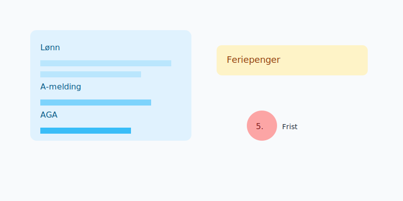
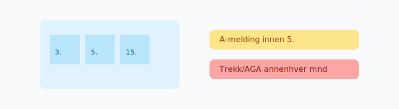

## Om kurset
Dette kurset dekker hele prosessen for **lønn**: oppsett, lønnskjøring, **A-melding**, feriepenger, trekk og innrapportering.

## Hva du vil lære

- Lønnsarter og satser
- Beregning av skatt og arbeidsgiveravgift
- A-melding frister og avvikshåndtering
- Feriepenger og sluttoppgjør
- Naturalytelser og fordelsbeskatning

## Viktige frister og satser

| Tema | Frist/forklaring |
| --- | --- |
| A-melding | Den 5. i påfølgende måned |
| Skattetrekk | Betaling annenhver måned |
| Arbeidsgiveravgift | Betaling annenhver måned |
| Feriepenger | Utbetales normalt i juni |

## Neste steg
- Grunnleggende bokføring: se [Regnskapskurs](/blogs/kurs/regnskapskurs)
- Fakturering og purring: se [Fakturakurs](/blogs/kurs/fakturakurs)
- Årsavslutning og innsending: se [Årsoppgjørskurs](/blogs/kurs/arsoppgjor-kurs)
