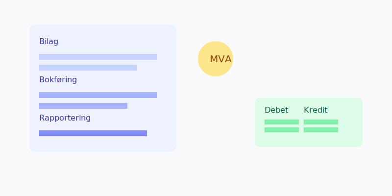
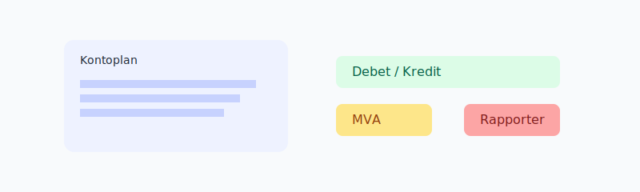

## Om kurset
Dette kurset gir en praktisk innføring i **regnskap**, fra bilag til **MVA** og rapportering. Du lærer hvordan du fører transaksjoner korrekt og setter opp gode rutiner.

## Hva du vil lære

- Debet og kredit i praksis
- Bilag og dokumentasjonskrav
- MVA-koder, satser og terminoppgjør
- Avstemming av bank og reskontro
- Periodisering og grunnleggende prinsipper

## Eksempler på bokføringsregler

| Hendelse | Konto | Debet | Kredit |
| --- | --- | --- | --- |
| Salg faktura | 1500 Kundefordringer | 1 250 | 0 |
| Salg faktura | 3000 Salgsinntekter | 0 | 1 000 |
| Salg faktura | 2700 Utgående mva | 0 | 250 |
| Betaling kunde | 1920 Bankinnskudd | 1 250 | 0 |
| Betaling kunde | 1500 Kundefordringer | 0 | 1 250 |

## Neste steg
- Fakturering, purring og purregebyr: se [Fakturakurs](/blogs/kurs/fakturakurs)
- Lønn, A-melding og arbeidsgiveravgift: se [Lønnskurs](/blogs/kurs/lonnskurs)
- Årsavslutning og skattemelding: se [Årsoppgjørskurs](/blogs/kurs/arsoppgjor-kurs)
