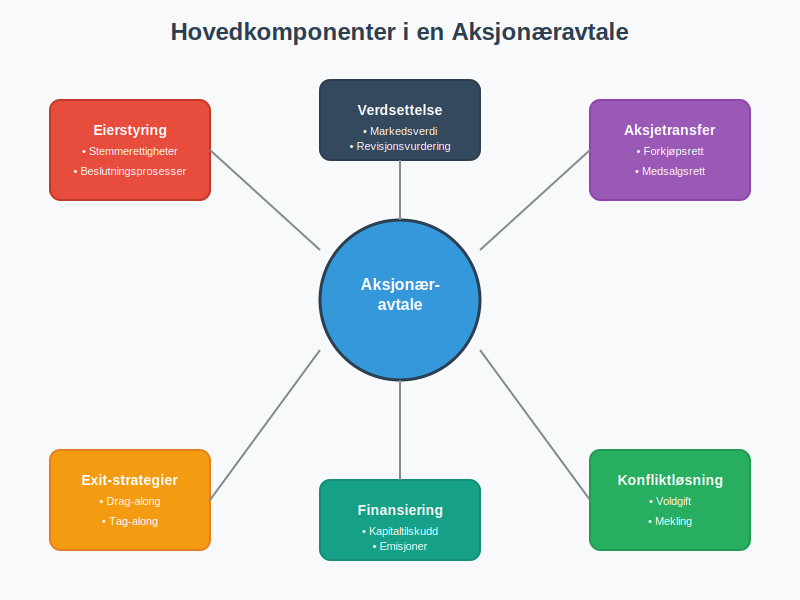
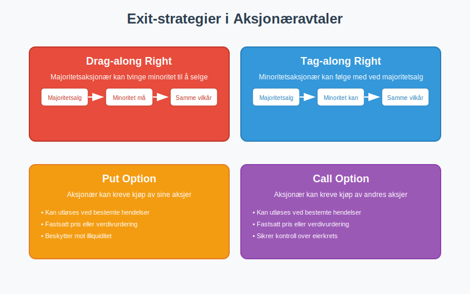
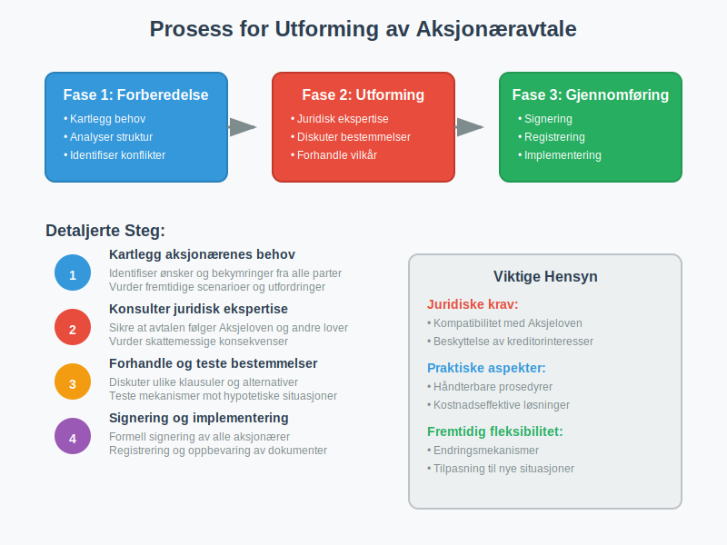
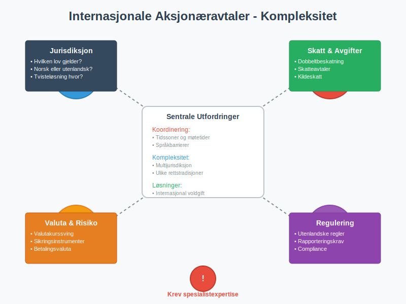
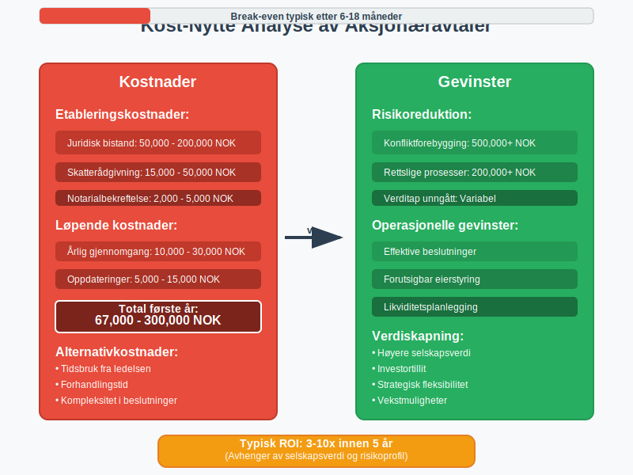

---
title: "Hva er en Aksjonæravtale?"
meta_title: "Hva er en Aksjonæravtale?"
meta_description: 'En **aksjonæravtale** er en omfattende **selskapsrettslig avtale** som regulerer forholdet mellom aksjonærene i et **aksjeselskap (AS)** i Norge. Denne skrift...'
slug: aksjonaeravtale
type: blog
layout: pages/single
---

En **aksjonæravtale** er en omfattende **selskapsrettslig avtale** som regulerer forholdet mellom aksjonærene i et **aksjeselskap (AS)** i Norge. Denne skriftlige avtalen supplerer [Aksjeloven](/blogs/regnskap/hva-er-aksjeloven "Hva er Aksjeloven? Regler for Aksjeselskaper i Norge") og [vedtektene](/blogs/regnskap/hva-er-vedtekter-for-aksjeselskap "Hva er Vedtekter for Aksjeselskap? Krav og Innhold") for å sikre klarhet i **eierstyring**, **stemmerettigheter** og **overføring av aksjer**.

## Hvorfor er en aksjonæravtale kritisk viktig?

Aksjonæravtaler er fundamentet for stabil **eierstyring** i aksjeselskaper. Uten en skriftlig avtale kan viktige beslutninger bli diskutert under press, noe som kan skade selskapets indre forhold og **verdiskapning**. Avtalen beskytter både majoritetens og minoritetens interesser.

**Hovedfordeler med aksjonæravtale:**

* **Forutsigbar eierstyring:** Klare regler for beslutningsprosesser og maktfordeling
* **Beskyttelse av minoritetsaksjonærer:** Sikrer at mindre eierandeler behandles rettferdig
* **Likviditetsplanlegging:** Regulering av salg og overføring av aksjer
* **Konflikthåndtering:** Definerte prosedyrer for mekling eller voldgift
* **Investeringsbeskyttelse:** Beskyttelse mot uønsket utvannsning ved emisjoner
* **Successionsplanlegging:** Regulering av arv og generasjonsskifte

## Nøkkelbestemmelser i en aksjonæravtale

En velutformet aksjonæravtale inneholder flere kritiske bestemmelser som regulerer ulike aspekter av **aksjonærforholdet**:

### 1. Forkjøpsrett og medsalgsrett

| Bestemmelse | Beskrivelse | Formål |
|:------------|:------------|:-------|
| **[Forkjøpsrett](/blogs/regnskap/forkjopsrett "Hva er en Forkjøpsrett? Retten til å kjøpe aksjer før eksterne")** | Retten til å kjøpe aksjer før de tilbys eksterne | Sikrer kontroll over eierkretsen |
| **Medsalgsrett** | Plikt til å tilby aksjer til eksisterende aksjonærer ved salg | Beskytter minoritetsaksjonærer |
| **Kjøpsrett** | Rett til å kjøpe aksjer til markedsverdi | Sikrer likviditet for aksjonærer |

### 2. Stemmekontrakter og beslutningsprosesser

**Stemmekontrakter** sikrer forutsigbarhet i generalforsamlingen:

* **Felles stemmegivning** ved viktige beslutninger
* **Kvalifisert flertall** for strategiske endringer
* **Vetorett** for minoritetsaksjonærer i kritiske saker
* **Representasjon** i styret basert på eierandel

### 3. Exit-strategier og likviditetsmekanismer

**Exit-klausuler** gir fleksibilitet ved endrede omstendigheter:

* **Drag-along right:** Minoriteten må følge majoriteten ved salg
* **Tag-along right:** Minoriteten kan følge med ved majoritetsalg
* **Put-option:** Rett til å selge aksjer til bestemte vilkår
* **Call-option:** Rett til å kjøpe aksjer til bestemte vilkår

## Juridiske rammer og krav

### Forhold til Aksjeloven

Aksjonæravtaler må være **kompatible** med [Aksjeloven](/blogs/regnskap/hva-er-aksjeloven "Hva er Aksjeloven? Regler for Aksjeselskaper i Norge"). Avtalen kan ikke overstyre lovens **tvingende bestemmelser**, men kan utfylle **dispositive regler**.

**Tvingende bestemmelser som ikke kan fravikes:**
* Minimumskrav til [aksjekapital](/blogs/regnskap/hva-er-aksjekapital "Hva er Aksjekapital? Krav og Forklaring")
* Krav til **generalforsamling** og **styrebehandling**
* **Kreditorvern** og **likvidasjonsregler**

### Registrering og dokumentasjon

Aksjonæravtaler må oppbevares sammen med [aksjeeierboken](/blogs/regnskap/hva-er-en-aksjeeierbok "Hva er en Aksjeeierbok? En Komplett Guide") og andre **selskapsdokumenter**. Avtalen bør:

* **Undertegnes** av alle aksjonærer
* **Dateres** og **notariseres** om nødvendig
* **Registreres** i [Aksjonærregisteret](/blogs/regnskap/hva-er-aksjonaerregisteret "Hva er Aksjonærregisteret? Komplett Guide til Norges Aksjonærregister") ved behov

## Implementeringsprosess

### Fase 1: Forberedelse og analyse

1. **Kartlegg aksjonærenes behov** og interesser
2. **Analyser selskapsstruktur** og fremtidige planer
3. **Identifiser potensielle konfliktområder**
4. **Vurder skattemessige konsekvenser**

### Fase 2: Utforming og forhandling

1. **Konsulter juridisk ekspertise** for å sikre lovlighet
2. **Diskuter nøkkelbestemmelser** med alle parter
3. **Forhandle vilkår** for ulike scenarioer
4. **Teste mekanismene** mot hypotetiske situasjoner

### Fase 3: Gjennomføring og oppfølging

1. **Signering** av alle aksjonærer
2. **Registrering** i relevante registre
3. **Implementering** av styringsmekanismer
4. **Regelmessig gjennomgang** og oppdatering

## Regnskapsmessige og skattemessige konsekvenser

### Regnskapsføring

**Aksjonæravtaler** har vanligvis **ingen direkte regnskapsførte beløp**, men kan påvirke:

* **Verdsettelse** ved salg og emisjoner
* **Egenkapitalbehandling** ved komplekse eierstrukturer
* **Klassifisering** av [egenkapital](/blogs/regnskap/hva-er-egenkapital "Hva er Egenkapital? Komplett Guide til Egenkapital i Regnskap") vs. fremmedkapital

### Skattemessige forhold

| Skatteområde | Påvirkning | Vurdering |
|:-------------|:----------|:----------|
| **Overdragelsesavgift** | Kan påvirke avgiftsberegning | Konsulter skatteekspert |
| **Gevinst/tap** | Påvirker behandling av aksjegevinst | Følg [fritaksmetoden](/blogs/regnskap/hva-er-fritaksmetoden "Hva er Fritaksmetoden? Skatteregler for Aksjegevinst") |
| **Dokumentavgift** | Kan utløse avgiftsplikt | Vurder struktur nøye |

## Spesielle situasjoner og utfordringer

### Familieselskapskap og generasjonsskifte

**Familieselskapskap** krever særlige hensyn i aksjonæravtaler:

* **Arveregulering** og **testamentariske bestemmelser**
* **Kompetansekrav** for nye generasjoner
* **Likviditetsløsninger** for uttreden fra familie

### Internasjonale aksjonærer

Ved **internasjonale aksjonærer** må avtalen vurdere:

* **Jurisdiksjon** og **lovvalg**
* **Valutarisiko** og **sikringsmekanismer**
* **Skatteavtaler** og **dobbeltbeskatning**

## Digitalisering og fremtidige trender

### Elektroniske aksjonæravtaler

**Digitalisering** påvirker aksjonæravtaler gjennom:

* **Elektronisk signering** og **blockchain-teknologi**
* **Automatisering** av [stemmegivning](/blogs/regnskap/hva-er-generalforsamling "Hva er Generalforsamling? Krav og Prosedyrer") og **utbytte**
* **Sanntidsrapportering** til [Aksjonærregisteret](/blogs/regnskap/hva-er-aksjonaerregisteret "Hva er Aksjonærregisteret? Komplett Guide til Norges Aksjonærregister")

### Nye eierformer og strukturer

**Moderne eierstrukturer** krever tilpasning av aksjonæravtaler:

* **Medarbeiderretter** og **opsjonsordninger**
* **Crowdfunding** og **tokenisering**
* **ESG-krav** og **bærekraftsrapportering**

## Praktiske tips for aksjonærer

### Når bør avtalen revideres?

**Regelmessig gjennomgang** er kritisk ved:

* **Endringer i eierstruktur** eller **aksjonærkrets**
* **Nye forretningsområder** eller **strategiske endringer**
* **Endringer i lovgivning** eller **skatteforhold**
* **Konfliktopplevelser** som avdekker svakheter

### Vanlige fallgruver

* **Manglende oppdatering** ved endringer
* **Uklare verdsettelsesmekanismer**
* **Manglende konfliktløsningsmekanismer**
* **Utilstrekkelig skattemessig planlegging**

## Kostnader og investeringer

### Etableringskostnader

| Kostnadselement | Estimert kostnad | Kommentar |
|:----------------|:----------------|:----------|
| **Juridisk bistand** | 50,000 - 200,000 NOK | Avhenger av kompleksitet |
| **Skatterådgivning** | 15,000 - 50,000 NOK | Kritisk for optimalisering |
| **Notarialbekreftelse** | 2,000 - 5,000 NOK | Ved behov for autentisering |
| **Løpende vedlikehold** | 10,000 - 30,000 NOK/år | Regelmessig gjennomgang |

### Gevinster og besparelser

**Investeringen** i en kvalitetsavtale kan spare:

* **Konfliktkostnader** og **rettslige prosesser**
* **Verditap** ved uforutsette situasjoner
* **Transaksjonskostnader** ved fremtidige endringer

## Relaterte artikler og ressurser

### Aksjeselskap og eierstyring

* **[Hva er et Aksjeselskap?](/blogs/regnskap/hva-er-et-aksjeselskap "Hva er et Aksjeselskap (AS)? Komplett Guide til Norske Aksjeselskap")**
* **[Hva er Aksjeloven?](/blogs/regnskap/hva-er-aksjeloven "Hva er Aksjeloven? Regler for Aksjeselskaper i Norge")**
* **[Hva er Vedtekter for Aksjeselskap?](/blogs/regnskap/hva-er-vedtekter-for-aksjeselskap "Hva er Vedtekter for Aksjeselskap? Krav og Innhold")**
* **[Hva er et Styre?](/blogs/regnskap/hva-er-styre "Hva er et Styre? Ansvar og Oppgaver i Aksjeselskap")**

### Aksjer og eierskap

* **[Hva er en Aksje?](/blogs/regnskap/hva-er-en-aksje "Hva er en Aksje? En Enkel Forklaring")**
* **[Hva er en Aksjonær?](/blogs/regnskap/hva-er-en-aksjonaer "Hva er en Aksjonær? En Komplett Guide")**
* **[Hva er Aksjeklasser?](/blogs/regnskap/hva-er-aksjeklasser "Hva er Aksjeklasser? A-aksjer vs B-aksjer")**
* **[Hva er Aksjekapital?](/blogs/regnskap/hva-er-aksjekapital "Hva er Aksjekapital? Krav og Forklaring")**
* **[Hva er en Forkjøpsrett?](/blogs/regnskap/forkjopsrett "Hva er en Forkjøpsrett? Retten til å kjøpe aksjer før eksterne")**

### Registrering og dokumentasjon

* **[Hva er Aksjonærregisteret?](/blogs/regnskap/hva-er-aksjonaerregisteret "Hva er Aksjonærregisteret? Komplett Guide til Norges Aksjonærregister")**
* **[Hva er en Aksjeeierbok?](/blogs/regnskap/hva-er-en-aksjeeierbok "Hva er en Aksjeeierbok? En Komplett Guide")**
* **[Hva er Aksjonærregisteroppgave?](/blogs/regnskap/aksjonaerregisteroppgave "Hva er Aksjonærregisteroppgave? Komplett Guide til Årlig Rapportering")**

### Regnskap og skatt

* **[Hva er Egenkapital?](/blogs/regnskap/hva-er-egenkapital "Hva er Egenkapital? Komplett Guide til Egenkapital i Regnskap")**
* **[Hva er Fritaksmetoden?](/blogs/regnskap/hva-er-fritaksmetoden "Hva er Fritaksmetoden? Skatteregler for Aksjegevinst")**
* **[Hva er Aksjonærmodellen?](/blogs/regnskap/aksjonaermodellen "Hva er Aksjonærmodellen? Skatteregler for Aksjonærer")**

## Konklusjon

En **aksjonæravtale** er en fundamental investering i selskapets **stabilitet** og **verdiskapning**. Ved å etablere klare rammer for **eierstyring**, **beslutningstaking** og **konfliktløsning** sikrer aksjonærene at selskapet kan operere effektivt selv under utfordrende omstendigheter.

**Nøkkelprinsippene** for en vellykket aksjonæravtale er:

1. **Klarhet** i rettigheter og plikter
2. **Fleksibilitet** for fremtidige endringer
3. **Rettferdighet** mellom alle aksjonærer
4. **Juridisk sikkerhet** og **lovlighet**

Investeringen i profesjonell utarbeidelse av aksjonæravtaler betaler seg over tid gjennom reduserte **konfliktkostnader** og økt **verdiskapning**.

