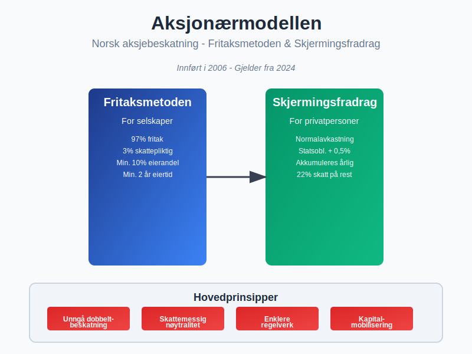
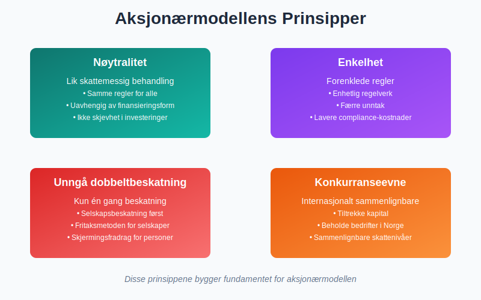
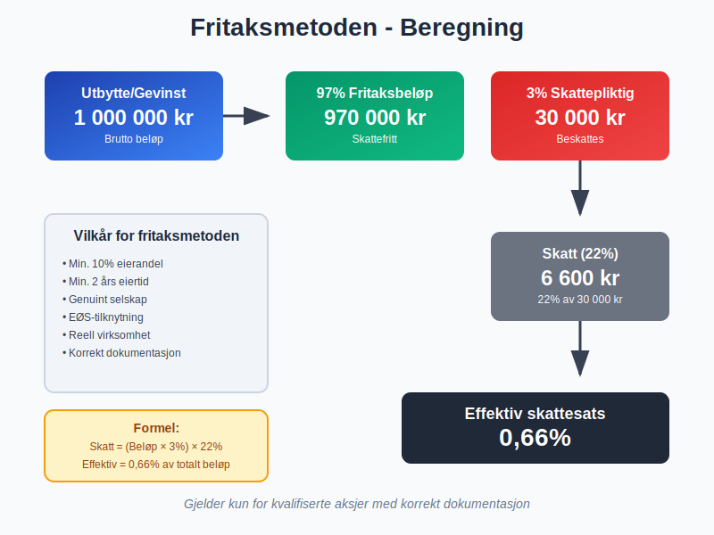
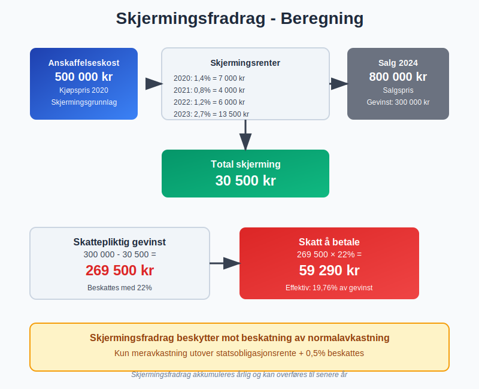
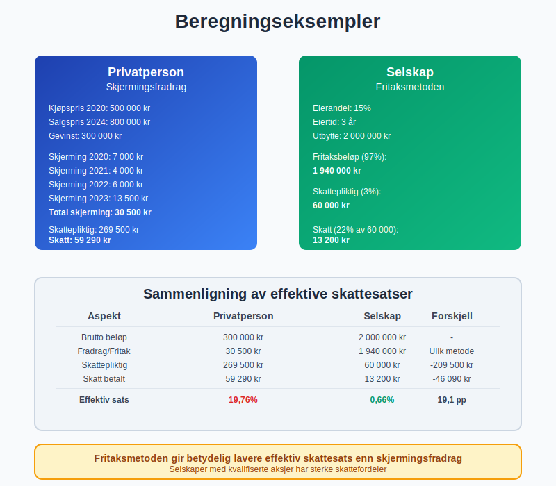
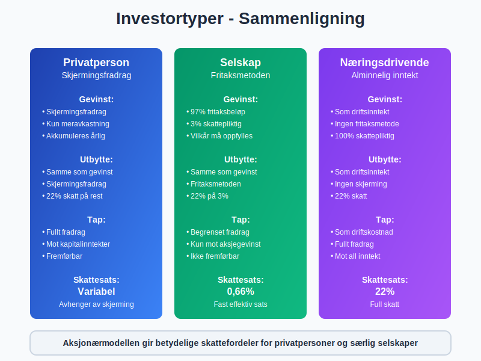
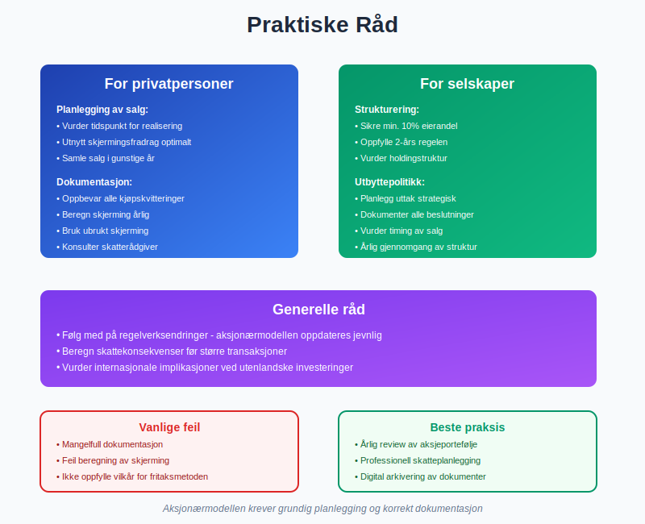

---
title: "Aksjonærmodellen - Komplett Guide til Norsk Aksjebeskatning"
meta_title: "Aksjonærmodellen - Komplett Guide til Norsk Aksjebeskatning"
meta_description: '**Aksjonærmodellen** er det sentrale skattesystemet for [aksjebeskatning](/blogs/regnskap/hva-er-en-aksje Hva er en aksje? Komplett guide til aksjer i Norge)...'
slug: aksjonaermodellen-guide
type: blog
layout: pages/single
---

**Aksjonærmodellen** er det sentrale skattesystemet for [aksjebeskatning](/blogs/regnskap/hva-er-en-aksje "Hva er en aksje? Komplett guide til aksjer i Norge") i Norge, innført i 2006 for å skape et enhetlig og nøytralt system for beskatning av [aksjer](/blogs/regnskap/hva-er-en-aksje "Hva er en aksje? Komplett guide til aksjer i Norge") og [utbytte](/blogs/regnskap/maskimalt-utbytte "Maksimalt utbytte fra AS - Beregning og regler"). Modellen bygger på to hovedprinsipper: **fritaksmetoden** og **skjermingsfradrag**, som sammen skal sikre at [aksjonærer](/blogs/regnskap/hva-er-en-aksjonaer "Hva er en aksjonær? Rettigheter og plikter") ikke blir dobbeltbeskattet.

For en grundig innføring i beskatning av aksjegevinster for bÃ¥de privatpersoner og selskaper, se [Skatt pÃ¥ aksjegevinst](/blogs/regnskap/skatt-pa-aksjegevinst "Skatt pÃ¥ aksjegevinst “ Guide til beskatning av aksjegevinster i Norge").



## Historisk bakgrunn og formål

Aksjonærmodellen ble innført som del av [skattereformen 2006](/blogs/regnskap/skatt "Skatt i Norge - Komplett guide til skatteregler") for å løse problemet med **dobbeltbeskatning** av aksjegevinster og utbytte. Før 2006 eksisterte det parallelle systemer som skapte ulik behandling mellom forskjellige investortyper.

### Hovedmålsettinger

* **Nøytralitet**: Lik skattemessig behandling uavhengig av finansieringsform
* **Enkelhet**: Enhetlige regler for alle aksjonærtyper
* **Likviditet**: Sikre at [norske bedrifter](/blogs/regnskap/hva-er-et-aksjeselskap "Hva er et aksjeselskap (AS)? Komplett guide") får tilgang til kapital
* **Internasjonal konkurranseevne**: Sammenlignbare vilkår med andre land



## Fritaksmetoden - Grunnpilaren i systemet

**Fritaksmetoden** er den første søylen i aksjonærmodellen og gjelder for [selskaper](/blogs/regnskap/hva-er-et-aksjeselskap "Hva er et aksjeselskap (AS)? Komplett guide") som eier aksjer. Metoden innebærer at gevinster og utbytte fra kvalifiserte aksjer i hovedsak er skattefrie.

### Vilkår for fritaksmetoden

| Vilkår | Beskrivelse | Detaljer |
|--------|-------------|----------|
| **Eierandel** | Minimum 10% av [aksjekapitalen](/blogs/regnskap/hva-er-aksjekapital "Hva er aksjekapital? Definisjon og beregning") eller stemmerettene | Må opprettholdes i minst 2 år |
| **Eiertid** | Kontinuerlig eierskap i minimum 2 år | Gjelder både før og etter salg |
| **Genuint selskap** | Selskapet må drive reell virksomhet | Ikke bare passiv kapitalforvaltning |
| **EØS-tilknytning** | Selskapet må være hjemmehørende i EØS | Eller i land med skatteavtale |

### Beregning av fritaksmetoden

**Fritaksmetoden** gir 97% fritak for gevinster og utbytte, mens 3% beskattes som [alminnelig inntekt](/blogs/regnskap/alminnelig-inntekt "Alminnelig inntekt - Beregning og skatteregler") med 22% skattesats.

**Eksempel på beregning:**
```
Utbytte mottatt: 1 000 000 kr
Fritaksbeløp (97%): 970 000 kr
Skattepliktig beløp (3%): 30 000 kr
Skatt (22% av 30 000): 6 600 kr
Effektiv skattesats: 0,66%
```



## Skjermingsfradrag - Beskyttelse for privatpersoner

**Skjermingsfradrag** er den andre søylen i aksjonærmodellen og gjelder for privatpersoner som eier aksjer. Fradraget skal sikre at kun den delen av gevinsten som overstiger en "normalavkastning" beskattes.

### Beregning av skjermingsfradrag

Skjermingsfradraget beregnes som:
**Skjermingsgrunnlag × Skjermingsrente**

| Komponent | Formel | Beskrivelse |
|-----------|---------|-------------|
| **Skjermingsgrunnlag** | [Inngangsverdi](/blogs/regnskap/inngaaende-balanse "Inngående balanse - Hva er det og hvordan beregnes det?") + tilleggsinvesteringer | Justert for uttak og utbytte |
| **Skjermingsrente** | Statsobligasjonsrente + 0,5% | Oppdateres årlig av [Skatteetaten](/blogs/regnskap/skattemelding "Skattemelding - Komplett guide til innlevering") |
| **Akkumulering** | Ubrukt skjerming overføres | Kan brukes i senere år |

### Skjermingsrenter historisk

| Ã…r | Skjermingsrente | Statsobligasjonsrente | Tillegg |
|----|-----------------|----------------------|---------|
| 2024 | 2,8% | 2,3% | 0,5% |
| 2023 | 2,7% | 2,2% | 0,5% |
| 2022 | 1,2% | 0,7% | 0,5% |
| 2021 | 0,8% | 0,3% | 0,5% |
| 2020 | 1,4% | 0,9% | 0,5% |



## Praktiske beregningseksempler

### Eksempel 1: Privatperson med aksjegevinst

En privatperson kjøpte aksjer for 500 000 kr i 2020 og selger dem for 800 000 kr i 2024.

**Beregning:**
```
Salgssum: 800 000 kr
Inngangsverdi: 500 000 kr
Gevinst: 300 000 kr

Skjerming 2020: 500 000 × 1,4% = 7 000 kr
Skjerming 2021: 500 000 × 0,8% = 4 000 kr
Skjerming 2022: 500 000 × 1,2% = 6 000 kr
Skjerming 2023: 500 000 × 2,7% = 13 500 kr
Total skjerming: 30 500 kr

Skattepliktig gevinst: 300 000 - 30 500 = 269 500 kr
Skatt (22%): 269 500 × 0,22 = 59 290 kr
```

### Eksempel 2: Selskap med utbytte

Et [aksjeselskap](/blogs/regnskap/hva-er-et-aksjeselskap "Hva er et aksjeselskap (AS)? Komplett guide") eier 15% av aksjene i et annet selskap og mottar 2 000 000 kr i utbytte.

**Beregning med fritaksmetoden:**
```
Utbytte mottatt: 2 000 000 kr
Fritaksbeløp (97%): 1 940 000 kr
Skattepliktig beløp (3%): 60 000 kr
Skatt (22% av 60 000): 13 200 kr
Effektiv skattesats: 0,66%
```



## Forskjeller mellom investortyper

### Privatpersoner

| Aspekt | Regel | Konsekvens |
|--------|-------|------------|
| **Gevinst** | Skjermingsfradrag | Kun meravkastning beskattes |
| **Utbytte** | Skjermingsfradrag | Beskyttelse mot normalavkastning |
| **Tap** | Fullt fradrag | Kan trekkes fra andre kapitalinntekter |
| **Skattesats** | 22% | [Alminnelig inntekt](/blogs/regnskap/alminnelig-inntekt "Alminnelig inntekt - Beregning og skatteregler") |

### Selskaper

| Aspekt | Regel | Konsekvens |
|--------|-------|------------|
| **Gevinst** | Fritaksmetoden | 97% fritak ved kvalifiserte aksjer |
| **Utbytte** | Fritaksmetoden | Samme behandling som gevinst |
| **Tap** | Begrenset fradrag | Kun mot gevinst på aksjer |
| **Skattesats** | 22% på 3% | Effektiv sats 0,66% |



## Spesielle situasjoner og unntak

### Næringsdrivende med aksjer

For [næringsdrivende](/blogs/regnskap/naeringsoppgave "Næringsoppgave - Hva er det og hvordan fylles den ut?") som handler aksjer som del av virksomheten, gjelder ikke aksjonærmodellen. Gevinster og tap behandles som [driftsinntekter](/blogs/regnskap/driftsinntekter "Driftsinntekter - Hva er det og hvordan beregnes det?") og [driftskostnader](/blogs/regnskap/driftskostnader "Driftskostnader - Oversikt og kategorisering").

### Utenlandske investorer

Utenlandske investorer som ikke er skattepliktige til Norge, har generelt begrenset skatteplikt på norske aksjer. [Skatteavtaler](/blogs/regnskap/skattemelding "Skattemelding - Komplett guide til innlevering") kan redusere eller eliminere skatten.

### Ansatte aksjer og opsjoner

[Ansatte](/blogs/regnskap/ansattutlegg "Ansattutlegg - Hva er det og hvordan håndteres det?") som får aksjer eller [opsjoner](/blogs/regnskap/hva-er-opsjonsavtale "Hva er en opsjonsavtale? Typer og vilkår") som del av lønn, må regne fordelen som lønnsinntekt ved tildelingen.

## Dokumentasjon og rapportering

### Krav til dokumentasjon

For å benytte aksjonærmodellen korrekt, må [bedrifter](/blogs/regnskap/hva-er-et-aksjeselskap "Hva er et aksjeselskap (AS)? Komplett guide") og privatpersoner dokumentere:

* **Anskaffelsestidspunkt** og **kostpris**
* **Eierandel** og **eiertid**
* **Utbytte** og **gevinster**
* **Skjermingsberegninger** (privatpersoner)

### Rapportering i selvangivelsen

| Skjema | Hvem | Innhold |
|--------|------|---------|
| **RF-1030** | Selskaper | Gevinst/tap på aksjer |
| **RF-1174** | Selskaper | Mottatt utbytte |
| **Vedlegg** | Privatpersoner | Aksjegevinst og skjerming |


## Internasjonale aspekter

### Skatteavtaler og dobbeltbeskatning

Norge har [skatteavtaler](/blogs/regnskap/skattemelding "Skattemelding - Komplett guide til innlevering") med over 80 land som regulerer beskatning av aksjegevinster og utbytte. Disse kan påvirke anvendelsen av aksjonærmodellen.

### FATCA og CRS

Norske [finansinstitusjoner](/blogs/regnskap/bedriftsbank "Bedriftsbank - Valg og tjenester for bedrifter") må rapportere om utenlandske kontoinnehavere under FATCA og CRS-regelverket, som kan påvirke aksjonærer.

## Framtidige endringer og utvikling

### Foreslåtte endringer

Regjeringen har signalisert flere mulige endringer i aksjonærmodellen:

* **Økt skattesats** på den skattepliktige delen
* **Redusert fritaksandel** i fritaksmetoden
* **Strengere vilkår** for kvalifiserte aksjer
* **Nye regler** for [holdingselskaper](/blogs/regnskap/holdingselskap "Holdingselskap - Struktur og skattefordeler")

### Europeiske harmoniseringskrav

EU arbeider med å harmonisere selskapsbeskatning, som kan påvirke norske regler om aksjebeskatning i årene framover.

## Praktiske råd og beste praksis

### For privatpersoner

* **Planlegg salg** for å utnytte skjermingsfradrag optimalt
* **Dokumenter** alle aksjekjøp og -salg nøye
* **Vurder tidspunkt** for realisering av gevinster
* **Bruk** ubrukt skjerming fra tidligere år

### For selskaper

* **Sikre** at vilkårene for fritaksmetoden oppfylles
* **Dokumenter** eierandel og eiertid
* **Vurder** struktur av [aksjeoppgave](/blogs/regnskap/hva-er-aksjeoppgave "Hva er en aksjeoppgave? Innlevering og krav") og investeringer
* **Planlegg** utbyttepolitikk strategisk



## Sammenheng med andre skatteregler

### Forholdet til andre kapitalskatter

Aksjonærmodellen må sees i sammenheng med:

* **[Eiendomsskatt](/blogs/regnskap/skatt "Skatt i Norge - Komplett guide til skatteregler")** på fast eiendom
* **[Formuesskatt](/blogs/regnskap/formue "Formue - Beregning og skatteregler")** (hvis gjeninnført)
* **[Arveavgift](/blogs/regnskap/skattemelding "Skattemelding - Komplett guide til innlevering")** ved generasjonsskifte

### Påvirkning på bedrifters finansieringsbeslutninger

Aksjonærmodellen påvirker hvordan bedrifter velger mellom:

* **[Egenkapital](/blogs/regnskap/egenkapital "Egenkapital - Beregning og betydning")** vs. [gjeld](/blogs/regnskap/gjeld "Gjeld - Typer og regnskapsbehandling")
* **Utbytte** vs. **tilbakekjøp** av aksjer
* **Opparbeidet** vs. **tilført** [egenkapital](/blogs/regnskap/egenkapital "Egenkapital - Beregning og betydning")

## Utfordringer og kritikk

### Kompleksitet

Til tross for målsettingen om enkelhet, oppleves aksjonærmodellen som kompleks, spesielt:

* **Skjermingsberegninger** for privatpersoner
* **Vilkår** for fritaksmetoden
* **Grensetilfeller** og tolkningsspørsmål

### Ulik behandling

Modellen skaper fortsatt forskjeller mellom:

* **Privatpersoner** og **selskaper**
* **Kvalifiserte** og **ikke-kvalifiserte** aksjer
* **Aktive** og **passive** investorer

## Konklusjon

Aksjonærmodellen er et sentralt element i norsk skattepolitikk som balanserer hensynet til kapitalflukt, skatteproveny og nøytralitet. Forståelse av modellens mekanismer er essensielt for både privatpersoner og bedrifter som investerer i aksjer.

**Nøkkelpunkter å huske:**

* **Fritaksmetoden** gir 97% fritak for selskaper med kvalifiserte aksjer
* **Skjermingsfradrag** beskytter privatpersoner mot beskatning av normalavkastning
* **Dokumentasjon** og korrekt rapportering er avgjørende
* **Planlegging** kan optimalisere skatteposisjonen betydelig

For å sikre korrekt anvendelse av aksjonærmodellen, anbefales det å konsultere [regnskapsfører](/blogs/regnskap/forretningsforer "Forretningsfører - Rolle og ansvar") eller skatterådgiver ved komplekse situasjoner.

## Relaterte artikler

* [Hva er en aksje?](/blogs/regnskap/hva-er-en-aksje "Hva er en aksje? Komplett guide til aksjer i Norge")
* [Hva er en aksjonær?](/blogs/regnskap/hva-er-en-aksjonaer "Hva er en aksjonær? Rettigheter og plikter")
* [Maksimalt utbytte fra AS](/blogs/regnskap/maskimalt-utbytte "Maksimalt utbytte fra AS - Beregning og regler")
* [Hva er et aksjeselskap?](/blogs/regnskap/hva-er-et-aksjeselskap "Hva er et aksjeselskap (AS)? Komplett guide")
* [Aksjekapital - definisjon og beregning](/blogs/regnskap/hva-er-aksjekapital "Hva er aksjekapital? Definisjon og beregning")
* [Fritaksmetoden](/blogs/regnskap/fritaksmetoden "Fritaksmetoden - Regler og anvendelse")
* [Skjermingsfradrag](/blogs/regnskap/skjermingsfradrag "Skjermingsfradrag - Beregning og regler")
* [Holdingselskap](/blogs/regnskap/holdingselskap "Holdingselskap - Struktur og skattefordeler")
* [Skattemelding](/blogs/regnskap/skattemelding "Skattemelding - Komplett guide til innlevering")
* [Alminnelig inntekt](/blogs/regnskap/alminnelig-inntekt "Alminnelig inntekt - Beregning og skatteregler")


