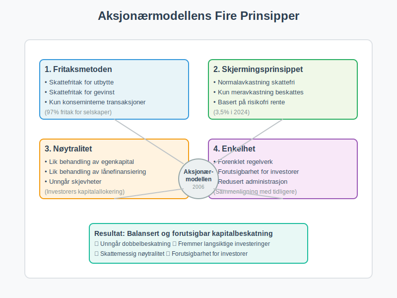
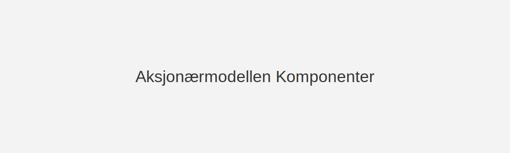
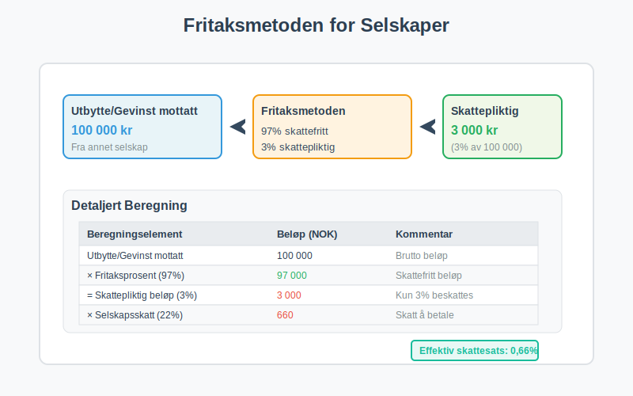
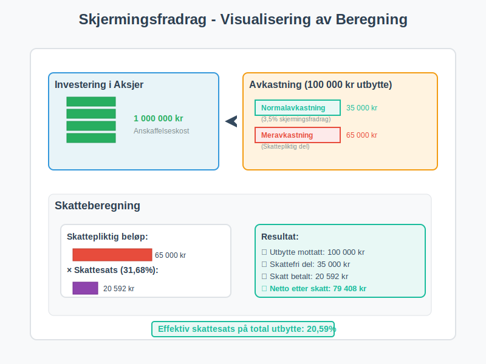
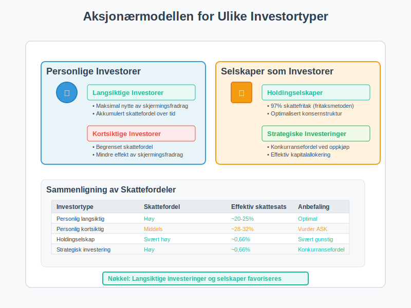
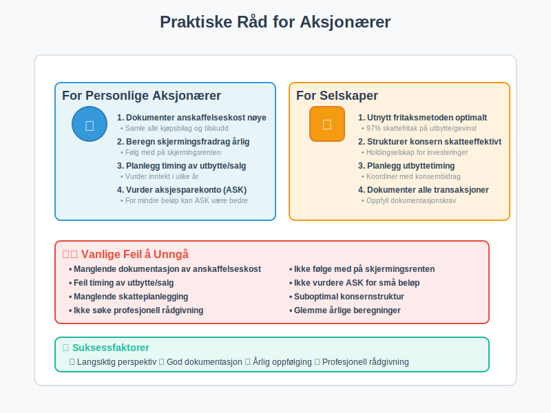

---
title: "Aksjonærmodellen"
seoTitle: "Aksjonærmodellen"
meta_description: '**Aksjonærmodellen** er den skattemessige modellen som regulerer **beskatning av utbytte og gevinst** for [aksjonærer](/blogs/regnskap/hva-er-en-aksjonaer Hv...'
slug: aksjonaermodellen
type: blog
layout: pages/single
---

**Aksjonærmodellen** er den skattemessige modellen som regulerer **beskatning av utbytte og gevinst** for [aksjonærer](/blogs/regnskap/hva-er-en-aksjonaer "Hva er en Aksjonær? Rettigheter og Plikter for Aksjeeiere") i norske [aksjeselskap](/blogs/regnskap/hva-er-et-aksjeselskap "Hva er et Aksjeselskap? Komplett Guide til AS som Selskapsform") (AS). Modellen kombinerer prinsipper fra **fritaksmetoden** med **skjermingsfradrag** for å sikre nøytralitet mellom ulike investeringsformer og unngå dobbelbeskatning.

## Historisk Bakgrunn og Formål

Aksjonærmodellen ble innført 1. januar 2006 som en del av den store **skattereformen** for å erstatte den tidligere regnskapsbaserte ordningen. Reformen var nødvendig for å:

* **Eliminere dobbelbeskatning** av selskapskapital
* **Skape skattemessig nøytralitet** mellom ulike investeringsformer
* **Forenkle regelverket** for aksjonærinvesteringer
* **Sikre forutsigbarhet** for langsiktige investeringer

Den gamle ordningen skapte skjevheter mellom [egenkapital](/blogs/regnskap/hva-er-egenkapital "Hva er Egenkapital? Beregning og Betydning i Regnskap") og [fremmedkapital](/blogs/regnskap/hva-er-fremmedkapital "Hva er Fremmedkapital? Lån og Gjeld i Selskaper") finansiering, noe som påvirket investeringsbeslutninger negativt.

### Grunnleggende Prinsipper

Aksjonærmodellen bygger på fire hovedprinsipper:

* **Fritaksmetoden:** Skattefritak for utbytte og gevinst ved konserninterne transaksjoner. Se [Hva er Fritaksmetoden?](/blogs/regnskap/hva-er-fritaksmetoden "Hva er Fritaksmetoden? Skattefordeler for Selskapsinvesteringer").
* **Skjermingsprinsippet:** Garanterer at normalavkastning (*skjermingsfradrag*) ikke beskattes. Les mer om [Hva er Skjermingsfradrag?](/blogs/regnskap/hva-er-skjermingsfradrag "Hva er Skjermingsfradrag? Skattefradrag for Alternativkostnad ved Aksjeinvestering").
* **Nøytralitet:** Lik behandling av egenkapital- og lånefinansiering.
* **Enkelhet:** Redusert behov for kompliserte skatteregler og forutsigbarhet for aksjonærer.

## Hovedkomponenter i Aksjonærmodellen

### Skjermingsfradrag - Kjernen i Modellen

**Skjermingsfradraget** er den sentrale komponenten som sikrer at kun **meravkastning** beskattes. Dette fradraget beregnes som:

* **Skjermingsgrunnlag** × **Skjermingsrente**
* Skjermingsgrunnlaget er kostprisen på aksjene
* Skjermingsrenten fastsettes årlig av myndighetene

### Komponenter i Oversikt

| **Komponent**           | **Beskrivelse**                                                                                          | **Satser 2024**    |
|-------------------------|----------------------------------------------------------------------------------------------------------|---------------------|
| **Skjermingsfradrag**   | Fradrag for risikofri rente på investert kapital                                                        | 3,5% årlig         |
| **Skjermingsrente**     | Årlig fastsatt risikofri rente (statsobligasjonsrente). Se [Hva er Skjermingsrente?](/blogs/regnskap/hva-er-skjermingsrente "Hva er Skjermingsrente? Beregning og Metodikk"). | 3,5% (2024)        |
| **Fritaksmetoden**      | Skattefritak for utbytte og gevinst ved konserninterne transaksjoner                                    | 97% fritak         |
| **Skattesats personlig**| Effektiv skattesats for personlige aksjonærer etter skjerming                                          | 31,68%             |
| **Selskapsskatt**       | Ordinær selskapsskatt                                                                                   | 22%                |

### Fritaksmetoden for Selskaper

For [selskaper](/blogs/regnskap/hva-er-foretak "Hva er et Foretak? Komplett Guide til Foretaksformer i Norge") som eier aksjer i andre selskaper gjelder **fritaksmetoden**:

* **97% av utbytte** er skattefritt
* **97% av gevinst** ved salg av aksjer er skattefritt
* **3% beskattes** som [alminnelig inntekt](/blogs/regnskap/alminnelig-inntekt "Alminnelig inntekt “ Komplett guide til skattemessig resultat og beregning") (22% skatt)
* Gjelder kun for aksjer i selskaper med **begrenset ansvar**

## Beregningseksempler

### Eksempel 1: Utbyttebeskatning for Personlig Aksjonær

La oss se på en personlig aksjonær som mottar [utbytte](/blogs/regnskap/hva-er-utbytte "Hva er Utbytte? Regnskapsføring og Skattemessige Konsekvenser"):

| **Beregningselement**         | **Beløp (NOK)** | **Kommentar**                                |
|-------------------------------|-----------------|----------------------------------------------|
| Inngangsverdi aksjer          | 1 000 000       | Anskaffelseskost inkl. tilskudd              |
| × Skjermingsrente (3,5 %)     |   35 000        | Skjermingsrente × inngangsverdi              |
| = Skjermingsfradrag           |   35 000        | Skattefritt "normalavkastning"               |
| Utbytte mottatt               |  100 000        | Brutto utbytte fra selskap                  |
| - Skjermingsfradrag           |  (35 000)       | Fradrag for normalavkastning                 |
| = Skattepliktig utbytte       |   65 000        | Kun meravkastning beskattes                  |
| × Effektiv skattesats (31,68 %) | 20 592        | Skatt på meravkastning                       |
| **Skatt å betale**            | **20 592**      | **Endelig skattekostnad**                    |

### Eksempel 2: Gevinst ved Salg av Aksjer

Ved salg av aksjer beregnes gevinst på samme måte:

| **Beregningselement**         | **Beløp (NOK)** | **Kommentar**                                |
|-------------------------------|-----------------|----------------------------------------------|
| Salgspris aksjer              | 1 200 000       | Brutto salgspris                            |
| - Anskaffelseskost            | (1 000 000)     | Opprinnelig kostpris                        |
| = Gevinst før skjerming       |  200 000        | Brutto gevinst                              |
| - Akkumulert skjermingsfradrag|  (175 000)      | 5 år × 35 000 (eksempel)                   |
| = Skattepliktig gevinst       |   25 000        | Kun meravkastning beskattes                  |
| × Effektiv skattesats (31,68 %) | 7 920         | Skatt på meravkastning                       |
| **Skatt å betale**            | **7 920**       | **Endelig skattekostnad**                    |

### Eksempel 3: Selskapsaksjonær med Fritaksmetoden

For selskaper som mottar utbytte gjelder fritaksmetoden:

| **Beregningselement**         | **Beløp (NOK)** | **Kommentar**                                |
|-------------------------------|-----------------|----------------------------------------------|
| Utbytte mottatt               |  100 000        | Brutto utbytte                              |
| × Fritaksprosent (97%)        |   97 000        | Skattefritt beløp                           |
| = Skattepliktig utbytte (3%)  |    3 000        | Kun 3% beskattes                            |
| × Selskapsskatt (22%)         |      660        | Skatt på skattepliktig del                  |
| **Skatt å betale**            | **660**         | **Svært lav effektiv skattesats**           |

## Praktisk Anvendelse og Skatteplanlegging

### Timing av Utbytte og Salg

Aksjonærmodellen gir flere muligheter for **skatteoptimalisering**:

* **Utbyttetiming:** Planlegg utbytte i år med lavere andre inntekter
* **Realisering av gevinst:** Vurder timing av salg basert på akkumulert skjermingsfradrag
* **Reinvestering:** Bruk skjermingsfradrag til å bygge opp skattefri avkastning

### Betydning for Ulike Investortyper

#### Personlige Investorer
* **Langsiktige investorer** drar størst nytte av akkumulert skjermingsfradrag
* **Kortsiktige investorer** får mindre skattefordel
* **Porteføljeplanlegging** blir viktigere for skatteoptimalisering

#### Selskaper som Investorer
* **Holdingselskaper** får store skattefordeler gjennom fritaksmetoden
* **Konsernstruktur** kan optimaliseres for skatteeffektivitet
* **Strategiske investeringer** får konkurransefordel

## Praktiske Råd for Aksjonærer

### For Personlige Aksjonærer

* **Dokumenter** anskaffelseskost nøye
* **Beregn** skjermingsfradrag årlig
* **Planlegg** utbytte- og salgstiming
* **Vurder** [aksjesparekonto](/blogs/regnskap/hva-er-aksjesparekonto "Hva er Aksjesparekonto? Skattefordeler ved Aksjesparing") som alternativ
* **Søk** profesjonell rådgivning ved større investeringer

### For Selskaper

* **Utnytt** fritaksmetoden optimalt
* **Strukturer** konsern for skatteeffektivitet
* **Planlegg** utbyttetiming
* **Dokumenter** alle transaksjoner
* **Vurder** [konsernbidrag](/blogs/regnskap/hva-er-konsernbidrag "Hva er Konsernbidrag? Skatteoptimalisering i Konsern") som alternativ

## Relaterte Artikler

For dypere forståelse av aksjonærmodellen, les også:

### Grunnleggende Konsepter
* [Hva er en Aksjonær?](/blogs/regnskap/hva-er-en-aksjonaer "Hva er en Aksjonær? Rettigheter og Plikter for Aksjeeiere")
* [Hva er et Aksjeselskap?](/blogs/regnskap/hva-er-et-aksjeselskap "Hva er et Aksjeselskap? Komplett Guide til AS som Selskapsform")
* [Hva er Aksjeloven?](/blogs/regnskap/hva-er-aksjeloven "Hva er Aksjeloven? Regler for Aksjeselskaper i Norge")
* [Hva er Utbytte?](/blogs/regnskap/hva-er-utbytte "Hva er Utbytte? Regnskapsføring og Skattemessige Konsekvenser")

### Skatteordninger
* [Hva er Skjermingsfradrag?](/blogs/regnskap/hva-er-skjermingsfradrag "Hva er Skjermingsfradrag? Skattefradrag for Alternativkostnad ved Aksjeinvestering")
* [Hva er Skjermingsrente?](/blogs/regnskap/hva-er-skjermingsrente "Hva er Skjermingsrente? Beregning og Metodikk")
* [Hva er Fritaksmetoden?](/blogs/regnskap/hva-er-fritaksmetoden "Hva er Fritaksmetoden? Skattefordeler for Selskapsinvesteringer")
* [Hva er Aksjesparekonto?](/blogs/regnskap/hva-er-aksjesparekonto "Hva er Aksjesparekonto? Skattefordeler ved Aksjesparing")

### Regnskap og Rapportering
* [Hva er Årsoppgjør?](/blogs/regnskap/hva-er-aarsoppgjoer "Hva er Årsoppgjør? Komplett Guide til Årsavslutning")
* [Hva er Skattemelding?](/blogs/regnskap/skattemelding "Skattemelding: Krav og Frister for Levering")
* [Næringsspesifikasjon](/blogs/regnskap/naringsspesifikasjon "Næringsspesifikasjon: Krav og Innhold i Skattemeldingen")

## Konklusjon

Aksjonærmodellen representerer en **balansert tilnærming** til beskatning av kapitalinntekter. Ved å kombinere skjermingsfradrag med fritaksmetoden, sikrer modellen at kun meravkastning beskattes, samtidig som den opprettholder skatteproveny for det offentlige.

For **investorer** gir modellen forutsigbarhet og incentiver til langsiktige investeringer. For **selskaper** åpner fritaksmetoden for effektiv kapitalallokering og konsernstrukturer. For **regnskapsførere** krever modellen god forståelse av beregningsregler og dokumentasjonskrav.

I et **internasjonalt perspektiv** står Norge som et foregangsland med sin unike tilnærming til aksjonærbeskatning, selv om modellen fortsatt utvikles og tilpasses nye utfordringer i skattesystemet.

For en enda mer detaljert og omfattende gjennomgang av alle aspekter ved aksjonærmodellen, anbefaler vi vår [Aksjonærmodellen - Komplett Guide til Norsk Aksjebeskatning](/blogs/regnskap/aksjonaermodellen-guide "Aksjonærmodellen - Komplett Guide til Norsk Aksjebeskatning").

