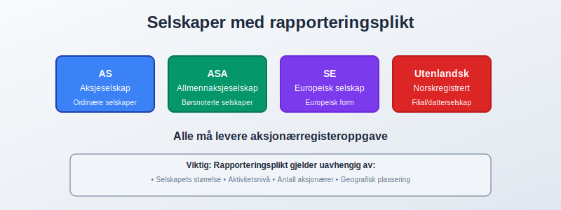

**Aksjonærregisteroppgave** er en **obligatorisk årlig rapportering** som alle norske [aksjeselskaper](/blogs/regnskap/hva-er-et-aksjeselskap "Hva er et Aksjeselskap (AS)? Komplett Guide til Norske Aksjeselskap") må sende til **Skatteetaten** innen **31. mai** hvert år. Denne oppgaven inneholder detaljert informasjon om selskapets **aksjeeierstruktur**, [aksjonærer](/blogs/regnskap/hva-er-en-aksjonaer "Hva er en Aksjonær? En Komplett Guide") og [aksjer](/blogs/regnskap/hva-er-en-aksje "Hva er en Aksje? En Enkel Forklaring"), og er en kritisk del av **skattekontroll** og **selskapsregisterføring** i Norge.

## Hva er aksjonærregisteroppgave?

**Aksjonærregisteroppgave** er en **formell rapport** som gir myndighetene fullstendig oversikt over **eierstrukturen** i norske aksjeselskaper. Oppgaven skal reflektere situasjonen per **31. desember** foregående år og må sendes elektronisk gjennom [Altinn](/blogs/regnskap/hva-er-altinn "Hva er Altinn? Norges Digitale Forvaltningsplattform") eller andre godkjente kanaler.

### Formål og betydning

Hovedformålet med aksjonærregisteroppgaven er å:

* **Sikre skattekontroll** av aksjonærer og utbytteutbetalinger
* **Overvåke eierstrukturer** i norske selskaper
* **Forebygge økonomisk kriminalitet** og hvitvasking
* **Støtte statistisk datainnsamling** for økonomisk analyse
* **Sikre transparens** i det norske næringslivet

## Hvem må levere aksjonærregisteroppgave?

**Alle aksjeselskaper** registrert i Norge har plikt til å levere aksjonærregisteroppgave, uansett størrelse eller aktivitetsnivå. Dette inkluderer:

### Omfattede selskaper

* **Ordinære aksjeselskaper (AS)**
* **Allmennaksjeselskaper (ASA)**
* **Europeiske aksjeselskaper (SE)**
* **Norskregistrerte utenlandske aksjeselskaper**

### Spesielle situasjoner

| Situasjon | Rapporteringsplikt | Merknad |
|:----------|:-------------------|:--------|
| **Nyetablerte selskaper** | Ja, fra stiftelsesåret | Gjelder selv om selskapet ikke har hatt aktivitet |
| **Selskaper under avvikling** | Ja, til avvikling er registrert | Må rapportere til siste regnskapsår |
| **Datterselskaper** | Ja, hver for seg | Konsernselskaper rapporterer individuelt |
| **Dormant selskaper** | Ja, hvis aksjer eksisterer | Ingen unntak for inaktive selskaper |

## Innhold og krav til aksjonærregisteroppgave

### Aksjonærinformasjon

**Detaljert informasjon** om hver aksjonær må inkluderes:

* **Navn og adresse** (for personlige aksjonærer)
* **Organisasjonsnummer** (for juridiske personer)
* **Fødselsnummer** eller **D-nummer** (for utenlandske personer)
* **Bostedsland** og **skattemessig bosted**
* **Eierandel** og **stemmeandel** per 31. desember

### Aksjeinformasjon

For hver [aksjeklasse](/blogs/regnskap/hva-er-aksjeklasser "Hva er Aksjeklasser? A-aksjer vs B-aksjer") må følgende oppgis:

* **Aksjeklasse** (A-aksjer, B-aksjer, osv.)
* **Pålydende verdi** per aksje
* **Antall aksjer** per aksjonær
* **Stemmerettigheter** knyttet til aksjene
* **Spesielle rettigheter** eller begrensninger

### Endringer i aksjonærkretsen

**Alle endringer** i løpet av regnskapsåret må dokumenteres:

* **Kjøp og salg** av aksjer
* **Emisjoner** og **nedsettelser** av aksjekapital
* **Splittelser** og **sammenslåinger** av aksjer
* **Arv** og **gave** av aksjer
* **Pantsettelser** og **andre sikkerhetsstillelser**

## Frister og leveringskanaler

### Kritiske frister

| Frist | Oppgave | Konsekvens ved forsinkelse |
|:------|:--------|:---------------------------|
| **31. mai** | Hovedfrist for levering | Gebyr og oppfølging |
| **31. august** | Siste frist etter forlengelse | Høyere gebyr |
| **31. desember** | Avsluttende frist | Tvangsgebyr og sanksjoner |

### Leveringsmåter

**Elektronisk levering** er obligatorisk:

* **Altinn** (mest brukte kanal)
* **Godkjente regnskapsystemer** med direkteintegrasjon
* **Fullmaktshaveres systemer** (autoriserte regnskapsførere)

## Relasjon til andre regnskapsplikter

### Sammenheng med årsoppgaven

Aksjonærregisteroppgaven er tett knyttet til [årsoppgaven](/blogs/regnskap/hva-er-aarsoppgave "Hva er Årsoppgave? Krav og Frister for Norske Bedrifter"):

* **Utbytteinformasjon** må stemme med regnskapstall
* **Aksjonærendringer** må reflekteres i begge oppgaver
* **Skattemessige konsekvenser** for både selskap og aksjonærer

### Forbindelse til aksjeeierboken

[Aksjeeierboken](/blogs/regnskap/hva-er-en-aksjeeierbok "Hva er en Aksjeeierbok? En Komplett Guide") er grunnlaget for aksjonærregisteroppgaven:

* **Konsistens** mellom aksjeeierbok og rapportering
* **Oppdateringer** må gjøres løpende gjennom året
* **Dokumentasjon** av alle endringer er påkrevd

## Sanksjoner og konsekvenser ved manglende levering

### Gebyrstruktur

**Trinnvis gebyrordning** ved forsinket levering:

| Forsinkelse | Gebyr | Tilleggstiltak |
|:------------|:------|:---------------|
| **1-60 dager** | 2,000 NOK | Purring fra Skatteetaten |
| **61-120 dager** | 5,000 NOK | Formell oppfølging |
| **121-180 dager** | 10,000 NOK | Tvangsmulkt |
| **Over 180 dager** | 15,000 NOK | Ytterligere sanksjoner |

### Ytterligere konsekvenser

* **Tvangsgebyr** kan påløpe månedlig
* **Politianmeldelse** ved gjentatte brudd
* **Registrering** i offentlige registre
* **Påvirkning** på selskapets kredittverdighet

## Praktisk gjennomføring

### Forberedelse og datainnsamling

**Systematisk tilnærming** til datainnsamling:

1. **Gjennomgang av aksjeeierbok** per 31. desember
2. **Verifikasjon** av alle aksjonæropplysninger
3. **Dokumentasjon** av endringer i året
4. **Kontroll** av stemmerettigheter og spesielle rettigheter

### Kvalitetssikring

**Kritiske kontrollpunkter:**

* **Summering** av alle aksjer mot aksjekapital
* **Verifikasjon** av organisasjonsnummer og fødselsnummer
* **Kontroll** av utenlandske aksjonærer
* **Avstemming** mot regnskapstall

## Spesielle utfordringer og løsninger

### Utenlandske aksjonærer

**Særskilte krav** for utenlandske aksjonærer:

* **Identifikasjon** gjennom D-nummer eller tilsvarende
* **Skattemessig bosted** må oppgis korrekt
* **Skatteavtaler** kan påvirke rapportering
* **Dokumentasjon** av identitet kan være krevende

### Komplekse eierstrukturer

Ved **komplekse eierstrukturer** må følgende vurderes:

* **Indirekte eierskap** gjennom holdingselskaper
* **Nominee-strukturer** og **forvaltning**
* **Trust-strukturer** og **stiftelser**
* **Samboerskap** og **ekteskapelig felleseie**

### Aksjeklasser og stemmerettigheter

**Forskjellige aksjeklasser** krever nøyaktig rapportering:

* **A-aksjer** og **B-aksjer** med ulike stemmerettigheter
* **Preferanseaksjer** med særlige rettigheter
* **Ansatteaksjer** med spesielle begrensninger
* **Warrants** og **opsjoner** under etablering

## Digitalisering og automatisering

### Moderne løsninger

**Teknologiske forbedringer** letter rapporteringen:

* **Automatisk dataoverføring** fra regnskapssystemer
* **Integrert kvalitetskontroll** i rapporteringssystemer
* **Varslingssystemer** for frister og endringer
* **Sanntidsoppdatering** av aksjonærinformasjon

### Fremtidige utviklinger

**Forventede endringer** i rapporteringskrav:

* **Hyppigere rapportering** av endringer
* **Utvidet informasjon** om reelle eiere
* **Integrasjon** med [Aksjonærregisteret](/blogs/regnskap/hva-er-aksjonaerregisteret "Hva er Aksjonærregisteret? Komplett Guide til Norges Aksjonærregister")
* **Automatisert cross-referanse** mellom registre

## Rollen til profesjonelle tjenesteyterne

### Autoriserte regnskapsførere

**Autoriserte regnskapsførere** kan bistå med:

* **Utarbeidelse** av aksjonærregisteroppgave
* **Kvalitetssikring** av data
* **Elektronisk levering** på vegne av selskapet
* **Oppfølging** av frister og endringer

### Revisorer og jurister

**Spesialiserte tjenesteyterne** bidrar med:

* **Komplekse eierstrukturer** og **internasjonale forhold**
* **Rettslig veiledning** ved usikkerhet
* **Skattemessig optimalisering** av eierstrukturer
* **Compliance** med endrede regelverk

## Internasjonale aspekter

### Skatteavtaler og dobbeltbeskatning

**Utenlandske aksjonærer** må vurdere:

* **Skatteavtaler** mellom Norge og hjemlandet
* **Kildeskatt** på utbytte og gevinster
* **Dokumentasjon** av skattemessig bosted
* **Refusjon** av overskytende skatt

### Rapportering til hjemland

**Tilleggskrav** for utenlandske aksjonærer:

* **CRS-rapportering** (Common Reporting Standard)
* **FATCA-krav** for amerikanske aksjonærer
* **Nasjonale rapporteringskrav** i hjemlandet
* **Dokumentasjon** av norsk aksjebesittelse

## Sammenheng med andre selskapsformer

### Sammenligning med andre foretak

| Selskapsform | Rapporteringsplikt | Sammenligning |
|:-------------|:-------------------|:---------------|
| **Enkeltpersonforetak** | Ingen aksjonærregisteroppgave | Enklere rapportering |
| **Ansvarlige selskaper** | Deltakerrapportering | Lignende, men ikke identisk |
| **Allmennaksjeselskaper** | Utvidet rapportering | Strengere krav |
| **Stiftelser** | Ingen aksjonærregisteroppgave | Annen regulering |

### Særlige hensyn for konsern

**Konsernstrukturer** krever ekstra oppmerksomhet:

* **Hver enhet** rapporterer individuelt
* **Konsern-interne eierskap** må dokumenteres
* **Eliminering** av double-counting
* **Konsolidering** på konsernnivå

## Nye krav og regelverksendringer 2024-2025

### Styrket UBO-rapportering (Ultimate Beneficial Owner)

**Nye krav** for identifisering av **reelle eiere** trer i kraft:

* **Dokumentasjon** av alle eiere med mer enn 25% eierandel
* **Rapportering** av kontrollstrukturer og stemmerettigheter
* **Vedlegg** med detaljerte eierstrukturdiagrammer
* **Kryss-referanse** mot [UBO-registeret](https://www.brreg.no/bedrift/opprettelse/reelle-rettighetshavere/ "Register over reelle rettighetshavere")

### Digitalisering og automatisering

**Nye teknologiske krav** fra 2024:

* **Strukturert dataformat** (XML/JSON) obligatorisk for store selskaper
* **API-integrasjon** for automatisert rapportering
* **Sanntidsvalidering** mot Brønnøysundregisteret
* **Elektronisk signatur** påkrevd for alle innsendelser

### Utvidet informasjonskrav

**Tilleggsinformasjon** som nå må rapporteres:

| Nytt krav | Beskrivelse | Gjelder fra |
|:----------|:------------|:------------|
| **Skattemessig bosted** | Detaljert informasjon for alle utenlandske aksjonærer | 1. januar 2024 |
| **Kontrollmekanismer** | Dokumentasjon av stemmerettigheter og kontroll | 1. mai 2024 |
| **Transaksjonshistorikk** | Alle endringer i løpet av året med datoer | 1. januar 2025 |
| **Relaterte parter** | Forbindelser mellom aksjonærer og selskap | 1. mai 2025 |

## Fremtidige endringer og utvikling

### Forventede regelverksendringer

**Kommende endringer** i rapporteringskrav:

* **Utvidet informasjon** om reelle eiere
* **Hyppigere rapportering** av endringer
* **Automatisert verifikasjon** mot andre registre
* **Integrasjon** med europeiske systemer

### Teknologiske forbedringer

**Nye teknologier** vil påvirke rapporteringen:

* **Blockchain-baserte** aksjeregistre
* **Kunstig intelligens** for kvalitetskontroll
* **Sanntidsrapportering** av endringer
* **Automatisert compliance**-sjekk

## Praktiske tips for bedriftsledere

### Forberedelse gjennom året

**Løpende forberedelse** sikrer smidig rapportering:

* **Oppdater aksjeeierbok** ved alle endringer
* **Dokumenter** alle aksjetransaksjoner
* **Verifiser** aksjonærinformasjon regelmessig
* **Forbered** rapportering tidlig i året

### Sjekkliste for aksjonærregisteroppgave

**Månedlig oppfølging** (anbefalt):

* ✅ **Kontroller** at alle aksjeendringer er registrert
* ✅ **Verifiser** kontaktinformasjon for aksjonærer
* ✅ **Dokumenter** alle transaksjoner med dato og beløp
* ✅ **Oppdater** stemmerettigheter ved endringer

**Kvartalsvis gjennomgang:**

* ✅ **Avstem** aksjekapital mot regnskapstall
* ✅ **Kontroller** utenlandske aksjonærer sitt skattemessige bosted
* ✅ **Gjennomgå** alle endringer i aksjeklasser
* ✅ **Forbered** dokumentasjon for komplekse strukturer

**Før 31. mai deadline:**

* ✅ **Fullfør** kvalitetssikring av alle data
* ✅ **Test** elektronisk innleveringssystem
* ✅ **Forbered** eventuelle vedlegg og tilleggsopplysninger
* ✅ **Lever** oppgaven minst 1 uke før fristen

### Kvalitetssikring

**Kritiske kontrollpunkter:**

* **Avstemming** mot regnskapstall
* **Verifikasjon** av identitetsopplysninger
* **Kontroll** av stemmerettigheter
* **Gjennomgang** av endringer i året

### Feilkilder og hvordan unngå dem

**Vanlige feil** og **forebyggende tiltak:**

* **Feil aksjonærinformasjon:** Regelmessig verifikasjon
* **Manglende endringer:** Systematisk oppfølging
* **Feil datering:** Konsistent bruk av 31. desember
* **Forsinkelse:** Tidlig påbegynnelse av arbeidet

### Vanlige utfordringer og løsninger

**Typiske problemer** og **hvordan løse dem:**

| Problem | Løsning | Forebygging |
|:--------|:--------|:------------|
| **Manglende D-nummer** for utenlandske aksjonærer | Kontakt Skatteetaten for tildeling | Søk om D-nummer ved aksjetegning |
| **Ukorrekt organisasjonsnummer** | Verifiser mot Brønnøysundregisteret | Automatisk validering i systemer |
| **Feil stemmerettigheter** | Gjennomgå [vedtekter](/blogs/regnskap/hva-er-vedtekter-for-aksjeselskap "Hva er Vedtekter for Aksjeselskap? Krav og Innhold") | Oppdater ved endringer i vedtekter |
| **Manglende dokumentasjon** | Systematisk arkivering av alle endringer | Digitalt aksjeregister med loggføring |
| **Tekniske problemer** ved levering | Test systemet før deadline | Lever tidlig, ha backup-plan |

### Praktiske eksempler

**Eksempel 1: Nyetablert selskap**
Et selskap stiftet i oktober 2023 må levere aksjonærregisteroppgave innen 31. mai 2024, selv om det ikke har hatt virksomhet.

**Eksempel 2: Aksjesalg i desember**
Aksjer solgt 20. desember 2023 må rapporteres med ny eier per 31. desember 2023, ikke den gamle eieren.

**Eksempel 3: Utenlandsk aksjonær**
En tysk aksjonær må oppgi tysk skattemessig bosted, ikke norsk adresse, selv om vedkommende har midlertidig opphold i Norge.

## Kostnader og ressurser

### Interne kostnader

**Estimerte kostnader** for intern håndtering:

| Aktivitet | Timesforbruk | Kostnad (ved 1,000 NOK/time) |
|:----------|:-------------|:------------------------------|
| **Datainnsamling** | 2-4 timer | 2,000-4,000 NOK |
| **Kvalitetssikring** | 1-2 timer | 1,000-2,000 NOK |
| **Rapportering** | 1-2 timer | 1,000-2,000 NOK |
| **Oppfølging** | 0.5-1 time | 500-1,000 NOK |

### Eksterne kostnader

**Kostnader ved bruk av externe tjenester:**

| Tjeneste | Kostnad | Fordeler |
|:---------|:--------|:---------|
| **Regnskapsfører** | 3,000-8,000 NOK | Profesjonell håndtering |
| **Rådgiver** | 5,000-15,000 NOK | Komplekse strukturer |
| **Systemleverandør** | 2,000-5,000 NOK | Automatisering |

## Relaterte artikler og ressurser

### Aksjeselskap og eierstruktur

* **[Hva er et Aksjeselskap?](/blogs/regnskap/hva-er-et-aksjeselskap "Hva er et Aksjeselskap (AS)? Komplett Guide til Norske Aksjeselskap")**
* **[Hva er en Aksjonær?](/blogs/regnskap/hva-er-en-aksjonaer "Hva er en Aksjonær? En Komplett Guide")**
* **[Hva er Aksjonærregisteret?](/blogs/regnskap/hva-er-aksjonaerregisteret "Hva er Aksjonærregisteret? Komplett Guide til Norges Aksjonærregister")**
* **[Hva er en Aksjeeierbok?](/blogs/regnskap/hva-er-en-aksjeeierbok "Hva er en Aksjeeierbok? En Komplett Guide")**

### Rapportering og compliance

* **[Hva er Årsoppgave?](/blogs/regnskap/hva-er-aarsoppgave "Hva er Årsoppgave? Krav og Frister for Norske Bedrifter")**
* **[Hva er Årsavslutning?](/blogs/regnskap/hva-er-aarsavslutning "Hva er Årsavslutning? Komplett Guide til Årsavslutning")**
* **[Hva er Altinn?](/blogs/regnskap/hva-er-altinn "Hva er Altinn? Norges Digitale Forvaltningsplattform")**
* **[Hva er A-melding?](/blogs/regnskap/hva-er-a-melding "Hva er A-melding? Komplett Guide til A-meldingen")**

### Aksjer og kapital

* **[Hva er en Aksje?](/blogs/regnskap/hva-er-en-aksje "Hva er en Aksje? En Enkel Forklaring")**
* **[Hva er Aksjeklasser?](/blogs/regnskap/hva-er-aksjeklasser "Hva er Aksjeklasser? A-aksjer vs B-aksjer")**
* **[Hva er Aksjekapital?](/blogs/regnskap/hva-er-aksjekapital "Hva er Aksjekapital? Krav og Forklaring")**
* **[Hva er et Aksjebevis?](/blogs/regnskap/hva-er-et-aksjebevis "Hva er et Aksjebevis? Elektroniske vs Fysiske Aksjebevis")**

### Skatt og regnskap

* **[Hva er Aksjonærmodellen?](/blogs/regnskap/aksjonaermodellen "Hva er Aksjonærmodellen? Skatteregler for Aksjonærer")**
* **[Hva er Fritaksmetoden?](/blogs/regnskap/hva-er-fritaksmetoden "Hva er Fritaksmetoden? Skatteregler for Aksjegevinst")**
* **[Hva er Betalbar Skatt?](/blogs/regnskap/hva-er-betalbar-skatt "Hva er Betalbar Skatt? Beregning og Behandling")**
* **[Hva er Skattemelding?](/blogs/regnskap/skattemelding "Hva er Skattemelding? Krav og Frister for Norske Skatteytere")**

### Juridiske aspekter

* **[Hva er Aksjeloven?](/blogs/regnskap/hva-er-aksjeloven "Hva er Aksjeloven? Regler for Aksjeselskaper i Norge")**
* **[Hva er Vedtekter for Aksjeselskap?](/blogs/regnskap/hva-er-vedtekter-for-aksjeselskap "Hva er Vedtekter for Aksjeselskap? Krav og Innhold")**
* **[Aksjonæravtale](/blogs/regnskap/aksjonaeravtale "Hva er en Aksjonæravtale? En Omfattende Guide til Aksjonæravtaler i Norge")**

## Konklusjon

**Aksjonærregisteroppgave** er en **kritisk compliance-oppgave** som alle norske aksjeselskaper må håndtere profesjonelt. Ved å forstå kravene, forberede seg systematisk og sikre nøyaktig rapportering kan selskaper unngå kostbare sanksjoner og bidra til transparens i norsk næringsliv.

**Nøkkelfaktorene** for vellykket håndtering er:

1. **Tidlig forberedelse** og systematisk datainnsamling
2. **Løpende oppdatering** av aksjeeierbok gjennom året
3. **Profesjonell kvalitetssikring** før levering
4. **Automatisering** der mulig for å redusere feil
5. **Samarbeid** med qualifiserte rådgivere ved komplekse strukturer

Investering i **gode rutiner** og **profesjonelle systemer** for aksjonærregisteroppgave betaler seg gjennom reduserte risikoinvesteringer og smidigere rapportering over tid.

