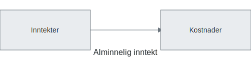

---
title: "Alminnelig inntekt"
seoTitle: "Alminnelig inntekt"
meta_description: '**Alminnelig inntekt** er grunnlaget for å beregne skatt (22–¯%) for norske selskaper og [personlig næringsdrivende](/blogs/regnskap/naeringsinntekt Næring...'
slug: alminnelig-inntekt
type: blog
layout: pages/single
---

**Alminnelig inntekt** er grunnlaget for å beregne skatt (22–¯%) for norske selskaper og [personlig næringsdrivende](/blogs/regnskap/naeringsinntekt "Næringsinntekt “ Komplett guide til næringsinntekt for selvstendig næringsdrivende"). Forståelsen av alminnelig inntekt er avgjørende for korrekt rapportering til Skatteetaten og optimal skatteplanlegging.
 
Det inkluderer **kapitalinntekter**, som du kan lese mer om i [Kapitalinntekt](/blogs/regnskap/kapitalinntekt "Kapitalinntekt “ Innføring i renter, utbytte, leieinntekter og kapitalgevinster i norsk regnskap").

## Hva er alminnelig inntekt?

Alminnelig inntekt defineres som det netto skattegrunnlaget som legges til grunn for beregning av selskapsskatt og formuesskatt. Begrepet omfatter:

* **[Inntekter](/blogs/regnskap/hva-er-inntekter "Hva er Inntekter? Komplett Guide til Inntektstyper og Regnskapsføring"):** Alle skattemessige inntekter fra virksomheten
* **Fradragsberettigede kostnader:** Kostnader som reduserer skattepliktig resultat
* **Skattemessige justeringer:** Periodisering, avskrivninger og andre korrigeringer

## Juridisk grunnlag

Definisjonen av alminnelig inntekt finnes i skatteloven § 5‘2 og bokføringsloven § 4‘1, som fastsetter hvordan inntekter og kostnader skal periodiseres og dokumenteres.

## Hvem omfattes?

Alminnelig inntekt gjelder for ulike selskapsformer:

| Selskapsform              | Skattesats på alminnelig inntekt                                |
|---------------------------|-----------------------------------------------------------------|
| Aksjeselskap (AS/ASA)     | **22–¯%**                                                        |
| Enkeltpersonforetak       | Progressiv personskatt (alminnelig inntekt + personfradrag)     |
| [Ansvarlig selskap (ANS/DA)](/blogs/regnskap/ansvarlig-selskap "Ansvarlig Selskap (ANS): Komplett Guide til Norsk Regnskap og Ansvarsstruktur") | Skattesats etter deltakernes andel av alminnelig inntekt        |

Se også [Hva er et aksjeselskap?](/blogs/regnskap/hva-er-et-aksjeselskap "Hva er et Aksjeselskap?") og [Hva er Enkeltpersonforetak?](/blogs/regnskap/hva-er-enkeltpersonforetak "Hva er Enkeltpersonforetak?") for mer om selskapsformer.
For en fullstendig oversikt over **firmaskatt**, se [Firmaskatt](/blogs/regnskap/firmaskatt "Firmaskatt “ Komplett guide til skatteregler for selskaper").

## Beregning av alminnelig inntekt

Alminnelig inntekt beregnes ved å summere alle inntekter, trekke fra kostnader og korrigere for skattemessige justeringer:

| Element               | Beskrivelse                                       |
|-----------------------|---------------------------------------------------|
| Inntekter             | Sum skattemessige inntekter                       |
| − Kostnader           | Sum fradragsberettigede kostnader                 |
| ± Justeringer         | Periodisering, avskrivninger og andre korreksjoner |
| **= Alminnelig inntekt** | Netto skattegrunnlag                              |

## Periodisering og avskrivninger

* **Periodiseringsprinsippet** sikrer at inntekter og kostnader knyttes til riktig regnskapsår. Se [Hva er periodisering?](/blogs/regnskap/hva-er-periodisering "Hva er Periodisering?").
* **Avskrivningsregler** bestemmer hvordan kostnader fordeles over eiendelens levetid. Les mer i [Hva er avskrivning?](/blogs/regnskap/hva-er-avskrivning "Hva er Avskrivning?").

## Skattesatser og unntak

Satsen for alminnelig inntekt er **22–¯%** (per 2024). Noen viktige unntak:

* **Negativ alminnelig inntekt**, også kalt [fremførbart underskudd](/blogs/regnskap/fremforbart-underskudd "Fremførbart underskudd: Komplett guide til håndtering av underskudd i regnskap og skatt"), kan fremføres ubegrenset mot fremtidig overskudd.
* **Fritaksmetoden** reduserer beskatning av utbytte og gevinster fra datterselskaper. Se [Hva er fritaksmetoden?](/blogs/regnskap/hva-er-fritaksmetoden "Hva er Fritaksmetoden? Komplett guide til skattefritak for utbytte").
* **Konsernbidrag** krever egne justeringer i konsernregnskapet.
* **Utbytte** fra aksjer beskattes delvis som alminnelig inntekt etter skjermingsregelen.

## Eksempel på beregning

| Post                         | Beløp (NOK)  |
|------------------------------|--------------|
| Inntekter                    | 1–¯200–¯000    |
| Kostnader                    |   750–¯000    |
| Avskrivninger og justeringer |    50–¯000    |
| **Alminnelig inntekt**           | **400–¯000**  |
| Selskapskatt (22–¯%)          |    88–¯000    |

## Betalbar skatt

Les mer om hvordan **betalbar skatt** fastsettes og rapporteres i [Betalbar skatt](/blogs/regnskap/betalbar-skatt "Betalbar skatt “ Komplett guide til beregning og håndtering").

## Ofte stilte spørsmål

### Hva er forskjellen mellom alminnelig inntekt og skattemessig resultat?

Alminnelig inntekt er skattegrunnlaget etter justeringer, mens skattemessig resultat kan inkludere midlertidige forskjeller som ikke inngår i alminnelig inntekt.

### Når kan negativ alminnelig inntekt fremføres?

Negativ alminnelig inntekt kan fremføres ubegrenset i tid, men konsern og fusjoner har egne regler.

### Hvordan påvirker fritaksmetoden alminnelig inntekt?

Utbytte og gevinst fra datterselskaper kan være delvis fritatt. Se [Hva er fritaksmetoden?](/blogs/regnskap/hva-er-fritaksmetoden "Hva er Fritaksmetoden? Komplett guide til skattefritak for utbytte").

## Videre lesning

* [Hva er avskrivning?](/blogs/regnskap/hva-er-avskrivning "Hva er Avskrivning?")
* [Hva er periodisering?](/blogs/regnskap/hva-er-periodisering "Hva er Periodisering?")
* [Hva er et aksjeselskap?](/blogs/regnskap/hva-er-et-aksjeselskap "Hva er et Aksjeselskap?")
* [Hva er Enkeltpersonforetak?](/blogs/regnskap/hva-er-enkeltpersonforetak "Hva er Enkeltpersonforetak?")
* [Hva er fritaksmetoden?](/blogs/regnskap/hva-er-fritaksmetoden "Hva er Fritaksmetoden? Komplett guide til skattefritak for utbytte")
* [Betalbar skatt](/blogs/regnskap/betalbar-skatt "Betalbar skatt “ Komplett guide til beregning og håndtering")
* [Firmaskatt](/blogs/regnskap/firmaskatt "Firmaskatt “ Komplett guide til skatteregler for selskaper")

