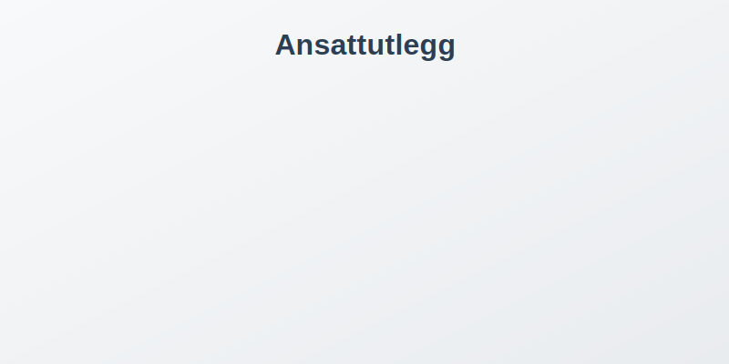

**Ansattutlegg** er [utgifter](/blogs/regnskap/utgift "Utgift “ Komplett Guide til Utgifter i Norsk Regnskap") som ansatte legger ut pÃ¥ vegne av virksomheten med egne midler, og som senere refunderes eller avregnes mot lønnen. Korrekt hÃ¥ndtering av ansattutlegg er kritisk for Ã¥ sikre nøyaktig regnskapsføring, internkontroll og skattemessig korrekthet i norske virksomheter.

## Hva er Ansattutlegg?

> Ansattutlegg er en form for **utlegg** hvor ansatte eller tilknyttede parter dekker kostnader for virksomheten med egne midler, med forventning om refusjon eller avregning mot lønn.

Ansattutlegg oppstår når ansatte må dekke virksomhetsrelaterte kostnader personlig, typisk i situasjoner hvor:

* Det ikke er praktisk mulig å bruke bedriftens [**bedriftskonto**](/blogs/regnskap/bedriftskonto "Bedriftskonto - Guide til Bedriftskonto og Banktjenester") direkte
* Ansatte handler på vegne av virksomheten i akutte situasjoner
* Virksomheten benytter utleggssystem som del av kompensasjonsordningen

## Typer Ansattutlegg

### Reiseutlegg
**Reiseutlegg** omfatter alle kostnader knyttet til forretningsreiser og er den vanligste formen for ansattutlegg:

* **Transport**: Fly, tog, drosje, kollektivtransport og kjøregodtgjørelse (se [kjørebok](/blogs/regnskap/hva-er-kjorebok "Hva er kjørebok? Komplett Guide til Kjørebok for Bedrifter i Norge"))
* **Overnatting**: Hotell, andre overnattingssteder og tilleggstjenester
* **[Diett](/blogs/regnskap/diett "Diett: Guide til normaltariffer, regler og regnskapsføring av diett")**: Måltider under reise og representasjon
* **Reiseforsikring**: Nødvendige forsikringer for forretningsreiser

### Kontor- og Driftsmateriell
Ansatte kan legge ut for mindre innkjøp av driftsmateriell:

* **Kontormateriell**: Kulepenn, papir, notisblokker og lignende
* **Programvare**: Mindre programvarelisenser og digitale verktøy
* **Verktøy**: Håndverktøy og mindre arbeidsrelatert utstyr

### Representasjonsutlegg
**Representasjonsutlegg** omfatter kostnader knyttet til kundepleie og forretningsutvikling:

* **Kundemøter**: Måltider og bevertning av kunder
* **Konferanser**: Påmelding og deltakelse på faglige arrangementer
* **Gaver**: Representasjonsgaver til kunder og forretningspartnere

## Regnskapsføring av Ansattutlegg

### Grunnleggende Bokføring

Ansattutlegg må **periodiseres** til korrekt regnskapsperiode og dokumenteres mot egne kontoer før refusjon eller [**avregning**](/blogs/regnskap/avregning "Avregning - Komplett Guide til Avregning i Regnskap"):

| Transaksjon | Debet | Kredit |
|-------------|-------|--------|
| Registrering av utlegg | Relevant utgiftskonto (f.eks. 6000-6999) | 1940 Utlegg til ansatte |
| Refusjon til ansatt | 1940 Utlegg til ansatte | 1900 Bankkonto |
| Avregning mot lønn | 1940 Utlegg til ansatte | 5700 Personalomkostninger |

### Kontoplan for Ansattutlegg

Standard kontoer for ansattutlegg i norsk [**kontoplan**](/blogs/regnskap/hva-er-kontoplan "Kontoplan - Komplett Guide til Norsk Kontoplan"):

| Konto | Beskrivelse | Bruk |
|-------|-------------|------|
| 1940 | Utlegg til ansatte | Midlertidig gjeld til ansatte |
| 1950 | Forskudd til ansatte | Forskudd gitt til ansatte |
| 6000-6999 | Driftskostnader | Klassifisering av utgiftstyper |
| 7140 | Reise- og oppholdsutgifter | Spesifikt for reiseutlegg |
| 7300 | Representasjon | Representasjonsutlegg |

### Periodisering og Timing

> Ansattutlegg må føres i den regnskapsperioden hvor kostnadene påløper, ikke når refusjon skjer.

**Periodiseringsprinsippet** krever at:

1. **Utgiften** føres når den påløper (ikke når den betales)
2. **Gjelden** til ansatt registreres umiddelbart
3. **Refusjon** behandles som en separat transaksjon

## Dokumentasjonskrav

### Lovpålagte Krav

[**Bokføringsloven**](/blogs/regnskap/hva-er-bokforingsloven "Bokføringsloven - Komplett Guide til Norsk Bokføringslov") og [**bokføringsforskriften**](/blogs/regnskap/hva-er-bokforingsregler "Bokføringsregler - Guide til Norske Bokføringsregler") stiller strenge krav til dokumentasjon av ansattutlegg:

| Dokumentasjon | Krav | Eksempel |
|---------------|------|----------|
| **Originalkvittering** | Må være original eller digitalt godkjent kopi | Kvittering fra restaurant, hotell eller transportør |
| **Forretningsformål** | Tydelig angivelse av formål og sammenheng | "Kundemøte med ABC AS - diskusjon av kontrakt" |
| **Dato og beløp** | Korrekt datostempel og beløpsinformasjon | Kvittering med lesbar dato og totalbeløp |
| **Godkjenning** | Autorisasjon fra leder eller controller | Signatur eller digital godkjenning |

### [Reiseregninger](/blogs/regnskap/reiseregning "Reiseregning - Guide til reiseregninger i Norsk Regnskap")

**Reiseregninger** må inneholde detaljerte opplysninger:

* **Reisemål og formål**: Hvor og hvorfor reisen fant sted
* **Tidsrom**: Fra- og til-dato for reisen
* **Kostnadsspesifikasjon**: Detaljert oversikt over alle utgifter
* **Kvitteringer**: Originalkvitteringer for alle utgifter over fastsatt beløp

### Digital Dokumentasjon

Moderne virksomheter benytter ofte **digitale løsninger** for dokumentasjon:

* **Kvitteringsskanning**: Mobilapper for øyeblikkelig registrering
* **Elektronisk arbeidsflyt**: Automatisk routing til godkjennere
* **Integrasjon**: Kobling til [**ERP-systemer**](/blogs/regnskap/hva-er-erp-system "ERP-system - Guide til Enterprise Resource Planning")

## Skattemessige Hensyn

### Fradragsberettigede Utlegg

> Skattemessig behandling av ansattutlegg avhenger av utgiftens art og om den følger alminnelige fradragsregler i [**skatteloven**](/blogs/regnskap/hva-er-skatt "Skatt - Komplett Guide til Skatt i Norge").

**Fradragsberettigede utlegg** må oppfylle følgende krav:

1. **Nødvendige for virksomheten**: Direkte tilknyttet virksomhetens drift
2. **Dokumentert**: Tilstrekkelig dokumentasjon i henhold til kravene
3. **Godkjent**: Autorisert gjennom virksomhetens godkjenningsprosedyrer
4. **Rimelige**: Kostnadene må være rimelige i forhold til formålet

### Ikke-fradragsberettigede Utlegg

Følgende utlegg gir **ikke fradragsrett**:

* **Private kostnader**: Kostnader som ikke er direkte virksomhetsrelaterte
* **Overdreven representasjon**: Utgifter som overstiger det rimelige
* **Manglende dokumentasjon**: Utlegg uten tilstrekkelig dokumentasjon
* **Personlige goder**: Kostnader som primært kommer ansatte til gode

### Merverdiavgift (MVA)

**MVA-behandling** av ansattutlegg følger vanlige regler:

| Utgiftstype | MVA-sats | Fradragsrett |
|-------------|----------|--------------|
| **Reiseutlegg** | 25% | Ja (med dokumentasjon) |
| **Representasjon** | 25% | Begrenset (50% av MVA) |
| **Kontorutstyr** | 25% | Ja |
| **Kjøregodtgjørelse** | Ingen MVA | Ikke relevant |

## Internkontroll og Godkjenning

### Godkjenningsprosedyrer

> Effektiv internkontroll reduserer risiko for feil og misligheter i håndtering av ansattutlegg.

**Godkjenningsnivåer** bør etableres basert på:

1. **Beløpsgrenser**: Ulike godkjenningsnivåer basert på utgiftens størrelse
2. **Utgiftstype**: Spesifikke krav for ulike typer utlegg
3. **Organisatorisk nivå**: Godkjenning på passende ledernivå

### Eksempel på Godkjenningsnivåer

| Beløp | Godkjenner | Ekstra Krav |
|-------|------------|-------------|
| 0 - 5,000 kr | Nærmeste leder | Standard dokumentasjon |
| 5,001 - 15,000 kr | Avdelingsleder | Skriftlig begrunnelse |
| 15,001 - 50,000 kr | Økonomiansvarlig | Budsjettgodkjenning |
| Over 50,000 kr | Daglig leder | Styregodkjenning |

### Kontrollrutiner

**Kontrollrutiner** bør inkludere:

* **Stikprøvekontroller**: Regelmessig gjennomgang av utlegg
* **Budsjettoppfølging**: Overvåking av utlegg mot budsjett
* **Trendanalyser**: Identifikasjon av uvanlige mønstre
* **Revisjonsarbeid**: Ekstern gjennomgang av rutiner

## Digitale Verktøy og Automatisering

### Moderne Utleggsløsninger

**Digitale verktøy** effektiviserer hele utleggsprosessen:

* **Mobilapper**: Øyeblikkelig registrering og kvitteringsskanning
* **Automatisk kategorisering**: AI-basert klassifisering av utgifter
* **Arbeidsflyt**: Automatisert routing til godkjennere
* **Integrasjon**: Kobling til [**lønnssystem**](/blogs/regnskap/hva-er-lonn "Lønn - Komplett Guide til Lønn og Lønnsberegning") og regnskap

### Fordeler med Digitalisering

| Område | Fordel | Beskrivelse |
|--------|--------|-------------|
| **Effektivitet** | Redusert behandlingstid | Raskere fra registrering til refusjon |
| **Nøyaktighet** | Færre feil | Automatisk validering og kontroll |
| **Sporbarhet** | Bedre dokumentasjon | Komplett auditspor for alle transaksjoner |
| **Compliance** | Regeloverholdelse | Automatisk sikring av lovkrav |

### Integrasjon med Regnskapssystem

**Integrasjon** med [**regnskapssystem**](/blogs/regnskap/hva-er-regnskap "Regnskap - Komplett Guide til Regnskap") gir:

1. **Automatisk bokføring**: Direkte overføring til riktige kontoer
2. **Real-time oppdatering**: Øyeblikkelig oppdatering av balanse
3. **Rapportering**: Automatisk generering av utleggsrapporter
4. **Avregning**: Automatisk avregning mot [**lønn**](/blogs/regnskap/hva-er-lonn "Lønn - Komplett Guide til Lønn og Lønnsberegning")

## Utleggsretningslinjer og Policyer

### Utforming av Utleggsretningslinjer

> Klare retningslinjer forebygger misforståelser og sikrer konsistent håndtering av ansattutlegg.

**Utleggsretningslinjer** bør dekke:

1. **Definisjon av godkjente utlegg**: Hva som kan refunderes
2. **Beløpsgrenser**: Maksimalbeløp for ulike utgiftstyper
3. **Dokumentasjonskrav**: Spesifikke krav til kvitteringer og dokumentasjon
4. **Tidsfrist**: Når utlegg må være innsendt for refusjon
5. **Godkjenningsprosess**: Hvem som kan godkjenne ulike typer utlegg

### Kommunikasjon og Opplæring

**Ansattopplæring** er kritisk for suksess:

* **Introduksjonsprogram**: Opplæring for nye ansatte
* **Ã…rlige oppfriskeringer**: Regelmessig oppdatering av kunnskap
* **Praktiske eksempler**: Konkrete case-studier og eksempler
* **Tilgjengelige ressurser**: Enkelt tilgjengelige retningslinjer og hjelpemidler

## Vanlige Utfordringer og Løsninger

### Typiske Problemområder

| Problem | Årsak | Løsning |
|---------|-------|---------|
| **Sent innsendte utlegg** | Manglende rutiner | Automatiske påminnelser og frister |
| **Ufullstendig dokumentasjon** | Uklare retningslinjer | Sjekklister og templates |
| **Feil kategorisering** | Manglende kunnskap | Automatisk forslag og validering |
| **Dubletter** | Manuell registrering | Automatisk duplikatsjekk |

### Beste Praksis

**Anbefalte tiltak** for effektiv utleggshåndtering:

1. **Standardisering**: Bruk av standardiserte skjemaer og prosesser
2. **Automatisering**: Minimering av manuelt arbeid
3. **Kvalitetskontroll**: Regelmessig gjennomgang av prosesser
4. **Kontinuerlig forbedring**: Oppdatering basert på erfaringer

## Juridiske Aspekter

### Arbeidsgiversansvar

**Arbeidsgivere** har ansvar for:

* **Rimelig refusjon**: Refusjon av berettigede utlegg innen rimelig tid
* **Dokumentasjon**: Oppbevaring av dokumentasjon i henhold til [**bokføringsloven**](/blogs/regnskap/hva-er-bokforingsloven "Bokføringsloven - Komplett Guide til Norsk Bokføringslov")
* **Skatteforhold**: Korrekt håndtering av skattemessige implikasjoner

### Ansattes Rettigheter

**Ansatte** har rett til:

* **Refusjon**: FÃ¥ refundert legitimt berettigede utlegg
* **Forutsigbarhet**: Klare retningslinjer for hva som dekkes
* **Rimelig behandlingstid**: Refusjon innen rimelig tid

## Rapportering og Analyse

### Utleggsrapporter

**Regelmessig rapportering** gir innsikt i:

* **Utgiftsmønstre**: Trender og sesongvariasjoner
* **Kostnadscontrolling**: Sammenligning mot budsjett
* **Avviksanalyser**: Identifikasjon av uvanlige transaksjoner
* **Leverandøranalyser**: Evaluering av leverandørbruk

### Nøkkeltall (KPI-er)

| Nøkkeltall | Formål | Beregning |
|------------|--------|-----------|
| **Gjennomsnittlig utlegg per ansatt** | Kostnadskontroll | Totale utlegg / antall ansatte |
| **Behandlingstid** | Effektivitet | Tid fra registrering til refusjon |
| **Godkjenningsgrad** | Kvalitet | Andel godkjente vs. avviste utlegg |
| **Digitalisering** | Modernisering | Andel digitalt registrerte utlegg |

## Fremtidige Trender

### Teknologisk Utvikling

**Fremtidige utviklinger** inkluderer:

* **Kunstig intelligens**: Automatisk kategorisering og validering
* **Blockchain**: Sikker og transparent dokumentasjon
* **Mobil-først**: Heldigitale prosesser optimert for mobile enheter
* **Integrasjon**: Sømløs kobling mellom alle systemer

### Regulatoriske Endringer

**Potensielle regulatoriske endringer**:

* **Digitalisering**: Krav til elektronisk dokumentasjon
* **Rapportering**: Utvidede rapporteringskrav
* **Automatisering**: Standardisering av digitale prosesser

## Relaterte Emner

### Tilknyttede Regnskapskonsepter

* **[Utlegg](/blogs/regnskap/hva-er-utlegg "Utlegg - Komplett Guide til Utlegg i Regnskap")**: Generell informasjon om alle typer utlegg
* **[Ansattreskontro](/blogs/regnskap/hva-er-ansattreskontro "Ansattreskontro - Guide til Ansattkontoer i Regnskap")**: Detaljert informasjon om ansattkontoer
* **[Avregning](/blogs/regnskap/avregning "Avregning - Komplett Guide til Avregning i Regnskap")**: Hvordan utlegg avregnes mot lønn
* **[Personalomkostninger](/blogs/regnskap/hva-er-personalkostnad "Personalkostnad - Guide til Personalkostnader i Regnskap")**: Bredere perspektiv på personalkostnader

### Systemintegrasjon

* **[ERP-system](/blogs/regnskap/hva-er-erp-system "ERP-system - Guide til Enterprise Resource Planning")**: Integrasjon med virksomhetssystemer
* **[Lønn](/blogs/regnskap/hva-er-lonn "Lønn - Komplett Guide til Lønn og Lønnsberegning")**: Sammenheng med lønnssystem
* **[Budsjett](/blogs/regnskap/hva-er-budsjettering "Budsjett - Komplett Guide til Budsjett og Budsjettering")**: Budsjettplanlegging av utlegg

---

*Denne artikkelen gir en omfattende oversikt over ansattutlegg i norsk regnskap. For spesifikke spørsmål eller komplekse situasjoner, anbefales det å konsultere med regnskapsfører eller revisor.*

