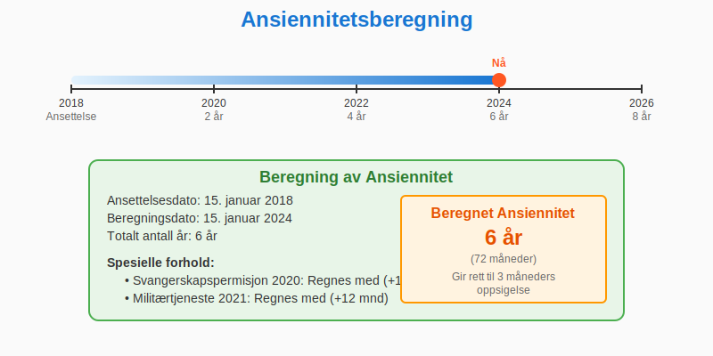
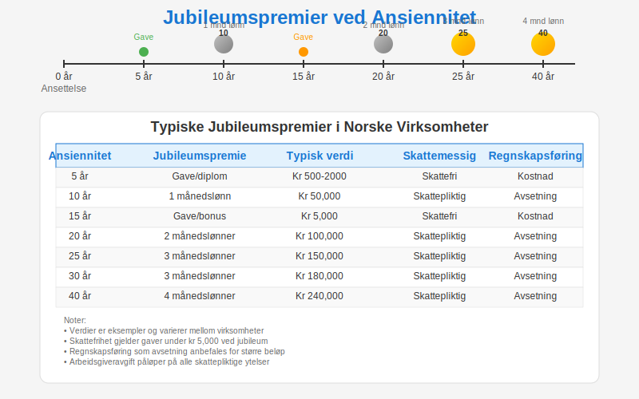

---
title: "Ansiennitet: Hva det betyr for lønn, rettigheter og regnskap"
seoTitle: "Ansiennitet | Betydning for lønn, rettigheter og regnskap"
description: "Ansiennitet beskriver hvor lenge en ansatt har jobbet i virksomheten og påvirker lønn, oppsigelsesfrister, ferie og pensjon. Denne guiden forklarer reglene, beregning og regnskapsmessige konsekvenser for arbeidsgivere."
summary: "En oversikt over ansiennitet med praktiske tabeller for oppsigelsesfrist, feriepenger og pensjon."
---

**Ansiennitet** er et grunnleggende konsept i norsk arbeidsrett og regnskapsføring som beskriver hvor lenge en ansatt har vært tilknyttet en virksomhet. Dette har omfattende juridiske, økonomiske og regnskapsmessige konsekvenser for både arbeidsgiver og arbeidstaker.


## Hva er Ansiennitet?

> **Ansiennitet** refererer til den akkumulerte tiden en ansatt har vært i stilling hos samme arbeidsgiver, og danner grunnlaget for en rekke rettigheter, ytelser og forpliktelser.

Ansiennitet er ikke bare en enkel tidsberegning, men et komplekst juridisk og regnskapsmessig konsept som påvirker:

* **Lønnsnivå** og lønnsøkninger (se [Gjennomsnittslønn i Norge](/blogs/regnskap/gjennomsnittslonn-i-norge "Gjennomsnittslønn i Norge"))
* **Pensjonsopptjening** og pensjonsberegning
* **Ferie- og fridagsrettigheter**
* **Oppsigelsesfrister** og avgangsvilkår
* **Sluttvederlag** og fratredelsesytelser
* **Ansiennitetspremier** og tillegg


## Juridisk Grunnlag for Ansiennitet

Ansiennitet er regulert gjennom flere juridiske kilder:

### Arbeidsmiljøloven
Arbeidsmiljøloven § 15-3 regulerer **[oppsigelsesfrister](/blogs/regnskap/oppsigelsestid "Oppsigelsestid")** basert på ansiennitet:

| Ansiennitet      | [Oppsigelsestid](/blogs/regnskap/oppsigelsestid "Oppsigelsestid") |
|------------------|------------------|
| Under 6 måneder  | 1 måned          |
| 6 måneder“2 år   | 2 måneder        |
| 2“5 år           | 3 måneder        |
| Over 5 år        | 4 måneder        |

### Tariffavtaler
[Tariffavtaler](/blogs/regnskap/tariff "Tariff i Norsk Regnskap") kan gi **utvidede rettigheter** basert på ansiennitet:

* Høyere feriepengesats (12,5% i stedet for 10,2%)
* Ekstra feriedager ved lang tjenestetid
* Ansiennitetstillegg og lønnstrinn
* Bedre pensjonsordninger

### Ferieloven
Ferieloven gir rettigheter som øker med ansiennitet:

* Rett til ferie etter 12 måneder
* Ansiennitetspremier ved jubileum
* Særlige regler for sykdom under ferie

## Beregning av Ansiennitet

### Grunnleggende Beregning

**Ansiennitet** beregnes fra første arbeidsdag til aktuell dato. Viktige prinsipper:

* Regnes i **fulle år** for de fleste formål
* **Sammenhengende ansettelse** er hovedregelen
* **Permisjon** og **sykdom** regnes vanligvis med
* **Militærtjeneste** regnes med hvis den avbryter ansettelsen



### Spesielle Beregningsregler

#### Virksomhetsoverdragelse
Ved virksomhetsoverdragelse (jf. arbeidsmiljøloven § 16) **overføres ansiennitet** til ny arbeidsgiver:

* Full ansiennitet fra opprinnelig ansettelsesdato
* Rettigheter og forpliktelser følger med
* Ny arbeidsgiver overtar alle ansiennitetsbetingede ytelser

#### Konsernforhold
I konsernforhold kan ansiennitet beregnes på ulike måter:

* **Konsernansiennitet**: Samlet tjeneste i hele konsernet
* **Selskapsansiennitet**: Kun tjeneste i aktuelt selskap
* **Tariffavtaler** kan gi spesielle regler

#### Avbrudd i Ansettelsen
Hvis ansettelsen avbrytes og gjenopptas:

* **Kort avbrudd** (under 6 måneder): Ansiennitet beholdes
* **Langt avbrudd** (over 6 måneder): Ny ansiennitetsberegning
* **Tariffavtaler** kan gi gunstigere regler

## Ansiennitet og Lønn

### Lønnstrinn og Ansiennitetstillegg

Mange virksomheter opererer med **lønnstrinn** basert på ansiennitet:

| Ansiennitet | Lønnstrinn | Typisk økning |
|-------------|------------|---------------|
| 0“2 år      | Trinn 1-3  | 2-4%          |
| 2“5 år      | Trinn 4-8  | 3-5%          |
| 5“10 år     | Trinn 9-15 | 4-6%          |
| 10+ år      | Trinn 16+  | 5-8%          |

### Regnskapsføring av Ansiennitetstillegg

Ansiennitetstillegg føres som:

```
Debet: Lønnskostnad (5000-serien)
Kredit: Lønn til utbetaling (2400-serien)
```

### Jubileumspremier

Mange virksomheter gir **jubileumspremier** ved milepæler:

* 10 års jubileum: 1-2 månedslønn
* 25 års jubileum: 2-3 månedslønn
* 40 års jubileum: 3-4 månedslønn



#### Regnskapsføring av Jubileumspremier

**Avsetning for fremtidige jubileumspremier**:

```
Debet: Lønnskostnad (5000)
Kredit: Avsetning jubileumspremier (2700)
```

**Utbetaling av jubileumspremie**:

```
Debet: Avsetning jubileumspremier (2700)
Kredit: Lønn til utbetaling (2400)
```

## Ansiennitet og Pensjon

### Tjenestepensjon

**Ansiennitet** er avgjørende for pensjonsopptjening:

* **Opptjeningstid**: Minimum 3 års ansiennitet for rett til tjenestepensjon
* **Opptjeningsgrunnlag**: Øker med ansiennitet
* **Pensjonsalder**: Kan påvirkes av lang tjenestetid

### Pensjonsopptjening etter Ansiennitet

| Ansiennitet | Opptjeningsrate | Maksimal pensjon |
|-------------|----------------|------------------|
| 3“10 år     | 2,0% per år    | 20%              |
| 10“20 år    | 2,5% per år    | 45%              |
| 20“30 år    | 3,0% per år    | 75%              |
| 30+ år      | 3,5% per år    | 100%             |

### Regnskapsføring av Pensjonskostnader

**Årets pensjonskostnad** beregnes basert på ansiennitet:

```
Debet: Pensjonskostnad (5140)
Kredit: Pensjonsforpliktelser (2900)
```

Se mer om [Tjenestepensjon](/blogs/regnskap/hva-er-tjenestepensjon "Hva er Tjenestepensjon? Komplett guide til tjenestepensjon og regnskapsføring") for detaljerte regler.

## Ansiennitet og Feriepenger

### Grunnleggende Feriepengeberegning

Alle ansatte har rett til **feriepenger** uavhengig av ansiennitet:

* **Hovedregel**: 10,2% av feriepengeberegnet lønn
* **Arbeidere**: 12% av feriepengeberegnet lønn
* **Ansiennitetstillegg**: Kan gi høyere sats

### Ansiennitetsbetingede Ferierettigheter

#### Ekstra Feriedager
Noen tariffavtaler gir **ekstra feriedager** basert på ansiennitet:

| Ansiennitet | Feriedager | Ekstra dager |
|-------------|------------|-------------|
| 0“5 år      | 25 dager   | 0            |
| 5“10 år     | 25 dager   | 1            |
| 10“15 år    | 25 dager   | 2            |
| 15+ år      | 25 dager   | 3            |

#### Særlige Feriepengesatser
Langvarig ansatte kan ha rett til **høyere feriepengesats**:

* 10+ års ansiennitet: 12,5% (i stedet for 10,2%)
* 20+ års ansiennitet: 15% (i enkelte tariffavtaler)

### Regnskapsføring av Feriepenger

**Ordinære feriepenger**:

```
Debet: Feriepengekostnad (5300)
Kredit: Skyldig feriepenger (2420)
```

**Ansiennitetstillegg feriepenger**:

```
Debet: Feriepengekostnad ansiennitet (5310)
Kredit: Skyldig feriepenger ansiennitet (2421)
```

Se mer om [Feriepenger](/blogs/regnskap/hva-er-feriepenger "Hva er Feriepenger? Komplett guide til feriepenger og regnskapsføring") for fullstendige regler.

## Ansiennitet ved Oppsigelse og Avgang

### Oppsigelsesfrister

**Arbeidsmiljøloven** § 15-3 fastsetter **minimumsfrister** basert på ansiennitet:

| Ansiennitet      | Oppsigelsesfrist fra arbeidsgiver | Oppsigelsesfrist fra arbeidstaker |
|------------------|-----------------------------------|-----------------------------------|
| Under 6 måneder  | 1 måned                           | 14 dager                          |
| 6 måneder“2 år   | 2 måneder                         | 1 måned                           |
| 2“5 år           | 3 måneder                         | 1 måned                           |
| Over 5 år        | 4 måneder                         | 1 måned                           |

### Sluttvederlag

Ved **langt ansettelsesforhold** kan det gis sluttvederlag:

* **10+ års ansiennitet**: 1-3 månedslønn
* **20+ års ansiennitet**: 3-6 månedslønn
* **30+ års ansiennitet**: 6-12 månedslønn

#### Regnskapsføring av Sluttvederlag

**Avsetning for sluttvederlag**:

```
Debet: Personalbehandling (5900)
Kredit: Avsetning sluttvederlag (2750)
```

**Utbetaling av sluttvederlag**:

```
Debet: Avsetning sluttvederlag (2750)
Kredit: Lønn til utbetaling (2400)
```

### Alderspensjon og Ansiennitet

Ved **alderspensjon** påvirker ansiennitet:

* **Pensjonsalder**: Kan senkes ved lang tjenestetid
* **Pensjonsnivå**: Øker med ansiennitet
* **Overgangsordninger**: Spesielle regler for langvarig ansatte

## Spesielle Ansiennitetsordninger

### Offentlig Sektor

Offentlig sektor har **spesielle ansiennitetsregler**:

* **Stillingsvern**: Sterkere ved lang ansiennitet
* **Lønnsrammer**: Automatisk progresjon basert på ansiennitet
* **Pensjonsordninger**: Særlige regler for statstilsatte

### Privat Sektor

Privat sektor har **mer fleksible** ansiennitetsordninger:

* **Tariffavtaler**: Fastsetter spesifikke rettigheter
* **Individuelle avtaler**: Kan gi bedre vilkår
* **Bedriftspensjon**: Varierer mellom virksomheter

### Internasjonale Ansettelser

Ved **internasjonale ansettelser** må man vurdere:

* **Norske regler**: Gjelder ved ansettelse i Norge
* **Utlandske regler**: Kan gi andre rettigheter
* **Konsernregler**: Spesielle ordninger for konsernansatte

## Dokumentasjon og Oppbevaring

### Nødvendig Dokumentasjon

For å dokumentere ansiennitet må følgende oppbevares:

* **Ansettelseskontrakter** med ansettelsesdato
* **Permisjonsvedtak** og sykmeldinger
* **Lønns- og personalregistre**
* **Tariffavtaler** og regelverksendringer

### Oppbevaringsplikt

Personaldokumenter må oppbevares i **minst 5 år** etter ansettelsens slutt. For pensjonsrelaterte dokumenter gjelder **50 års oppbevaringsplikt**.

### Digitale Systemer

Moderne lønns- og personalsystemer kan:

* **Automatisk beregne** ansiennitet
* **Varsle om** jubileum og rettigheter
* **Integrere med** regnskapssystemer
* **Dokumentere** alle endringer

## Internasjonale Perspektiver

### EU-regler

**EU-direktivet** om arbeidsvilkår påvirker ansiennitetsregler:

* **Virksomhetsoverdragelse**: Ansiennitet skal overføres
* **Diskrimineringsforbud**: Ansiennitet kan ikke diskriminere
* **Arbeidstid**: Ansiennitet påvirker ferierettigheter

### Nordiske Sammenligninger

| Land        | Maksimal oppsigelsesfrist | Feriepengesats | Pensjonssystem |
|-------------|--------------------------|----------------|----------------|
| Norge       | 4 måneder                | 10,2%/12%      | 2-pilarsystem  |
| Sverige     | 6 måneder                | 12%            | ATP-system     |
| Danmark     | 6 måneder                | 12,5%          | Folkepensjon   |
| Finland     | 6 måneder                | 11,5%          | Arbeidspenjon  |

## Fremtidige Utviklingstrekk

### Demografiske Endringer

**Befolkningsutvikling** påvirker ansiennitetsregler:

* **Aldring**: Lengre arbeidskarrierer
* **Mobilitet**: Hyppigere jobbytte
* **Kompetanse**: Fokus på kvalifikasjoner fremfor ansiennitet

### Teknologiske Endringer

**Digitalisering** påvirker ansiennitetssystemer:

* **Automatisering**: Enklere beregning og administrasjon
* **Integrering**: Bedre sammenheng mellom HR og regnskap
* **Analyse**: Bedre prognoser for personalkostnader

### Arbeidsmarkedsendringer

**Nye arbeidsformer** utfordrer tradisjonelle ansiennitetsmodeller:

* **Prosjektansettelser**: Kortere ansettelsesforhold
* **Fleksibilitet**: Mindre fokus på fast ansettelse
* **Kompetansemobilitet**: Belønning basert på ferdigheter

## Praktiske Råd for Virksomheter

### Utforming av Ansiennitetspolitikk

1. **Kartlegg** gjeldende tariffavtaler og lovkrav
2. **Definer** klare ansiennitetstrinn og rettigheter
3. **Integrer** med lønns- og personalsystemer
4. **Kommuniser** tydelig til ansatte
5. **Evaluer** regelmessig kostnadsutviklingen

### Regnskapsmessige Tiltak

1. **Avsetninger**: Beregn fremtidige jubileumspremier
2. **Budsjetting**: Inkluder ansiennitetskostnader
3. **Rapportering**: Separate ansiennitetskostnader
4. **Kontroll**: Regelmessig oppfølging av rettigheter

### Risikostyring

1. **Kostnadskontroll**: Overvåk ansiennitetsdrevne kostnader
2. **Juridisk compliance**: Sikre etterlevelse av regler
3. **Dokumentasjon**: Oppretthold fullstendig dokumentasjon
4. **Forsikring**: Vurder ansiennitetsrelaterte risikoer

## Relaterte Regnskapsmessige Konsekvenser

### Årsoppgjør

I **årsoppgjøret** må følgende vurderes:

* **Avsetninger** for fremtidige jubileumspremier
* **Pensjonsforpliktelser** basert på ansiennitet
* **Feriepengereserve** inkludert ansiennitetstillegg
* **Sluttvederlag** for langtidsansatte

### Budsjetting og Prognoser

**Ansiennitet** må inkluderes i:

* **Lønnsbudsjettet** for neste år
* **Langsiktige prognoser** for personalkostnader
* **Pensjonskostnader** over tid
* **Organisasjonsutvikling** og kompetansehevning

### Skattemessige Konsekvenser

**Ansiennitetstillegg** og **jubileumspremier** har spesielle skatteregler:

* **Lønnsfradrag**: Ordinært fradrag for virksomheten
* **Arbeidsgiveravgift**: Påløper på alle ytelser
* **Skattlegging**: Ordinær skattlegging for arbeidstaker

Se mer om [Arbeidsgiveravgift](/blogs/regnskap/hva-er-arbeidsgiveravgift "Hva er Arbeidsgiveravgift? Komplett guide til arbeidsgiveravgift og regnskapsføring") for detaljerte regler.

## Konklusjon

**Ansiennitet** er et komplekst og omfattende konsept som påvirker mange aspekter av arbeidsforholdet og regnskapsføringen. Korrekt håndtering av ansiennitet krever:

* **Juridisk forståelse** av relevante lovbestemmelser
* **Regnskapsmessig kompetanse** for korrekt føringsm
* **Systemstøtte** for effektiv administrasjon
* **Kontinuerlig oppfølging** av rettigheter og kostnader

Virksomheter som implementerer gode ansiennitetssystemer vil kunne:

* **Redusere** juridisk risiko
* **Forbedre** ansattlojalitet
* **Optimalisere** personalkostnader
* **Sikre** compliance med regelverk

## Relaterte Artikler

* Les mer om [Grunnlønn](/blogs/regnskap/hva-er-grunnlonn "Hva er Grunnlønn? Beskrivelse av fastlønn og komponenter") for sammenhengen mellom ansiennitet og lønn
* Se [Feriepenger](/blogs/regnskap/hva-er-feriepenger "Hva er Feriepenger? Komplett guide til feriepenger og regnskapsføring") for hvordan ansiennitet påvirker feriepengesatser
* Utforsk [Tjenestepensjon](/blogs/regnskap/hva-er-tjenestepensjon "Hva er Tjenestepensjon? Komplett guide til tjenestepensjon og regnskapsføring") for ansiennitetsbetingede pensjonsrettigheter
* Les om [Arbeidsgiveravgift](/blogs/regnskap/hva-er-arbeidsgiveravgift "Hva er Arbeidsgiveravgift? Komplett guide til arbeidsgiveravgift og regnskapsføring") for avgift på ansiennitetstillegg
* Se [Lønn](/blogs/regnskap/hva-er-lonn "Hva er Lønn? Komplett guide til lønn og regnskapsføring") for generelle lønnsbestemmelser

*Ansiennitet er et sentralt element i norsk arbeidsrett og regnskapsføring. Sikre korrekt håndtering gjennom god planlegging, systemstøtte og kontinuerlig oppfølging av regelverksendringer.*


