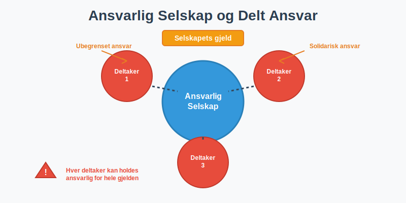
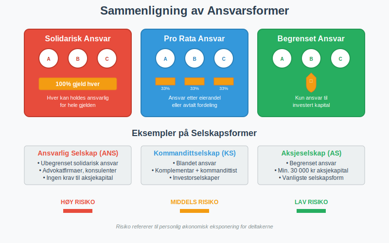
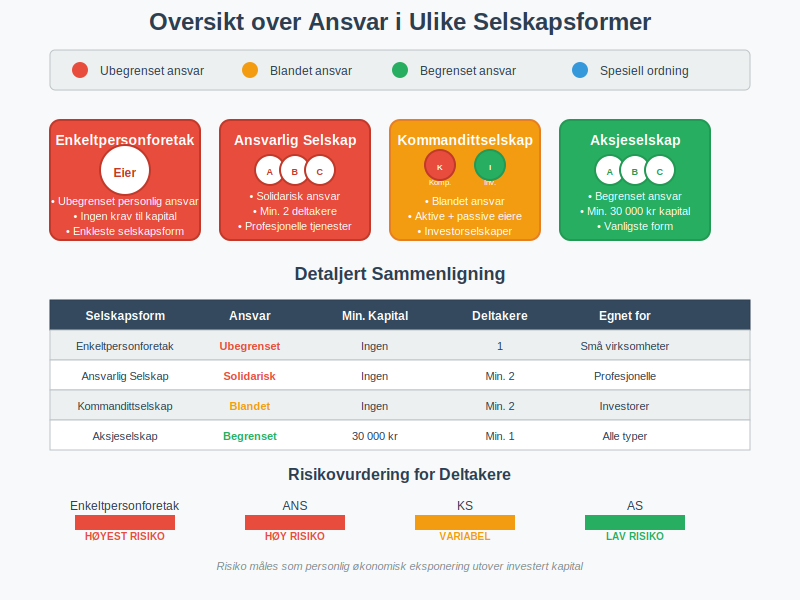
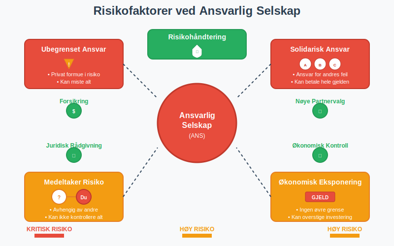
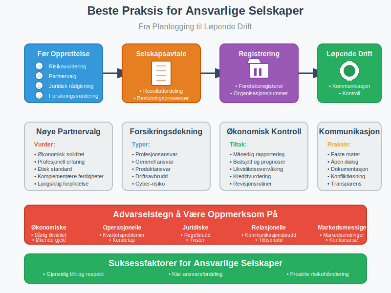
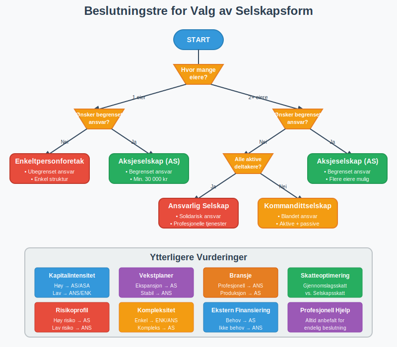

---
title: "Ansvarlig Selskap (ANS) og Delt Ansvar (DA)"
meta_title: "Ansvarlig Selskap (ANS) og Delt Ansvar (DA)"
meta_description: 'Et **ansvarlig selskap (ANS)**, også kalt **DA (Delt Ansvar)**, er en [foretaksform](/blogs/regnskap/hva-er-foretak Hva er et Foretak? Komplett Guide til Fore...'
slug: ansvarlig-selskap-delt-ansvar
type: blog
layout: pages/single
---

Et **ansvarlig selskap (ANS)**, også kalt **DA (Delt Ansvar)**, er en [foretaksform](/blogs/regnskap/hva-er-foretak "Hva er et Foretak? Komplett Guide til Foretaksformer i Norge") hvor to eller flere deltakere driver virksomhet sammen med **ubegrenset solidarisk ansvar**. Dette betyr at hver deltaker kan holdes ansvarlig for hele selskapets gjeld og forpliktelser, ikke bare sin egen andel.

## Hva er et Ansvarlig Selskap?

Et ansvarlig selskap skiller seg fundamentalt fra et [aksjeselskap](/blogs/regnskap/hva-er-et-aksjeselskap "Hva er et Aksjeselskap? Komplett Guide til Selskapsformen") ved at deltakerne har **ubegrenset personlig ansvar**. Selskapsformen reguleres av selskapsloven og er vanlig innen profesjonelle tjenester som advokatfirmaer, regnskapsfirmaer og konsulentselskaper.

> For en komplett oversikt over ansvarlig selskap, inkludert regnskapsmessige forhold, skattekonsekvenser og praktiske råd, se vår utfyllende guide om [Ansvarlig Selskap (ANS)](/blogs/regnskap/ansvarlig-selskap "Ansvarlig Selskap (ANS): Komplett Guide til Norsk Regnskap og Ansvarsstruktur").

### Kjennetegn ved Ansvarlig Selskap

#### Ubegrenset Solidarisk Ansvar
Den viktigste egenskapen ved et ANS er at alle deltakere har **ubegrenset solidarisk ansvar**. Dette innebærer:

- Hver deltaker kan holdes ansvarlig for hele selskapets gjeld
- Kreditorene kan kreve full betaling fra hvilken som helst deltaker
- Deltakernes private formue kan tas i bruk for å dekke selskapets forpliktelser
- Ansvaret gjelder også for medeltakernes handlinger på vegne av selskapet

#### Minimum To Deltakere
- Et ANS må ha **minimum to deltakere**
- Deltakerne kan være både fysiske og juridiske personer
- Alle deltakere har rett til å representere selskapet utad

#### Ingen Krav til Aksjekapital
I motsetning til [aksjeselskaper](/blogs/regnskap/hva-er-aksjekapital "Hva er Aksjekapital? Krav og Forklaring") har ANS ingen krav til minimum kapitalinnskudd.

## Delt Ansvar - Ulike Former for Ansvar

Begrepet **delt ansvar** refererer til hvordan ansvar fordeles mellom deltakerne i et selskap. Det finnes flere former for ansvar i norsk selskapsrett:

### Solidarisk Ansvar
Ved **solidarisk ansvar** kan hver deltaker holdes ansvarlig for hele gjelden:

- Kreditorer kan kreve full betaling fra én deltaker
- Den som betaler kan senere kreve regress fra de andre deltakerne
- Vanlig i ansvarlige selskaper og enkelte andre selskapsformer

### Pro Rata Ansvar
Ved **pro rata ansvar** er hver deltaker kun ansvarlig for sin andel:

- Ansvaret fordeles etter eierandel eller avtalt fordeling
- Mindre vanlig i norske selskapsformer
- Krever spesifikk avtale mellom partene

### Begrenset Ansvar
Ved **begrenset ansvar** er deltakernes ansvar begrenset til deres investering:

- Vanlig i aksjeselskaper og allmennaksjeselskaper
- Beskytter deltakernes private formue
- Krever minimum kapitalinnskudd

| Selskapsform | Ansvarstype | Minimum Kapital | Antall Deltakere |
|--------------|-------------|-----------------|------------------|
| Ansvarlig Selskap (ANS) | Ubegrenset solidarisk | Ingen | Minimum 2 |
| [Aksjeselskap (AS)](/blogs/regnskap/hva-er-et-aksjeselskap "Hva er et Aksjeselskap?") | Begrenset | 30 000 kr | Minimum 1 |
| Kommandittselskap (KS) | Blandet | Ingen | Minimum 2 |
| [Enkeltpersonforetak](/blogs/regnskap/hva-er-enkeltpersonforetak "Hva er et Enkeltpersonforetak? Komplett Guide til Selskapsformen") | Ubegrenset personlig | Ingen | 1 |

## Fordeler med Ansvarlig Selskap

### Enkel Opprettelse og Drift
- **Ingen kapitalinnskudd:** Krever ikke minimum aksjekapital som AS
- **Fleksibel struktur:** Færre formelle krav enn aksjeselskaper
- **Rask oppstart:** Enklere registreringsprosess

### Skattemessige Fordeler
- **Gjennomslagsskatt:** Overskudd beskattes direkte hos deltakerne
- **Fradragsrett:** Underskudd kan trekkes fra i deltakernes øvrige inntekt
- **Fleksibel resultatfordeling:** Kan avtale annen fordeling enn eierandeler

### Kredittilgang
- **Personlig ansvar:** Kan gi bedre kredittilgang da deltakernes private formue står som sikkerhet
- **Soliditet:** Kreditorene har større sikkerhet gjennom det ubegrensede ansvaret

## Ulemper og Risikoer

### Ubegrenset Personlig Ansvar
Den største ulempen er det **ubegrensede personlige ansvaret**:

- Deltakernes private formue står som sikkerhet
- Risiko for personlig konkurs ved store tap
- Ansvar for medeltakernes handlinger

### Solidarisk Ansvar
- **Full ansvarsbyrde:** Kan måtte betale hele selskapets gjeld alene
- **Avhengighet av medeltakere:** Risiko knyttet til andre deltakeres økonomiske situasjon
- **Regresskrav:** MÃ¥ kreve tilbakebetaling fra medeltakere i etterkant

### Begrenset Fleksibilitet
- **Enstemmighet:** Viktige beslutninger krever ofte enstemmighet
- **Uttreden:** Komplisert å tre ut av selskapet
- **Overdragelse:** Vanskelig å overdra eierandeler

## Kommandittselskap - En Hybrid

**Kommandittselskap (KS)** er en variant hvor ansvaret er delt mellom to typer deltakere:

### Komplementarer
- Har **ubegrenset solidarisk ansvar**
- Kan representere selskapet utad
- Ansvarlig for den daglige driften

### Kommandittister
- Har **begrenset ansvar** til sitt kapitalinnskudd
- Kan ikke delta i den daglige driften
- Fungerer som passive investorer

| Deltaker | Ansvar | Driftsansvar | Representasjonsrett |
|----------|--------|--------------|-------------------|
| Komplementar | Ubegrenset solidarisk | Ja | Ja |
| Kommandittist | Begrenset til innskudd | Nei | Nei |

## Praktiske RÃ¥d for Ansvarlige Selskaper

### Før Opprettelse
1. **Vurder risiko:** Er du komfortabel med ubegrenset personlig ansvar?
2. **Velg medeltakere nøye:** Du blir ansvarlig for deres handlinger
3. **Få juridisk rådgivning:** Konsulter advokat om selskapsavtale
4. **Vurder forsikring:** Profesjonsansvarsforsikring kan redusere risiko

### Selskapsavtale
En god selskapsavtale bør regulere:

- **Resultatfordeling:** Hvordan overskudd og underskudd fordeles
- **Beslutningsprosesser:** Hvem som kan ta hvilke beslutninger
- **Uttreden:** Prosedyrer for å forlate selskapet
- **Oppløsning:** Hvordan selskapet skal avvikles

### Løpende Drift
- **Regelmessig kommunikasjon:** Hold medeltakere informert om selskapets situasjon
- **Økonomisk kontroll:** Følg nøye med på selskapets økonomi
- **Forsikring:** Vurder løpende behovet for forsikringsdekning
- **Juridisk oppfølging:** Hold selskapsavtalen oppdatert

## Ansvar i Ulike Bransjer

### Profesjonelle Tjenester
Ansvarlige selskaper er vanlige innen:

- **Advokatfirmaer:** Tradisjonelt organisert som ANS
- **Regnskapsfirmaer:** Mange velger ANS for fleksibilitet
- **Konsulentselskaper:** Vanlig for mindre konsulentgrupper
- **Arkitektfirmaer:** Profesjonsansvar gjør ANS naturlig

### NÃ¥r ANS Ikke Egner Seg
ANS er mindre egnet for:

- **Kapitalintensive virksomheter:** Høy risiko gjør begrenset ansvar ønskelig
- **Mange eiere:** Solidarisk ansvar blir komplisert med mange deltakere
- **Ekstern finansiering:** Investorer foretrekker ofte begrenset ansvar

## Ansvarsbegrensning og Forsikring

### Profesjonsansvarsforsikring
- **Dekker profesjonelle feil:** Beskytter mot krav fra klienter
- **Obligatorisk i enkelte bransjer:** PÃ¥krevd for advokater og revisorer
- **Reduserer personlig risiko:** Kan dekke store erstatningskrav

### Generell Ansvarsforsikring
- **Dekker tredjepartskrav:** Beskytter mot skader på andre
- **Produktansvar:** Viktig for selskaper som produserer varer
- **Driftsansvar:** Dekker skader i forbindelse med virksomheten

### Begrensninger i Forsikring
- **Selvrisiko:** Deltakerne må dekke beløp under selvrisiko
- **Eksklusjoner:** Visse typer skader dekkes ikke
- **Maksimum dekning:** Forsikringen har øvre grense

## Sammenligning med Andre Selskapsformer

### ANS vs. Aksjeselskap

| Aspekt | Ansvarlig Selskap | [Aksjeselskap](/blogs/regnskap/hva-er-et-aksjeselskap "Hva er et Aksjeselskap?") |
|--------|-------------------|------------------|
| Ansvar | Ubegrenset solidarisk | Begrenset til aksjekapital |
| Minimum kapital | Ingen | 30 000 kr |
| Skatt | Gjennomslagsskatt | Selskapsskatt + utbytteskatt |
| Formaliteter | Færre krav | Strenge krav til [regnskap](/blogs/regnskap/hva-er-regnskap "Hva er Regnskap?") |
| Fleksibilitet | Høy | Regulert av [aksjeloven](/blogs/regnskap/hva-er-aksjeloven "Hva er Aksjeloven?") |

### ANS vs. [Enkeltpersonforetak](/blogs/regnskap/hva-er-enkeltpersonforetak "Hva er et Enkeltpersonforetak? Komplett Guide til Selskapsformen")

| Aspekt | Ansvarlig Selskap | [Enkeltpersonforetak](/blogs/regnskap/hva-er-enkeltpersonforetak "Hva er et Enkeltpersonforetak? Komplett Guide til Selskapsformen") |
|--------|-------------------|-------------------|
| Antall eiere | Minimum 2 | 1 |
| Ansvar | Solidarisk mellom deltakere | Personlig for eier |
| Kompleksitet | Middels | Lav |
| Skattefordeler | Fleksibel fordeling | Begrenset |

## Juridiske Aspekter

### Selskapsloven
Ansvarlige selskaper reguleres av **selskapsloven kapittel 2**:

- Regler for opprettelse og registrering
- Deltakernes rettigheter og plikter
- Representasjon og beslutningsprosesser
- Oppløsning og avvikling

### Registrering
- **Foretaksregisteret:** Må registreres i Brønnøysundregistrene
- **Selskapsavtale:** MÃ¥ vedlegges ved registrering
- **Prokura:** Kan gi andre rett til å representere selskapet

### Regnskapsplikt
ANS har samme regnskapsplikt som andre selskaper:

- Må føre [regnskap](/blogs/regnskap/hva-er-regnskap "Hva er Regnskap?") etter regnskapsloven
- Årsregnskap må leveres til myndighetene
- Revisjon kan være påkrevd avhengig av størrelse

## Internasjonale Perspektiver

### Tilsvarende Selskapsformer
- **Partnership (USA/UK):** Tilsvarende ubegrenset ansvar
- **Société en nom collectif (Frankrike):** Fransk variant av ANS
- **Offene Handelsgesellschaft (Tyskland):** Tysk ansvarlig selskap

### Limited Liability Partnership (LLP)
- **Begrenset ansvar:** Beskytter mot medeltakernes feil
- **Profesjonsansvar:** Beholder ansvar for egne handlinger
- **Ikke tilgjengelig i Norge:** MÃ¥ bruke andre selskapsformer

## Fremtidige Utviklingstrekk

### Digitalisering
- **Elektronisk signering:** Forenkler selskapsavtaler
- **Digital rapportering:** Automatisert regnskapsrapportering
- **Online registrering:** Enklere opprettelsesprosess

### Regulatoriske Endringer
- **EU-harmonisering:** Kan påvirke norske regler
- **Profesjonsregulering:** Endringer i bransjespecifikke krav
- **Skattelovgivning:** Kan endre skattemessige fordeler

## Konklusjon

Ansvarlig selskap med delt ansvar er en selskapsform som egner seg godt for **profesjonelle tjenester** og **mindre virksomheter** hvor deltakerne ønsker fleksibilitet og er komfortable med personlig ansvar. Det ubegrensede solidariske ansvaret krever nøye vurdering av risiko og valg av medeltakere.

### NÃ¥r ANS er Riktig Valg
- Profesjonelle tjenester med lav kapitalintensitet
- FÃ¥ deltakere som kjenner hverandre godt
- Ønske om skattemessig fleksibilitet
- Behov for rask oppstart uten kapitalinnskudd

### Når Andre Selskapsformer Bør Vurderes
- Høy risiko eller kapitalintensive virksomheter
- Mange eiere eller eksterne investorer
- Ønske om begrenset personlig ansvar
- Planer om børsnotering eller salg

Uansett valg av selskapsform er det viktig å få **profesjonell rådgivning** og utarbeide en grundig **selskapsavtale** som regulerer forholdet mellom deltakerne og deres ansvar.

### Relaterte Begreper

For å forstå ansvarlig selskap og delt ansvar fullt ut, bør du også sette deg inn i:

- **[Enkeltpersonforetak](/blogs/regnskap/hva-er-enkeltpersonforetak "Hva er et Enkeltpersonforetak? Komplett Guide til Selskapsformen")** - Den enkleste selskapsformen med ubegrenset personlig ansvar
- **[Aksjeselskap](/blogs/regnskap/hva-er-et-aksjeselskap "Hva er et Aksjeselskap?")** - Selskapsform med begrenset ansvar
- **[Aksjeloven](/blogs/regnskap/hva-er-aksjeloven "Hva er Aksjeloven?")** - Regulerer aksjeselskaper
- **[Aksjekapital](/blogs/regnskap/hva-er-aksjekapital "Hva er Aksjekapital?")** - Minimum kapital i aksjeselskaper
- **[Regnskap](/blogs/regnskap/hva-er-regnskap "Hva er Regnskap?")** - Regnskapsplikt for alle selskaper
- **[Aksjonærlån](/blogs/regnskap/hva-er-aksjonaerlan-fra-as "Hva er Aksjonærlån fra AS?")** - Finansieringsalternativer i aksjeselskaper

Ansvarlig selskap representerer en viktig selskapsform i norsk næringsliv som balanserer fleksibilitet med ansvar, og som krever grundig forståelse av både muligheter og risikoer.
