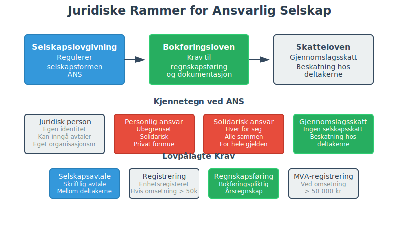
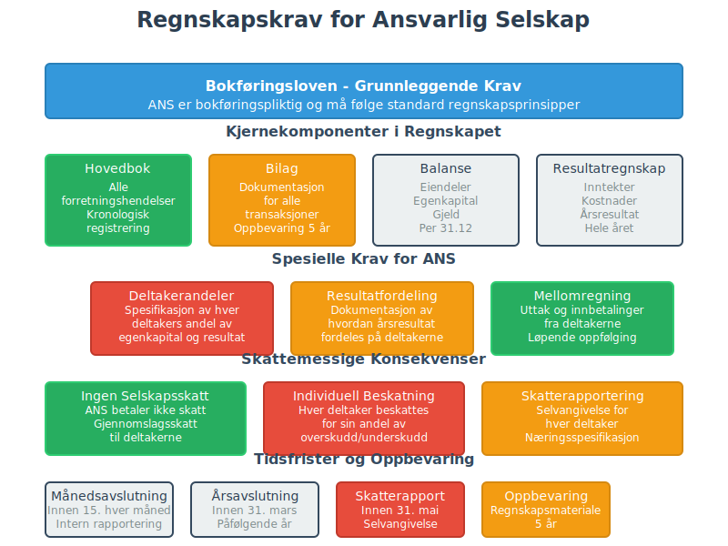
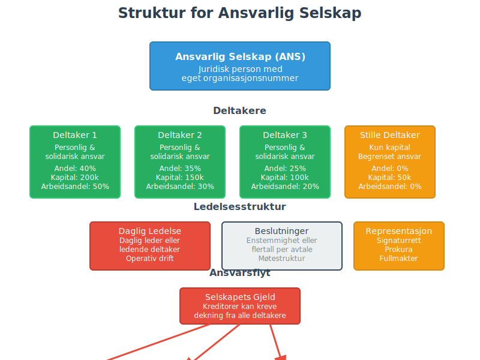
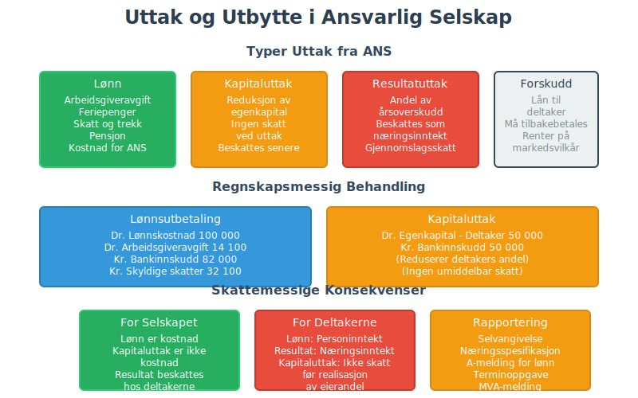
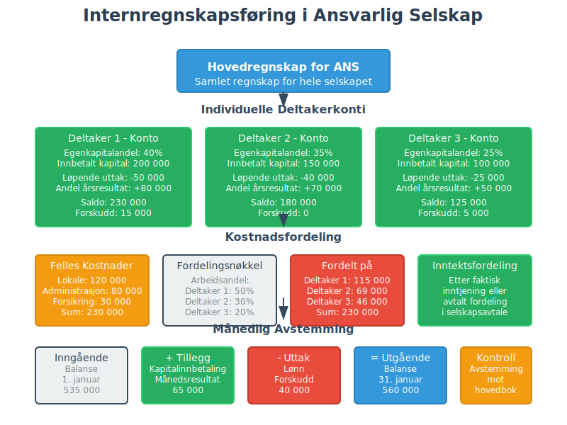

---
title: "Ansvarlig Selskap (ANS)"
meta_title: "Ansvarlig Selskap (ANS)"
meta_description: ''
slug: ansvarlig-selskap
type: blog
layout: pages/single
---


For en oversikt over ulike selskapsformer i Norge, se [Selskapsform](/blogs/regnskap/selskapsform "Selskapsform: Oversikt over selskapsformer i Norge").

Et **ansvarlig selskap (ANS)** er en selskapsform hvor to eller flere deltakere driver virksomhet sammen med **ubegrenset solidarisk ansvar**. Denne formen gir fleksibilitet i drift og skatt, men krever nøye vurdering av risiko og solid forståelse av regnskapsmessige konsekvenser.

Denne selskapsformen omtales også ofte som **DA (Delt Ansvar)**. Les mer i vår artikkel om [Ansvarlig Selskap og Delt Ansvar](/blogs/regnskap/ansvarlig-selskap-delt-ansvar "ANS og DA: Komplett Guide til Ansvarlig Selskap og Delt Ansvar").

## Hva er et Ansvarlig Selskap?

Ansvarlig selskap er en del av [organisasjonsform](/blogs/regnskap/organisasjonsform "Organisasjonsform: Komplett Guide til Selskapsformer i Norge") regulert av **selskapslovgivningen**. ANS skiller seg fra andre selskapsformer ved at deltakerne **personlig kan heldes ansvarlig** for selskapets samlede forpliktelser.

**Nøkkelpunkter:**

* To eller flere deltakere (fysiske eller juridiske)
* Ingen krav til minimum aksjekapital
* Ubegrenset solidarisk ansvar for gjeld og forpliktelser
* Overskudd beskattes direkte hos deltakerne (gjennomslagsskatt)
* MÃ¥ registreres i Enhetsregisteret hvis omsetning > 50 000 kr

## Juridiske Rammer og Lovgrunnlag



ANS er regulert av **selskapslovgivningen** og må følge [**bokføringsloven**](/blogs/regnskap/hva-er-bokforingsloven "Hva er Bokføringsloven? Komplett Guide til Norsk Bokføringslovgivning"). Selskapet har egen juridisk identitet, men deltakerne hefter personlig og solidarisk.

### Registrering og Formelle Krav

| Krav                    | Beskrivelse                           | Tidsfrist    |
|-------------------------|---------------------------------------|--------------|
| **Selskapsavtale**      | Skriftlig avtale mellom deltakerne    | Før oppstart |
| **Enhetsregisteret**    | Registrering hvis omsetning > 50 000  | Innen 7 dager|
| **MVA-registrering**    | Hvis omsetning > 50 000 kr årlig      | Innen 7 dager|
| **Arbeidsgiver**        | Ved ansettelse av arbeidstakere       | Før ansettelse|
| **Firmaattest**         | Bestilling av offisielt dokument fra Foretaksregisteret | Ved behov |

## Regnskapsmessige Forhold

### Bokføringsplikt og Regnskapskrav

ANS er **[bokføringspliktig](/blogs/regnskap/hva-er-bokforingsplikt "Hva er Bokføringsplikt i Norge?")** etter [bokføringsloven](/blogs/regnskap/hva-er-bokforingsloven "Hva er Bokføringsloven?") og må føre:

* **Hovedbok** med alle forretningshendelser
* **Bilag** og dokumentasjon jf. [bilagsloven](/blogs/regnskap/hva-er-bilag "Hva er Bilag i Regnskap?")
* **Ã…rsavslutning** med balanse og resultatregnskap
* **Spesifikasjon** av fordringer og gjeld



### Skattemessige Konsekvenser

**Gjennomslagsskatt** betyr at:

* Selskapet betaler ikke selskapsskatt
* Deltakerne beskattes for sin andel av overskuddet
* [Underskudd](/blogs/regnskap/hva-er-underskudd "Hva er Underskudd?") kan fradragsføres hos deltakerne
* Deltakerne må levere [selvangivelse](/blogs/regnskap/skattemelding "Skattemelding") for sin andel

## Kjennetegn og Struktur

| Aspekt                  | Ansvarlig Selskap (ANS)               |
|-------------------------|---------------------------------------|
| **Ansvarstype**         | Ubegrenset solidarisk                 |
| **Minimum kapital**     | Ingen                                 |
| **Antall deltakere**    | Minimum 2                             |
| **Skatteordning**       | Gjennomslagsskatt                     |
| **Juridisk person**     | Ja (begrenset)                        |
| **Krav til selskapsavtale** | Ja                                |
| **Ã…rsregnskapsplikt**   | Ja, forenklet                         |

## Selskapsavtale - Kritiske Elementer

En grundig **selskapsavtale** må regulere:

### Grunnleggende Bestemmelser

* **Formål** og virksomhetsområde
* **Deltakernes andeler** og innsluttskrav
* **Ansvarsfordeling** og beslutningsmyndighet
* **Resultatfordeling** og utbyttepolitikk

### Drift og Styring



* **Daglig ledelse** og representasjon
* **Signaturrett** og prokura
* **Møtestruktur** og beslutningsprosess
* **Rapportering** og informasjonsplikt

### Uttreden og Oppløsning

* **Uttredelsesrett** og -plikter
* **Verdsettelse** av andeler ved uttreden
* **Konkurranseklausuler** og taushetsplikt
* **Oppløsning** og avvikling

## Fordeler med ANS

### Skattemessige Fordeler

1. **Direkte fradrag:** Underskudd kan fradragsføres direkte hos deltakerne
2. **Ingen dobbeltbeskatning:** Overskudd beskattes kun hos deltakerne
3. **Fleksibel resultatfordeling:** Kan avvike fra eierandeler med avtale
4. **Avskrivninger:** Deltakerne kan få direkte fradrag for avskrivninger

### Operasjonelle Fordeler

* **Lav etableringskostnad:** Ingen krav til minimumskapital som i [aksjeselskap](/blogs/regnskap/hva-er-et-aksjeselskap "Hva er et Aksjeselskap?")
* **Rask oppstart:** Færre formelle krav enn AS
* **Fleksibel organisering:** Enkel beslutningsstruktur
* **Kredittilgang:** Personlig heftelse kan gi bedre kredittvilkår

## Ulemper og Risikoer

### Ansvarsrisiko

* **Ubegrenset ansvar:** Privat formue kan benyttes for å dekke selskapets gjeld
* **Solidarisk ansvar:** En deltaker kan hele ansvar hvis andre ikke kan betale
* **Kreditorvern:** Kreditorer kan kreve privat formue

### Operasjonelle Utfordringer

* **Komplekse avtaler:** Krever grundig selskapsavtale for å regulere intern fordeling av risiko
* **Avhengighet:** SÃ¥rbar for konflikt mellom deltakere
* **Begrenset kapitaltilgang:** Vanskelig å hente ekstern kapital

## Regnskapsmessig Behandling

### Egenkapital og Innbetaling

```
Deltakernes innbetaling:
Dr. Bankinnskudd        XXX
  Kr. Egenkapital           XXX
```

### Resultatfordeling

ANS må spesifisere hvordan **årsresultatet** fordeles mellom deltakerne:

| Fordelingsgrunnlag     | Beskrivelse                          |
|------------------------|--------------------------------------|
| **Eierandeler**        | Etter avtalt eierandel              |
| **Arbeidsandeler**     | Etter arbeidsinnsats                 |
| **Kapitalandeler**     | Etter kapitalinnbetaling             |
| **Kombinert**          | Blanding av flere kriterier         |

### Uttak og Utbytte



* **Uttak** behandles som fradrag i egenkapital
* **Lønn** til deltakere krever arbeidsgiveravgift
* **Utbytte** beskattes som kapitalinntekt

## Sammenligning med Andre Selskapsformer

| Selskapsform           | Ansvarstype            | Min. Kapital | Antall deltakere | Skatteordning |
|------------------------|------------------------|--------------|------------------|---------------|
| **ANS**                | Ubegrenset solidarisk   | Ingen        | ≥ 2              | Gjennomslag   |
| [AS](/blogs/regnskap/hva-er-et-aksjeselskap "Hva er et Aksjeselskap?") | Begrenset (aksjekapital) | 30 000 kr    | ≥ 1              | Selskapsskatt |
| [ENK](/blogs/regnskap/hva-er-enkeltpersonforetak "Hva er et Enkeltpersonforetak?") | Ubegrenset personlig     | Ingen       | 1                | Personlig     |
| **DA** (Delt ansvar)   | Begrenset til andel     | Ingen        | ≥ 2              | Gjennomslag   |

## Praktiske Råd før Oppstart

*Vurder nøye* om ANS passer for din virksomhet:

### Risikovurdering

1. **Ansvarsanalyse:** Er ubegrenset ansvar akseptabelt?
2. **Forsikring:** Vurder profesjons- og ansvarsforsikring
3. **Kapitalvurdering:** Kan deltakerne dekke potensielle forpliktelser?

### Valg av Deltakere

* **Økonomisk soliditet:** Velg medeltakere med solid økonomi
* **Komplementære ferdigheter:** Ulike kompetanser gir synergieffekt
* **Tillitsforhold:** Grunnlag for langsiktig samarbeid

### Juridiske Forberedelser

* **Selskapsavtale:** Engasjer advokat for utarbeidelse
* **Forsikring:** Kartlegg behov for ansvars- og bedriftsforsikring
* **Skatterådgivning:** Få veiledning om skattemessige konsekvenser

## Regnskapsmessige Utfordringer

### Internregnskapsføring



* **Andelsregnskaper:** Separat regnskap for hver deltaker
* **Mellomregning:** HÃ¥ndtering av forskudd og uttak
* **Kostnadsfordeling:** Fordeling av felles kostnader

### Ã…rsavslutning

ANS må utarbeide:

* **Ã…rsregnskap** med balanse og resultatregnskap
* **Spesifikasjon** av deltakernes andeler
* **Resultatfordeling** dokumentert i noter
* **Oppbevaring** av regnskapsmateriale i 5 år

## NÃ¥r ANS er Rett Selskapsform

ANS er særlig egnet for:

### Profesjonelle Tjenester

* **Advokatfellesskap** og konsulentvirksomhet
* **Regnskapsbyråer** ([Hva er et regnskapsbyrå?](/blogs/regnskap/regnskapsbyra "Regnskapsbyrå: Hva gjør de og hvorfor er det viktig?")) og revisjonsfirmaer
* **Teknisk rådgivning** og engineering

### Mindre Virksomheter

* **Handel** med lav kapitalrisiko
* **HÃ¥ndverksbedrifter** med felles utstyr
* **Startup-virksomhet** med flere gründere

### Kriterier for Egnethet

* **Lav kapitalrisiko** i bransjen
* **Høy tillit** mellom deltakerne
* **Komplementære ferdigheter** hos deltakerne
* **Ønske om skattemessig fleksibilitet**

## Oppløsning og Avvikling

### Frivillig Oppløsning

* **Enstemmig** beslutning av deltakerne
* **Varsling** til kreditorer og kontraktsmotparter
* **Avvikling** av eiendeler og gjeld
* **Sluttutdeling** til deltakerne

### Tvangsoppløsning

* **Konkurs** ved betalingsudyktighet
* **Rettslig oppløsning** ved alvorlig mislighold
* **Dødsfall** kan utløse oppløsning

## Alternativer til ANS

### Delt Ansvar (DA)

For mer informasjon om [delt ansvar](/blogs/regnskap/ansvarlig-selskap-delt-ansvar "Ansvarlig Selskap med Delt Ansvar"), som begrenser ansvaret til den enkelte deltakers andel.

### Aksjeselskap (AS)

[Aksjeselskap](/blogs/regnskap/hva-er-et-aksjeselskap "Hva er et Aksjeselskap?") gir begrenset ansvar men krever høyere kapitalkrav.

### Enkeltpersonforetak (ENK)

[Enkeltpersonforetak](/blogs/regnskap/hva-er-enkeltpersonforetak "Hva er et Enkeltpersonforetak?") for enkeltpersoner som ønsker full kontroll.

---

For mer om selskapsformer, se [Organisasjonsform](/blogs/regnskap/organisasjonsform "Organisasjonsform: Komplett Guide til Selskapsformer i Norge") og [Selskapsregistrering](/blogs/regnskap/selskapsregistrering "Selskapsregistrering i Norge").


