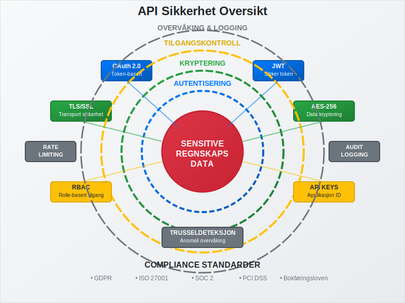

**API-integrasjon og automatisering av regnskap** representerer fremtiden for moderne regnskapsføring, hvor teknologi eliminerer manuelle prosesser og skaper sømløs dataflyt mellom ulike forretningssystemer. For norske bedrifter betyr dette en revolusjon i hvordan [regnskap](/blogs/regnskap/hva-er-regnskap "Hva er regnskap? En Dybdeanalyse for Norge") håndteres, fra tradisjonell manuell [bokføring](/blogs/regnskap/hva-er-bokforing "Hva er Bokføring? En Komplett Guide til Norsk Bokføringspraksis") til fullstendig automatiserte regnskapsprosesser.

*Se ogsÃ¥: [Databriller i Regnskap](/blogs/regnskap/databriller "Databriller i Regnskap “ Visualisering og Analyse av Regnskapsdata").*

*Se ogsÃ¥: [Integrasjon](/blogs/regnskap/integrasjon "Integrasjon “ En Innføring i Integrasjonskonsepter i Regnskap").*

*Se også: [Hva er Betalingstjenestedirektivet (PSD2)?](/blogs/regnskap/hva-er-betalingstjenestedirektivet "Hva er Betalingstjenestedirektivet (PSD2)?").*

## Seksjon 1: Grunnleggende Konsepter og Definisjon

**API** (Application Programming Interface) er grensesnittet som lar ulike programvarer kommunisere og utveksle data automatisk. I regnskapssammenheng fungerer API-er som digitale broer som kobler sammen [ERP-systemer](/blogs/regnskap/hva-er-erp-system "Hva er ERP-system? Komplett Guide til Enterprise Resource Planning"), **[regnskapsprogrammer](/blogs/regnskap/regnskapsprogram "Regnskapsprogram: Økonomistyring for Norske Bedrifter")**, banker, og andre forretningsapplikasjoner.


### 1.1 Hva er API-integrasjon i Regnskap?

API-integrasjon i regnskapsføring innebærer automatisk overføring av finansielle data mellom ulike systemer uten menneskelig inngripen. Dette inkluderer:

* **Banktransaksjoner:** Automatisk import av [banktransaksjoner](/blogs/regnskap/hva-er-banktransaksjoner "Hva er Banktransaksjoner? Komplett Guide til Bankavstemminger") direkte til regnskapssystemet
* **Fakturabehandling:** Sømløs integrasjon med [elektronisk fakturering](/blogs/regnskap/hva-er-elektronisk-fakturering "Hva er Elektronisk Fakturering? Komplett Guide til Digitale Fakturaløsninger")
* **Lagerdata:** Automatisk integrasjon med [strekkoder](/blogs/regnskap/hva-er-strekkode "Hva er Strekkode i Regnskap? Komplett Guide til Automatisert Registrering") og lagerstyringssystemer
* **Lønnsdata:** Automatisk overføring fra lønnssystemer til [hovedbok](/blogs/regnskap/hva-er-hovedbok "Hva er Hovedbok? Komplett Guide til Regnskapets Hovedbok")
* **Rapportering:** Sanntids finansiell rapportering og analyse

### 1.2 Automatisering vs. Tradisjonell Regnskapsføring

Sammenligning mellom tradisjonelle og automatiserte regnskapsprosesser:

| **Aspekt** | **Tradisjonell Metode** | **API-automatisert Metode** |
|------------|-------------------------|------------------------------|
| **Dataregistrering** | Manuell inntasting | Automatisk import |
| **Feilrisiko** | Høy (menneskelige feil) | Lav (systemvalidering) |
| **Tidsbruk** | Timer/dager | Minutter/sanntid |
| **Kostnad** | Høy arbeidskostnad | Lav driftskostnad |
| **Skalerbarhet** | Begrenset | Ubegrenset |
| **Rapportering** | Periodisk | Sanntid |


## Seksjon 2: Tekniske Løsninger og Arkitektur

Moderne API-integrasjoner bygger på robuste tekniske fundamenter som sikrer pålitelighet, sikkerhet og skalerbarhet.

### 2.1 API-typer i Regnskapsintegrasjon

**REST API-er** dominerer regnskapssektoren på grunn av sin enkelhet og fleksibilitet:

* **GET:** Henter data (f.eks. kontosaldo, transaksjonshistorikk)
* **POST:** Oppretter nye poster ([bilag](/blogs/regnskap/hva-er-bilag "Hva er Bilag? Komplett Guide til Regnskapsbilag"), fakturaer)
* **PUT/PATCH:** Oppdaterer eksisterende data
* **DELETE:** Sletter poster (med revisjonsspor)


### 2.2 Dataformater og Standarder

Regnskapsdata utveksles typisk i standardiserte formater:

* **JSON:** Mest brukt for moderne API-er
* **XML:** Tradisjonelt format, fortsatt brukt i [EHF](/blogs/regnskap/hva-er-efaktura "Hva er eFaktura? Komplett Guide til Elektronisk Fakturering") og offentlige systemer
* **CSV:** Enkel import/eksport av tabelldata
* **XBRL:** Standardisert rapportering til offentlige myndigheter

### 2.3 Sikkerhet og Autentisering

API-sikkerhet er kritisk for regnskapsdata:

**Autentiseringsmetoder:**

* **OAuth 2.0:** Industristandard for sikker tilgangskontroll
* **API-nøkler:** Enkel identifikasjon av applikasjoner
* **JWT-tokens:** Sikker overføring av brukerinformasjon
* **TLS/SSL:** Kryptering av datatransmisjon
* **[Tofaktorautentisering](/blogs/regnskap/hva-er-tofaktorautentisering "Hva er Tofaktorautentisering? Komplett Guide til 2FA for Regnskapsføring og Cybersikkerhet"):** Ekstra sikkerhetslag for API-tilgang



## Seksjon 3: Implementering og Integrasjonsprosess

Vellykket implementering av API-integrasjon krever systematisk planlegging og gjennomføring.

### 3.1 Implementeringsfaser

**Fase 1: Kartlegging og Analyse**

* Identifiser eksisterende systemer og dataflyt
* Analyser integrasjonsbehov og prioriteringer
* Vurder teknisk infrastruktur og kompetanse

**Fase 2: Systemvalg og Planlegging**

* Velg kompatible systemer med robuste API-er
* Definer datamodeller og mappingstrategier
* Planlegg testing og utrullingsstrategier

**Fase 3: Utvikling og Testing**

* Implementer API-koblinger og datavalidering
* Gjennomfør omfattende testing av alle integrasjoner
* Etabler overvåking og feilhåndtering

**Fase 4: Utrulling og Optimalisering**

* Gradvis migrering fra manuelle til automatiserte prosesser
* Opplæring av brukere og etablering av nye rutiner
* Kontinuerlig optimalisering basert på erfaringer


### 3.2 Vanlige Integrasjonsscenarier

**Bankintegrasjon:**

Automatisk import av banktransaksjoner eliminerer manuell registrering og reduserer feil betydelig. Moderne bankAPI-er tilbyr:

* Sanntids transaksjonsfeed
* Automatisk kategorisering basert på historikk
* Integrasjon med [bankavstemming](/blogs/regnskap/hva-er-bankavstemming "Hva er Bankavstemming? Komplett Guide til Bankavstemminger")

Disse API-er bygger på infrastrukturen til moderne [betalingstjenester](/blogs/regnskap/betalingstjeneste "Hva er betalingstjeneste? Komplett Guide til Betalingstjenester i Norge"), som gjør det mulig å integrere direkte med banker og betalingsformidlere for sanntids dataflyt.

**Fakturaautomatisering:**

[Fakturatolk](/blogs/regnskap/hva-er-fakturatolk "Hva er Fakturatolk? AI-drevet Fakturabehandling og Automatisering") og [OCR-teknologi](/blogs/regnskap/hva-er-ocr "Hva er OCR? OCR i Norske Regnskapsprosesser “ En Komplett Guide") kombinert med API-er muliggjør:

* Automatisk lesing og tolking av innkommende fakturaer
* Validering mot bestillinger og kontrakter
* Automatisk [bilagsføring](/blogs/regnskap/hva-er-bilagsforing "Hva er Bilagsføring? Komplett Guide til Regnskapsbilag") og godkjenningsflyt

**Lønnsintegrasjon:**

Sømløs kobling mellom lønnssystem og regnskap sikrer:

* Automatisk journalføring av lønnskostnader
* Korrekt håndtering av [arbeidsgiveravgift](/blogs/regnskap/hva-er-arbeidsgiveravgift "Hva er Arbeidsgiveravgift? En Komplett Guide til Norges Lønnsavgift")
* Integrert rapportering til [Altinn](/blogs/regnskap/hva-er-altinn "Hva er Altinn? Komplett Guide til Norges Digitale Offentlige Tjenester")

## Seksjon 4: Fordeler og Gevinster

API-integrasjon og automatisering gir betydelige fordeler for norske bedrifter på flere områder.

### 4.1 Operasjonelle Fordeler

**Tidsbesparelse:**

* **90% reduksjon** i tid brukt på dataregistrering
* **Sanntids** oppdatering av regnskapsdata
* **Eliminering** av dobbeltarbeid mellom systemer

**Kvalitetsforbedring:**

* **Reduserte feil** gjennom automatisk validering
* **Konsistent** databehandling på tvers av systemer
* **Forbedret** sporbarhet og revisjonsspor


### 4.2 Økonomiske Gevinster

Kostnad-nytte analyse av API-automatisering:

| **Kostnadskategori** | **Før Automatisering** | **Etter Automatisering** | **Besparelse** |
|---------------------|------------------------|--------------------------|----------------|
| **Lønnskostnader** | 100% | 30% | 70% |
| **Feilretting** | 100% | 20% | 80% |
| **Systemvedlikehold** | 100% | 120% | -20% |
| **Totalkostnad** | 100% | 45% | **55%** |

### 4.3 Strategiske Fordeler

**Skalerbarhet:**

API-baserte løsninger vokser med bedriften uten proporsjonale kostnadsøkninger. Dette er spesielt viktig for:

* Voksende bedrifter med økende transaksjonsvolum
* Sesongbaserte virksomheter med varierende aktivitet
* Bedrifter som ekspanderer til nye markeder

**Konkurransefortrinn:**

* **Raskere** beslutningsgrunnlag gjennom sanntidsdata
* **Lavere** operasjonelle kostnader
* **Høyere** nøyaktighet i finansiell rapportering

## Seksjon 5: Utfordringer og Risikohåndtering

Selv om API-integrasjon gir store fordeler, finnes det utfordringer som må håndteres proaktivt.

### 5.1 Tekniske Utfordringer

**Systemkompatibilitet:**

* **Legacy-systemer** som mangler moderne API-er
* **Dataformat-inkompatibilitet** mellom ulike systemer
* **Versjonshåndtering** av API-er over tid

**Ytelse og Stabilitet:**

* **API-begrensninger** (rate limiting) som kan påvirke dataflyt
* **Nedetid** i tredjepartssystemer som stopper automatisering
* **Datavolum** som kan overbelaste integrasjoner


### 5.2 Sikkerhet og Compliance

**Datasikkerhet:**

Regnskapsdata er sensitive og krever høyeste sikkerhetsnivå:

* **Kryptering** av data i transit og hvile
* **Tilgangskontroll** med prinsippet om minste privilegium
* **Logging** og overvåking av alle API-kall

**Regulatorisk Compliance:**

Norske bedrifter må overholde:

* **[Bokføringsloven](/blogs/regnskap/hva-er-bokforingsloven "Hva er Bokføringsloven? Komplett Guide til Norsk Bokføringsregelverk")** og krav til dokumentasjon
* **GDPR** for behandling av personopplysninger
* **Revisjonsregler** for sporbarhet og kontroll

### 5.3 Organisatoriske Utfordringer

**Kompetanse:**

* **Teknisk kompetanse** for implementering og vedlikehold
* **Endringsledelse** for å få organisasjonen med på omstillingen
* **Opplæring** av brukere i nye arbeidsmetoder

**Leverandøravhengighet:**

* **Vendor lock-in** som kan begrense fremtidig fleksibilitet
* **SLA-avtaler** som sikrer tilgjengelighet og ytelse
* **Exit-strategier** for å håndtere leverandørskifte

## Seksjon 6: Fremtidige Trender og Teknologier

Regnskapsautomatisering utvikler seg raskt med nye teknologier som former fremtidens løsninger.

### 6.1 Kunstig Intelligens og Maskinlæring

**AI-drevet Kategorisering:**

Moderne systemer lærer av historiske data for å:

* **Automatisk kategorisere** transaksjoner med høy nøyaktighet
* **Foreslå** konteringsforslag basert på mønstre
* **Identifisere** avvik og potensielle feil

**Prediktiv Analyse:**

AI kan forutsi:

* **Kontantstrøm** basert på historiske mønstre
* **Leverandørbetalinger** for optimalisert likviditetsstyring
* **Sesongvariasjoner** i forretningsaktivitet


### 6.2 Blockchain og Distribuerte Systemer

**Smart Contracts:**

Automatiserte kontrakter som utfører seg selv når forhåndsdefinerte betingelser oppfylles:

* **Automatisk fakturering** ved leveranse
* **Øyeblikkelig betaling** ved kontraktoppfyllelse
* **Transparent** og uforanderlig transaksjonsspor

**Desentralisert Regnskap:**

Blockchain-teknologi kan revolusjonere:

* **Revisjon** gjennom uforanderlige poster
* **Tverrbedrift-transaksjoner** med redusert friksjon
* **Regulatorisk rapportering** med økt transparens

### 6.3 Internet of Things (IoT) Integrasjon

**Automatisk Datainnsamling:**

IoT-sensorer kan automatisk registrere:

* **Lagerendringer** for automatisk kostnadsjustering
* **Energiforbruk** for nøyaktig kostnadsallokering
* **Produksjonsdata** for sanntids kostnadsregnskap

Et særlig interessant eksempel på IoT-integrasjon finner vi i landbrukssektoren, hvor [landbrukets dataflyt](/blogs/regnskap/landbrukets-dataflyt "Landbrukets Dataflyt: Komplett Guide til Databehandling i Moderne Landbruk") demonstrerer hvordan sensorer, maskiner og automatiserte systemer kan skape en helhetlig regnskapsløsning fra jord til regnskap.

## Seksjon 7: Implementeringsguide for Norske Bedrifter

Praktisk veiledning for bedrifter som ønsker å implementere API-integrasjon og automatisering.

### 7.1 Behovsanalyse og ROI-beregning

**Kartlegging av NÃ¥situasjon:**

* **Tidsregistrering** av manuelle regnskapsprosesser
* **Feilanalyse** av eksisterende rutiner
* **Kostnadskartlegging** av dagens løsninger

**ROI-beregning:**

```
ROI = (Årlige besparelser - Implementeringskostnad) / Implementeringskostnad × 100%

Eksempel:
- Implementeringskostnad: 500,000 kr
- Ã…rlige besparelser: 300,000 kr
- ROI år 1: (300,000 - 500,000) / 500,000 = -40%
- ROI år 2: (600,000 - 500,000) / 500,000 = 20%
- ROI år 3: (900,000 - 500,000) / 500,000 = 80%
```

### 7.2 Leverandørvalg og Evaluering

**Evalueringskriterier:**

| **Kriterium** | **Vekting** | **Vurderingsfaktorer** |
|---------------|-------------|------------------------|
| **Funksjonalitet** | 30% | API-bredde, integrasjonsmuligheter |
| **Sikkerhet** | 25% | Sertifiseringer, compliance |
| **Support** | 20% | Norsk support, responstid |
| **Kostnad** | 15% | Totalkostnad, prismodell |
| **Skalerbarhet** | 10% | Fremtidig vekstmuligheter |

**Referansesjekk:**

* **Kundecase** fra lignende bedrifter
* **Implementeringstid** og utfordringer
* **Langsiktig tilfredshet** med løsningen

### 7.3 Implementeringsplan

**Milepælsplan:**

* **Uke 1-2:** Systemkartlegging og datamodellering
* **Uke 3-6:** API-utvikling og testing
* **Uke 7-8:** Pilotimplementering med begrenset scope
* **Uke 9-10:** Fullskala utrulling og brukertesting
* **Uke 11-12:** Optimalisering og dokumentasjon

**Risikohåndtering:**

* **Backup-planer** for kritiske prosesser
* **Parallellkjøring** under overgangsfasen
* **Rollback-prosedyrer** ved kritiske feil


## Seksjon 8: MÃ¥ling av Suksess og KPI-er

Effektiv måling av automatiseringsgevinster krever definerte [nøkkeltall](/blogs/regnskap/hva-er-nokkeltall "Hva er Nøkkeltall? Komplett Guide til Finansielle Nøkkeltall i Regnskap") og oppfølgingsrutiner.

### 8.1 Operasjonelle KPI-er

**Effektivitetsmålinger:**

* **Behandlingstid per transaksjon:** Reduksjon fra timer til minutter
* **Automatiseringsgrad:** Andel transaksjoner som behandles automatisk
* **Feilrate:** Reduksjon i manuelle feil og korrigeringer

**Kvalitetsmålinger:**

* **Datakvalitet:** Konsistens og nøyaktighet på tvers av systemer
* **Compliance-score:** Overholdelse av regnskapsstandarder
* **Revisjonsspor:** Komplett sporbarhet av alle transaksjoner

### 8.2 Finansielle KPI-er

**Kostnadsreduksjon:**

* **Lønnskostnader:** Redusert tid brukt på manuelle oppgaver
* **Feilkostnader:** Mindre tid brukt på korrigeringer
* **Systemkostnader:** Optimalisert lisensbruk og infrastruktur

**Verdiskaping:**

* **Raskere rapportering:** Tidligere tilgang til beslutningsgrunnlag
* **Forbedret kontantstrøm:** Raskere fakturabehandling og betaling
* **Skalerbarhet:** Håndtering av vekst uten proporsjonale kostnadsøkninger

### 8.3 Strategiske KPI-er

**Konkurranseposisjon:**

* **Time-to-market:** Raskere lansering av nye produkter/tjenester
* **Kundetilfredshet:** Forbedret service gjennom raskere prosesser
* **Innovasjonskapasitet:** Frigjort ressurser til verdiskapende aktiviteter

## Konklusjon

API-integrasjon og automatisering av regnskap representerer en fundamental endring i hvordan norske bedrifter håndterer finansiell informasjon. Gjennom systematisk implementering av moderne teknologiløsninger kan bedrifter oppnå betydelige gevinster i form av reduserte kostnader, forbedret kvalitet og økt konkurranseevne.

**Nøkkelsuksessfaktorer:**

* **Grundig planlegging** med fokus på forretningsbehov
* **Riktig teknologivalg** basert på skalerbarhet og sikkerhet
* **Systematisk implementering** med risikohåndtering
* **Kontinuerlig optimalisering** basert på erfaringer og nye teknologier

For bedrifter som ønsker å være konkurransedyktige i fremtidens digitale økonomi, er API-integrasjon og automatisering av regnskap ikke lenger et valg, men en nødvendighet. Ved å følge beste praksis og lære av andres erfaringer, kan norske bedrifter lykkes med denne viktige digitaliseringsreisen.

Fremtiden tilhører de bedriftene som klarer å kombinere teknologisk innovasjon med solid forretningsforståelse, og API-automatisering av regnskap er en av de viktigste byggesteinene i denne transformasjonen.


