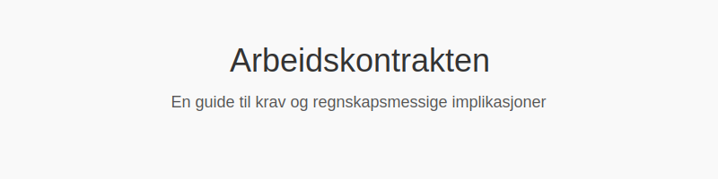

---
title: "Arbeidskontrakten"
seoTitle: "Arbeidskontrakten"
description: ''
---

**Arbeidskontrakten** er det sentrale, skriftlige dokumentet som formelt etablerer et **ansettelsesforhold** mellom *arbeidsgiver* og *arbeidstaker* i Norge. En tydelig og korrekt utformet arbeidskontrakt **beskytter begge parter**, sikrer etterlevelse av arbeidsrettslige krav, og legger grunnlaget for korrekt **regnskapsføring** og rapportering.

## Seksjon 1: Hva er en arbeidskontrakt?

En arbeidskontrakt er det juridiske beviset på at et arbeidsforhold er inngått, og regulerer partenes rettigheter, plikter og vilkår. For en oversikt over ulike arbeidsforholdstyper, se [Hva er Arbeidsforholdstype?](/blogs/regnskap/hva-er-arbeidsforholdstype "Hva er Arbeidsforholdstype?").

## Seksjon 2: Lovpålagte krav til innhold

I henhold til arbeidsmiljøloven §14-6 må skriftlige arbeidsavtaler som hovedregel inneholde følgende **obligatoriske opplysninger**:

| Element                | Beskrivelse                                                       |
|------------------------|-------------------------------------------------------------------|
| **Partene**            | Navn og organisasjonsnummer til arbeidsgiver; navn og fødselsnummer til arbeidstaker |
| **Arbeidssted**        | Fysisk eller geografisk lokasjon hvor arbeidet utføres            |
| **Stilling og oppgaver** | Stillingsbetegnelse og hovedarbeidsoppgaver                    |
| **Startdato og varighet** | Når arbeidsforholdet begynner, og om det er tidsbegrenset eller varig |
| **Avtalt arbeidstid**  | Ordinær arbeidstid per uke eller dag                             |
| **Lønn og godtgjørelse** | Fastlønn, overtidsbetaling, bonusordninger og andre ytelser     |
| **Ferie og feriepenger** | Antall feriedager, beregningsgrunnlag for feriepenger og regler om [fellesferie](/blogs/regnskap/fellesferie "Fellesferie: Hva, regler og planlegging i Norge") |
| **[Oppsigelsestid](/blogs/regnskap/oppsigelsestid "Oppsigelsestid")**   | Lengde på oppsigelsesfrist ved opphør av kontrakten              |
| **Prøvetid**           | Lengde på eventuell prøvetid (maks 6 måneder)                     |

## Seksjon 3: Typer arbeidskontrakter

Avhengig av behov og varighet finnes det flere kontraktsformer. Se også [Arbeidsgiver](/blogs/regnskap/arbeidsgiver "Arbeidsgiver “ Roller og Ansvar i Norsk Arbeidsliv og Regnskap") for arbeidsgivers ansvar ved ansettelse.

- **Fast stilling** (ubegrenset varighet)
- **Midlertidig ansettelse** (tidsbegrenset)
- **Vikariat** (erstatter ansatt med rett til gjeninntreden)
- **Prøveperiode** (inntil 6 måneder ved nyansettelser)

## Seksjon 4: Regnskapsmessige implikasjoner

Arbeidskontrakten har direkte betydning for hvordan lønns- og personalrelaterte kostnader **periodiseres** og bokføres:

- **Periodisering av lønnskostnader**: Lønn kostnadsføres i den perioden arbeidet utføres.
- **Avsetninger for forpliktelser**: Tidsbegrensede kontrakter kan kreve avsetning for fremtidige lønnsutbetalinger.
- **Dokumentasjonskrav**: Skriftlige kontrakter inngår som en del av regnskapsdokumentasjonen i henhold til [Bokføringsforskriften](/blogs/regnskap/hva-er-bokforingsforskriften "Hva er Bokføringsforskriften? Komplett Guide til Norske Bokføringskrav og Regler").

| Regnskapsprinsipp           | Beskrivelse                                                       |
|-----------------------------|-------------------------------------------------------------------|
| **Periodiseringsprinsippet**| Kostnader og inntekter bokføres når de påløper, ikke når betaling skjer |
| **Dokumentasjonsprinsippet** | Alle påløpte forpliktelser må dokumenteres i regnskapet            |

For mer om grunnleggende regnskapsprinsipper, se [Hva er Regnskap?](/blogs/regnskap/hva-er-regnskap "Hva er Regnskap?").

## Seksjon 5: Oppbevaring og dokumentasjon

I henhold til bokføringsforskriften §5-1 skal skriftlige arbeidskontrakter oppbevares i minst 5 år etter regnskapsårets slutt. Korrekt dokumentasjon er avgjørende for:

- Revisjon og internkontroll (se [Hva er Internkontroll?](/blogs/regnskap/hva-er-internkontroll "Hva er Internkontroll?"))
- Skatte- og avgiftskontroll (se [Hva er dokumentasjon i regnskap og bokføring?](/blogs/regnskap/hva-er-dokumentasjon-regnskap-bokforing "Hva er dokumentasjon i regnskap og bokføring?"))

## Seksjon 6: Praktiske tips og beste praksis

Følgende anbefalinger kan bidra til å sikre at arbeidskontraktene er **komplette**, **korrekte** og **etterprøvbare**:

- Bruk standardiserte **maler** som dekker alle lovpålagte krav.
- Inkluder klare beskrivelser av arbeidsoppgaver, -sted og arbeidstid.
- Definer [oppsigelsestid](/blogs/regnskap/oppsigelsestid "Oppsigelsestid") og prøvetid tydelig.
- Sørg for signaturer fra begge parter før tiltredelse.
- Gjennomgå og oppdater kontraktene ved endringer i arbeidsforholdet.

---

## Oppsummering

En velskrevet **arbeidskontrakt** er fundamentet for et trygt og lovlig arbeidsforhold. Forståelse av innhold, krav og **regnskapsmessige konsekvenser** er avgjørende for både arbeidsgiver og arbeidstaker.

---

## Relaterte artikler

  - [Hva er Arbeidsforholdstype?](/blogs/regnskap/hva-er-arbeidsforholdstype "Hva er Arbeidsforholdstype?") “ Oversikt over ulike ansettelsesformer.
  - [Arbeidsgiver](/blogs/regnskap/arbeidsgiver "Arbeidsgiver “ Roller og Ansvar i Norsk Arbeidsliv og Regnskap") “ Arbeidsgivers juridiske og økonomiske ansvar.
  - [Tillitsvalgt](/blogs/regnskap/tillitsvalgt "Tillitsvalgt “ Rolle og ansvar i norsk regnskap") “ Rolle og ansvar for ansatterepresentanter i norsk regnskap.

