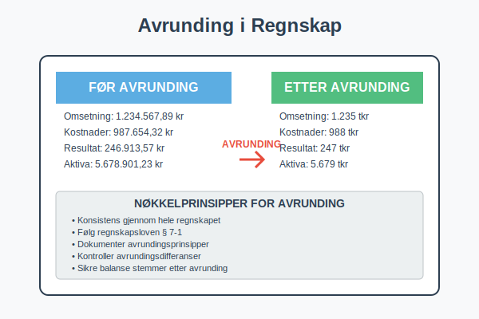
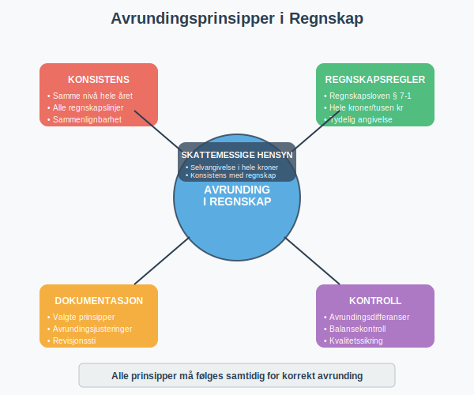
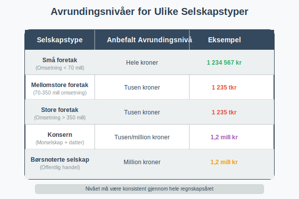
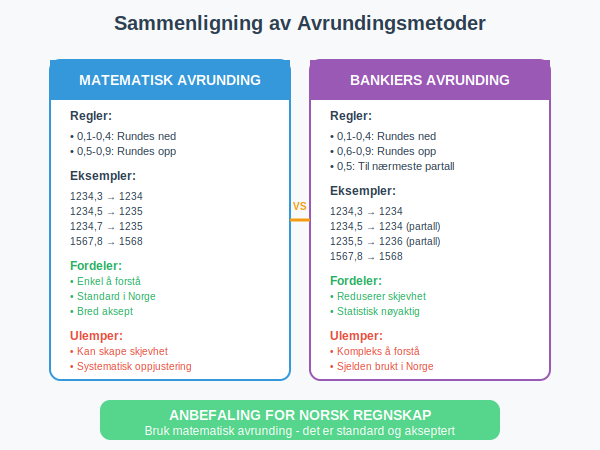
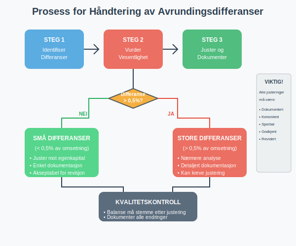
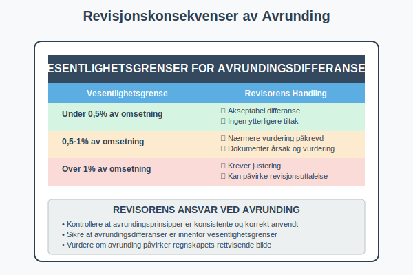
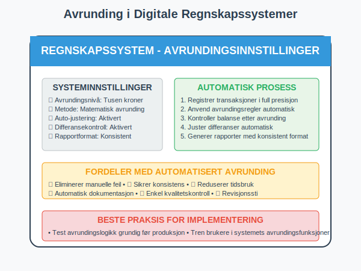
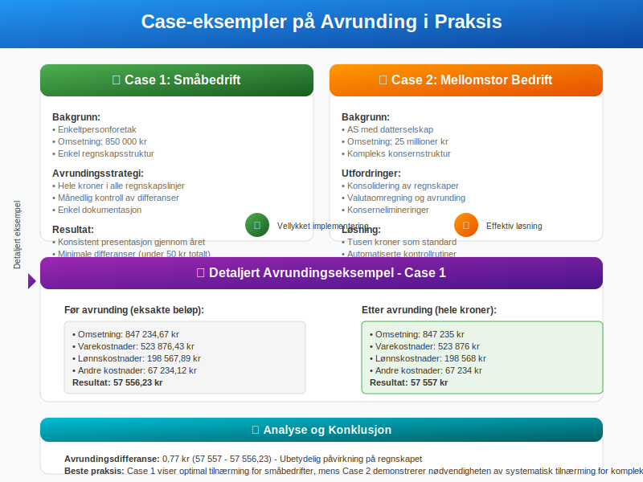
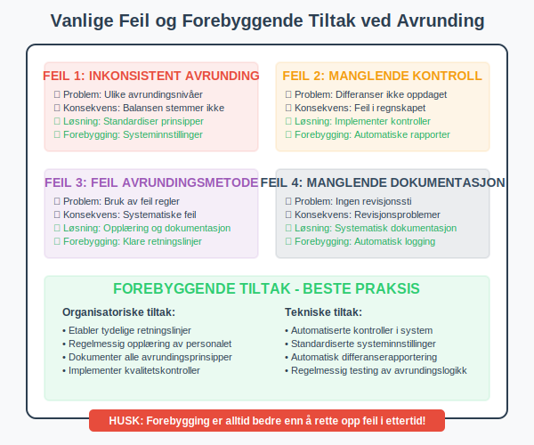
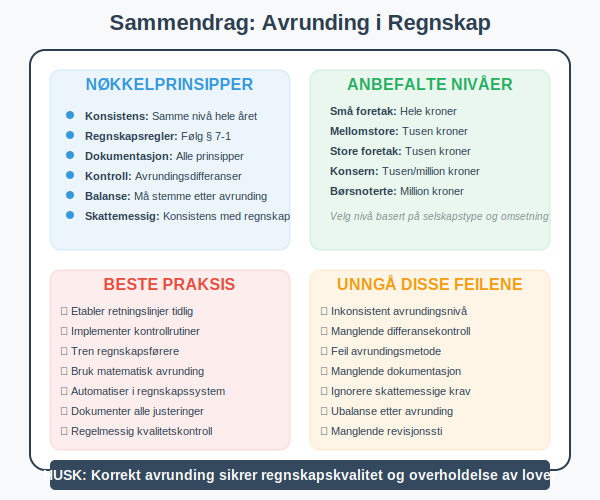

---
title: "Avrunding i Regnskap"
meta_title: "Avrunding i Regnskap"
meta_description: '**Avrunding i regnskap** er et viktig prinsipp som handler om hvordan tall skal presenteres og behandles i [regnskapsføring](/blogs/regnskap/hva-er-regnskap "H...'
slug: avrunding-regnskap
type: blog
layout: pages/single
---

**Avrunding i regnskap** er et viktig prinsipp som handler om hvordan tall skal presenteres og behandles i [regnskapsføring](/blogs/regnskap/hva-er-regnskap "Hva er Regnskap? En komplett guide"). Korrekt avrunding sikrer konsistens, klarhet og overholdelse av regnskapsregler.



## Hva er Avrunding i Regnskap?

Avrunding i regnskap refererer til prosessen med å **forenkle tall** ved å redusere antall desimaler eller fjerne mindre betydningsfulle sifre. Dette gjøres for å:

* **Forbedre lesbarhet** av regnskapet
* **Sikre konsistens** i presentasjon
* **Følge regnskapsregler** og standarder
* **Redusere kompleksitet** i regnskapsrapporter

Avrunding påvirker både [balansen](/blogs/regnskap/hva-er-aktiva "Hva er Aktiva? Forklaring av Eiendeler i Balansen") og resultatregnskapet, og må gjøres systematisk og konsistent.



## Regnskapsregler for Avrunding

### Norske Regnskapsstandarder

I Norge følger avrunding i regnskap spesifikke regler:

#### Regnskapsloven § 7-1
* **Beløp skal oppgis i hele kroner** eller i tusen kroner
* **Konsistent avrunding** gjennom hele regnskapet
* **Tydelig angivelse** av avrundingsnivå

#### Avrundingsnivåer

| Selskapstype | Anbefalt Avrundingsnivå | Eksempel |
|--------------|-------------------------|----------|
| Små foretak | Hele kroner | 1 234 567 kr |
| Mellomstore foretak | Tusen kroner | 1 235 tkr |
| Store foretak | Tusen kroner | 1 235 tkr |
| Konsern | Tusen/million kroner | 1,2 mill kr |



## Avrundingsmetoder

### Matematisk Avrunding (Vanligste)

**Matematisk avrunding** følger standard matematiske regler:

* **0,1-0,4:** Rundes ned
* **0,5-0,9:** Rundes opp

#### Eksempler på Matematisk Avrunding

| Opprinnelig beløp | Avrundet til hele kroner | Avrundet til tusen kroner |
|-------------------|-------------------------|---------------------------|
| 1 234,3 kr | 1 234 kr | 1 tkr |
| 1 234,5 kr | 1 235 kr | 1 tkr |
| 1 234,7 kr | 1 235 kr | 1 tkr |
| 1 567,8 kr | 1 568 kr | 2 tkr |

### Bankiers Avrunding

**Bankiers avrunding** (også kalt "round half to even"):

* **Ved 0,5:** Rundes til nærmeste partall
* **Reduserer systematisk skjevhet** i store datasett
* **Brukes sjelden** i norsk regnskap



## Praktisk Gjennomføring av Avrunding

### Konsistens i Regnskapet

#### Samme Avrundingsnivå
* **Alle poster** må bruke samme avrundingsnivå
* **Balanse må stemme** etter avrunding
* **Kontroll av avrundingsdifferanser**

#### Avrundingsdifferanser
Når avrunding skaper differanser:

* **Små differanser:** Justeres mot egenkapital
* **Større differanser:** Krever nærmere analyse
* **Dokumentasjon:** Alle justeringer må dokumenteres

### Regnskapsføring av Avrundingsjusteringer

```
Eksempel på avrundingsjustering:

Før avrunding:
- Omsetning: 1 234 567,80 kr
- Kostnader: 987 654,30 kr
- Resultat: 246 913,50 kr

Etter avrunding til tusen kroner:
- Omsetning: 1 235 tkr
- Kostnader: 988 tkr
- Resultat: 247 tkr

Avrundingsjustering: 0,50 kr til egenkapital
```



## Skattemessige Konsekvenser

### Skatteetaten og Avrunding

#### Selvangivelse
* **Skatteetaten krever** oppgave i hele kroner
* **Avrunding til nærmeste krone** er påkrevd
* **Konsistens** mellom regnskap og selvangivelse

#### Moms og Avrunding
* **Momsoppgave** skal oppgis i hele kroner
* **Avrunding av hver linje** før summering
* **Spesielle regler** for momskompensasjon

### Revisjonskonsekvenser

#### Revisorens Ansvar
* **Kontrollere avrundingsprinsipper**
* **Sikre konsistens** i anvendelse
* **Vurdere vesentlighet** av avrundingsdifferanser

| Vesentlighetsgrense | Handling |
|-------------------|----------|
| Under 0,5% av omsetning | Akseptabel |
| 0,5-1% av omsetning | Nærmere vurdering |
| Over 1% av omsetning | Krever justering |



## Digitale Regnskapssystemer og Avrunding

### Automatisk Avrunding

Moderne [regnskapssystemer](/blogs/regnskap/hva-er-regnskap "Hva er Regnskap? En komplett guide") håndterer avrunding automatisk:

#### Systeminnstillinger
* **Avrundingsnivå** kan settes globalt
* **Automatiske justeringer** for differanser
* **Rapportgenerering** med konsistent avrunding

#### Kontrollrutiner
* **Balansekontroll** etter avrunding
* **Differanserapporter** for oppfølging
* **Historisk sporing** av avrundingsjusteringer

### Beste Praksis for Digitale Systemer

* **Sett avrundingsregler** tidlig i implementeringen
* **Test avrundingslogikk** grundig
* **Dokumenter avrundingsprinsipper** i systemdokumentasjon
* **Tren brukere** i avrundingshåndtering



## Internasjonale Perspektiver

### IFRS og Avrunding

**International Financial Reporting Standards (IFRS)** har egne retningslinjer:

#### IAS 1 - Presentasjon av Finansregnskap
* **Materialitet** skal vurderes ved avrunding
* **Konsistent presentasjon** kreves
* **Tydelig angivelse** av avrundingsnivå

#### Sammenligning med Norske Regler

| Aspekt | Norske regler | IFRS |
|--------|---------------|------|
| Avrundingsnivå | Hele kroner/tusen | Fleksibelt |
| Konsistens | Påkrevd | Påkrevd |
| Dokumentasjon | Detaljert | Prinsippbasert |

## Praktiske Eksempler og Case

### Case 1: Småbedrift med Enkel Struktur

**Bakgrunn:** Enkeltpersonforetak med omsetning på 850 000 kr

#### Avrundingsstrategi:
* **Hele kroner** i alle regnskapslinjer
* **Månedlig kontroll** av avrundingsdifferanser
* **Enkel dokumentasjon** av avrundingsprinsipper

#### Resultat:
* **Konsistent presentasjon** gjennom året
* **Minimale avrundingsdifferanser** (under 50 kr totalt)
* **Enkel revisjon** og godkjenning

### Case 2: Mellomstor Bedrift med Kompleks Struktur

**Bakgrunn:** AS med omsetning på 25 millioner kr og flere datterselskap

#### Utfordringer:
* **Konsolidering** av regnskaper
* **Valutaomregning** og avrunding
* **Konsernelimineringer** med avrundingseffekter

#### Løsning:
* **Tusen kroner** som standard avrundingsnivå
* **Sentralisert avrundingskontroll**
* **Automatiserte kontrollrutiner**



## Vanlige Feil og Fallgruver

### Typiske Avrundingsfeil

#### Inkonsistent Avrunding
* **Problem:** Ulike avrundingsnivåer i samme regnskap
* **Konsekvens:** Balansen stemmer ikke
* **Løsning:** Standardiser avrundingsprinsipper

#### Manglende Kontroll av Differanser
* **Problem:** Avrundingsdifferanser ikke identifisert
* **Konsekvens:** Feil i regnskapet
* **Løsning:** Implementer kontrollrutiner

#### Feil Avrundingsmetode
* **Problem:** Bruk av feil avrundingsregler
* **Konsekvens:** Systematiske feil
* **Løsning:** Opplæring og dokumentasjon

### Forebyggende Tiltak

* **Tydelige retningslinjer** for avrunding
* **Regelmessig opplæring** av regnskapsførere
* **Automatiserte kontroller** i regnskapssystem
* **Dokumentasjon** av alle avrundingsprinsipper



## Fremtidige Utviklingstrender

### Teknologiske Utviklinger

#### Kunstig Intelligens og Avrunding
* **Automatisk optimalisering** av avrundingsstrategier
* **Prediktiv analyse** av avrundingseffekter
* **Intelligent kvalitetskontroll**

#### Blockchain og Avrunding
* **Transparent avrundingshistorikk**
* **Uforanderlig dokumentasjon** av avrundingsprinsipper
* **Automatiserte smart contracts** for avrunding

### Regulatoriske Endringer

#### Kommende Endringer i Regnskapsloven
* **Økt fokus** på digitaliseringskrav
* **Standardisering** av avrundingsprinsipper
* **Forbedret rapporteringskvalitet**

## Konklusjon og Anbefalinger

**Avrunding i regnskap** er et fundamentalt prinsipp som krever:

### Nøkkelprinsippene
* **Konsistens** i anvendelse gjennom hele regnskapet
* **Dokumentasjon** av valgte avrundingsprinsipper
* **Kontroll** av avrundingsdifferanser
* **Overholdelse** av regnskapsregler og standarder

### Praktiske Anbefalinger
* **Etabler klare retningslinjer** tidlig i regnskapsåret
* **Implementer kontrollrutiner** for avrundingskvalitet
* **Tren personalet** i korrekte avrundingsprinsipper
* **Dokumenter alle avvik** og justeringer

### Fremover
Avrunding vil fortsette å være viktig i regnskapsføring, men teknologiske utviklinger vil gjøre prosessen mer automatisert og presis. Bedrifter som investerer i gode avrundingsprinsipper og -systemer vil ha fordeler i form av bedre regnskapskvalitet og enklere revisjonsprocesser.



## Relaterte Artikler

For mer informasjon om relaterte regnskapstemaer, se:

* [Hva er Regnskap?](/blogs/regnskap/hva-er-regnskap "Hva er Regnskap? En komplett guide")
* [Hva er Aktiva?](/blogs/regnskap/hva-er-aktiva "Hva er Aktiva? Forklaring av Eiendeler i Balansen")
* [Hva er et Aksjeselskap?](/blogs/regnskap/hva-er-et-aksjeselskap "Hva er et Aksjeselskap? Komplett Guide til Selskapsformen")


