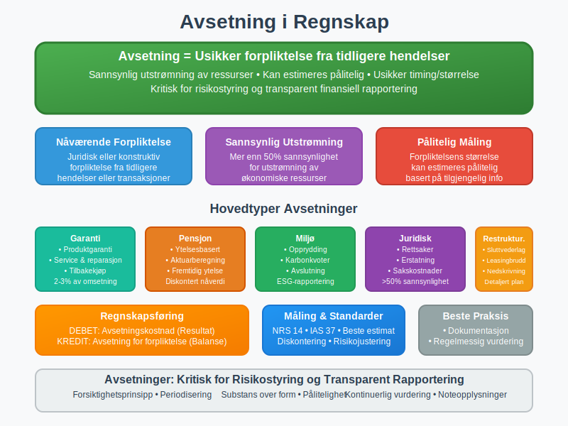
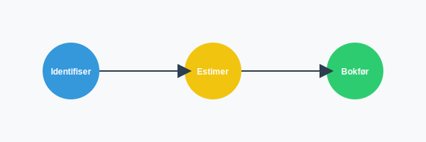
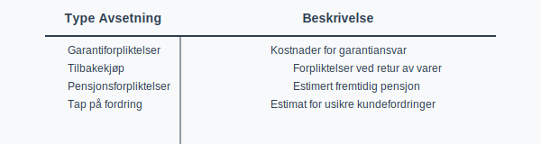
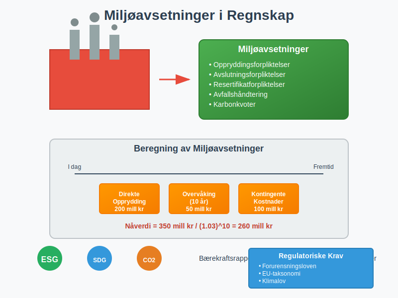

---
title: "Hva er Avsetning i Regnskap?"
meta_title: "Hva er Avsetning i Regnskap?"
meta_description: '**Avsetning** er en fundamental del av [regnskapsføring](/blogs/regnskap/hva-er-regnskap "Hva er Regnskap? En komplett guide") som sikrer at virksomheten tar h...'
slug: avsetning
type: blog
layout: pages/single
---

**Avsetning** er en fundamental del av [regnskapsføring](/blogs/regnskap/hva-er-regnskap "Hva er Regnskap? En komplett guide") som sikrer at virksomheten tar høyde for fremtidige **forpliktelser** og usikre kostnader. Avsetninger representerer en kritisk komponent i [balansen](/blogs/regnskap/hva-er-balanse "Hva er Balanse? En Guide til Balanseregnskap") og påvirker både resultatregnskapet og virksomhetens finansielle stilling. Som en sentral del av [periodiseringsprinsippet](/blogs/regnskap/hva-er-periodisering "Hva er Periodisering? Prinsipper og Praktiske Eksempler"), sikrer avsetninger at kostnader og forpliktelser regnskapsføres i riktig periode.

Prinsippet er også nært knyttet til [sammenstillingsprinsippet](/blogs/regnskap/sammenstillingsprinsippet "Hva er Sammenstillingsprinsippet?") som sikrer matching av kostnader og inntekter.

For mer om hvordan utilstrekkelige avsetninger kan føre til **baksmell**, se [Baksmell](/blogs/regnskap/baksmell "Baksmell i Regnskap og Skatt: Årsaker, Eksempler og Behandling").





## Seksjon 1: Grunnleggende om Avsetning

### 1.1 Definisjon og Konsept

**Avsetning** defineres som en forpliktelse med usikker tidsmessig utstrekning eller beløp som oppstår som følge av tidligere hendelser. For at en forpliktelse skal klassifiseres som avsetning, må den oppfylle spesifikke kriterier og skille seg fra andre typer [gjeld](/blogs/regnskap/hva-er-gjeld "Hva er Gjeld i Regnskap? Komplett Guide til Forpliktelser og Gjeldstyper").

### 1.2 Forskjell mellom Avsetning og Ordinær Gjeld

| **Aspekt** | **Avsetning** | **Ordinær Gjeld** |
|------------|---------------|-------------------|
| **Sikkerhet** | Usikker størrelse eller tidspunkt | Kjent beløp og forfall |
| **Grunnlag** | Estimat basert på sannsynlighet | Kontraktuelle forpliktelser |
| **Måling** | Beste estimat av fremtidig utstrømning | Faktisk skyldig beløp |
| **Eksempler** | Garantiforpliktelser, rettsaker | [Leverandørgjeld](/blogs/regnskap/hva-er-leverandorgjeld "Hva er Leverandørgjeld i Regnskap? Komplett Guide til Kreditorhåndtering og Regnskapsføring"), banklån |

### 1.3 Regnskapsmessige Prinsipper

Avsetninger følger flere grunnleggende regnskapsprinsipper:

* **Forsiktighetsprinsippet:** Kostnader og forpliktelser regnskapsføres når de er sannsynlige
* **Periodiseringsprinsippet:** Kostnader matches mot relaterte inntekter
* **Substans over form:** Økonomisk realitet prioriteres over juridisk form
* **Pålitelighet:** Estimater må være basert på tilgjengelig informasjon

## Seksjon 2: Detaljerte Avsetningstyper



### 2.1 Garantiavsetninger

**Garantiavsetninger** er blant de vanligste typene avsetninger og oppstår når virksomheten selger produkter med garanti.

#### Beregning av Garantiavsetninger:

```text
Garantiavsetning = Omsetning × Historisk garantikostnad (%)
```

#### Eksempel - Garantiavsetning:
En bilforhandler selger 1000 biler til 500 000 kr hver. Historisk erfaring viser 2% garantikostnad:

```text
Garantiavsetning = 500 000 000 × 2% = 10 000 000 kr
```

#### Regnskapsføring:
```text
DEBET: Garantikostnad              10 000 000
   KREDIT: Avsetning for garanti              10 000 000
```

### 2.2 Pensjonsavsetninger

**[Pensjonsavsetninger](/blogs/regnskap/hva-er-pensjon "Hva er Pensjon? Komplett Guide til Pensjonsordninger og Regnskapsføring")** representerer virksomhetens forpliktelser overfor ansatte for fremtidige pensjonsutbetalinger.

#### Typer Pensjonsordninger:
* **Ytelsesbaserte ordninger:** Avsetning basert på fremtidige ytelser
* **Innskuddsbaserte ordninger:** Avsetning kun for påløpte premier
* **[Obligatorisk tjenestepensjon](/blogs/regnskap/obligatorisk-tjenestepensjon "Obligatorisk Tjenestepensjon - Regler og Regnskapsføring"):** Minimum pensjonsordning

#### Aktuarmessige Forutsetninger:
* **Diskonteringsrente:** Avkastning på sikre obligasjoner
* **Lønnutvikling:** Forventet årlig lønnsøkning
* **Dødelighet:** Statistisk levealder
* **Personalomsetning:** Forventet utskifting av ansatte

### 2.3 Restruktureringsavsetninger

**Restruktureringsavsetninger** oppstår når virksomheten har en detaljert plan for restrukturering og har kommunisert denne til berørte parter.

#### Kriterier for Restruktureringsavsetning:
* **Detaljert plan:** Spesifisert plan med tidsskjema og kostnader
* **Forpliktende beslutning:** Styrebeslutning eller offentlig kommunikasjon
* **Sannsynlig gjennomføring:** Planen vil sannsynligvis gjennomføres
* **Pålitelig estimat:** Kostnadene kan estimeres pålitelig

#### Inkluderte Kostnader:
* **Sluttvederlag:** Kompensasjon til permitterte ansatte
* **Nedskrivninger:** Verdifall på aktiva som følge av restrukturering
* **Direkte kostnader:** Kostnader direkte knyttet til restrukturering
* **Leasingbrudd:** Kostnader ved opphevelse av leasingavtaler

### 2.4 Miljøavsetninger

**Miljøavsetninger** blir stadig viktigere og relaterer seg til virksomhetens miljømessige forpliktelser.

#### Typer Miljøavsetninger:
* **Oppryddingsforpliktelser:** Kostnader for å rense forurensning
* **Avslutningsforpliktelser:** Kostnader ved nedleggelse av anlegg
* **Resertifikatforpliktelser:** Kostnader for miljøsertifikater
* **Avfallshåndtering:** Kostnader for avfallsbehandling



### 2.5 Rettsavsetninger

**Rettsavsetninger** oppstår når virksomheten er involvert i rettssaker eller andre juridiske tvister.

#### Vurdering av Rettsavsetninger:
* **Juridisk rådgivning:** Vurdering fra advokat
* **Sannsynlighetsgrad:** Mer enn 50% sannsynlighet for tap
* **Kostnadsestimat:** Estimat av potensielle tap og sakskostnader
* **Tidsperspektiv:** Forventet varighet av rettssak

## Seksjon 3: Regulatorisk Rammeverk

### 3.1 Norsk Regnskapsstandard (NRS) 14

**NRS 14** "Avsetninger, betingede forpliktelser og betingede eiendeler" er den sentrale standarden for avsetninger i Norge.

#### Hovedkrav i NRS 14:

##### Innregningskriterier:
* **Nåværende forpliktelse:** Juridisk eller konstruktiv forpliktelse
* **Tidligere hendelse:** Forpliktelsen oppstår fra tidligere transaksjoner
* **Sannsynlig utstrømning:** Mer enn 50% sannsynlighet
* **Pålitelig måling:** Forpliktelsen kan estimeres pålitelig

##### MÃ¥ling av Avsetninger:
* **Beste estimat:** Mest sannsynlige utfall
* **Nåverdiberegning:** Diskontering ved vesentlige beløp
* **Risikojustering:** Hensyn til usikkerhet i estimatet
* **Fremtidig kostnadsinflasjon:** Justering for prisstigning

### 3.2 Sammenligning med IFRS

| **Aspekt** | **NRS 14** | **IAS 37** |
|------------|------------|-------------|
| **Innregningskriterier** | Nåværende forpliktelse, sannsynlig utstrømning, pålitelig måling | Samme kriterier |
| **Måling** | Beste estimat, nåverdi ved lange tidshorisonter | Beste estimat, nåverdi når tidselement er vesentlig |
| **Diskontering** | Ikke detaljert regulert | Detaljerte krav til diskonteringsrente |
| **Restrukturering** | Forpliktelse når detaljert plan og kommunikasjon | Samme tilnærming |

### 3.3 Skattemessige Konsekvenser

#### Generelle Skatteregler:
* **Tidspunkt for fradrag:** Avsetninger gir ikke skattelfradrag
* **Realisasjonsprinsippet:** Fradrag når kostnad er pådratt
* **Temporære forskjeller:** Kan skape [utsatt skatt](/blogs/kontoplan/2120-utsatt-skatt "Konto 2120 - Utsatt skatt i Norsk Standard Kontoplan")

#### Spesifikke Avsetningstyper:
* **Garantiavsetninger:** Fradrag når garantiservice utføres
* **Pensjonsavsetninger:** Fradrag for innbetalte premier
* **Miljøavsetninger:** Fradrag når oppryddingskostnader påløper

## Seksjon 4: Regnskapsføring og Måling

### 4.1 Innregning av Avsetninger

#### Første Innregning:
```text
DEBET: Avsetningskostnad (resultat)
   KREDIT: Avsetning for forpliktelse (balanse)
```

#### Bruk av Avsetning:
```text
DEBET: Avsetning for forpliktelse
   KREDIT: Bank/Leverandørgjeld
```

#### Reversering av Avsetning:
```text
DEBET: Avsetning for forpliktelse
   KREDIT: Reversering av avsetning (resultat)
```

### 4.2 MÃ¥ling og Estimering

#### Estimeringsmetoder:
* **Forventet verdi:** Sannsynlightsvektede utfall
* **Mest sannsynlige utfall:** Enkelt mest sannsynlige scenario
* **Konservativ tilnærming:** Høyeste rimelige estimat

#### Eksempel - Forventet verdi:
En rettssak med følgende mulige utfall:

| **Utfall** | **Sannsynlighet** | **Beløp** | **Forventet verdi** |
|------------|------------------|-----------|---------------------|
| Tap sak | 60% | 10 000 000 | 6 000 000 |
| Vinn sak | 40% | 0 | 0 |
| **Total** | | | **6 000 000** |

### 4.3 Diskontering og NÃ¥verdi

#### NÃ¥r Diskontering Kreves:
* **Vesentlige beløp:** Betydelige fremtidige utbetalinger
* **Lang tidshorisont:** Forfall mer enn 12 måneder frem
* **Stabil diskonteringsrente:** PÃ¥litelig langsiktig rente

#### Diskonteringsrente:
```text
Nåverdi = Fremtidig verdi / (1 + diskonteringsrente)^antall år
```

#### Eksempel - Diskontering:
Miljøavsetning på 50 millioner kr som forfaller om 10 år, diskonteringsrente 3%:

```text
NÃ¥verdi = 50 000 000 / (1,03)^10 = 37 244 000 kr
```

## Seksjon 5: Praktiske Eksempler og Cases

### 5.1 Case: Garantiavsetning for Elektronikkbedrift

**Situasjon:** ElektroAS selger elektronikk med 2 års garanti.

**Historiske data:**
* Omsetning 2023: 100 millioner kr
* Historisk garantikostnad: 3% av omsetning
* Gjennomsnittlig garantiperiode: 18 måneder

**Beregning:**
```text
Garantiavsetning = 100 000 000 × 3% = 3 000 000 kr
```

**Regnskapsføring:**
```text
DEBET: Garantikostnad              3 000 000
   KREDIT: Avsetning for garanti              3 000 000
```

### 5.2 Case: Restruktureringsavsetning

**Situasjon:** ProduksjonAS beslutter å stenge en fabrikk.

**Planlagte kostnader:**
* Sluttvederlag til 100 ansatte: 50 millioner kr
* Nedskrivning av maskiner: 30 millioner kr
* Oppryddingskostnader: 10 millioner kr
* Leasingbrudd: 5 millioner kr

**Total avsetning:** 95 millioner kr

**Regnskapsføring:**
```text
DEBET: Restruktureringskostnad         95 000 000
   KREDIT: Avsetning for restrukturering         95 000 000
```

### 5.3 Case: Miljøavsetning for Oljebedrift

**Situasjon:** OljeAS må rense et industriområde.

**Kostnadskomponenter:**
* Jordforurensning: 200 millioner kr
* Grunnvannsrensing: 150 millioner kr
* Overvåking (10 år): 50 millioner kr
* Kontingente kostnader: 100 millioner kr

**Tidsperspektiv:** 5-15 år
**Diskonteringsrente:** 2,5%

**Beregning:**
```text
Total kostnader = 500 000 000 kr
Nåverdi (10 år) = 500 000 000 / (1,025)^10 = 390 000 000 kr
```

## Seksjon 6: Avsetninger i Forskjellige Bransjer

### 6.1 Bygg- og Anleggsbransjen

#### Spesifikke Avsetninger:
* **Feilrettingsavsetninger:** Kostnader for å rette mangler
* **Garantiavsetninger:** Langsiktige garanti på bygg
* **Miljøavsetninger:** Opprydding på byggeplasser
* **Forsikringsavsetninger:** Egenrisiko på forsikringer

#### Praktisk Beregning:
```text
Garantiavsetning = Entreprisesum × Garantisats × Garantiperiode
```

### 6.2 Teknologibransjen

#### Teknologispesifikke Avsetninger:
* **Produkttilbakekall:** Kostnader ved defekte produkter
* **Patentkonflikter:** Potensielle royaltykostnader
* **Datasikkerhet:** Kostnader ved sikkerhetsbrudd
* **Oppdateringsforpliktelser:** Kostnader for produktoppdateringer

### 6.3 Helsesektoren

#### Helsespesifikke Avsetninger:
* **Behandlingsfeil:** Potensielle erstatningskrav
* **Medisinsk utstyr:** Avsetninger for defekt utstyr
* **Regulatoriske endringer:** Kostnader ved regelverksendringer
* **Pasientskader:** Avsetninger for behandlingsskader

## Seksjon 7: Avsetninger og Risikostyring

### 7.1 Risikokategorier

#### Operasjonell Risiko:
* **Produktdefekter:** Garantikostnader og tilbakekall
* **Personalrisiko:** Sluttvederlag og pensjonsforpliktelser
* **Miljørisiko:** Forurensning og oppryddingskostnader
* **Teknologirisiko:** Systemfeil og cybersikkerhet

#### Finansiell Risiko:
* **Renterisiko:** Endringer i diskonteringsrenter
* **Valutarisiko:** Avsetninger i utenlandsk valuta
* **Inflasjon:** Kostnadsvekst over tid
* **Likviditetsrisiko:** Tidspunkt for kontantutstrømning

### 7.2 Risikostyring og Avsetninger

#### Risikostyringsprosess:
1. **Identifikasjon:** Kartlegging av potensielle forpliktelser
2. **Vurdering:** Sannsynlighet og konsekvens
3. **MÃ¥ling:** Kvantifisering av potensielle kostnader
4. **Overvåking:** Kontinuerlig oppfølging og oppdatering

#### Risikoindikatorer:
* **Antall kundemeldinger:** Indikator på garantiproblemer
* **Regulatory endringer:** Nye lovkrav som skaper forpliktelser
* **Bransjetrends:** Utviklinger som påvirker avsetningsnivåer
* **Økonomiske indikatorer:** Faktorer som påvirker kostnadsestimat

## Seksjon 8: Avsetninger og Noteopplysninger

### 8.1 Krav til Noteopplysninger

#### Obligatoriske Opplysninger:
* **Åpningsbalanse:** Avsetninger ved årets start
* **Tillegg:** Nye avsetninger i løpet av året
* **Benyttelser:** Faktiske utbetalinger mot avsetning
* **Reverseringer:** Avsetninger som er reversert
* **Diskonteringseffekter:** Effekt av tidsverdijustering

#### Eksempel på Noteopplysning:

| **Avsetningstype** | **Ã…pningsbalanse** | **Tillegg** | **Benyttelse** | **Reversering** | **Sluttbalanse** |
|--------------------|--------------------|-------------|----------------|-----------------|------------------|
| Garantiavsetning | 10 000 000 | 8 000 000 | -5 000 000 | -1 000 000 | 12 000 000 |
| Pensjonsavsetning | 50 000 000 | 12 000 000 | -8 000 000 | 0 | 54 000 000 |
| Miljøavsetning | 25 000 000 | 5 000 000 | -2 000 000 | 0 | 28 000 000 |

### 8.2 Kvalitative Opplysninger

#### Beskrivelse av Avsetninger:
* **Karakter:** Hva avsetningen dekker
* **Usikkerhet:** Grad av usikkerhet i estimatet
* **Tidsperspektiv:** Forventet tidspunkt for utbetaling
* **Hovedforutsetninger:** Kritiske antagelser i beregningen

#### Sensitivitetsanalyse:
* **Endring i forutsetninger:** Effekt på avsetningsnivå
* **Scenario-analyser:** Ulike utfall og konsekvenser
* **Usikkerhetsintervaller:** Sannsynlige variasjoner i estimatet

## Seksjon 9: Digitalisering og Avsetninger

### 9.1 Moderne Regnskapssystemer

#### Automatiserte Funksjoner:
* **Beregningsmoduler:** Automatisk beregning basert på parametere
* **Integrasjoner:** Kobling mot drift og produksjon
* **Rapportering:** Automatisk generering av noteopplysninger
* **Varslingssystemer:** Automatiske påminnelser om vurderinger

#### Kunstig Intelligens og Machine Learning:
* **Prediktive modeller:** Forbedrede estimater basert på historiske data
* **Mønstergjenkjenning:** Identifisering av avsetningsbehov
* **Risikoscoring:** Automatisk vurdering av risikofaktorer
* **Kvalitetssikring:** Automatisk kontroll av beregninger

### 9.2 Big Data og Avsetninger

#### Datakilder:
* **Produksjonsdata:** Kvalitetsmål og feilrater
* **Kundedata:** Klager og tilbakemeldinger
* **Markedsdata:** Bransjetrends og benchmarks
* **Regulatoriske data:** Endringer i lovverk og forskrifter

#### Analytiske Verktøy:
* **Regresjonsanalyse:** Sammenheng mellom variabler
* **Tidsserieanalyse:** Utvikling over tid
* **Simulering:** Monte Carlo-modeller for usikkerhet
* **Benchmarking:** Sammenligning med bransje

## Seksjon 10: Internasjonale Perspektiver

### 10.1 IFRS og IAS 37

#### Hovedforskjeller fra NRS 14:
* **Detaljerte målingsregler:** Mer spesifikke krav til diskontering
* **Konvergenskriterier:** Strengere krav til innregning
* **Noteopplysninger:** Mer omfattende rapporteringskrav
* **Overgangsregler:** Spesifikke krav ved første anvendelse

#### Forventede Endringer:
* **Forsikringskontrakter:** Nye regler for forsikringsavsetninger
* **Leasingkontrakter:** Endringer i leasingavsetninger
* **Miljørapportering:** Økte krav til miljøavsetninger
* **Bærekraftrapportering:** Kobling til ESG-rapportering

### 10.2 Europeiske Regnskapsstandarder

#### Nasjonale Variasjoner:
* **Tyskland:** Strengere krav til miljøavsetninger
* **Frankrike:** Detaljerte regler for pensjonsavsetninger
* **Storbritannia:** Spesifikke krav til finansielle avsetninger
* **Nederland:** Fokus på avsetninger i finanssektoren

### 10.3 Amerikanske Regnskapsstandarder (US GAAP)

#### Hovedforskjeller:
* **Sannsynlighetskriterium:** "Probable" vs "more likely than not"
* **MÃ¥lingsprinsipp:** Forskjeller i diskonteringsregler
* **Kontinuerlig evaluering:** Krav til kontinuerlig revurdering
* **Noteopplysninger:** Mer detaljerte kvantitative krav

## Seksjon 11: Fremtidens Avsetninger

### 11.1 Nye Avsetningstyper

#### Klimarelaterte Avsetninger:
* **Karbonkvoter:** Forpliktelser knyttet til CO2-utslipp
* **Klimarisiko:** Avsetninger for klimatilpasning
* **Grønn omstilling:** Kostnader ved miljøomstilling
* **Bærekraftsmål:** Forpliktelser knyttet til SDG-er

#### Teknologirelaterte Avsetninger:
* **Cybersikkerhet:** Avsetninger for IT-sikkerhetsbrudd
* **Datavern:** Kostnader knyttet til GDPR-brudd
* **Kunstig intelligens:** Ansvarsproblematikk ved AI-bruk
* **Kvantedatamaskiner:** Krypteringsrelaterte risiko

### 11.2 Regulatoriske Endringer

#### Forventede Endringer:
* **ESG-rapportering:** Økte krav til miljøavsetninger
* **Bærekraftsstandarder:** Nye avsetningstyper
* **Regulatorisk teknologi:** Automatiserte rapporteringskrav
* **Grenseoverskridende regler:** Harmoniserte internasjonale krav

### 11.3 Teknologisk Utvikling

#### Fremtidens Verktøy:
* **Blockchain:** Transparens og sporbarhet i avsetninger
* **IoT-sensorer:** Sanntidsdata for avsetningsberegninger
* **Kvantedatamaskiner:** Komplekse sannsynlighetsberegninger
* **Automatisert revisjon:** AI-basert kontroll av avsetninger

## Seksjon 12: Beste Praksis og Anbefalinger

### 12.1 Organisatoriske Tiltak

#### Styrings- og Kontrollsystem:
* **Avsetningskomité:** Tverrfaglig gruppe for avsetningsvurderinger
* **Dokumentasjonspraksis:** Systematisk dokumentasjon av forutsetninger
* **Kvalitetssikring:** Uavhengig kontroll av beregninger
* **Rapporteringsrutiner:** Regelmessig rapportering til ledelse

#### Kompetanseutvikling:
* **Faglig oppdatering:** Kontinuerlig opplæring i nye standarder
* **Tverrfaglig samarbeid:** Samarbeid mellom regnskap, jus og drift
* **Ekstern rådgivning:** Bruk av spesialister ved komplekse avsetninger
* **Benchmarking:** Læring fra beste praksis i bransjen

### 12.2 Praktiske Retningslinjer

#### Avsetningsprosess:
1. **Identifisering:** Systematisk kartlegging av potensielle forpliktelser
2. **Vurdering:** Grundig analyse av sannsynlighet og konsekvens
3. **Måling:** Pålitelige beregninger basert på tilgjengelig informasjon
4. **Dokumentasjon:** Detaljert dokumentasjon av forutsetninger og beregninger
5. **Godkjenning:** Formell godkjenning av avsetninger
6. **Oppfølging:** Kontinuerlig overvåking og oppdatering

#### Kvalitetssikring:
* **Fireøyeprinsipp:** Dobbeltkontroll av beregninger
* **Dokumentasjonskrav:** Standardiserte dokumentasjonsmal
* **Revisjonssjekk:** Regelmessig intern revisjon
* **Ekstern validering:** Uavhengig kontroll av større avsetninger

### 12.3 Risikostyring

#### Risikomitigering:
* **Forsikringsdekning:** Forsikring mot identifiserte risiko
* **Kontraktsjus:** Ansvarsbegrensning i kontrakter
* **Overvåking:** Kontinuerlig risikohåndtering
* **Beredskapshållning:** Planer for håndtering av avsetninger

#### Kommunikasjon:
* **Intern kommunikasjon:** Regelmessig informasjon til organisasjonen
* **Ekstern kommunikasjon:** Transparent rapportering til interessenter
* **Krisekommunikasjon:** Forberedt kommunikasjon ved store avsetninger
* **Medietreneng:** HÃ¥ndtering av medieoppmerksomhet

## Konklusjon

**Avsetninger** representerer en kritisk og kompleks del av moderne regnskapsføring som krever grundig forståelse av både regnskapsmessige prinsipper og virksomhetsspesifikke risiko. Fra grunnleggende garantiavsetninger til komplekse miljø- og pensjonsforpliktelser, påvirker avsetninger alle aspekter av virksomhetens finansielle rapportering og strategiske beslutninger.

### Nøkkelpunkter for Successful Avsetningshåndtering:

* **Systematisk tilnærming:** Implementering av strukturerte prosesser for identifikasjon, måling og oppfølging av avsetninger
* **Regelmessig oppdatering:** Kontinuerlig revurdering av forutsetninger og estimater basert på ny informasjon
* **Tverrfaglig samarbeid:** Samarbeid mellom regnskap, jus, drift og ledelse for å sikre helhetlig vurdering
* **Transparent rapportering:** Klar og forståelig kommunikasjon om avsetninger til interessenter

### Fremtidige Utfordringer:

Utviklingen innen regulatoriske krav, teknologi og bærekraft vil fortsette å påvirke avsetningspraksis. Virksomheter må forberede seg på nye typer risiko og forpliktelser, samtidig som de benytter moderne teknologi for å forbedre nøyaktigheten og effektiviteten i avsetningsprosessen.

### Strategisk Perspektiv:

Avsetninger er ikke bare en regnskapsmessig forpliktelse, men også et strategisk verktøy for risikostyring og verdiskaping. Ved å forstå og håndtere avsetninger proaktivt kan virksomheter:

* **Forbedre risikostyring** gjennom bedre forståelse av potensielle forpliktelser
* **Optimalisere kapitalallokering** ved å ta høyde for fremtidige kontantstrømmer
* **Styrke interessentenes tillit** gjennom transparent og pålitelig finansiell rapportering
* **Skape competitive advantage** ved å håndtere usikkerhet bedre enn konkurrenter

Effektiv avsetningshåndtering krever kontinuerlig læring, tilpasning og forbedring. Ved å følge beste praksis og holde seg oppdatert på utviklingen innen standarder og teknologi, kan virksomheter sikre at deres avsetningspraksis støtter både regnskapsmessige krav og forretningsmessige mål.

For videre lesning om relaterte emner, se våre artikler om [gjeld](/blogs/regnskap/hva-er-gjeld "Hva er Gjeld i Regnskap? Komplett Guide til Forpliktelser og Gjeldstyper"), [periodisering](/blogs/regnskap/hva-er-periodisering "Hva er Periodisering? Prinsipper og Praktiske Eksempler"), [balanse](/blogs/regnskap/hva-er-balanse "Hva er Balanse? En Guide til Balanseregnskap"), [utsatt skatt](/blogs/kontoplan/2120-utsatt-skatt "Konto 2120 - Utsatt skatt i Norsk Standard Kontoplan"), og [pensjonsforpliktelser](/blogs/kontoplan/2100-pensjonsforpliktelser "Konto 2100 - Pensjonsforpliktelser i Norsk Standard Kontoplan").


