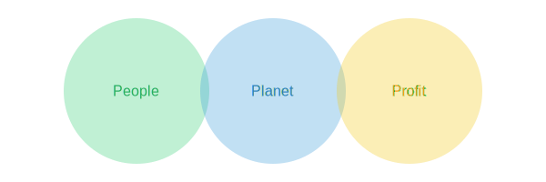

---
title: "Bærekraft"
meta_title: "Bærekraft"
meta_description: '**Bærekraft** er et overordnet prinsipp som omfatter økonomisk, miljømessig og sosial ansvarlighet i virksomheters drift og rapportering. I regnskapssammenhe...'
slug: baerekraft
type: blog
layout: pages/single
---

**Bærekraft** er et overordnet prinsipp som omfatter økonomisk, miljømessig og sosial ansvarlighet i virksomheters drift og rapportering. I regnskapssammenheng innebærer bærekraft å integrere målbare miljø- og samfunnspåvirkninger i finansielle beslutninger, rapportering og strategisk planlegging.

## Triple Bunnlinje

Tabellen nedenfor viser de tre pilarene i bærekraft, ofte omtalt som *triple bunnlinje*:

| Pilar   | Fokus                    | Eksempel                                    |
|---------|--------------------------|---------------------------------------------|
| People  | Sosial bærekraft         | Arbeidsforhold, mangfold og inkludering     |
| Planet  | Miljømessig bærekraft    | Klimagassutslipp, ressursbruk og avfallshåndtering |
| Profit  | Økonomisk bærekraft      | Langsiktig lønnsomhet og stabil kontantstrøm |

* For mer informasjon om [Helse, miljø og sikkerhet (HMS)](/blogs/regnskap/hms "Helse, miljø og sikkerhet (HMS)"), se vår artikkel om HMS.
* For mer om [Sirkulær økonomi](/blogs/regnskap/sirkulaer-okonomi "Sirkulær økonomi i Regnskap: En Guide til Sirkulær økonomi og Regnskapspraksis"), se vår artikkel om sirkulær økonomi.

## Bærekraft i Norsk Regnskap

Norske virksomheter må forholde seg til en rekke lover og direktiver som stiller krav til bærekraftsrapportering og samfunnsansvar:

* [CSRD-direktivet](/blogs/regnskap/hva-er-csrd "Hva er CSRD? Corporate Sustainability Reporting Directive - Komplett Guide") – EU-krav om standardisert bærekraftsrapportering.
* [EU-taksonomien](/blogs/regnskap/hva-er-eu-taksonomien "Hva er EU-taksonomien? Komplett Guide til EUs Klassifiseringssystem for Bærekraftige Aktiviteter") – EUs **klassifiseringssystem** for miljømessig bærekraftige økonomiske aktiviteter.
* Åpenhetsloven – krav om due diligence for menneskerettigheter og anstendige arbeidsforhold.
* Regnskapsloven § 3‑3c – krav om redegjørelse for samfunnsansvar i årsrapporten.

## Praktisk Rapportering

Å rapportere bærekraft krever gode systemer for datainnsamling, kvalitetssikring og intern kontroll:

1. **Vesentlighetsanalyse** – Identifiser hvilke bærekraftstemaer som er viktigst for virksomheten og interessentene.
2. **Datainnsamling** – Samle miljø-, sosiale og styringsdata fra interne og eksterne kilder.
3. **KPI-er og mål** – Etabler konkrete indikatorer for å måle fremgang (f.eks. CO₂-utslipp per omsetningsenhet).
4. **Rapportering** – Utarbeid integrert rapport eller separat bærekraftsrapport etter [ESRS-standardene](/blogs/regnskap/hva-er-csrd "Hva er CSRD? Corporate Sustainability Reporting Directive - Komplett Guide").
5. **Revisjon og verifikasjon** – Sikre ekstern gjennomgang av bærekraftsdata.

Bedrifter som ivaretar bærekraft i forretningsmodellen, styrker omdømme, reduserer risiko og legger til rette for langsiktig verdiskaping.

For en grundig gjennomgang av **bærekraftsrapportering**, se [Bærekraftsrapportering](/blogs/regnskap/baerekraftsrapportering "Bærekraftsrapportering: En komplett guide til bærekraftsrapportering").

*Artikkelen ble sist oppdatert for å gi en komplett oversikt over bærekraft og dens rolle i moderne regnskap.*
