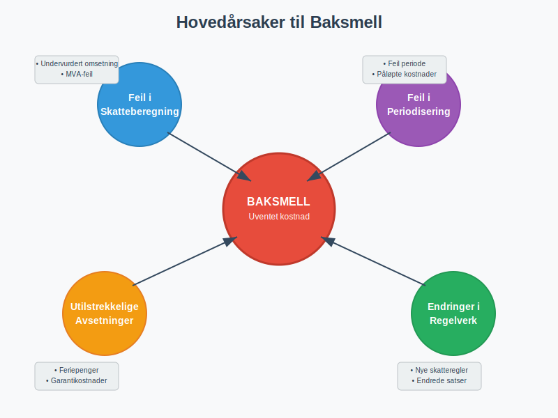
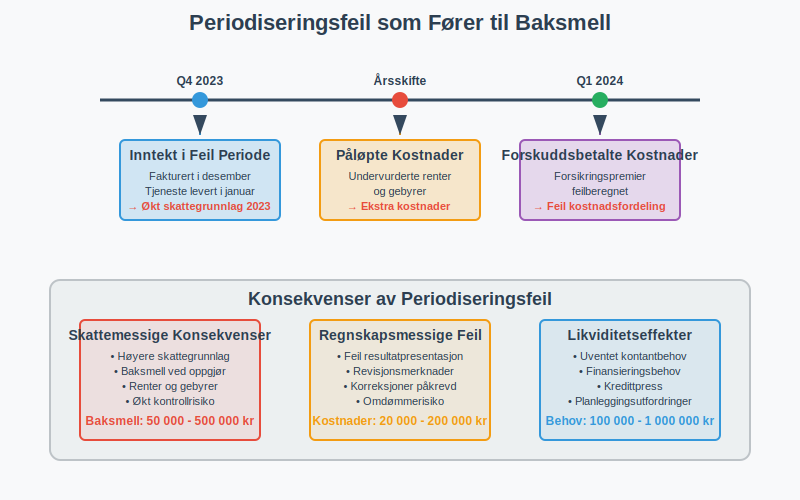
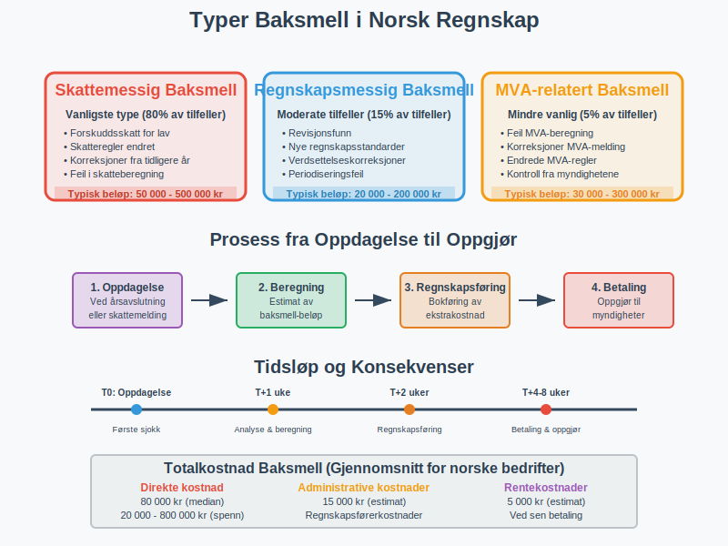
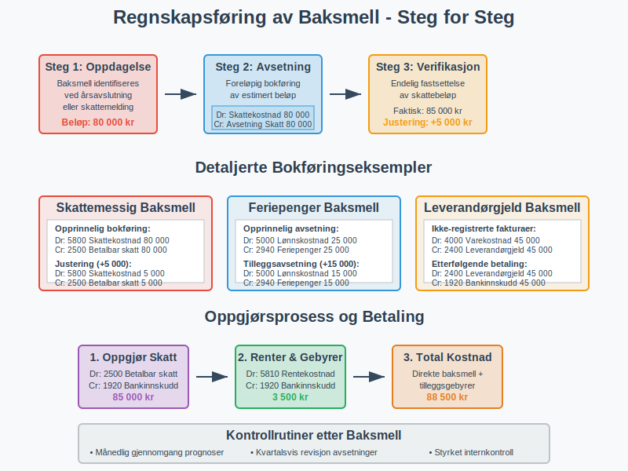
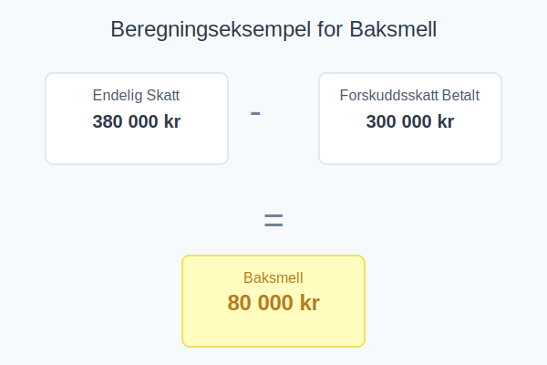
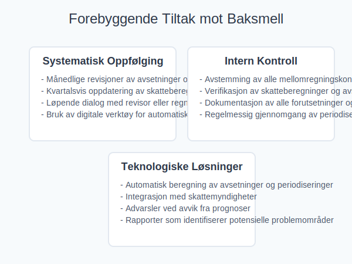
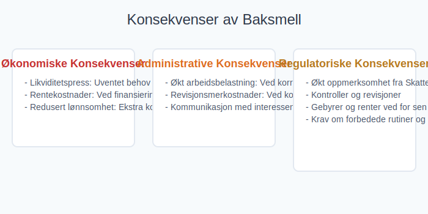
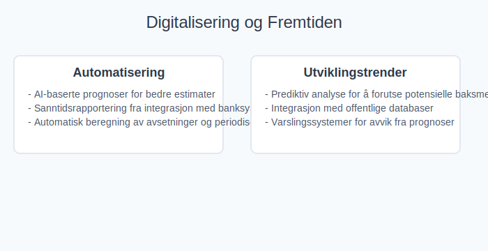
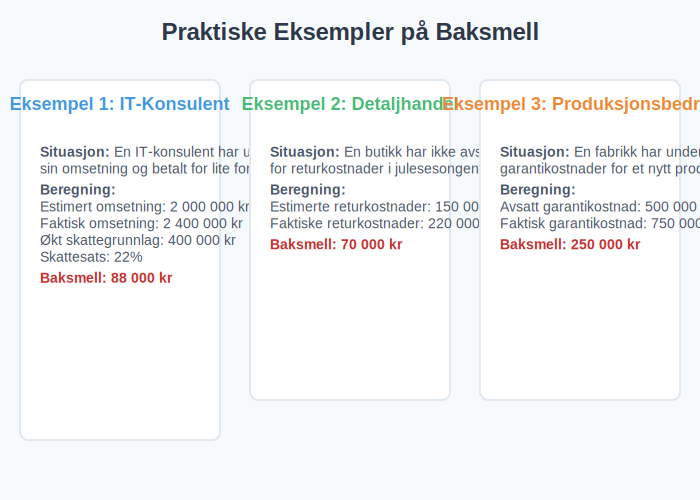

---
title: "Baksmell i Regnskap og Skatt"
meta_title: "Baksmell i Regnskap og Skatt"
meta_description: '**Baksmell** er en ekstra skattekostnad eller regnskapsjustering som oppstår når **forskuddsbetalinger**, **avsetninger** eller **periodiseringer** ikke dekke...'
slug: baksmell
type: blog
layout: pages/single
---

**Baksmell** er en ekstra skattekostnad eller regnskapsjustering som oppstår når **forskuddsbetalinger**, **avsetninger** eller **periodiseringer** ikke dekker den faktiske skatten eller kostnaden ved likningsoppgjøret. Dette fører til en uventet ekstrakostnad som kan påvirke virksomhetens [likviditet](/blogs/regnskap/hva-er-likviditet "Hva er Likviditet? Måling og Styring av Betalingsevne") og økonomiske planlegging.


## Hva er Baksmell?

Baksmell er en **norsk regnskapsterminologi** som beskriver situasjoner hvor virksomheten får en uventet ekstrakostnad ved [skatteoppgjøret](/blogs/regnskap/skatteoppgjor "Skatteoppgjør Guide: Prosess, Tidslinje og Viktige Frister") eller **årsavslutningen**. Begrepet brukes når den faktiske skatten eller kostnaden overstiger det som tidligere er beregnet og avsatt.

### Definisjonen av Baksmell

Baksmell oppstår når:

* **[Forskuddsskatt](/blogs/regnskap/hva-er-forskuddsskatt "Hva er Forskuddsskatt? Beregning og Innbetaling")** eller [forskuddstrekk](/blogs/regnskap/hva-er-forskuddstrekk "Hva er Forskuddstrekk? Beregning og Innbetaling") har vært **for lavt beregnet**
* **[Avsetninger](/blogs/regnskap/avsetning "Avsetning i Regnskap - Komplett Guide til Avsetninger og Estimater")** for kostnader eller [periodisering](/blogs/regnskap/hva-er-periodisering "Hva er Periodisering? Prinsipper og Eksempler i Regnskap") har vært **utilstrekkelige**
* **Skjulte feil** i regnskapsføringen har ført til **underrapportering** av skattegrunnlag
* **Endringer i regelverk** som påvirker skatteberegningen etter at avsetninger er gjort



## Årsaker til Baksmell

### 1. Feil i Skatteberegninger

De vanligste årsakene til baksmell relatert til **skatteberegninger** inkluderer:

* **Undervurdering av [omsetning](/blogs/regnskap/hva-er-omsetning "Hva er Omsetning? Beregning og Regnskapsføring")** ved prognostisering
* **Overvurdering av fradragsberettigede kostnader**
* **Manglende hensyn til skattemessige justeringer**
* **Feil i beregning av [mva](/blogs/regnskap/hva-er-moms-mva "Hva er Merverdiavgift (MVA)? Beregning og Regnskapsføring")**

### 2. Utilstrekkelige Avsetninger

Virksomheter kan få baksmell på grunn av **mangelfulle avsetninger** for:

| Avsetningstype | Typiske Feil | Konsekvenser |
|----------------|--------------|--------------|
| **Feriepenger** | Undervurdering av opptjening | Ekstra lønnskostnader |
| **Bonuser** | Manglende prognostisering | Uventede personalkostnader |
| **Leverandørgjeld** | Ikke-fakturerte leveranser | Økte driftskostnader |
| **Garantikostnader** | Undervurdert garantiforpliktelse | Ekstra servicekostnader |

### 3. Periodiseringsfeil

**[Periodisering](/blogs/regnskap/hva-er-periodisering "Hva er Periodisering? Prinsipper og Eksempler i Regnskap")** kan føre til baksmell når:

* **Inntekter** er periodisert til feil periode
* **Kostnader** ikke er korrekt fordelt over perioder
* **Påløpte renter** eller gebyrer er undervurdert
* **Forsikringspremier** eller andre forhåndsbetalte kostnader er feilberegnet



## Typer Baksmell

### Skattemessig Baksmell

Dette er den vanligste formen for baksmell og oppstår ved:

* **[Skattemelding](/blogs/regnskap/skattemelding "Skattemelding - Komplett Guide til Utfylling og Innlevering")** viser høyere skatt enn beregnet
* **Endringer i skatteregler** som ikke er reflektert i avsetninger
* **Korreksjoner av tidligere års** skattegrunnlag

### Regnskapsmessig Baksmell

Oppstår ved **[årsavslutning](/blogs/regnskap/hva-er-aarsavslutning "Hva er Årsavslutning? Steg for Steg Guide til Årsavslutning")** når:

* **Revisjonen** avdekker feil i regnskapet
* **Nye regnskapsstandarder** krever justeringer
* **Verdsettelse av eiendeler** må korrigeres

### MVA-relatert Baksmell

Kan oppstå ved:

* **Feil i [mva-beregninger](/blogs/regnskap/hva-er-moms-mva "Hva er Merverdiavgift (MVA)? Beregning og Regnskapsføring")**
* **Korreksjoner av tidligere MVA-meldinger**
* **Endringer i MVA-regler**



## Regnskapsføring av Baksmell

### Grunnleggende Bokføring

Ved oppdagelse av baksmell bokføres dette vanligvis som:

```text
Debet: Relevant kostnadskonto (resultatkonto)
Kredit: Avsetning/Gjeld (balansekonto)
```

**Eksempel på skatterelatert baksmell:**

```text
Debet: Skattekostnad                 100 000 kr
Kredit: Betalbar skatt              100 000 kr
```

### Spesifikke Kontoeringsprinsipper

| Baksmell-type | Debet-konto | Kredit-konto | Kommentar |
|---------------|-------------|--------------|-----------|
| **Skatt** | [2500 Betalbar skatt ikke utlignet](/blogs/kontoplan/2500-betalbar-skatt-ikke-utlignet "Konto 2500: Betalbar Skatt Ikke Utlignet") | Bankkonto | Ved betaling |
| **Feriepenger** | [2940 Feriepenger](/blogs/kontoplan/2940-feriepenger "Konto 2940: Feriepenger") | Lønnskostnad | Korrigering |
| **Leverandørgjeld** | [2400 Leverandørgjeld](/blogs/kontoplan/2400-leverandorgjeld "Konto 2400: Leverandørgjeld") | Varekostnad | Påløpte kostnader |

### Oppgjørspostering

Etter at baksmellen er betalt eller oppgjort:

```text
Debet: Avsetning/Gjeld (balansekonto)
Kredit: Bank/Kasse (balansekonto)
```



## Hvordan Beregne og Estimere Baksmell

### Prognostiseringsmodeller

For å **forutse** potensielle baksmell kan virksomheter bruke:

* **Rullende prognoser** basert på løpende resultater
* **Scenarioanalyser** med ulike antagelser
* **Historiske data** og trendanalyser
* **Benchmarking** mot sammenlignbare virksomheter

### Beregningseksempel

**Situasjon:** Et firma har betalt 300 000 kr i forskuddsskatt, men den endelige skatten blir 380 000 kr.

**Beregning av baksmell:**
```
Endelig skatt:           380 000 kr
Forskuddsskatt betalt: - 300 000 kr
Baksmell:              =  80 000 kr
```

**Regnskapsføring:**
```
Debet: Skattekostnad     80 000 kr
Kredit: Betalbar skatt   80 000 kr
```



## Forebyggende Tiltak

### Systematisk Oppfølging

**Best practices** for å unngå baksmell:

* **Månedlige revisjoner** av avsetninger og prognoser
* **Kvartalsvis oppdatering** av skatteberegninger
* **Løpende dialog** med revisor eller regnskapsfører
* **Bruk av digitale verktøy** for automatisk beregning

### Intern Kontroll

Etabler **kontrollrutiner** for:

* **[Avstemming](/blogs/regnskap/hva-er-avstemming "Hva er Avstemming? Prosess og Beste Praksis")** av alle mellomregningskontoer
* **Verifikasjon** av skatteberegninger og avsetninger
* **Dokumentasjon** av alle forutsetninger og antagelser
* **Regelmessig gjennomgang** av periodiseringer



### Teknologiske Løsninger

Moderne **regnskapssystemer** kan bidra til å redusere baksmell ved:

* **Automatisk beregning** av avsetninger
* **Integrasjon** med skattemyndigheter
* **Advarsler** ved avvik fra prognoser
* **Rapporter** som identifiserer potensielle problemområder

## Konsekvenser av Baksmell

### Økonomiske Konsekvenser

Baksmell kan påvirke virksomheten på flere måter:

* **[Likviditetspress](/blogs/regnskap/hva-er-likviditet "Hva er Likviditet? Måling og Styring av Betalingsevne"):** Uventet behov for kontanter
* **Rentekostnader:** Ved finansiering av baksmell
* **Redusert [lønnsomhet](/blogs/regnskap/hva-er-profitt "Hva er Profitt? Beregning og Forbedring av Lønnsomhet"):** Ekstra kostnader påvirker resultatet

### Administrative Konsekvenser

* **Økt arbeidsbelastning** ved korreksjoner og oppfølging
* **Revisjonsmerkostnader** ved komplekse korreksjoner
* **Kommunikasjon** med interessenter om avvik

### Regulatoriske Konsekvenser

Ved betydelige baksmell kan virksomheten risikere:

* **Økt oppmerksomhet** fra Skatteetaten
* **Kontroller** og revisjoner
* **Gebyrer** og renter ved for sen betaling
* **Krav om forbedrede rutiner** og kontroller



## Bransjespesifikke Utfordringer

### Bygge- og Anleggsbransjen

Særlige utfordringer med baksmell på grunn av:

* **Prosjektbasert [virksomhet](/blogs/regnskap/hva-er-foretak "Hva er Foretak? Organisasjonsformer og Regnskapsplikt")**
* **Lange [avskrivningsperioder](/blogs/regnskap/hva-er-avskrivning "Hva er Avskrivning? Metoder og Beregning")**
* **Komplekse kostnadsellementer**

### Detaljhandel

Utfordringer knyttet til:

* **Sesongvariasjoner** i omsetning
* **[Varelager](/blogs/regnskap/hva-er-varelager "Hva er Varelager? Verdivurdering og Regnskapsføring")**-svingninger
* **Kompleks MVA-behandling**

### Tjenesteyting

Spesielle hensyn for:

* **[Opptjent ikke fakturert](/blogs/kontoplan/1530-opptjent-ikke-fakturert-inntekt "Konto 1530: Opptjent Ikke Fakturert Inntekt")** inntekt
* **Personalkostnader** og feriepenger
* **Prosjektbaserte inntekter**

## Digitalisering og Fremtiden

### Automatisering

Moderne teknologi bidrar til å redusere baksmell ved:

* **AI-baserte prognoser** for bedre estimater
* **Sanntidsrapportering** fra integrasjon med banksystemer
* **Automatisk beregning** av avsetninger og periodiseringer

### Utviklingstrender

Fremtidens regnskapssystemer vil fokusere på:

* **Prediktiv analyse** for å forutse potensielle baksmell
* **Integrasjon** med offentlige databaser
* **Varslingssystemer** for avvik fra prognoser



## Praktiske Eksempler

### Eksempel 1: IT-Konsulent

**Situasjon:** En IT-konsulent har undervurdert sin omsetning og betalt for lite forskuddsskatt.

**Beregning:**
- Estimert omsetning: 2 000 000 kr
- Faktisk omsetning: 2 400 000 kr
- Økt skattegrunnlag: 400 000 kr
- Skattesats: 22%
- **Baksmell:** 88 000 kr

### Eksempel 2: Detaljhandel

**Situasjon:** En butikk har ikke avsatt nok for returkostnader i julesesongen.

**Beregning:**
- Estimerte returkostnader: 150 000 kr
- Faktiske returkostnader: 220 000 kr
- **Baksmell:** 70 000 kr

### Eksempel 3: Produksjonsbedrift

**Situasjon:** En fabrikk har undervurdert garantikostnader for et nytt produkt.

**Beregning:**
- Avsatt garantikostnad: 500 000 kr
- Faktisk garantikostnad: 750 000 kr
- **Baksmell:** 250 000 kr



## Relaterte Artikler

For å lære mer om emner som henger sammen med baksmell, se også:

* **[Skattemelding](/blogs/regnskap/skattemelding "Skattemelding - Komplett Guide til Utfylling og Innlevering")**
* **[Forskuddsskatt](/blogs/regnskap/hva-er-forskuddsskatt "Hva er Forskuddsskatt? Beregning og Innbetaling")**
* **[Periodisering](/blogs/regnskap/hva-er-periodisering "Hva er Periodisering? Prinsipper og Eksempler i Regnskap")**
* **[Avsetning](/blogs/regnskap/avsetning "Avsetning i Regnskap - Komplett Guide til Avsetninger og Estimater")**
* **[Årsavslutning](/blogs/regnskap/hva-er-aarsavslutning "Hva er Årsavslutning? Steg for Steg Guide til Årsavslutning")**
* **[Betalbar skatt](/blogs/regnskap/betalbar-skatt "Betalbar Skatt: Beregning og Regnskapsføring")**
* **[Mva](/blogs/regnskap/hva-er-moms-mva "Hva er Merverdiavgift (MVA)? Beregning og Regnskapsføring")**
* **[Likviditet](/blogs/regnskap/hva-er-likviditet "Hva er Likviditet? Måling og Styring av Betalingsevne")**
* **[Fremførbart underskudd](/blogs/regnskap/fremforbart-underskudd "Fremførbart underskudd: Komplett guide til håndtering av underskudd i regnskap og skatt")**
* **[Restskatt](/blogs/regnskap/restskatt "Restskatt “ Hva er restskatt og hvordan beregnes den?")**

## Oppsummering

**Baksmell** er en viktig konsept innen **norsk regnskap og skatt** som kan påvirke virksomheters økonomi betydelig. Ved å forstå årsaker, implementere forebyggende tiltak og ha gode rutiner for regnskapsføring kan virksomheter **minimere risikoen** for uventede ekstrakostnader.

**Nøkkelpunkter for å unngå baksmell:**

* **Regelmessig oppfølging** av prognoser og avsetninger
* **Kvalitetssikring** av skatteberegninger
* **Bruk av moderne teknologi** for automatisering
* **Tett samarbeid** med fagekspertise
* **Kontinuerlig forbedring** av interne rutiner

Ved å ta hensyn til disse faktorene kan virksomheter sikre mer **nøyaktig finansiell rapportering** og unngå de negative konsekvensene som baksmell kan medføre.


