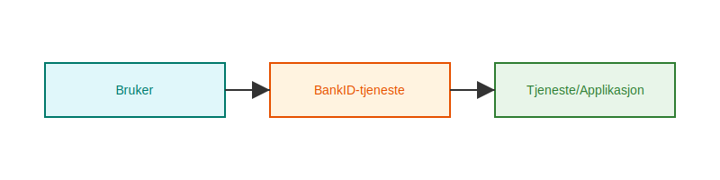
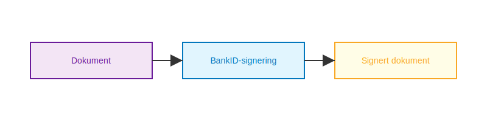

---
title: "Hva er BankID?"
meta_title: "Hva er BankID?"
meta_description: 'BankID er **den mest brukte digitale identitets- og signaturløsningen** i Norge, og spiller en sentral rolle innen **regnskap**, **banktjenester** og **offentl...'
slug: bankid
type: blog
layout: pages/single
---

BankID er **den mest brukte digitale identitets- og signaturløsningen** i Norge, og spiller en sentral rolle innen **regnskap**, **banktjenester** og **offentlige systemer**. Med BankID kan brukere autentisere seg sikkert og signere dokumenter elektronisk, noe som forenkler arbeidsflyter og ivaretar strenge sikkerhetskrav.

Les mer om [Bedriftsbank](/blogs/regnskap/bedriftsbank "Bedriftsbank - Oversikt over banktjenester for bedrifter og regnskapsintegrasjon") for en komplett oversikt over bedriftens banktjenester og bruk av BankID.

## Historikk og utvikling

BankID ble introdusert i 2003 gjennom et samarbeid mellom flere norske banker. Målet var å etablere en felles, pålitelig infrastruktur for **elektronisk identifikasjon** (eID). Siden lanseringen har løsningen gjennomgått flere oppgraderinger for å møte nye krav innen **personvern** og **IT-sikkerhet**, samt for å støtte avansert funksjonalitet som mobil signering.

## Typer BankID

| Type BankID               | Beskrivelse                                               |
|---------------------------|-----------------------------------------------------------|
| **BankID på mobil**       | Autentisering via mobilnummer og engangskoder i app.      |
| **BankID med programvare**| Programvarebasert løsning for PC og mobil.                |
| **BankID med kodebrikke** | Fysisk enhet som genererer engangskoder offline.          |

## Bruksområder i regnskapssystemer

BankID integreres i moderne regnskapssystemer for å sikre at **autoriserte brukere** har riktig tilgang og for å muliggjøre **digitale signaturer** på regnskapsbilag.

- **Innlogging og brukeradministrasjon**: Beskytter sensitive data i regnskapssystemet.
- **Elektronisk signering**: Digital godkjenning av årsregnskap, kontrakter og bilag.
- **Automatisert rapportering** til [Altinn](/blogs/regnskap/hva-er-altinn "Hva er Altinn? En komplett guide til offentlige tjenester i Norge") og [eFaktura](/blogs/regnskap/hva-er-efaktura "Hva er eFaktura? Veiledning til elektronisk fakturahåndtering").
- **API-integrasjon** via [Open Banking](/blogs/regnskap/hva-er-open-banking "Hva er Open Banking? Oversikt over åpne bank-APIer") og [API-integrasjon og automatisering](/blogs/regnskap/api-integrasjon-automatisering-regnskap "API-integrasjon og automasjon i regnskap").

## Autentiseringsflyt

## Signeringsflyt

## Sikkerhet og personvern

BankID er underlagt både norske og europeiske regelverk, blant annet **eIDAS** og **GDPR**, noe som sikrer at alle transaksjoner og personopplysninger håndteres sikkert og i henhold til lov.

| Regelverk | Fokusområde                                  |
|-----------|-----------------------------------------------|
| eIDAS     | EU-rammeverk for elektronisk identitet        |
| GDPR      | Personvern og databeskyttelse                 |

For mer om sikkerhet, se [Hva er tofaktorautentisering?](/blogs/regnskap/hva-er-tofaktorautentisering "Hva er Tofaktorautentisering? Hvordan styrke sikkerheten med 2FA").

## Fordeler og utfordringer

**Fordeler:**
- Økt sikkerhet og brukertillit.
- Raskere og mer effektive arbeidsprosesser.
- Reduserte kostnader knyttet til papirdokumenter.

*Utfordringer:*
- Avhengighet av ekstern infrastruktur.
- Behov for brukeropplæring.
- HÃ¥ndtering av tekniske feil og support.

## Veien videre

BankID forventes å utvikle seg med nye funksjoner som **biometrisk autentisering** og utvidet støtte for digitale signaturer i flere juridiske dokumenter. Regnskapsførere og økonomimedarbeidere må derfor følge med på utviklingen for å utnytte potensialet fullt ut.

