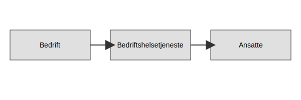

---
title: "Bedriftshelsetjeneste"
meta_title: "Bedriftshelsetjeneste"
meta_description: '**Bedriftshelsetjeneste** er en lovpålagt [Helse, miljø og sikkerhet (HMS)](/blogs/regnskap/hms "Helse, miljø og sikkerhet (HMS)")-tjeneste i Norge som har s...'
slug: bedriftshelsetjeneste
type: blog
layout: pages/single
---

**Bedriftshelsetjeneste** er en lovpålagt [Helse, miljø og sikkerhet (HMS)](/blogs/regnskap/hms "Helse, miljø og sikkerhet (HMS)")-tjeneste i Norge som har som formål å forebygge arbeidsrelaterte sykdommer og skader. Tjenesten yter faglig støtte til virksomheter og ansatte innenfor ulike bransjer, og arbeider tett med både ledelse og arbeidsmiljøutvalg.

## 1. Hva er Bedriftshelsetjeneste?

Bedriftshelsetjeneste (BHT) er et eksternt fagmiljø med tverrfaglig kompetanse innen medisin, yrkeshygiene, ergonomi og psykososialt arbeidsmiljø. BHT skal bistå virksomheter med kartlegging, risikovurdering og oppfølging av arbeidsmiljøet.

## 2. Lovgrunnlag

Bedriftshelsetjeneste er regulert i **arbeidsmiljøloven** § 3-3 og tilhørende forskrift om **arbeidsmiljø, sikkerhet og helse** (internkontrollforskriften). Nedenfor er en oversikt over krav til virksomheter:

| Antall ansatte | Krav til BHT-tilknytning            | Kommentar                     |
|---------------:|-------------------------------------|-------------------------------|
| 50+            | Obligatorisk                        | Alle virksomheter med 50 eller flere ansatte må tilknytte BHT |
| 20–49          | Obligatorisk ved særlig risiko      | Når arbeidsmiljøet utgjør høy risiko for helse eller sikkerhet |
| Under 20       | Anbefalt, men ikke pålagt           | Mindre virksomheter oppfordres til å benytte BHT frivillig     |

## 3. Tjenester og oppgaver

BHT tilbyr en rekke tjenester tilpasset virksomhetens behov:

* **Helseundersøkelser:** Systematiske legesjekker og arbeidsmedisinske vurderinger
* **Kartlegging av arbeidsmiljø:** Måling av støy, kjemikalier, belastningsskader og psykososiale forhold
* **Risikostyring:** Analyser, handlingsplaner og oppfølging av tiltak
* **Opplæring og veiledning:** Kurs i ergonomi, førstehjelp og HMS-ledelse
* **Internkontrollstøtte:** Bidra til dokumentasjon og prosesser i [Hva er internkontroll?](/blogs/regnskap/hva-er-internkontroll "Hva er internkontroll? Komplett Guide til Internkontroll i Norge")

## 4. Samarbeid med AMU og Internkontroll

> Samarbeid med [Arbeidsmiljøutvalg (AMU)](/blogs/regnskap/amu "AMU (Arbeidsmiljøutvalg) – Komplett Guide til Arbeidsmiljøutvalg i Norge") og integrering i virksomhetens internkontrollsystem er avgjørende for et helhetlig HMS-arbeid.

## 5. Fordeler ved Bedriftshelsetjeneste

Ved en aktiv BHT-tilknytning får virksomheten:

* **Forebygging:** Redusert sykefravær og bedre arbeidsmiljø
* **Konkurransefortrinn:** Livskraftige, robuste ansatte og omdømme
* **Lovoppfyllelse:** Sikring av krav i arbeidsmiljøloven og forskrifter
* **Dokumentasjon:** Systematisk oppfølging av helse og sikkerhet for intern og ekstern rapportering

## 6. Kostnader og finansiering

| Type kostnad           | Beskrivelse                              |
|------------------------|------------------------------------------|
| Årsavgift              | Fast pris basert på antall ansatte        |
| Konsulenttimer         | Timepriser for prosjekter og kartlegging  |
| Kurs og opplæring      | Pakker eller enkeltkurs                   |

## 7. Illustrasjon: Roller i Bedriftshelsetjeneste

## 8. Hvordan etablere bedriftshelsetjeneste

For å etablere BHT i din virksomhet kan du følge disse trinnene:

1. Kartlegg behov og risiko
2. Anskaff dokumentasjon på tjenesteyterens godkjenning
3. Inngå avtale om omfang og tjenester
4. Integrer BHT i internkontroll og AMU
5. Evaluer og revider årlig

For mer om internkontroll og HMS, se [Hva er internkontroll?](/blogs/regnskap/hva-er-internkontroll "Hva er internkontroll? Komplett Guide til Internkontroll i Norge").

## 9. Regnskapsføring av utgifter til Bedriftshelsetjeneste

Når du fører regnskap for kostnader knyttet til **bedriftshelsetjeneste**, er det viktig å klassifisere utgiftene riktig:

| Konto | Beskrivelse                             | Regnskapstype    |
|-------|-----------------------------------------|------------------|
| 6900  | Annen driftskostnad, tjenester          | Driftskostnader  |
| 6800  | Annen personalkostnad, HMS-tiltak       | Personalkostnad  |
| 7300  | Investeringer i HMS-utstyr og opplæring | Immaterielle eiendeler (evt. avskrivning) |

Disse kostnadene kan også påvirke [personalkostnader](/blogs/regnskap/hva-er-personalkostnad "Hva er personalkostnad? Komplett Guide til Personalkostnader") og [driftskostnader](/blogs/regnskap/hva-er-driftskostnader "Hva er driftskostnader? Komplett Guide til Driftskostnader").

## 10. Skattefradrag og økonomiske insentiver

Bedriftshelsetjeneste-utgifter gir vanligvis **fradragsrett** som driftskostnader. Ifølge [skatteloven](/blogs/regnskap/hva-er-skatt "Hva er skatt? Komplett Guide til Skatteregler i Norge") kan virksomheter kreve fradrag for:

* Utgifter til helseundersøkelser og kartlegging
* Kurs i HMS og ergonomi
* Risikovurderinger og tiltaksplaner

Se [Hva er fradrag?](/blogs/regnskap/hva-er-fradrag "Hva er fradrag? Komplett Guide til Fradragsmuligheter") for mer informasjon om fradragsmuligheter.

## 11. Digitalisering og verktøy

Moderne bedriftshelsetjenester tilbyr digitale løsninger som:

* **Nettbaserte** helseundersøkelser og spørreskjemaer
* Mobilapper for intern HMS-rapportering
* Dashboard for risikoområder og statistikk
* Integrasjon med [API-integrasjon, automatisering og regnskap](/blogs/regnskap/api-integrasjon-automatisering-regnskap "API-integrasjon, automatisering og regnskap") for sømløs dataflyt

Dette effektiviserer både administrasjon og oppfølging av HMS-arbeidet.

## 12. Vanlige utfordringer og løsninger

| Utfordring                              | Løsning                                       |
|-----------------------------------------|-----------------------------------------------|
| Lav deltakelse blant ansatte            | **Kommunikasjonsplan** og motivasjonskampanjer |
| Uklare ansvarsforhold                   | Definere roller i AMU og ledelse              |
| Manglende dokumentasjon                 | Implementere digitale **dokumentasjonssystemer** |
| Kostnadsbegrensninger                   | Velge modulbaserte tjenester                  |

For mer om roller i bedriftshelsetjenesten, se [Roller i Bedriftshelsetjeneste](bedriftshelsetjeneste-roller.svg).

## 13. Fremtidige trender i Bedriftshelsetjeneste

Utviklingen innen bedriftshelsetjeneste styres av:

* **Telemedisin** og virtuelle konsultasjoner
* Økt bruk av **wearables** for helsedata
* Kunstig intelligens i risikovurdering
* Fokus på psykisk helse og stressmestring
* Tverrfaglige team og partnernettverk

## 14. Oppsummering

Bedriftshelsetjeneste er en sentral del av **HMS-arbeidet** i norske virksomheter. En helhetlig tilnærming inkluderer:

* Riktig regnskapsføring og skattefradrag
* Tett samarbeid med AMU og internkontroll
* Digitalisering for bedre oppfølging
* Klare roller og ansvarsforhold
* Kontinuerlig evaluering av tiltak

Ved å følge beste praksis kan virksomheter redusere risiko, forbedre arbeidsmiljø og oppnå lovpålagt etterlevelse.
