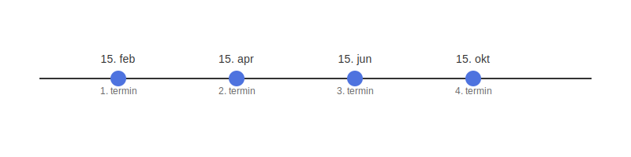

---
title: "Betalbar skatt"
meta_title: "Betalbar skatt"
meta_description: '**Betalbar skatt** er det beløpet en virksomhet må betale i [firmaskatt](/blogs/regnskap/firmaskatt "Firmaskatt “ Komplett guide til skatteregler for selska...'
slug: betalbar-skatt
type: blog
layout: pages/single
---

**Betalbar skatt** er det beløpet en virksomhet må betale i [firmaskatt](/blogs/regnskap/firmaskatt "Firmaskatt “ Komplett guide til skatteregler for selskaper") (også kalt **selskapsskatt**) basert på det skattemessige resultatet. Dette er den **faktiske skatteforpliktelsen** som føres som gjeld i balansen og forfaller til betaling når [skattemeldingen](/blogs/regnskap/skattemelding "Skattemelding - Komplett Guide til Utfylling og Innlevering") er behandlet.

## Hva er betalbar skatt?
Begrepet **betalbar skatt** beskriver den delen av selskapsskatten som bedriften er forpliktet til å betale i en gitt periode. Den avviker ofte fra skattekostnaden i resultatregnskapet på grunn av [**midlertidige forskjeller**](/blogs/regnskap/midlertidige-forskjeller "Midlertidige forskjeller i regnskap “ Forklaring og Eksempler"), [utsatt skatt](/blogs/regnskap/hva-er-utsatt-skatt "Hva er Utsatt Skatt? Beregning og Regnskapsføring") og forskuddsskatt.

## Nøkkelkomponenter i betalbar skatt

* **Skattemessig resultat**: Selskapsresultatet justert for fradrag, avskrivninger og eventuelle tilleggsposter ([alminnelig inntekt](/blogs/regnskap/alminnelig-inntekt "Alminnelig inntekt “ Komplett guide til skattemessig resultat og beregning")).
* **Skattesats**: Den gjeldende satsen for selskapsskatt (**22 %** per 2024).
* **Forskuddsskatt**: Beløp som er betalt forskuddsvis gjennom året og som motregnes i betalbar skatt. Les mer om [forskuddsskatt](/blogs/regnskap/hva-er-forskuddsskatt "Hva er Forskuddsskatt? Beregning og Innbetaling").
* **Utsatt skatt**: Midlertidige forskjeller mellom regnskapsmessig og skattemessig resultat som utløser skattebetaling i fremtiden ([utsatt skatt](/blogs/regnskap/hva-er-utsatt-skatt "Hva er Utsatt Skatt? Beregning og Regnskapsføring")).

## Beregning av betalbar skatt

| **Element**             | **Beskrivelse**                                                                                  |
|-------------------------|--------------------------------------------------------------------------------------------------|
| Skattemessig resultat   | [Alminnelig inntekt](/blogs/regnskap/alminnelig-inntekt "Alminnelig inntekt “ Komplett guide til skattemessig resultat og beregning") |
| × Skattesats (22 %)     | Gjeldende selskapsskattesats                                                                     |
| − Forskuddsskatt        | Sum betalte forskuddsskatter i perioden                                                         |
| **= Betalbar skatt**    | Faktisk beløp virksomheten skal betale i skatt                                                   |

## Betalbar skatt i regnskapet

Betalbar skatt føres som en kortsiktig gjeldspost i balansen under **kortsiktig gjeld**. Når [skatteoppgjøret](/blogs/regnskap/skatteoppgjor "Skatteoppgjør Guide: Prosess, Tidslinje og Viktige Frister") er klart, vil faktisk betaling redusere denne gjeldsposten.

## Eksempel på beregning

La oss se et forenklet eksempel:

| Post                    | Beløp         |
|-------------------------|---------------|
| Alminnelig inntekt      | 500 000 kr    |
| × Skattesats (22 %)     | 110 000 kr    |
| − Forskuddsskatt        | 80 000 kr     |
| **Betalbar skatt**      | **30 000 kr** |

## Skattebetalingsfrister

Forskuddsskatt for aksjeselskaper fordeles vanligvis i fire terminer:

| **Termin**   | **Frist**      |
|-------------|----------------|
| 1. termin   | 15. februar    |
| 2. termin   | 15. april      |
| 3. termin   | 15. juni       |
| 4. termin   | 15. oktober    |

## Regnskapsføring av betalbar skatt

Betalbar skatt bokføres som en kortsiktig gjeldspost i balansen, for eksempel på [konto 2500 - Betalbar skatt, ikke utlignet](/blogs/kontoplan/2500-betalbar-skatt-ikke-utlignet "Konto 2500 - Betalbar skatt, ikke utlignet"). Når [skatteoppgjøret](/blogs/regnskap/skatteoppgjor "Skatteoppgjør Guide: Prosess, Tidslinje og Viktige Frister") finner sted, reduseres denne gjeldsposten mot bankinnskudd.

### Eksempel bokføring ved terminbetaling

| **Dato**    | **Konto Debet**                               | **Konto Kredit**                         | **Beløp**   |
|-------------|-----------------------------------------------|------------------------------------------|-------------|
| 15. april   | 2500 Betalbar skatt, ikke utlignet            | 1920 Bankinnskudd                        | 80 000 kr   |

## Vanlige utfordringer og tips

* **Forsinkelsesgebyr** ved manglende betaling gir ekstra kostnader og bør unngås.
* **Periodisering**: Sørg for å periodisere kostnaden riktig i resultatregnskapet for å samsvare med driftsresultatet.
* **Sammenheng med utsatt skatt**: Forstå forskjellen mellom utsatt skatt og betalbar skatt for å unngå overraskelser i balansen.

## Videre lesning

* [Hva er alminnelig inntekt?](/blogs/regnskap/alminnelig-inntekt "Alminnelig inntekt “ Komplett guide til skattemessig resultat og beregning")
* [Hva er utsatt skatt?](/blogs/regnskap/hva-er-utsatt-skatt "Hva er Utsatt Skatt? Beregning og Regnskapsføring")
* [Skattemelding](/blogs/regnskap/skattemelding "Skattemelding - Komplett Guide til Utfylling og Innlevering")
* [Restskatt](/blogs/regnskap/restskatt "Restskatt “ Hva er restskatt og hvordan beregnes den?")
* [Utlignet skatt](/blogs/regnskap/utlignet-skatt "Utlignet skatt “ Forklaring av endelig skatteoppgjør")
* [Konto 2500 - Betalbar skatt, ikke utlignet](/blogs/kontoplan/2500-betalbar-skatt-ikke-utlignet "Konto 2500 - Betalbar skatt, ikke utlignet")
* [Konto 8300 - Betalbar skatt](/blogs/kontoplan/8300-betalbar-skatt "Konto 8300 - Betalbar skatt")
* [Konto 8600 - Betalbar skatt, ekstraordinært resultat](/blogs/kontoplan/8600-betalbar-skatt-ekstraordinart-resultat "Konto 8600 - Betalbar skatt, ekstraordinært resultat")

For en dypere forståelse av relaterte skatteteori og -poster, se også:
* [Hva er alminnelig inntekt?](/blogs/regnskap/alminnelig-inntekt "Alminnelig inntekt “ Komplett guide til skattemessig resultat og beregning")
* [Hva er utsatt skatt?](/blogs/regnskap/hva-er-utsatt-skatt "Hva er Utsatt Skatt? Beregning og Regnskapsføring")
* [Skattemelding](/blogs/regnskap/skattemelding "Skattemelding - Komplett Guide til Utfylling og Innlevering")
* [Restskatt](/blogs/regnskap/restskatt "Restskatt “ Hva er restskatt og hvordan beregnes den?")
* [Utlignet skatt](/blogs/regnskap/utlignet-skatt "Utlignet skatt “ Forklaring av endelig skatteoppgjør")
* [Konto 2500 - Betalbar skatt, ikke utlignet](/blogs/kontoplan/2500-betalbar-skatt-ikke-utlignet "Konto 2500 - Betalbar skatt, ikke utlignet")
* [Konto 8300 - Betalbar skatt](/blogs/kontoplan/8300-betalbar-skatt "Konto 8300 - Betalbar skatt")
* [Konto 8600 - Betalbar skatt, ekstraordinært resultat](/blogs/kontoplan/8600-betalbar-skatt-ekstraordinart-resultat "Konto 8600 - Betalbar skatt, ekstraordinært resultat")

