---
title: "Hva er betalingstjeneste?"
seoTitle: "Hva er betalingstjeneste?"
meta_description: 'En **betalingstjeneste** er en finansiell tjeneste som muliggjør igangsetting, behandling eller fullføring av betalingstransaksjoner mellom betaler og betalin...'
slug: betalingstjeneste
type: blog
layout: pages/single
---

En **betalingstjeneste** er en finansiell tjeneste som muliggjør igangsetting, behandling eller fullføring av betalingstransaksjoner mellom betaler og betalingsmottaker. I det moderne digitale betalingslandskapet omfatter dette alt fra tradisjonelle [bankoverføringer](/blogs/regnskap/hva-er-bankgiro "Hva er BankGiro? Komplett Guide til Norsk Betalingssystem") til avanserte elektroniske tjenester som **PIS** (Payment Initiation Services) og **AIS** (Account Information Services) under [PSD2-direktivet](/blogs/regnskap/hva-er-betalingstjenestedirektivet "Hva er betalingstjenestedirektivet? PSD2 og Norske Regnskapsregler"). 

Betalingstjenester er fundamentet for all kommersiell aktivitet og regnskapsmessig dokumentasjon i moderne næringsliv. De påvirker direkte hvordan bedrifter håndterer [kundefordringer](/blogs/regnskap/hva-er-kundefordring "Hva er Kundefordring? Komplett Guide til Debitorhåndtering"), [leverandørgjeld](/blogs/regnskap/hva-er-leverandorgjeld "Hva er Leverandørgjeld? Komplett Guide til Kreditorhåndtering") og generell [likviditetsstyring](/blogs/regnskap/hva-er-likviditetsstyring "Hva er Likviditetsstyring? Komplett Guide til Kontantstrømstyring").

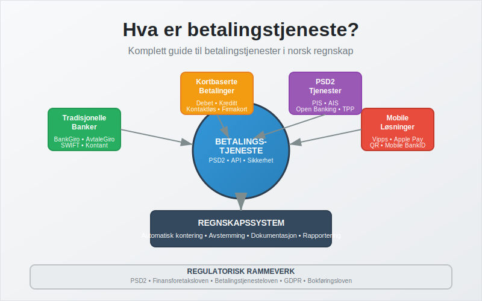

## Seksjon 1: Definisjon og Grunnleggende Konsepter

Betalingstjenester defineres i EU's betalingstjenestedirektiv (PSD2) og implementert i norsk lov gjennom finansforetaksloven og betalingstjenesteloven. En betalingstjeneste er enhver tjeneste som:

* **Iverksetter betalinger:** Starter betalingstransaksjoner på vegne av en betaler
* **Behandler betalinger:** Formidler og prosesserer betalingsinstruksjoner
* **Fullfører betalinger:** Sikrer at betalingen når frem til mottaker

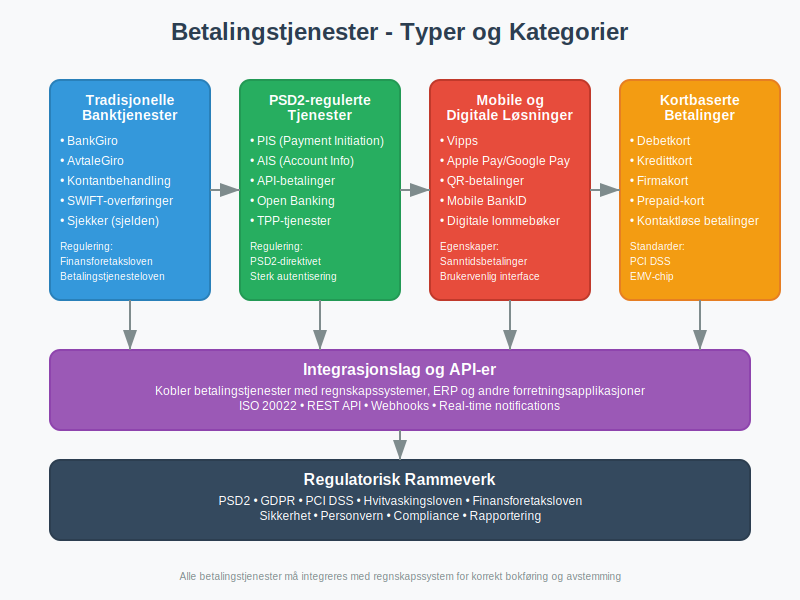

### Juridisk Rammeverk

I Norge reguleres betalingstjenester primært av:

* **Finansforetaksloven:** Hovedloven for finansielle tjenester
* **Betalingstjenesteloven:** Spesifikk regulering av betalingstjenester
* **[PSD2-direktivet](/blogs/regnskap/hva-er-betalingstjenestedirektivet "Hva er betalingstjenestedirektivet? PSD2 og Norske Regnskapsregler"):** EU-direktiv implementert i norsk lov
* **Hvitvaskingsloven:** Krav til kundekontroll og rapportering

Disse reguleringene sikrer at betalingstjenester oppfyller standarder for sikkerhet, transparens og forbrukerbeskyttelse, noe som er essensielt for korrekt regnskapsføring og [internkontroll](/blogs/regnskap/hva-er-internkontroll "Hva er Internkontroll? Komplett Guide til Internkontrollsystemer").

## Seksjon 2: Kategorier av Betalingstjenester

I henhold til PSD2 og norsk lovgivning kan betalingstjenester kategoriseres på flere måter. Dette er viktig for regnskapsmessig behandling og [kontering](/blogs/regnskap/hva-er-kontering "Hva er Kontering? Komplett Guide til Bilagskontering og Bokføring").

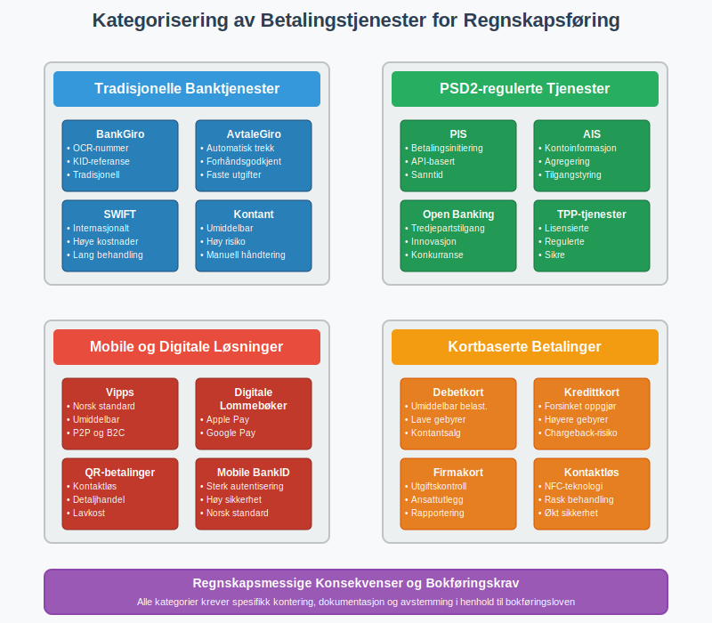

### 2.1 Tradisjonelle Banktjenester

Disse omfatter tjenester som har vært tilgjengelige gjennom banker i årtier:

| Tjenestetype | Norske Eksempler | Regnskapsmessig Behandling |
|--------------|------------------|---------------------------|
| **[BankGiro](/blogs/regnskap/hva-er-bankgiro "Hva er BankGiro? Komplett Guide til Norsk Betalingssystem")** | Tradisjonelle bankoverføringer | Bokføres når transaksjonen registreres i bankkonto |
| **[AvtaleGiro](/blogs/regnskap/hva-er-avtalegiro "Hva er AvtaleGiro? Komplett Guide til Automatisk Betaling")** | Automatisk trekk av faste utgifter | Krever forhåndsgodkjenning og systematisk oppfølging |
| **Sjekker** | Sjelden brukt i Norge i dag | Bokføres ved utstedelse, ikke ved innløsning |
| **Kontantbehandling** | Bankinnskudd, uttak | Krever umiddelbar registrering og [avstemming](/blogs/regnskap/hva-er-avstemming "Hva er Avstemming? Komplett Guide til Regnskapsavstemming") |

### 2.2 PSD2-regulerte Tjenester

Disse moderne tjenestene er spesifikt regulert under det europeiske betalingstjenestedirektivet:

**PIS (Payment Initiation Services):**
* Tjenester som initierer betalinger på vegne av brukere
* Eksempler: API-baserte betalingsløsninger, "Pay by Bank"-knapper
* Regnskapsmessig: Behandles som [banktransaksjoner](/blogs/regnskap/hva-er-banktransaksjoner "Hva er Banktransaksjoner? Typer, Regnskapsføring og Automatisering")

**AIS (Account Information Services):**
* Tjenester som samler kontoinformasjon fra flere banker
* Eksempler: Personlig økonomi-apper, regnskapsintegrasjoner
* Regnskapsmessig: Påvirker ikke direkte bokføring, men forbedrer [avstemming](/blogs/regnskap/hva-er-avstemming "Hva er Avstemming? Komplett Guide til Regnskapsavstemming")

### 2.3 Mobile og Digitale Betalingsløsninger

Disse har revolusjonert betalingslandskapet de siste årene:

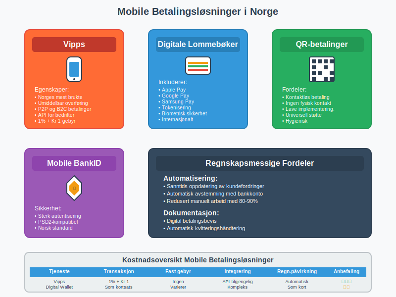

**Norske Mobile Betalingstjenester:**
* **Vipps:** Den dominerende mobile betalingsløsningen i Norge
* **Mobile BankID-betalinger:** Integrert med norske banker
* **QR-kodebetalinger:** Økende popularitet i [detaljhandel](/blogs/regnskap/hva-er-detaljhandel "Hva er Detaljhandel? Komplett Guide til Detaljhandelsregnskap")

**Internasjonale Løsninger:**
* **Apple Pay / Google Pay:** Digitale lommebøker koblet til kort
* **PayPal:** Internasjonal e-handelstjeneste
* **Stripe / Klarna:** Betalingsformidlere for e-handel

### 2.4 Kortbaserte Betalingstjenester

Kortbetalinger utgjør en betydelig del av moderne handelstransaksjoner:

| Korttype | Behandling | Regnskapsmessige Hensyn |
|----------|------------|-------------------------|
| [**Debetkort**](/blogs/regnskap/debetkort "Debetkort? Komplett Guide til Debetkort i Norge") | Umiddelbar belastning | Behandles som kontantsalg i [datakasse](/blogs/regnskap/hva-er-datakasse "Hva er Datakasse? Komplett Guide til Kassasystem, Krav og Regnskapsføring") |
| **Kredittkort** | Forsinket oppgjør | Krever oppfølging av terminoppgjør og gebyrer |
| **Firmakort** | Bedriftsspesifikke kort | Viktig for [ansattutlegg](/blogs/regnskap/ansattutlegg "Ansattutlegg - Komplett Guide til Reiseregninger og Utlegg") og utgiftskontroll |

## Seksjon 3: Teknisk Infrastruktur og Integrasjon

Den tekniske infrastrukturen bak betalingstjenester har utviklet seg dramatisk de siste årene. Moderne betalingssystemer bygger på komplekse nettverk av banker, betalingsformidlere og teknologileverandører.

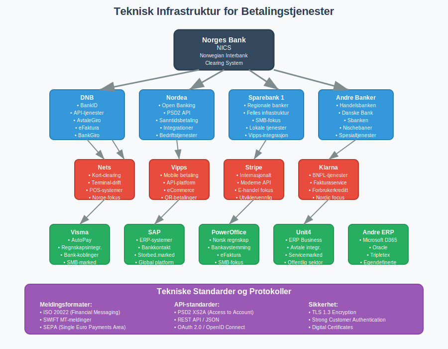

### 3.1 Betalingsinfrastruktur i Norge

**Norges Bank:** 
* Driver NICS (Norwegian Interbank Clearing System)
* Håndterer oppgjør mellom banker
* Sentral for alle større betalingstransaksjoner

**Nets (tidligere BBS):**
* Hovedaktør for kortbetalinger i Norge
* Driver mye av infrastrukturen for [datakasser](/blogs/regnskap/hva-er-datakasse "Hva er Datakasse? Komplett Guide til Kassasystem, Krav og Regnskapsføring")
* Integrert med de fleste regnskapssystemer

**Bankenes rolle:**
* Tilbyr API-er for [elektronisk fakturering](/blogs/regnskap/hva-er-elektronisk-fakturering "Hva er Elektronisk Fakturering? Komplett Guide til Digitale Fakturaløsninger")
* Integrerer med [eFaktura](/blogs/regnskap/hva-er-efaktura "Hva er eFaktura? Komplett Guide til Elektronisk Fakturering i Norge") og [AvtaleGiro](/blogs/regnskap/hva-er-avtalegiro "Hva er AvtaleGiro? Komplett Guide til Automatisk Betaling")
* Tilbyr bedriftsrettede betalingsløsninger

### 3.2 API-integrasjon med Regnskapssystemer

Moderne betalingstjenester integreres direkte med regnskapssystemer gjennom [API-er](/blogs/regnskap/api-integrasjon-automatisering-regnskap "API-integrasjon & Automatisering i Regnskap"):

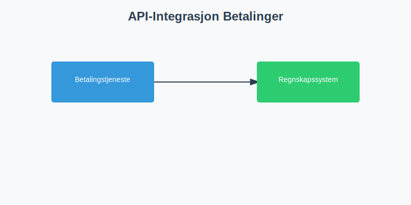

**Fordeler med automatisert integrasjon:**
* Reduserer manuell dataregistrering med opptil 90%
* Minimerer feil i [bilagsføring](/blogs/regnskap/hva-er-bilagsforing "Hva er Bilagsføring? Komplett Guide til Registrering av Regnskapsbilag")
* Sikrer sanntids [avstemming](/blogs/regnskap/hva-er-avstemming "Hva er Avstemming? Komplett Guide til Regnskapsavstemming")
* Forbedrer [kontantstrømstyring](/blogs/regnskap/hva-er-kontantstrom "Hva er Kontantstrøm? Komplett Guide til Kontantstrømanalyse")

**Tekniske standarder:**
* **ISO 20022:** Internasjonal standard for finansielle meldinger
* **PSD2 API-standarder:** Sikrer interoperabilitet
* **Open Banking:** Fremmer innovasjon og konkurranse

## Seksjon 4: Regnskapsføring av Betalingstjenester

Korrekt regnskapsføring av betalingstjenester er avgjørende for [god regnskapsskikk](/blogs/regnskap/god-regnskapsskikk "God Regnskapsskikk - Prinsipper og Praksis i Norge") og etterlevelse av juridiske krav.

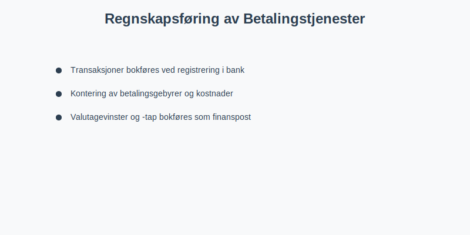

### 4.1 Grunnleggende Bokføringsprinsipper

**Transaksjonstidspunkt:**
* Betalinger bokføres når de registreres i bankkonto
* For kortbetalinger: Ved terminoppgjør, ikke ved salg
* Mobile betalinger: Vanligvis samme dag eller neste virkedag

**[Kontering](/blogs/regnskap/hva-er-kontering "Hva er Kontering? Komplett Guide til Bilagskontering og Bokføring") av betalingsgebyrer:**

| Gebyrtype | Kontotype | Eksempel Kontonummer |
|-----------|-----------|---------------------|
| Kortgebyrer | Finanskostnad | 8050 - Kortgebyrer |
| Bankgebyrer | Finanskostnad | 8070 - Bankgebyrer |
| Vipps-gebyrer | Finanskostnad | 8051 - Mobile betalingsgebyrer |
| API-kostnader | Driftskostnad | 6940 - IT-tjenester |

### 4.2 Spesielle Regnskapsmessige Utfordringer

**Valutabetalinger:**
* Må håndtere [valutakurssvingninger](/blogs/regnskap/hva-er-differanse "Hva er Differanse? Komplett Guide til Differansekontoer")
* Bokføres til kursen på transaksjonstidspunktet
* Kursgevinster/-tap skal bokføres som finanspost

**Forskuddsbetalinger:**
* [Forskuddsbetalinger](/blogs/regnskap/hva-er-forskuddsbetaling "Hva er forskuddsbetaling? Komplett Guide til Forskuddsbetalinger i Regnskap") via betalingstjenester
* Krever spesiell oppfølging og [periodisering](/blogs/regnskap/hva-er-periodisering "Hva er Periodisering? Komplett Guide til Periodisering i Regnskap")

**Tilbakebetaling og reversering:**
* Chargebacks fra kortselskaper
* Feilbetalinger som må korrigeres
* Kan kreve bruk av [kreditnotaer](/blogs/regnskap/hva-er-kreditnota "Hva er en Kreditnota? Komplett Guide til Kreditnotaer i Norge")

### 4.3 Dokumentasjonskrav

I henhold til [bokføringsloven](/blogs/regnskap/hva-er-bokforingsloven "Hva er Bokføringsloven? Komplett Guide til Norsk Bokføringsregulering") må alle betalingstransaksjoner dokumenteres:

**Obligatorisk dokumentasjon:**
* Betalingsbevis fra betalingstjeneste
* Avtaler med betalingsleverandører
* API-logger og transaksjonshistorikk
* Gebyrspesifikasjoner og terminoppgjør

**Oppbevaringstid:**
* Minimum 5 år for regnskapsbilag
* 10 år for kontrakter og avtaler
* Permanent oppbevaring for API-sikkerhetssertifikater

## Seksjon 5: Sikkerhet og Risikostyring

Betalingstjenester håndterer sensitive finansielle data og er derfor underlagt strenge sikkerhetskrav. Dette påvirker også regnskapsmessige kontroller og [internkontrollsystemer](/blogs/regnskap/hva-er-internkontroll "Hva er Internkontroll? Komplett Guide til Internkontrollsystemer").

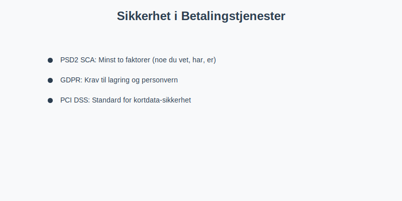

### 5.1 Regulatoriske Sikkerhetskrav

**PSD2 Sterk Kundeautentisering (SCA):**
* Minst to av følgende faktorer: noe du vet, noe du har, noe du er
* Påvirker hvordan betalinger initieres og dokumenteres
* Viktig for sporbarhet i regnskapet

**GDPR og Personvern:**
* Strenge krav til hvordan betalingsdata lagres
* Påvirker oppbevaring av regnskapsbilag
* Krever dokumenterte prosedyrer for datasletting

**PCI DSS (Payment Card Industry Data Security Standard):**
* Obligatorisk for alle som håndterer kortdata
* Påvirker [datakassesystemer](/blogs/regnskap/hva-er-datakasse "Hva er Datakasse? Komplett Guide til Kassasystem, Krav og Regnskapsføring")
* Krever regelmessige sikkerhetstester

### 5.2 Operasjonelle Sikkerhetsrisikoer

**Tekniske risikoer:**
* API-sikkerhet og tilgangskontroll
* Nettverksikkerhet og kryptering
* Systemtilgjengelighet og backup

**Prosessrisikoer:**
* Manglende [avstemming](/blogs/regnskap/hva-er-avstemming "Hva er Avstemming? Komplett Guide til Regnskapsavstemming") av betalinger
* Utilstrekkelig [internkontroll](/blogs/regnskap/hva-er-internkontroll "Hva er Internkontroll? Komplett Guide til Internkontrollsystemer")
* Svak adgangsstyring til betalingssystemer

**Finansielle risikoer:**
* Likviditetsrisiko ved forsinkede oppgjør
* Valutarisiko for internasjonale betalinger
* Kredittrisiko ved forskuddsbetalinger

### 5.3 Kontrollmiljø og Beste Praksis

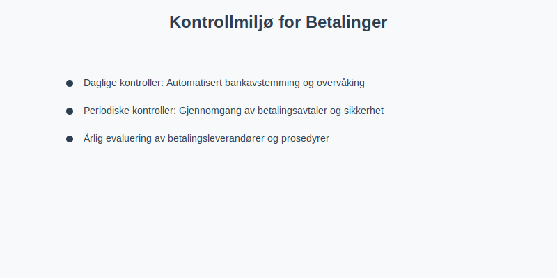

**Daglige kontroller:**
* Automatisert [bankavstemming](/blogs/regnskap/hva-er-bankavstemming "Hva er Bankavstemming? Komplett Guide til Daglig Bankavstemming")
* Overvåking av feilede transaksjoner
* Kontroll av gebyrer og terminoppgjør

**Periodiske kontroller:**
* Månedlig gjennomgang av betalingsavtaler
* Kvartalsvis gjennomgang av sikkerhetsprosedyrer
* Årlig evaluering av betalingsleverandører

## Seksjon 6: Integrasjon og Automatisering

Moderne betalingstjenester muliggjør høy grad av automatisering i regnskapsprosesser. Dette forbedrer både effektivitet og nøyaktighet.

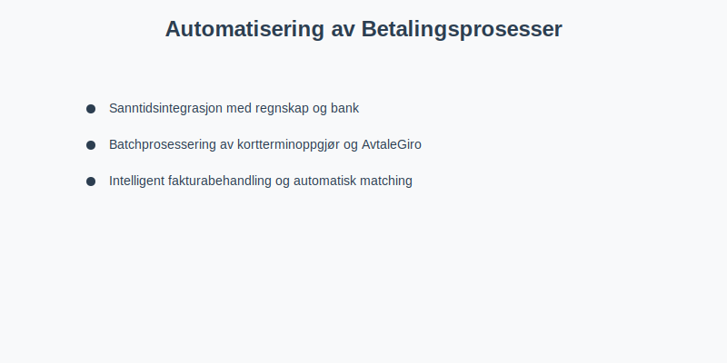

### 6.1 API-basert Integrasjon

Effektiv bruk av [API-integrasjon](/blogs/regnskap/api-integrasjon-automatisering-regnskap "API-integrasjon & Automatisering i Regnskap") transformerer regnskapsarbeid:

**Sanntidsintegrasjon:**
* Umiddelbar oppdatering av [kundefordringer](/blogs/regnskap/hva-er-kundefordring "Hva er Kundefordring? Komplett Guide til Debitorhåndtering")
* Automatisk avstemming av [banktransaksjoner](/blogs/regnskap/hva-er-banktransaksjoner "Hva er Banktransaksjoner? Typer, Regnskapsføring og Automatisering")
* Direkte kobling mellom salg og betalingsmottak

**Batchprosessering:**
* Daglig import av kortterminoppgjør
* Ukentlig prosessering av [AvtaleGiro](/blogs/regnskap/hva-er-avtalegiro "Hva er AvtaleGiro? Komplett Guide til Automatisk Betaling")-transaksjoner
* Månedlig avstemming av gebyrposter

### 6.2 Intelligent Fakturabehandling

Betalingstjenester kan integreres med [automatisert fakturabehandling](/blogs/regnskap/hva-er-fakturatolk "Hva er Fakturatolk? Automatisk Fakturabehandling og OCR-teknologi"):

**Automatisk matching:**
* [KID-nummer](/blogs/regnskap/hva-er-kid-nummer "Hva er KID-nummer? Komplett Guide til Kunde-IDentifikasjon i Norge") kobler betalinger til [fakturaer](/blogs/regnskap/hva-er-en-faktura "Hva er en Faktura? En Guide til Norske Fakturakrav")
* [OCR-nummer](/blogs/regnskap/hva-er-ocr "Hva er OCR? OCR i Norske Regnskapsprosesser “ En Komplett Guide") sikrer korrekt [kundeoppfølging](/blogs/regnskap/hva-er-kundereskontro "Hva er Kundereskontro? Komplett Guide til Kundefordringsstyring")
* Automatisk oppdatering av [kundefordringer](/blogs/regnskap/hva-er-kundefordring "Hva er Kundefordring? Komplett Guide til Debitorhåndtering")

**Varslingssystemer:**
* Automatiske påminnelser for forfalte betalinger
* Varsler ved mislykkede betalingsforsøk
* Rapporter om avvik i betalingsmønster

## Seksjon 7: Kostnadsanalyse og Optimalisering

Forståelse av kostnadene ved ulike betalingstjenester er viktig for både [budsjettarbeid](/blogs/regnskap/hva-er-budsjettering "Hva er Budsjettering? Komplett Guide til Bedriftsbudsjett") og løpende [kostnadskontroll](/blogs/regnskap/hva-er-kostnader "Hva er Kostnader? Komplett Guide til Kostnadsregnskapet").

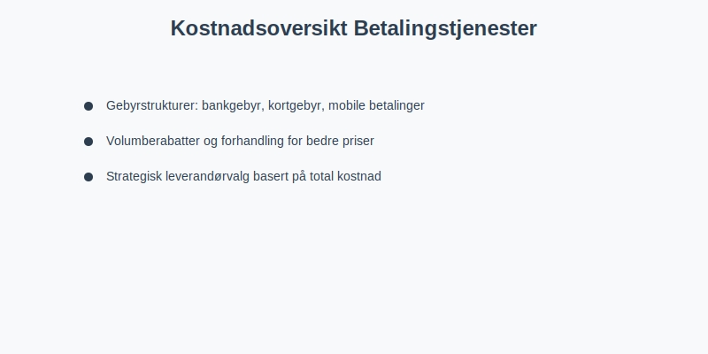

### 7.1 Gebyrstrukturer

**Tradisjonelle Bankgebyrer:**
* Fast månedsgebyr for bedriftskonto: Kr 200-800
* Transaksjonsgebyr: Kr 1-5 per overføring
* Internasjonale overføringer: Kr 50-200 + valutapåslag

**Kortbetalingsgebyrer:**
* [Debetkort](/blogs/regnskap/debetkort "Debetkort? Komplett Guide til Debetkort i Norge") (nasjonalt): 0.3-0.7% av beløp
* Kredittkort (nasjonalt): 0.8-1.5% av beløp
* Internasjonale kort: 1.5-3.5% av beløp
* Fast terminalgebyr: Kr 150-500 per måned

**Mobile Betalingstjenester:**
* Vipps for bedrifter: 1% + Kr 1 per transaksjon
* Apple Pay/Google Pay: Lignende kortgebyr + teknisk integrasjon
* QR-betalinger: Varierer mellom 0.5-2% avhengig av leverandør

### 7.2 Optimalisering av Betalingskostnader

**Strategisk leverandørvalg:**
* Sammenlign totalkostnader, ikke bare transaksjonsgebyrer
* Vurder integrasjonskostnader og tidsinvestering
* Evaluer kundeservice og teknisk support

**Volumberabatter:**
* Forhandl rabatter basert på månedlig volum
* Vurder årlige avtaler for bedre priser
* Konsolider betalingsvolum hos færre leverandører

## Seksjon 8: Spesielle Situasjoner og Utfordringer

### 8.1 Internasjonale Betalinger

Internasjonale betalingstjenester bringer ekstra kompleksitet:

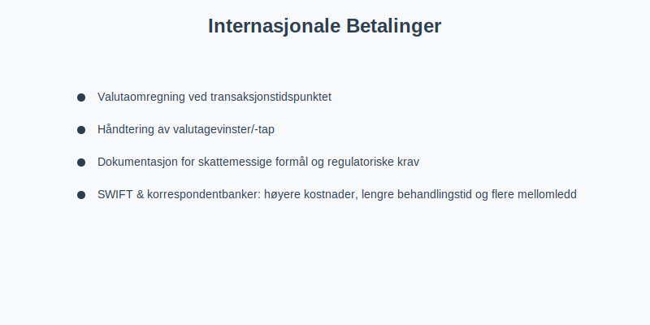

**Regnskapsmessige utfordringer:**
* Valutaomregning ved transaksjonstidspunktet
* Håndtering av valutagevinster/-tap
* Dokumentasjon for skattemessige formål
* Overholdelse av utenlandske regulatoriske krav

**SWIFT og korrespondentbanker:**
* Høyere kostnader og lengre behandlingstid
* Flere mellomledd øker risiko for feil
* Viktig med god dokumentasjon for [revisjon](/blogs/regnskap/hva-er-arbeidspapirer-revisjon "Hva er Arbeidspapirer? Komplett Guide til Revisjonsdokumentasjon")

### 8.2 E-handelsspesifikke Utfordringer

**Chargebacks og tvister:**
* Kunder kan bestride kortbetalinger
* Krever reservasjoner i regnskapet
* Påvirker [tap på fordringer](/blogs/regnskap/avsetning "Avsetning i Regnskap - Komplett Guide til Avsetninger og Estimater")

**Abonnementstjenester:**
* Kompleks håndtering av [uopptjent inntekt](/blogs/regnskap/hva-er-uopptjent-inntekt "Hva er Uopptjent Inntekt? Periodisering og Regnskapsføring")
* Automatiske belastninger krever robust feilhåndtering
* Refusjonshåndtering ved avbrudd

### 8.3 Regulatoriske Endringer

**Kommende EU-regulering:**
* Digital Services Act (DSA)
* Markets in Crypto-Assets (MiCA)
* Digital Operational Resilience Act (DORA)

**Norske tilpasninger:**
* Implementering av EU-direktiver
* Endringer i [skattelovgivning](/blogs/regnskap/hva-er-skatteloven "Skatteloven - Komplett Guide til Norsk Skattelovgivning")
* Nye krav til [rapportering](/blogs/regnskap/hva-er-naeringsoppgave "Hva er Næringsoppgave? Komplett Guide til Selvangivelse for Næring")

## Seksjon 9: Fremtidige Trender og Teknologisk Utvikling

Betalingslandskapet endrer seg raskt, og bedrifter må være forberedt på kommende teknologiske skifter.

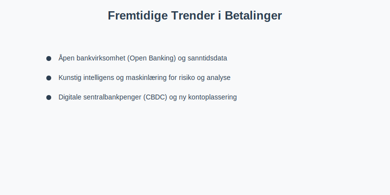

### 9.1 Åpen Bankvirksomhet (Open Banking)

**Nye muligheter:**
* Direkte integrasjon mellom regnskapssystem og banker
* Sanntids [kontantstrømanalyse](/blogs/regnskap/hva-er-kontantstromanalyse "Hva er Kontantstrømanalyse? Komplett Guide til Finansiell Planlegging")
* Automatisert [likviditetsstyring](/blogs/regnskap/hva-er-likviditetsstyring "Hva er Likviditetsstyring? Komplett Guide til Kontantstrømstyring")

**Regnskapsmessige fordeler:**
* Eliminerer behov for manuell [bankavstemming](/blogs/regnskap/hva-er-bankavstemming "Hva er Bankavstemming? Komplett Guide til Daglig Bankavstemming")
* Forbedrer nøyaktighet i [kontantstrømoppdateringer](/blogs/regnskap/hva-er-kontantstromoppstilling "Hva er Kontantstrømoppstilling? Komplett Guide til Kontantstrømrapportering")
* Muliggjør prediksjon av [betalingsevne](/blogs/regnskap/hva-er-betalingsevne "Hva er Betalingsevne? Analyse av Likviditet og Finansiell Stabilitet")

### 9.2 Kunstig Intelligens og Maskinlæring

**Intelligent betalingsanalyse:**
* Automatisk kategorisering av transaksjoner
* Prediksjon av betalingsmønstre
* Identifikasjon av suspekte transaksjoner

**Forbedret risikostyring:**
* AI-basert svindeldeteksjon
* Intelligent kredittrisikoevaluering
* Automatisert compliance-overvåking

### 9.3 Digitale Sentralbankpenger (CBDC)

**Norges Bank sin forskning:**
* Pilot med digital norsk krone
* Potensielt påvirker alle betalingstjenester
* Kan revolusjonere regnskapsrapportering

**Implikasjoner for regnskap:**
* Nye kontotyper og klassifiseringer
* Sanntids [skatteinnrapportering](/blogs/regnskap/hva-er-mva-melding "Hva er MVA-melding? Komplett Guide til Merverdiavgiftsrapportering")
* Endret behov for [avstemming](/blogs/regnskap/hva-er-avstemming "Hva er Avstemming? Komplett Guide til Regnskapsavstemming")

## Seksjon 10: Beste Praksis og Implementering

### 10.1 Strategisk Planlegging

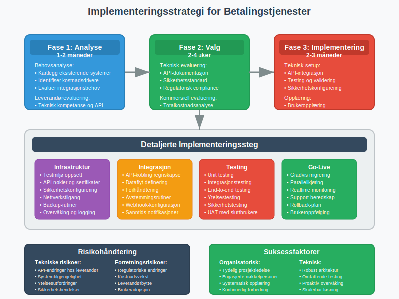

**Behovsanalyse:**
1. Kartlegg eksisterende betalingsstrømmer
2. Identifiser ineffektiviteter og kostnadsdrivere
3. Evaluer integrasjonsmuligheter med regnskapssystem
4. Vurder fremtidige vekstplaner

**Leverandørevaluering:**
* **Teknisk kompetanse:** API-kvalitet og dokumentasjon
* **Regulatorisk etterlevelse:** PSD2, GDPR, lokale krav
* **Kostnadsstruktur:** Transparente priser uten skjulte gebyrer
* **Support og service:** Tilgjengelig kundeservice på norsk

### 10.2 Implementeringsprosess

**Fase 1: Forberedelse (1-2 måneder)**
* Opprett testmiljø
* Tren nøkkelpersonell
* Oppdater [internkontrollrutiner](/blogs/regnskap/hva-er-internkontroll "Hva er Internkontroll? Komplett Guide til Internkontrollsystemer")
* Etabler backup-prosedyrer

**Fase 2: Pilot (1 måned)**
* Test med begrenset volum
* Verifiser regnskapsintegrasjon
* Kontroller [avstemmingsrutiner](/blogs/regnskap/hva-er-avstemming "Hva er Avstemming? Komplett Guide til Regnskapsavstemming")
* Dokumenter eventuelle justeringer

**Fase 3: Full implementering (1-2 måneder)**
* Gradvis overgang fra gamle systemer
* Kontinuerlig overvåking av ytelse
* Regelmessig evaluering av prosesser
* Optimalisering basert på erfaring

### 10.3 Kontinuerlig Forbedring

**Månedlig evaluering:**
* Gjennomgang av betalingskostnader
* Analyse av feilede transaksjoner
* Vurdering av [likviditetspåvirkning](/blogs/regnskap/hva-er-likviditet "Hva er Likviditet? Komplett Guide til Likviditetsanalyse")

**Kvartalsvis optimalisering:**
* Benchmarking mot andre leverandører
* Evaluering av nye teknologiske muligheter
* Vurdering av prosesseffektivitet

**Årlig strategisk gjennomgang:**
* Evaluering av totale betalingskostnader
* Vurdering av leverandørprestasjoner
* Planlegging av fremtidige oppgraderinger

## Konklusjon

Betalingstjenester er en kritisk komponent i moderne bedriftsdrift og regnskapsføring. Fra tradisjonelle [bankoverføringer](/blogs/regnskap/hva-er-bankgiro "Hva er BankGiro? Komplett Guide til Norsk Betalingssystem") til avanserte API-baserte løsninger, påvirker valg av betalingstjenester direkte [kontantstrømmen](/blogs/regnskap/hva-er-kontantstrom "Hva er Kontantstrøm? Komplett Guide til Kontantstrømanalyse"), [likviditeten](/blogs/regnskap/hva-er-likviditet "Hva er Likviditet? Komplett Guide til Likviditetsanalyse") og regnskapsmessige prosesser i enhver bedrift.

Successfull implementering krever grundig planlegging, forståelse av regulatoriske krav som [PSD2](/blogs/regnskap/hva-er-betalingstjenestedirektivet "Hva er betalingstjenestedirektivet? PSD2 og Norske Regnskapsregler"), og integrasjon med eksisterende [regnskapssystemer](/blogs/regnskap/hva-er-regnskap "Hva er Regnskap? Komplett Guide til Regnskapsføring i Norge"). Med riktig tilnærming kan moderne betalingstjenester dramatisk forbedre effektiviteten, redusere kostnader og styrke [internkontrollen](/blogs/regnskap/hva-er-internkontroll "Hva er Internkontroll? Komplett Guide til Internkontrollsystemer").

Etterhvert som teknologien utvikler seg, vil betalingstjenester bli enda mer integrert med regnskaps- og forretningsprosesser. Bedrifter som investerer i å forstå og optimalisere sine betalingsløsninger i dag, vil være bedre posisjonert for fremtidens digitale handelsmiljø.

For relaterte temaer, se våre guider til [elektronisk fakturering](/blogs/regnskap/hva-er-elektronisk-fakturering "Hva er Elektronisk Fakturering? Komplett Guide til Digitale Fakturaløsninger"), [API-integrasjon](/blogs/regnskap/api-integrasjon-automatisering-regnskap "API-integrasjon & Automatisering i Regnskap"), [banktransaksjoner](/blogs/regnskap/hva-er-banktransaksjoner "Hva er Banktransaksjoner? Typer, Regnskapsføring og Automatisering") og [betalingstjenestedirektivet](/blogs/regnskap/hva-er-betalingstjenestedirektivet "Hva er betalingstjenestedirektivet? PSD2 og Norske Regnskapsregler").

