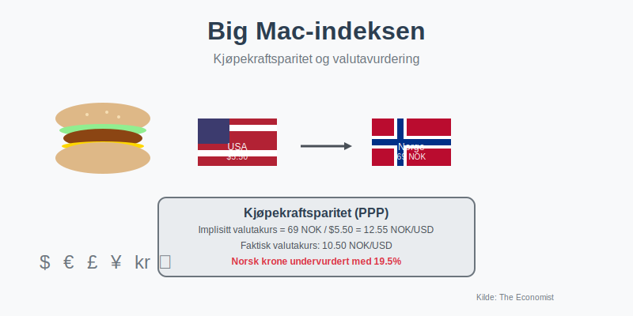
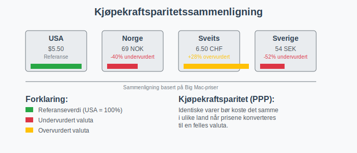
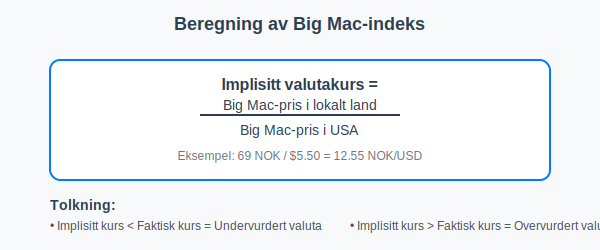
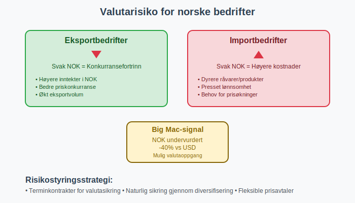
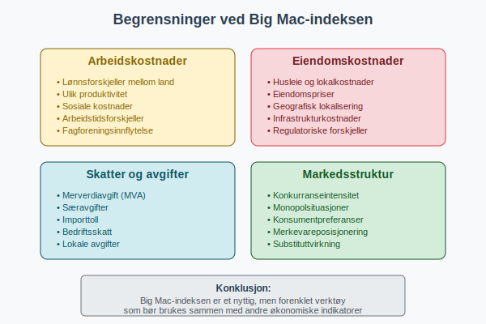
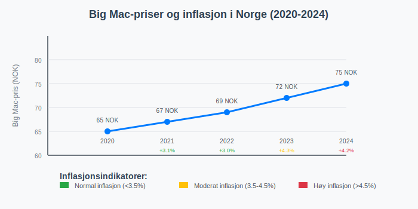
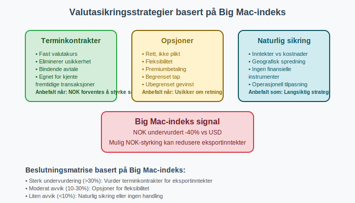

---
title: "Big Mac-indeksen"
seoTitle: "Big Mac-indeksen | Kjøpekraft, valuta og praktisk bruk"
description: "Big Mac-indeksen er et uformelt mål på kjøpekraftparitet som sammenligner priser på en Big Mac på tvers av land for å indikere under- eller overvurderte valutaer. Her forklarer vi beregning, begrensninger og praktisk bruk for norske bedrifter."
summary: "Forklaring av Big Mac-indeksen med eksempler, beregning og hva den betyr for norske virksomheter."
---

**Big Mac-indeksen** er et uformelt økonomisk verktøy som brukes til å sammenligne kjøpekraft mellom ulike land. Indeksen, utviklet av det britiske magasinet The Economist i 1986, baserer seg på prisen på en **Big Mac hamburger** fra McDonald's som en enkel måte å måle om valutaer er under- eller overvurdert.

## Hva er Big Mac-indeksen?

Big Mac-indeksen fungerer som en forenklet versjon av **kjøpekraftparitetsteorien** (PPP). Teorien foreslår at identiske varer bør koste det samme i ulike land når prisene konverteres til en felles valuta.

### Hvordan fungerer indeksen?

Big Mac-indeksen sammenligner **lokale priser** på Big Mac burgere med prisen i USA (som referansepunkt). Beregningen viser om en valuta er:

* **Undervurdert** - Hvis Big Mac koster mindre enn i USA
* **Overvurdert** - Hvis Big Mac koster mer enn i USA
* **Rettferdig verdsatt** - Hvis prisen tilsvarer amerikansk nivå

## Beregning av Big Mac-indeksen

Indeksen beregnes ved følgende formel:

### Eksempel fra Norge (2024)

| Land | Big Mac-pris | Lokal valuta | Implisitt valutakurs | Faktisk valutakurs | Over/undervurdert |
|------|-------------|--------------|---------------------|-------------------|-------------------|
| **Norge** | 69 NOK | NOK | 6.27 NOK/USD | 10.50 NOK/USD | -40.3% (undervurdert) |
| **USA** | $5.50 | USD | 1.00 | 1.00 | 0% (referanse) |
| **Sveits** | 6.50 CHF | CHF | 1.18 CHF/USD | 0.92 CHF/USD | +28.3% (overvurdert) |
| **Sverige** | 54 SEK | SEK | 4.91 SEK/USD | 10.20 SEK/USD | -51.9% (undervurdert) |
| **Danmark** | 30 DKK | DKK | 2.73 DKK/USD | 6.85 DKK/USD | -60.1% (undervurdert) |

*Tallene er eksempler og kan variere.*

## Relevans for norske bedrifter

### Valutarisiko og prisingstrategi

For norske bedrifter som opererer internasjonalt, gir Big Mac-indeksen innsikt i:

* **[Valutaeksponering](/blogs/regnskap/hva-er-fremmedkapital "Hva er fremmedkapital? Guide til ekstern finansiering")** og potensielle gevinster/tap
* **Prisingstrategi** i ulike markeder
* **Kostnadskontroll** ved internasjonale anskaffelser

### Regnskapsmessige konsekvenser

Big Mac-indeksen kan påvirke **[regnskapsføring](/blogs/regnskap/hva-er-regnskap "Hva er regnskap? Komplett guide til norsk regnskapsføring")** på flere måter:

#### 1. Valutaomregning

* **Omregning av utenlandske transaksjoner** til norske kroner
* **[Avstemming](/blogs/regnskap/hva-er-avstemming "Hva er avstemming? Guide til regnskapsmessig avstemming")** av valutaposisjoner
* Vurdering av **valutasikringsstrategier**

#### 2. Verdsettelse av investeringer

* **[Investering](/blogs/regnskap/hva-er-investere "Hva er investering? Guide til investeringsstrategier")** i utenlandske markeder
* Vurdering av **oppkjøpskandidater** i andre land
* **[Goodwill](/blogs/regnskap/hva-er-goodwill "Hva er goodwill? Immaterielle eiendeler i regnskapet")** ved internasjonale transaksjoner

## Begrensninger ved Big Mac-indeksen

### Strukturelle forskjeller

Big Mac-indeksen har flere **begrensninger** som påvirker nøyaktigheten:

* **Arbeidskostnader** varierer betydelig mellom land
* **Husleie og eiendomspriser** påvirker McDonald's kostnader
* **Lokale skatter og avgifter** som [**merverdiavgift**](/blogs/regnskap/hva-er-moms-mva "Hva er moms/mva? Komplett guide til merverdiavgift")
* **Regulatoriske forskjeller** i ulike markeder

### Justert Big Mac-indeks

For å korrigere for **inntektsforskjeller**, utviklet The Economist en justert versjon som tar hensyn til BNP per capita:

**Justert indeks = Rå indeks - (0.5 × ln(BNP per capita lokal / BNP per capita USA))**

## Praktisk anvendelse i norsk næringsliv

### For eksportbedrifter

Norske **[eksportbedrifter](/blogs/regnskap/hva-er-omsetning "Hva er omsetning? Guide til inntektsregistrering")** kan bruke Big Mac-indeksen til:

* **Markedsvurdering** - Identifisere attraktive eksportmarkeder
* **Prisoptimalisering** - Tilpasse priser til lokal kjøpekraft
* **Risikostyring** - Forutse valutabevegelser

### For importbedrifter

**Importbedrifter** kan anvende indeksen for:

* **[Leverandørvurdering](/blogs/regnskap/hva-er-leverandor "Hva er leverandør? Guide til leverandørforhold")** i ulike land
* **Kostnadsprognose** for fremtidige innkjøp
* **[Budsjettplanlegging](/blogs/regnskap/hva-er-budsjettering "Hva er budsjettering? Guide til finansiell planlegging")**

## Big Mac-indeksen og inflasjon

Indeksen kan også brukes til å **sammenligne inflasjonsnivåer** mellom land:

### Historisk utvikling i Norge

| År | Big Mac-pris Norge | Årlig prisendring | Kommentar |
|----|-------------------|-------------------|-----------|
| 2020 | 65 NOK | - | Referanseår |
| 2021 | 67 NOK | +3.1% | Moderat økning |
| 2022 | 69 NOK | +3.0% | Fortsatt økning |
| 2023 | 72 NOK | +4.3% | **[Inflasjon](/blogs/regnskap/hva-er-inflasjon "Hva er inflasjon? Økonomiske konsekvenser for bedrifter")** synlig |
| 2024 | 75 NOK | +4.2% | Høy inflasjon fortsetter |

## Alternativer til Big Mac-indeksen

### Andre mat-baserte indekser

* **Starbucks-indeksen** - Basert på kaffe-priser
* **iPhone-indeksen** - Teknologi-basert sammenligning
* **Netflix-indeksen** - Abonnementstjenester

### Offisielle målinger

* **OECD PPP-data** - Mer omfattende datagrunnlag
* **Verdensbank PPP** - Inkluderer flere varer og tjenester
* **IMF valutavurderinger** - Profesjonelle økonomiske analyser

## Regnskapsmessig behandling av valutaeksponering

### Sikringsinstrumenter

Basert på Big Mac-indeksen kan bedrifter vurdere:

* **Terminkontrakter** for valutasikring
* **Opsjoner** for fleksibel sikring
* **[Naturlig sikring](/blogs/regnskap/hva-er-finansiering "Hva er finansiering? Guide til bedriftsfinansiering")** gjennom diversifisering

### Regnskapsføring av sikringsforhold

* **Fair value sikring** - Markedsverdi endringer
* **Kontantstrøm sikring** - Fremtidige transaksjoner
* **Netto investering sikring** - Utenlandske datterselskaper

## Anvendelse i finansiell analyse

### Nøkkeltall og KPIer

Big Mac-indeksen kan integreres med andre **[nøkkeltall](/blogs/regnskap/hva-er-nokkeltall "Hva er Nøkkeltall? Komplett Guide til Finansielle Nøkkeltall i Regnskap")** for å:

* **Benchmarke** internasjonale operasjoner
* **Evaluere** markedsinntrenging
* **Optimalisere** [**kapitalallokering**](/blogs/regnskap/hva-er-kapital "Hva er kapital? Guide til bedriftens finansielle ressurser")

### Risikoevaluering

| Risikotype | Big Mac-indikator | Handling |
|------------|-------------------|----------|
| **Valutarisiko** | >20% avvik fra PPP | Vurder sikring |
| **Inflasjonsrisiko** | Økende Big Mac-priser | Øk prisfleksibilitet |
| **Markedsrisiko** | Stor prisspredning | Diversifiser geografisk |

## Teknologiske verktøy og Big Mac-data

### Digitale kilder

* **The Economist** - Opprinnelig kilde, oppdateres jevnlig
* **OECD Stats** - Offisielle PPP-data for sammenligning
* **Reuters/Bloomberg** - Sanntids valutakurser

### Automatisering i regnskap

Moderne **[ERP-systemer](/blogs/regnskap/hva-er-erp-system "Hva er ERP-system? Guide til bedriftssystemer")** kan integrere Big Mac-data for:

* **Automatisk valutaomregning**
* **Risiko-dashboards**
* **Prognosemodeller**

## Sektorspesifikke anvendelser

### Detaljhandel

**[Detaljhandelsbedrifter](/blogs/regnskap/hva-er-detaljhandel "Hva er detaljhandel? Guide til handelsbransjen")** bruker indeksen til:

* **Lokalisering** av nye butikker
* **Prisingstrategi** på tvers av markeder
* **[Varelager](/blogs/regnskap/hva-er-varelager "Hva er varelager? Guide til lagerregnskapet")** optimalisering

### Produksjon og industri

Industriselskaper anvender Big Mac-data for:

* **Sourcing-beslutninger** - Hvor produsere mest kostnadseffektivt
* **Markedsinntrenging** - Prioritere markeder med gunstig kjøpekraft
* **[Investeringsbeslutninger](/blogs/regnskap/hva-er-investeringsselskap "Hva er investeringsselskap? Guide til investeringsstrategier")** - Fabrikklokalisering

## Compliance og regulatoriske hensyn

### Norske regnskapsregler

Ved bruk av Big Mac-indeksen må norske selskaper følge:

* **[Regnskapsloven](/blogs/regnskap/hva-er-bokforingsloven "Hva er bokføringsloven? Norske regnskapsregler")** - Krav til valutaomregning
* **[God regnskapsskikk](/blogs/regnskap/god-regnskapsskikk "God regnskapsskikk: Prinsipper og praksis")** - Konsistente metoder
* **[Norsk regnskapsstandard](/blogs/regnskap/norsk-regnskapsstandard-nrs "Norsk regnskapsstandard (NRS): Guide til regnskapsregler")** - Spesifikke retningslinjer

### Internasjonale standarder

For konsern med utenlandske datterselskaper:

* **[IFRS](/blogs/regnskap/hva-er-ifrs "Hva er IFRS? Internasjonale regnskapsstandarder")** - Konsolideringsregler
* **IAS 21** - Valutaomregning spesifikt
* **IFRS 9** - Sikringsinstrumenter

## Fremtidige utviklingstrender

### Digitale valutaer

Med fremveksten av **digitale valutaer** og **kryptovalutaer**, kan Big Mac-indeksen utvikles til å inkludere:

* **Stabilcoins** - Kryptovalutaer knyttet til tradisjonelle valutaer
* **Digitale sentralbankvalutaer** (CBDC)
* **Grenseløse betalingsløsninger**

### Miljø- og bærekraftshensyn

Fremtidige versjoner kan inkludere:

* **Karbonavtrykk** - Miljøkostnader ved produksjon
* **[ESG-faktorer](/blogs/regnskap/hva-er-esg "Hva er ESG? Bærekraft i regnskap og rapportering")** - Sosiale og etiske aspekter
* **Lokal bærekraft** - Regionale miljøforskjeller

## Konklusjon

**Big Mac-indeksen** er et nyttig verktøy for å forstå **valutaforhold** og **kjøpekraft** på tvers av land. For norske bedrifter gir indeksen verdifull innsikt i:

* **Markedsmuligheter** i ulike land
* **Valutarisiko** og sikringsstrategier  
* **Prisingsoptimalisering** for internasjonale markeder
* **[Investeringsbeslutninger](/blogs/regnskap/hva-er-kapital "Hva er kapital? Guide til bedriftens finansielle ressurser")**

Selv om indeksen har **begrensninger**, fungerer den som et enkelt og tilgjengelig verktøy for å forstå komplekse **økonomiske sammenhenger** som påvirker moderne forretningsdrift.

For bedrifter som ønsker å **ekspandere internasjonalt** eller optimalisere sin **valutastrategi**, bør Big Mac-indeksen brukes sammen med andre økonomiske indikatorer og professional rådgivning fra **[regnskapsførere](/blogs/regnskap/hva-er-regnskap "Hva er regnskap? Komplett guide til norsk regnskapsføring")** og finansielle rådgivere.

