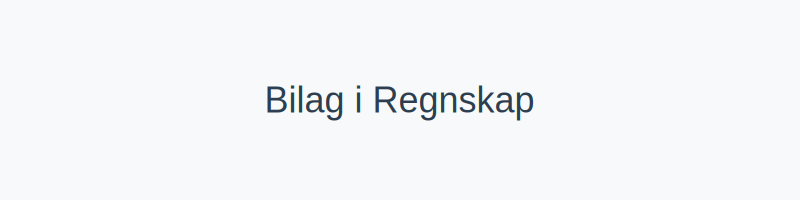
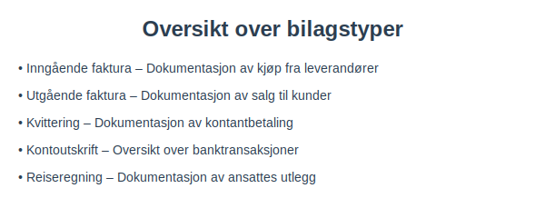
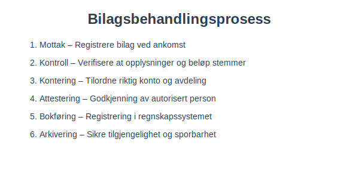
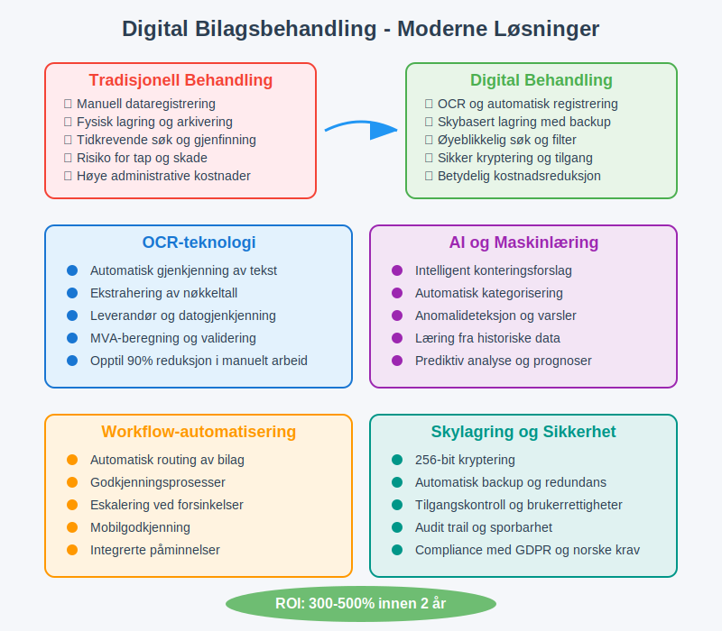
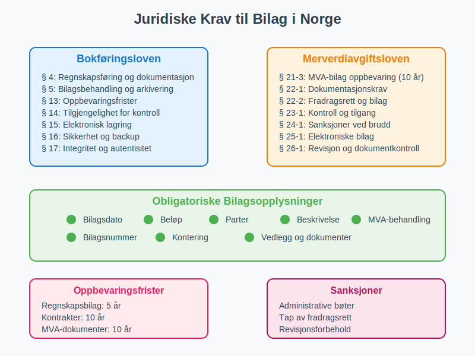
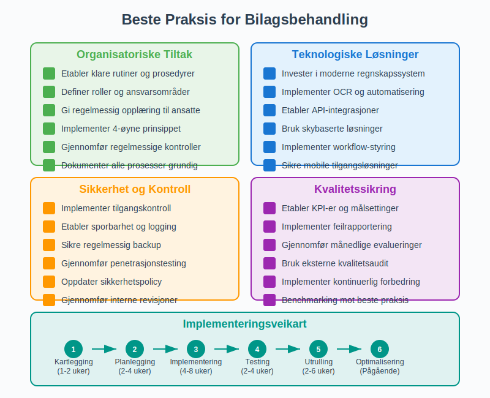

---
title: "Bilag i Regnskap – Guide til Dokumentasjon og Behandling"
seoTitle: "Bilag i Regnskap “ Guide til Dokumentasjon og Behandling"
description: '**Bilag** er grunnlaget for all **regnskapsføring** og dokumenterer hver forretningshendelse med nødvendig informasjon for korrekt [bokføring](/blogs/regnska...'
---

**Bilag** er grunnlaget for all **regnskapsføring** og dokumenterer hver forretningshendelse med nødvendig informasjon for korrekt [bokføring](/blogs/regnskap/hva-er-bokforing "Hva er Bokføring? En Komplett Guide til Norsk Bokføringspraksis"). Som fundamentet for pålitelig [regnskapsføring](/blogs/regnskap/hva-er-regnskap "Hva er Regnskap? En Komplett Guide til Norsk Regnskapsføring"), sikrer bilag sporbarhet, etterprøvbarhet og overholdelse av norske lovkrav. Denne omfattende artikkelen gir en grundig gjennomgang av hva bilag er, hvordan de håndteres i norsk regnskapspraksis, og hvordan moderne bedrifter kan effektivisere bilagsbehandlingen.

## Hva er bilag i norsk regnskap?

Et **bilag** er ethvert dokument som dokumenterer en forretningshendelse og gir grunnlag for [bokføring](/blogs/regnskap/hva-er-bokforing "Hva er Bokføring? En Komplett Guide til Norsk Bokføringspraksis") i regnskapet. I henhold til **[bokføringsloven](/blogs/regnskap/hva-er-bokforingsloven "Hva er Bokføringsloven? Krav, Regler og Praktisk Veiledning")** og **[bokføringsforskriften](/blogs/regnskap/hva-er-bokforingsforskriften "Hva er Bokføringsforskriften? Komplett Guide til Norske Bokføringskrav og Regler")** må alle regnskapspostringer være dokumentert med bilag.

### Hovedkategorier av bilag

Bilag kan kategoriseres basert på deres opprinnelse og funksjon:

* **Inngående bilag** “ dokumenter mottatt fra eksterne parter, som [leverandørfakturaer](/blogs/regnskap/hva-er-en-faktura "Hva er en Faktura? En Guide til Norske Fakturakrav") og [kvitteringer](/blogs/regnskap/kvittering "Hva er Kvittering? En Guide til Kvitteringskrav i Norsk Regnskap")
* **Utgående bilag** “ dokumenter sendt til eksterne parter, som salgsfakturaer og [kreditnotaer](/blogs/regnskap/hva-er-kreditnota "Hva er Kreditnota? Komplett Guide til Kreditnotaer")
* **Interne bilag** “ dokumenter opprettet internt, som [reiseregninger](/blogs/regnskap/hva-er-utlegg "Hva er Utlegg? Komplett Guide til Utlegg og Refusjon") og [avskrivningsbilag](/blogs/regnskap/hva-er-avskrivning "Hva er Avskrivning? Metoder, Beregning og Regnskapsføring")

### Juridisk grunnlag for bilag

Norsk regnskapslovgivning stiller strenge krav til bilagsbehandling:

* **Dokumentasjonsplikt**: Alle transaksjoner må dokumenteres med bilag
* **Oppbevaringsplikt**: Bilag må oppbevares i minimum **5 år** etter regnskapsårets slutt
* **Tilgjengelighetsplikt**: Bilag må være tilgjengelige for [revisor](/blogs/regnskap/hva-er-revisor "Hva er Revisor? Rolle, Ansvar og Krav i Norge") og skattemyndighetene

For en dypere definisjon og detaljert gjennomgang, se [Hva er Bilag?](/blogs/regnskap/hva-er-bilag "Hva er Bilag i Regnskap?").

## Detaljert oversikt over bilagstyper

Norske bedrifter håndterer en rekke ulike bilagstyper, hver med spesifikke krav til innhold og oppbevaring:

### Eksterne bilag

**Eksterne bilag** utveksles med parter utenfor bedriften og utgjør størstedelen av regnskapsbilag:

| **Bilagstype**           | **Beskrivelse**                           | **Oppbevaringstid** | **Lovgrunnlag** |
|--------------------------|-------------------------------------------|---------------------|------------------|
| [Inngående faktura](/blogs/regnskap/hva-er-en-faktura "Hva er en Faktura? En Guide til Norske Fakturakrav")        | Kjøp fra [leverandører](/blogs/regnskap/hva-er-leverandor "Hva er Leverandør?")    | Minst 5 år          | Bokføringsforskriften § 13-2 |
| [Utgående faktura](/blogs/regnskap/hva-er-en-faktura "Hva er en Faktura? En Guide til Norske Fakturakrav")         | Salg til [kunder](/blogs/regnskap/hva-er-kunde "Hva er Kunde?")           | Minst 5 år          | Bokføringsforskriften § 13-2 |
| [Kvittering](/blogs/regnskap/kvittering "Hva er Kvittering? En Guide til Kvitteringskrav i Norsk Regnskap") | Bevis for [kontantbetaling](/blogs/regnskap/hva-er-kontantfaktura "Hva er Kontantfaktura?") | Minst 5 år | Bokføringsforskriften § 13-2 |
| [Kontoutskrift](/blogs/regnskap/hva-er-banktransaksjoner "Hva er Banktransaksjoner?")            | [Banktransaksjoner](/blogs/regnskap/hva-er-banktransaksjoner "Hva er Banktransaksjoner?") og saldoer            | Minst 5 år          | Bokføringsforskriften § 13-2 |
| [Tolldeklarasjon](/blogs/regnskap/tolldeklarasjonsoversikt "Tolldeklarasjonsoversikt: Oversikt over tolldeklarasjon i regnskap")          | Import/eksport dokumentasjon              | Minst 5 år          | Tolloven § 12-1 |
| Forsikringspolise        | Avtaler om forsikringsdekning              | Minst 10 år         | Bokføringsforskriften § 13-3 |

### Interne bilag

**Interne bilag** opprettes av bedriften selv for å dokumentere interne hendelser:

| **Bilagstype**           | **Beskrivelse**                           | **Oppbevaringstid** | **Lovgrunnlag** |
|--------------------------|-------------------------------------------|---------------------|------------------|
| [Reiseregning](/blogs/regnskap/hva-er-utlegg "Hva er Utlegg?")             | Dokumentasjon av [ansattes utlegg](/blogs/regnskap/ansattutlegg "Ansattutlegg i Regnskap")           | Minst 5 år          | Bokføringsforskriften § 13-2 |
| [Lønnsbilag](/blogs/regnskap/hva-er-lonn "Hva er Lønn?")              | [Lønnsutbetalinger](/blogs/regnskap/hva-er-lonn "Hva er Lønn?") og [arbeidsgiveravgift](/blogs/regnskap/hva-er-arbeidsgiveravgift "Hva er Arbeidsgiveravgift?")           | Minst 5 år          | Bokføringsforskriften § 13-2 |
| [Avskrivningsbilag](/blogs/regnskap/hva-er-avskrivning "Hva er Avskrivning?")        | Dokumentasjon av [avskrivninger](/blogs/regnskap/hva-er-avskrivning "Hva er Avskrivning?")           | Minst 5 år          | Bokføringsforskriften § 13-2 |
| [Periodiseringsbilag](/blogs/regnskap/hva-er-periodisering "Hva er Periodisering?")      | Fordeling av kostnader over perioder      | Minst 5 år          | Bokføringsforskriften § 13-2 |
| Korrigeringsbilag        | Rettelser av tidligere posteringer        | Minst 5 år          | Bokføringsforskriften § 13-2 |
| Varetellingsliste        | Dokumentasjon av [lageropptelling](/blogs/regnskap/hva-er-varelager "Hva er Varelager?")           | Minst 5 år          | Bokføringsforskriften § 13-2 |

### Spesielle bilagstyper for ulike bransjer

Enkelte bransjer har spesifikke bilagskrav:

* **[Detaljhandel](/blogs/regnskap/hva-er-detaljhandel "Hva er Detaljhandel?")**: [X-rapporter](/blogs/regnskap/hva-er-x-rapport "Hva er X-rapport?"), Z-rapporter, [kasseoppgjør](/blogs/regnskap/hva-er-kasseoppgjor "Hva er Kasseoppgjør?")
* **Landbruk**: Produksjonsnotater, [landbrukskontoplan](/blogs/regnskap/landbrukskontoplan "Landbrukskontoplan Guide")-spesifikke bilag
* **Transport**: [Kjørebøker](/blogs/regnskap/hva-er-kjorebok "Hva er Kjørebok?"), fraktbrev
* **Bygg og anlegg**: Timeregninger, materialnotater, [entrepriseavtaler](/blogs/regnskap/hva-er-entreprise "Hva er Entreprise?")

## Bilagsbehandlingsprosess og internkontroll

En systematisk **bilagsbehandlingsprosess** er essensielt for god [internkontroll](/blogs/regnskap/hva-er-internkontroll "Hva er Internkontroll?") og overholdelse av norske lovkrav. Prosessen sikrer korrekt registrering, kontroll og lagring av alle forretningsdokumenter.

### Detaljert bilagsbehandlingsprosess

1. **Mottak og registrering**
   - Registrere bilag ved ankomst med dato og referanse
   - Tildele unikt [bilagsnummer](/blogs/regnskap/hva-er-bilagsnummer "Hva er Bilagsnummer?") for sporbarhet
   - Digitalisere fysiske bilag for sikker lagring

2. **Saklig kontroll**
   - Verifisere at varen/tjenesten er mottatt som avtalt
   - Kontrollere at leveransen stemmer med bestilling
   - Sjekke kvalitet og kvantitet av leveransen

3. **Regnskapsmessig kontroll**
   - Kontrollere at alle obligatoriske opplysninger er til stede
   - Verifisere beregninger og summer
   - Kontrollere [MVA-behandling](/blogs/regnskap/hva-er-moms-mva "Hva er Moms/MVA?")

4. **[Kontering](/blogs/regnskap/hva-er-kontering "Hva er Kontering?") og klassifisering**
   - Tilordne riktig [kontokode](/blogs/regnskap/hva-er-kontoplan "Hva er Kontoplan?") og avdeling
   - Angi korrekt [kostnadssted](/blogs/regnskap/hva-er-kostnad "Hva er Kostnad?") eller prosjekt
   - Sikre riktig [periodisering](/blogs/regnskap/hva-er-periodisering "Hva er Periodisering?")

5. **[Attestering](/blogs/regnskap/hva-er-attestering "Hva er Attestering?") og godkjenning**
   - Godkjenning av autorisert person med fullmakt
   - Kontroll av budsjett og økonomiske rammer
   - Dokumentasjon av godkjenningsprosess

6. **Bokføring og registrering**
   - Registrering i regnskapssystemet eller [ERP-system](/blogs/regnskap/hva-er-erp-system "Hva er ERP-system?")
   - Oppdatering av [leverandørreskontro](/blogs/regnskap/hva-er-leverandorreskontro "Hva er Leverandørreskontro?") eller [kundereskontro](/blogs/regnskap/hva-er-kundereskontro "Hva er Kundereskontro?")
   - Integrering med lønns- og [MVA-systemer](/blogs/regnskap/hva-er-mva-melding "Hva er MVA-melding?")

7. **Betaling og oppfjølg**
   - Utbetaling til leverandør i henhold til [betalingsbetingelser](/blogs/regnskap/hva-er-betalingsbetingelser "Hva er Betalingsbetingelser?")
   - Matching av betaling mot [faktura](/blogs/regnskap/hva-er-en-faktura "Hva er en Faktura? En Guide til Norske Fakturakrav")
   - Oppfjølging av utestfående [kundefordringer](/blogs/regnskap/hva-er-kundefordring "Hva er Kundefordring?")

8. **Arkivering og oppbevaring**
   - Sikker lagring i henhold til [oppbevaringskrav](/blogs/regnskap/oppbevaring-av-regnskapsmateriale "Oppbevaring av Regnskapsmateriale")
   - Indeksering for enkel gjenfinning
   - Backup og sikkerhetskopi

### Ansvarsfordeling og roller

For å sikre god **internkontroll** bør ulike personer ha ansvar for forskjellige deler av prosessen:

| **Rolle** | **Ansvar** | **Kontrollpunkt** |
|-----------|------------|-----------------|
| **Bestiller** | Bestilling av varer/tjenester | Forretningsformål og beløpsramme |
| **Mottaker** | Mottak og kvalitetskontroll | Levering i henhold til bestilling |
| **Regnskapsfører** | [Kontering](/blogs/regnskap/hva-er-kontering "Hva er Kontering?") og MVA-behandling | Korrekt regnskapsføring |
| **Attestant** | Godkjenning av betaling | Fullmakt og budsjett |
| **Kasserer** | Utbetaling | Godkjent bilag |
| **Arkivar** | Oppbevaring og tilgjengelighet | Lovkrav til dokumentasjon |

## Digitale løsninger og moderne bilagsbehandling

**Digitalisering** av bilagsbehandlingen gir betydelige fordeler i form av effektivitet, nøyaktighet og kostnadsbesparelser. Moderne norske bedrifter investerer i stadig mer sofistikerte løsninger for å automatisere og forbedre sine bilagsprosesser.

### Fordeler med digital bilagsbehandling

* **Økt effektivitet**: Raskere behandling og godkjenning av bilag
* **Bedre søkbarhet**: Enkel gjenfinning av historiske dokumenter
* **Reduserte kostnader**: Mindre behov for fysisk lagring og manuelt arbeid
* **Forbedret internkontroll**: Automatiske kontroller og full sporbarhet
* **Miljøvennlig**: Betydelig reduksjon i papirforbruk
* **Økt sikkerhet**: Backup, tilgangskontroll og kryptering

### Teknologiske løsninger

Moderne [regnskapssystemer](/blogs/regnskap/hva-er-regnskap "Hva er Regnskap?") og [ERP-systemer](/blogs/regnskap/hva-er-erp-system "Hva er ERP-system?") tilbyr omfattende funksjoner:

* **[OCR-teknologi](/blogs/regnskap/hva-er-ocr "Hva er OCR? OCR i Norske Regnskapsprosesser “ En Komplett Guide") (Optical Character Recognition)**
  - Automatisk innsanking av bilagsdata fra PDF-er og bilder
  - Gjenkjenning av [fakturanummer](/blogs/regnskap/hva-er-fakturanummer "Hva er Fakturanummer?"), datoer, beløp og leverandøropplysninger
  - Reduserer manuell dataregistrering med opptil 90%

* **Automatisk kontering og kategorisering**
  - Maskinlæring for intelligent forslag til [kontering](/blogs/regnskap/hva-er-kontering "Hva er Kontering?")
  - Historikkbaserte konteringsforslag
  - Automatisk [MVA-behandling](/blogs/regnskap/hva-er-moms-mva "Hva er Moms/MVA?") basert på leverandør og varetyper

* **Workflow-styring og godkjenning**
  - Integrerte [attesterings](/blogs/regnskap/hva-er-attestering "Hva er Attestering?")-prosesser
  - Automatisk ruting basert på beløp og kategori
  - Mobilappen for godkjenning uansett hvor du befinner deg
  - Eskalering ved forsinkelser

* **Integrasjoner og automatisering**
  - Kobling til [bankdata](/blogs/regnskap/hva-er-banktransaksjoner "Hva er Banktransaksjoner?") for automatisk matching
  - Integrasjon med [e-faktura](/blogs/regnskap/hva-er-efaktura "Hva er E-faktura?") systemer
  - API-tilkobling til leverandørsystemer
  - Automatisk [periodisering](/blogs/regnskap/hva-er-periodisering "Hva er Periodisering?") og avsetninger

### Skybasert arkivering og tilgjengelighet

* **Sikker lagring**: Krypterte data med redundans og backup
* **Global tilgjengelighet**: Tilgang fra alle enheter og lokasjoner
* **Skalerbarhet**: Automatisk tilpasning til bedriftens vekst
* **Compliance**: Oppfyllelse av norske lovkrav til [oppbevaring](/blogs/regnskap/oppbevaring-av-regnskapsmateriale "Oppbevaring av Regnskapsmateriale")

### Implementering av digitale løsninger

Vellykket digitalisering krever planlegging og riktig gjennomføring:

1. **Behovsanalyse**: Kartlegg eksisterende prosesser og identifiser forbedringsområder
2. **Systemvalg**: Velg løsning som passer bedriftens størrelse og behov
3. **Opplæring**: Sikre at alle ansatte kan bruke systemet effektivt
4. **Datamigrering**: Overfør eksisterende data til nytt system
5. **Testing og pilotering**: Test systemet grundig før full utrulling
6. **Kontinuerlig forbedring**: Juster og optimaliser basert på erfaring

For mer om digital bilagsbehandling og juridiske krav, se [Hva er Bokføringsforskriften](/blogs/regnskap/hva-er-bokforingsforskriften "Hva er Bokføringsforskriften? Komplett Guide til Norske Bokføringskrav og Regler").

## Juridiske krav til bilag og oppbevaring

Norsk lovgivning stiller strenge krav til bilagsbehandling og dokumentasjon. Disse kravene sikrer sporbarhet, etterprøvbarhet og beskyttelse av interessenter.

### Lovgrunnlag for bilagskrav

**[Bokføringsloven](/blogs/regnskap/hva-er-bokforingsloven "Hva er Bokføringsloven?")** og **[bokføringsforskriften](/blogs/regnskap/hva-er-bokforingsforskriften "Hva er Bokføringsforskriften?")** danner det juridiske fundamentet:

* **§ 4**: Krav til regnskapsføring og dokumentasjon
* **§ 5**: Krav til bilagsbehandling og arkivering
* **§ 13**: Oppbevaringsfrister for ulike dokumenttyper

### Obligatoriske bilagsopplysninger

Alle bilag må inneholde følgende **obligatoriske opplysninger**:

| **Opplysning** | **Beskrivelse** | **Eksempel** |
|---------------|-----------------|-------------|
| **Bilagsdato** | Når transaksjonen fant sted | 15.03.2024 |
| **Beløp** | Transaksjonens verdi inkl. MVA | 12.500,00 kr |
| **Parter** | Hvem som er involvert | Leverandør AS og Kjøper AS |
| **Beskrivelse** | Hva transaksjonen gjelder | Kjøp av kontormøbler |
| **[MVA-behandling](/blogs/regnskap/hva-er-moms-mva "Hva er Moms/MVA?")** | Merverdiavgift spesifisert | 2.500,00 kr (25% MVA) |
| **Bilagsnummer** | Unikt identifikasjonsnummer | REG-2024-001234 |

### Oppbevaringsfrister og krav

Ulike dokumenttyper har forskjellige oppbevaringsfrister:

| **Dokumenttype** | **Oppbevaringstid** | **Lovgrunnlag** |
|------------------|--------------------|-----------------|
| **Regnskapsbilag** | Minimum 5 år | Bokføringsforskriften § 13-2 |
| **[Fakturaer](/blogs/regnskap/hva-er-en-faktura "Hva er en Faktura? En Guide til Norske Fakturakrav")** | Minimum 5 år | Bokføringsforskriften § 13-2 |
| **Kontrakter og avtaler** | Minimum 10 år | Bokføringsforskriften § 13-3 |
| **[MVA-dokumenter](/blogs/regnskap/hva-er-mva-melding "Hva er MVA-melding?")** | Minimum 10 år | Merverdiavgiftsloven § 21-3 |
| **[Årsregnskap](/blogs/regnskap/hva-er-aarsoppgave "Hva er Årsoppgave?")** | Minimum 10 år | Bokføringsforskriften § 13-3 |
| **Lønnsbilag** | Minimum 5 år | Bokføringsforskriften § 13-2 |

### Digitale bilag og juridiske krav

For at **digitale bilag** skal være juridisk gyldige, må de oppfylle spesifikke krav:

* **Autentisitet**: Bilagets opprinnelse må kunne verifiseres
* **Integritet**: Innholdet må ikke kunne endres uten at det oppdages
* **Lesbarhet**: Bilag må være lesbare gjennom hele oppbevaringsperioden
* **Tilgjengelighet**: Må være tilgjengelige for kontroll av myndigheter

### Sanksjoner ved manglende overholdelse

Manglende overholdelse av bilagskrav kan føre til:

* **Administrative sanksjoner**: Bøter og pålegg fra skattemyndighetene
* **Skattejuridiske konsekvenser**: Tap av [fradragsrett](/blogs/regnskap/hva-er-fradrag "Hva er Fradrag?") for kostnader uten dokumentasjon
* **Revisormæssige konsekvenser**: Forbehold i [revisjonsberetning](/blogs/regnskap/hva-er-revisjonsberetning "Hva er Revisjonsberetning?")
* **Rettslige konsekvenser**: Problemer ved tvist eller rettsak

For detaljert informasjon om oppbevaringskrav, se [Oppbevaring av regnskapsmateriale](/blogs/regnskap/oppbevaring-av-regnskapsmateriale "Oppbevaring av Regnskapsmateriale - Krav og frister").

## Beste praksis for effektiv bilagsbehandling

Vellykkede bedrifter implementerer **beste praksis** for å sikre korrekt og effektiv bilagsbehandling:

### Organisatoriske tiltak

* **Etabler klare rutiner**: Dokumenter alle prosesser for bilagsbehandling
* **Definer roller og ansvar**: Sørg for at alle vet sitt ansvar i prosessen
* **Opplær ansatte**: Gi regelmessig opplæring i bilagskrav og -rutiner
* **Gjennomfør kontroller**: Implementer regelmessige kvalitetskontroller

### Teknologiske løsninger

* **Invester i moderne regnskapssystem**: Velg system med god bilagshåndtering
* **Implementer automatisering**: Bruk OCR og AI for å redusere manuelt arbeid
* **Etabler integrasjoner**: Koble sammen ulike systemer for smidig dataflyt
* **Sikre backup og redundans**: Beskytt mot tap av kritiske data

### Sikkerhet og kontroll

* **Implementer tilgangskontroll**: Begrens hvem som kan behandle sensitive bilag
* **Etabler sporbarhet**: Logg alle endringer og handlinger for full transparens
* **Gjennomfør revisjoner**: Kontroller regelmessig at rutinene følges
* **Oppdater sikkerhetstiltak**: Hold tritt med nye trusler og løsninger

## Fremtidige trender innen bilagsbehandling

Bilagsbehandling er i kontinuerlig utvikling, drevet av teknologiske fremskritt:

### Kunstig intelligens og maskinlæring

* **Automatisk kategorisering**: AI kan klassifisere bilag basert på innhold
* **Intelligent kontering**: Maskinlæring forslår korrekt [kontering](/blogs/regnskap/hva-er-kontering "Hva er Kontering?")
* **Anomalideteksjon**: Oppdage uvanlige mønstre og potensielle feil
* **Prediktiv analyse**: Forutsi fremtidige utgifter basert på historikk

### Blockchain og distribuerte systemer

* **Uforanderlige poster**: Sikre at bilag ikke kan endres etter registrering
* **Desentralisert lagring**: Redusert avhengighet av sentrale systemer
* **Smart kontrakter**: Automatisk utførelse av avtaler basert på bilag

### Økt automatisering

* **Robotprosessautomatisering (RPA)**: Automatisering av repetitive oppgaver
* **Integrerte økosystemer**: Smiøløs dataflyt mellom alle systemer
* **Sanntidsbehandling**: Øyeblikkelig behandling av bilag ved mottak

## Konklusjon og oppsummering

**Bilag** er det uomtvistelige fundamentet for pålitelig regnskapsføring og god [internkontroll](/blogs/regnskap/hva-er-internkontroll "Hva er Internkontroll?") i norske bedrifter. Gjennom systematisk behandling av alle forretningsdokumenter sikrer bedriftene:

### Hovedpunkter å huske:

* **Juridisk overholdelse**: Alle transaksjoner må dokumenteres med gyldige bilag
* **Oppbevaringsplikt**: Minimum 5 år for regnskapsbilag, 10 år for kontrakter
* **Internkontroll**: Systematisk behandling sikrer nøyaktighet og sporbarhet
* **Digital transformasjon**: Moderne løsninger øker effektivitet og reduserer kostnader
* **Fremtidsrettede løsninger**: AI og automatisering revolusjonerer bilagsbehandlingen

### Anbefalinger for bedrifter:

1. **Evaluer eksisterende prosesser**: Identifiser forbedringsområder i bilagsbehandlingen
2. **Invester i teknologi**: Moderne løsninger gir betydelig avkastning
3. **Opplær personalet**: Sikre at alle forstår viktigheten av korrekt bilagsbehandling
4. **Etabler gode rutiner**: Konsistens i prosesser sikrer kvalitet og overholdelse
5. **Planlegg for fremtiden**: Velg skalerbare løsninger som vokser med bedriften

Med riktig tilnærming til bilagsbehandling kan bedrifter ikke bare oppfylle lovkrav, men også skape betydelig verdi gjennom bedre økonomistyring, økt effektivitet og reduserte kostnader. Bilagsbehandling utvikler seg fra en administrativ nødvendighet til en strategisk konkurransefordel for moderne norske bedrifter.

