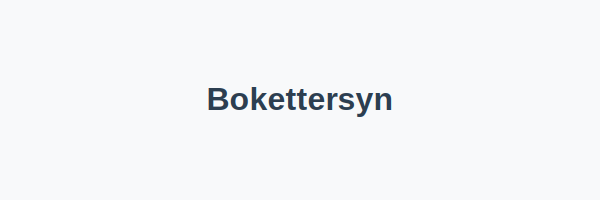

---
title: "Hva er Bokettersyn i Regnskap?"
meta_title: "Hva er Bokettersyn i Regnskap?"
meta_description: '**Bokettersyn** er en kontrollaktivitet utført av **Skatteetaten** og andre offentlige instanser for å verifisere at virksomhetens [bokføringsplikt](/blogs/r...'
slug: bokettersyn
type: blog
layout: pages/single
---

**Bokettersyn** er en kontrollaktivitet utført av **Skatteetaten** og andre offentlige instanser for å verifisere at virksomhetens [bokføringsplikt](/blogs/regnskap/hva-er-bokforingsplikt "Hva er Bokføringsplikt i Norge? Hvem, Når og Hvordan?") og andre regnskapskrav overholdes. Bokettersyn bidrar til **transparens**, **etterprøvbarhet** og **tillit** i norsk næringsliv.

Skatteetaten kan også be om periodiske **SAF-T**-eksportfiler for å gjennomføre bokettersyn og revisjon. Les mer i artikkelen [Hva er SAF-T?](/blogs/regnskap/saf-t "SAF-T: Standard Audit File for Tax i Norge").

## Hva er Bokettersyn?

Bokettersyn innebærer en systematisk gjennomgang av virksomhetens regnskapsmateriale, dokumentasjon og rapportering for å sikre at regnskapet oppfyller kravene i [bokføringsloven](/blogs/regnskap/hva-er-bokforingsloven "Hva er Bokføringsloven? Krav, Regler og Praktisk Veiledning") og tilhørende forskrifter.

## Typer Bokettersyn

| **Type**                 | **Beskrivelse**                                                            | **Ansvarlig instans** |
|--------------------------|----------------------------------------------------------------------------|-----------------------|
| **Stikkprøvekontroll**   | Utvalg av bilag og regnskapsrapporter gjennomgås for vurdering.            | Skatteetaten          |
| **Fullstendig kontroll** | Grundig gjennomgang av alle relevante regnskapsdokumenter for hele perioden.| Skatteetaten          |
| **Skattekontroll**       | Spesielt fokus på skatteberegning, fradrag og rapportering.                | Skatteetaten          |
| **MVA-kontroll**         | Kontroll av MVA-rapportering, innsendte MVA-meldinger og bilag.            | Skatteetaten          |

## Hvordan Forberede seg til Bokettersyn

Følgende tiltak kan hjelpe virksomheter med å forberede seg til bokettersyn:

* Sørg for oppdatert og **fullstendig** bokføring i tråd med regelverket.
* Ha enkel tilgang til **bilag**, fakturaer og annen dokumentasjon.
* Gjennomfør internkontroller og [avstemming](/blogs/regnskap/hva-er-avstemming "Hva er Avstemming i Regnskap? Komplett Guide") jevnlig.
* Dokumenter rutiner for **datahåndtering** og oppbevaring.
* Sørg for at regnskapssystemet kan generere **SAF-T** filer ved forespørsel.

## Vanlige Spørsmål om Bokettersyn

* **Hva skjer hvis jeg får et bokettersyn?**  
  Skatteetaten vil be om innsyn i regnskapet, og eventuelle avvik kan føre til tilleggsskatt eller straff.
* **Hvor langt tilbake kan bokettersynet gå?**  
  Som regel kan Skatteetaten kontrollere de siste **5** årene, men dette kan variere.
* **Kan jeg klage på et bokettersyn?**  
  Ja, du kan klage på vedtaket skriftlig innen angitt frist.

## Relaterte Artikler

* [Hva er Bokføringsplikt?](/blogs/regnskap/hva-er-bokforingsplikt "Hva er Bokføringsplikt i Norge? Hvem, Når og Hvordan?")  
* [Hva er Avstemming i Regnskap?](/blogs/regnskap/hva-er-avstemming "Hva er Avstemming i Regnskap? Komplett Guide")  
* [Hva er Bokføringsloven?](/blogs/regnskap/hva-er-bokforingsloven "Hva er Bokføringsloven? Krav, Regler og Praktisk Veiledning")

