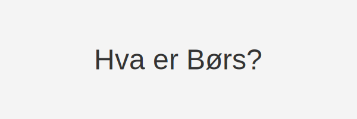

---
title: "Hva er Børs? En Guide til Norsk Børs og Aksjehandel"
meta_title: "Hva er Børs? En Guide til Norsk Børs og Aksjehandel"
meta_description: '**Børs** er det organiserte markedet for kjøp og salg av aksjer og andre finansielle instrumenter i Norge. **Børsen** gir en strukturert og gjennomsiktig han...'
slug: bors
type: blog
layout: pages/single
---

**Børs** er det organiserte markedet for kjøp og salg av aksjer og andre finansielle instrumenter i Norge. **Børsen** gir en strukturert og gjennomsiktig handelsplattform som legger til rette for prisdannelse, likviditet og kapitaltilgang for selskaper.

## Hva er en børs?

*børs* (fra gammel engelsk *beorh* og tysk *Börse*) refererer til en institusjon eller markedsplass der kjøp og salg av [verdipapirer](/blogs/regnskap/hva-er-verdipapir "Hva er Verdipapir? En Komplett Guide til Verdipapirer") som aksjer, obligasjoner og derivater skjer.

## Hvordan fungerer Oslo Børs?

Oslo Børs er Norges hovedbørs og driver en elektronisk handelsplattform hvor aksjer og andre verdipapirer handles kontinuerlig. Tabellen under viser noen nøkkelfakta om Oslo Børs:

| Egenskap           | Detaljer                                |
| ------------------ | --------------------------------------- |
| Åpningstid         | 09:00 – 16:30 (CET)                     |
| Antall selskaper   | Over 200                                |
| Markedsverdi       | Omtrent 3 000 milliarder kroner         |
| Valuta             | Norske kroner (NOK)                     |
| Hovedindekser      | OSEBX, OBX, OSEFX                       |

## Nøkkelbegreper i børs

* **Aksje** – En eierandel i et selskap. Se [Hva er en aksje?](/blogs/regnskap/hva-er-en-aksje "Hva er en Aksje?")
* **Aksjekurs** – Prisen en aksje handles for, formet av tilbud og etterspørsel på børsen.
* **Likviditet** – Evnen til å kjøpe og selge uten store prisendringer. Se [Hva er Likviditet?](/blogs/regnskap/hva-er-likviditet "Hva er Likviditet? En komplett guide til likviditetsstyring").
* **Unoterte aksjer** – Aksjer som ikke er notert på børs. Se [Unoterte aksjer](/blogs/regnskap/unoterte-aksjer "Unoterte aksjer – Veileder til investering og regnskapsføring").
* **Kurtasje** – avgift betalt til megler eller handelsplattform ved kjøp eller salg av aksjer og andre verdipapirer. Se [Hva er Kurtasje?](/blogs/regnskap/kurtasje "Hva er Kurtasje? Guide til Kurtasje og Megleravgifter")
* **Ordretyper**:
  | Ordretype      | Beskrivelse                             |
  | -------------- | --------------------------------------- |
  | Markedsordre   | Kjøp/salg til beste tilgjengelige kurs   |
  | Limitordre     | Kjøp/salg til angitt maksimum/minimum    |
  | Stop-loss ordre| Automatisk ordre ved en gitt kursgrense |

## Regulering og tilsyn

Finanstilsynet fører tilsyn med børsen og påser at handel skjer i samsvar med gjeldende lover og regelverk.

## Hvordan handle aksjer på børsen?

For å handle aksjer på Oslo Børs trenger du en meglerkonto hos et registrert aksjemeglerforetak. Følg disse trinnene:

*   Ã…pne en meglerkonto hos en registrert tilbyder.
*   Gjør en ordre (markedsordre eller limitordre) via nettbank eller handelsplattform.
*   Bekreft ordren og følg med på ordrestatus.
*   Ordren utføres, og aksjene registreres på kontoen din.

## Oppsummering

Børsen er en kritisk del av det finansielle systemet i Norge, som muliggjør effektiv kapitalallokering og prising av selskaper. Ved å forstå de grunnleggende prinsippene, *ordretyper* og regulatoriske krav, kan investorer bedre navigere i aksjemarkedet og ta informerte beslutninger.
