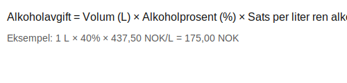

---
title: "Brennevin"
seoTitle: "Brennevin"
meta_description: 'Brennevin er en **alkoholholdig drikk** med minimum 22 % volumprosent alkohol, og omfatter ulike typer sprit som akevitt, whisky, vodka og likører. **Brennevi...'
slug: brennevin
type: blog
layout: pages/single
---

Brennevin er en **alkoholholdig drikk** med minimum 22 % volumprosent alkohol, og omfatter ulike typer sprit som akevitt, whisky, vodka og likører. **Brennevin** er underlagt særavgifter og særskilt regnskapsbehandling i Norge.

## Hva er Brennevin og Relevant Lovverk

Brennevin reguleres av særavgiftsloven og merverdiavgiftsloven (MVA). I tillegg gjelder krav til bokføring i henhold til [bokføringsforskriften](/blogs/regnskap/hva-er-bokforingsforskriften "Hva er Bokføringsforskriften? Komplett Guide til Regnskapsførsel") og prinsipper for Norsk Standard Kontoplan (NS 4102).

## Alkoholavgift og Beregningsgrunnlag

> **Alkoholavgift** beregnes ut fra volum ren alkohol og fastsatt sats per liter ren alkohol.

| Parameter                    | Formel                                                  |
|------------------------------|---------------------------------------------------------|
| Alkoholvolum                 | Volum (L) × Alkoholprosent (%)                          |
| Sats for spritalkoholavgift  | 437,50 NOK per liter ren alkohol                        |
| Total alkoholavgift          | Alkoholvolum (L) × Sats                                  |

## Merverdiavgift (MVA) på Brennevin

> Brennevin er **MVA-pliktig** vare og avgiftsbelegges med ordinær sats (25 %) i henhold til [mva-loven](/blogs/regnskap/mva-loven "MVA-loven: Komplett Guide til Merverdiavgiftsloven").

## Bokføring av Brennevin-transaksjoner

For riktig føring av kjøp, avgiftene og salg av brennevin anbefales det å bruke dedikerte kontoer i kontoplanen:

| Transaksjon                    | Debet (Norsk Standard Kontoplan)     | Kredit                              |
|--------------------------------|--------------------------------------|-------------------------------------|
| Kjøp av brennevin (varen)      | Konto 4000 - Varekjøp               | Konto 2400 - Leverandørgjeld        |
| Beregnet alkoholavgift         | Konto 5800 - Særavgifter            | Konto 2750 - Avgiftsgjeld           |
| Beregnet MVA                   | Konto 2720 - Utgående merverdiavgift | Konto 2750 - Avgiftsgjeld           |
| Salg av brennevin med MVA      | Konto 1500 - Varelager               | Konto 3000 - Salgsinntekt           |
|                                |                                      | Konto 2770 - Inngående merverdiavgift |

## Praktiske Tips og Internlenking

* Sørg for å kontrollere at all **særavgiftsberegning** dokumenteres og attesteres internt (se [Hva er Attestering?](/blogs/regnskap/hva-er-attestering "Hva er Attestering? En Komplett Guide til Bilagsbehandling og Godkjenning")).
* Les mer om kontoplan og anbefalte kontoer i [Hva er en Kontoplan?](/blogs/regnskap/hva-er-kontoplan "Hva er en Kontoplan? Komplett Guide til Kontoplaner i Norsk Regnskap").
* Få oversikt over bokføringskrav i [Hva er Bokføringsforskriften?](/blogs/regnskap/hva-er-bokforingsforskriften "Hva er Bokføringsforskriften? Komplett Guide til Regnskapsførsel").

## Oppsummering

Brennevin krever nøye håndtering av både **alkoholavgift** og **merverdiavgift**, i tillegg til korrekt bokføring i henhold til gjeldende lover og kontoplanstandarder. Ved å følge anbefalte praksiser for særavgiftsberegning og MVA-behandling sikrer bedriften etterlevelse av regelverket og presis regnskapsrapportering.

