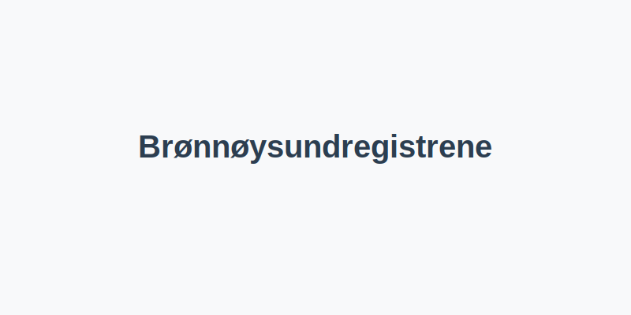

**Brønnøysundregistrene** er et offentlig forvaltningsorgan under Nærings- og fiskeridepartementet som administrerer flere sentrale norske registre. Dette inkluderer blant annet Enhetsregisteret, Foretaksregisteret, Regnskapsregisteret og MVA-registeret, som alle er essensielle for norske virksomheters juridiske og regnskapsmessige status.

### Hovedregistre

| **Register** | **Beskrivelse** |
|--------------|-----------------|
| [Enhetsregisteret](/blogs/regnskap/hva-er-enhetsregisteret "Hva er Enhetsregisteret?") | Grunnleggende registrering av alle juridiske enheter i Norge og tildeling av organisasjonsnummer. |
| [Foretaksregisteret](/blogs/regnskap/ansvarlig-selskap "Hva er Ansvarlig Selskap?") | Registrering av aksjeselskaper, ansvarlige selskaper, kommandittselskaper og andre selskapsformer. |
| [Regnskapsregisteret](/blogs/regnskap/hva-er-regnskapsregisteret "Hva er Regnskapsregisteret? Komplett Guide til Regnskapsregisteret i Norge") | Innsending og offentliggjøring av årsregnskap for norske selskaper. |
| [MVA-registeret](/blogs/regnskap/hva-er-mva-registeret "Hva er MVA-registeret?") | Registrering av virksomheter med merverdiavgiftsplikt. |

### Viktige funksjoner og tjenester

* **Tildeling av organisasjonsnummer:** Gjennom Enhetsregisteret får alle virksomheter et unikt organisasjonsnummer.
* **Selskapsregistrering:** Opprettelse, endring og sletting av selskaper i Foretaksregisteret.
* **Offentliggjøring av regnskap:** Innsending og publisering av årsregnskap i Regnskapsregisteret.
* **MVA-registrering:** Registrering av merverdiavgiftspliktige virksomheter.

### Digitale løsninger

Brønnøysundregistrene tilbyr flere **digitale tjenester** for effektiv registrering og innsyn:

* [Altinn](/blogs/regnskap/hva-er-altinn "Hva er Altinn? En Guide til Offentlige Tjenester") “ sentral portal for skjema, innlevering og dialog med offentlige registre.
* [API-integrasjon](/blogs/regnskap/api-integrasjon-automatisering-regnskap "API-integrasjon og automatisering av regnskap") “ sanntidsoppdatering og automatiserte arbeidsflyter.
* **Nettjenester** “ direkte søk og nedlasting av informasjon via Brønnøysundregistrenes nettsider.
* [Firmaattest](/blogs/regnskap/firmaattest "Firmaattest") “ Offisielt dokument som bekrefter registrerte opplysninger om selskapet.
* **Proff.no** “ en tredjepartsplattform for bedriftsinformasjon og økonomiske nøkkeltall. Les mer i vÃ¥r guide til [Proff.no](/blogs/regnskap/proff-no "Proff.no - Oversikt og Brukerveiledning").

### Hvordan søke i Brønnøysundregistrene

1. Besøk den offisielle nettsiden til Brønnøysundregistrene.
2. Velg relevant register (f.eks. Enhetsregisteret eller Foretaksregisteret).
3. Søk på **organisasjonsnummer**, **foretaksnavn** eller **personnummer**.
4. Last ned eller vis ønsket informasjon “ ofte gratis for grunnleggende data.

### Eksempler på bruk i regnskap

Regnskapsførere og revisorer benytter Brønnøysundregistrenes registre for å:

* Verifisere **organisasjonsnummer** og **virksomhetsstatus**.
* Hente **Ã¥rsregnskap** for sammenligning og analyse.
* Kontrollere at selskapsinformasjon er oppdatert i Foretaksregisteret.
* Sjekke **MVA-status** og registreringsdato.

### Hvis du vil lære mer

For en mer detaljert beskrivelse av hvert enkelt register, se også:

* [Hva er Enhetsregisteret?](/blogs/regnskap/hva-er-enhetsregisteret "Hva er Enhetsregisteret?")
* [Hva er Foretaksregisteret?](/blogs/regnskap/ansvarlig-selskap "Hva er Ansvarlig Selskap?")
* [Hva er Regnskapsregisteret?](/blogs/regnskap/hva-er-regnskap "Hva er Regnskap?")
* [Hva er MVA-registeret?](/blogs/regnskap/hva-er-mva-registeret "Hva er MVA-registeret?")

### Konklusjon

**Brønnøysundregistrene** er en **hjørnestein** i norsk næringsliv ved å sikre korrekt registrering, offentliggjøring og tilgang til viktig virksomhetsinformasjon. Kunnskap om disse registrene er avgjørende for alle som driver eller jobber med regnskap og selskapsforvaltning i Norge.

