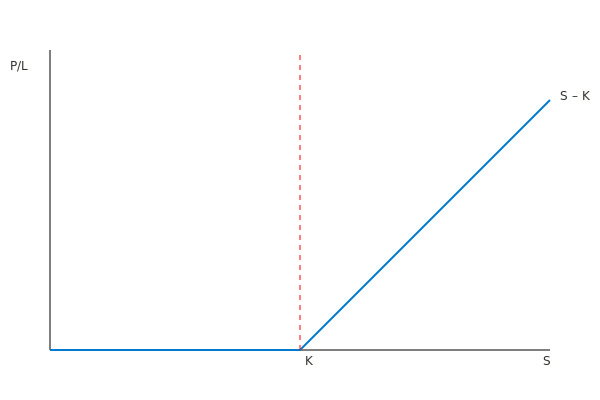

---
title: "Hva er en Call-opsjon?"
meta_title: "Hva er en Call-opsjon?"
meta_description: 'En **call-opsjon** (kjøpsopsjon) er en type opsjonsavtale som gir innehaveren rett, men ikke plikt, til å **kjøpe** den underliggende eiendelen til en forhå...'
slug: call-opsjon
type: blog
layout: pages/single
---

En **call-opsjon** (kjøpsopsjon) er en type opsjonsavtale som gir innehaveren rett, men ikke plikt, til å **kjøpe** den underliggende eiendelen til en forhåndsbestemt pris (strike) innen eller på utløpsdatoen. Call-opsjoner er viktige for risikostyring, investeringsstrategier og selskapers finansielle planlegging.

Les mer om opsjoner generelt i [Hva er en Opsjon?](/blogs/regnskap/opsjon "Hva er en Opsjon?") og se også salgsopsjoner i [Hva er en Put-opsjon?](/blogs/regnskap/put-opsjon "Hva er en Put-opsjon?").

## Hva er en Call-opsjon?

For mer om opsjonsavtaler generelt, se [Hva er en Opsjonsavtale?](/blogs/regnskap/hva-er-opsjonsavtale "Hva er en Opsjonsavtale?").

En **call-opsjon** gir innehaveren rett til å kjøpe en underliggende eiendel til en forhåndsbestemt **utøvelsespris** innen en angitt tidsperiode. Innehaveren tjener når markedsprisen på eiendelen er høyere enn utøvelsesprisen ved utløp.

## Grunnleggende elementer i en call-opsjon

En call-opsjon består av flere nøkkelfaktorer:

* **Underliggende eiendel** – den finansielle eiendelen som kan kjøpes.
* **Utøvelsespris (K)** – den avtalte prisen innehaveren kan kjøpe eiendelen for.
* **Utløpsdato (T)** – siste dag opsjonen kan utøves.
* **Opsjonspremie** – kostnaden for å erverve call-opsjonen.
* **Volatilitet (σ)** – forventet variasjon i underliggende eiendels pris.

## Payoffdiagram for call-opsjon

Et payoffdiagram viser potensiell gevinst eller tap ved utløp av call-opsjonen:

## Nøkkelfaktorer og deres påvirkning

| Faktor                | Symbol | Effekt på call-opsjon |
|------------------------|--------|------------------------|
| **Aksjepris**          | S      | Positiv                |
| **Utøvelsespris**      | K      | Negativ                |
| **Tid til utløp**      | T      | Positiv                |
| **Risikofri rente**    | r      | Positiv                |
| **Volatilitet**        | σ      | Positiv                |
| **Utbytte**            | q      | Negativ                |

## Regnskapsmessig behandling av call-opsjoner

Regnskapsmessig innregning og måling følger [IFRS 9](/blogs/regnskap/hva-er-ifrs "Hva er IFRS?") for finansielle instrumenter. Ved første gangs innregning skal call-opsjoner måles til virkelig verdi, og transaksjonskostnader skal inkluderes dersom de ikke er del av handelsportefølje.

Videre må etterfølgende måling skje enten til virkelig verdi gjennom resultatregnskap eller gjennom totalresultat, avhengig av forretningsmodell og kontraktens karakteristika.

## Praktiske eksempler

1. **Spekulasjon**: En investor kjøper call-opsjoner for å dra nytte av forventet prisoppgang på en aksje med begrenset kapitalrisiko (maksimal risiko er opsjonspremien).
2. **Sikring**: Et selskap som planlegger å kjøpe råvarer bruker call-opsjoner for å låse pris og beskytte mot prisøkning.

## Oppsummering

* En call-opsjon gir rett, men ikke plikt, til å kjøpe en eiendel til en avtalt pris.
* Regnskapsmessig innregning følger IFRS 9 med virkelig verdi-måling.
* Call-opsjoner brukes både til spekulasjon og sikring.

## Se også

* [Hva er en Opsjonsavtale?](/blogs/regnskap/hva-er-opsjonsavtale "Hva er en Opsjonsavtale?")
* [Hva er en Put-opsjon?](/blogs/regnskap/put-opsjon "Hva er en Put-opsjon? En Guide til salgsopsjoner i Regnskap")
* [Hva er IFRS?](/blogs/regnskap/hva-er-ifrs "Hva er IFRS?")
* [Hva er Derivater?](/blogs/regnskap/derivater "Hva er Derivater? En Guide til Derivater i Regnskap")
