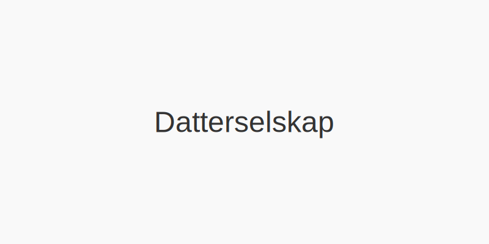

---
title: "Hva er Datterselskap?"
seoTitle: "Hva er Datterselskap?"
meta_description: '**Datterselskap** er et selskap som er kontrollert av et [morselskap](/blogs/regnskap/hva-er-morselskap "Hva er et Morselskap? Komplett Guide til Morselskap og ...'
slug: datterselskap
type: blog
layout: pages/single
---

**Datterselskap** er et selskap som er kontrollert av et [morselskap](/blogs/regnskap/hva-er-morselskap "Hva er et Morselskap? Komplett Guide til Morselskap og Konsernledelse"). I en [konsernstruktur](/blogs/regnskap/hva-er-konsern "Hva er et Konsern? Komplett Guide til Konsernstrukturer og Konsolidering") er datterselskapene de selskapene som står under morselskapets bestemmende innflytelse. Dette har viktige juridiske og regnskapsmessige konsekvenser for både morselskapet og konsernet som helhet.

## Definisjon av Datterselskap

Et datterselskap defineres i **aksjeloven** § 1-3 som et selskap der et annet selskap (morselskapet) har **bestemmende innflytelse**, vanligvis ved å eie mer enn **50% av stemmene**. I norsk regnskapslovgivning innebærer dette at datterselskapet inngår i morselskapets konsernregnskap.

### Juridisk rammeverk

Datterselskaper må følge **aksjeloven** og **regnskapsloven**, og morselskapet har en rekke plikter og rettigheter knyttet til konsernstyring og internkontroll. Se også vår guide til [aksjeloven](/blogs/regnskap/hva-er-aksjeloven "Hva er Aksjeloven? Komplett Guide til Aksjeloven og Regnskapsregler") for detaljer.

## Typer av Datterselskap

| **Type**                   | **Beskrivelse**                                                                 |
|----------------------------|---------------------------------------------------------------------------------|
| Operasjonelt datterselskap | Datterselskap med egen drift, ansatte og egne inntekter, men styrt av morselskapet. |
| Holdingselskap             | Rent investeringsselskap uten operasjonell virksomhet; eier aksjer i andre selskaper. |
| Felleskontrollert selskap  | Joint venture med delt kontroll, ofte regulert gjennom aksjonæravtale.           |

## Kontrollkriterier

* **Eiermajoritet**: Morselskapet eier direkte eller indirekte mer enn **50% av stemmerettighetene**.
* **Styrekontroll**: Morselskapet kan **utnevne flertallet av styremedlemmene**.
* **Kontrollavtaler**: Avtaler som gir morselskapet **bestemmende innflytelse**.

## Regnskapsmessig behandling

Morselskapet må konsolidere datterselskapets regnskap i konsernregnskapet. Konsolidering kan innebære:

1. **Full konsolidering**: 100% av datterselskapets balanse og resultat inkluderes, med justeringer for minoritetsinteresser.
2. **Egenkapitalmetoden**: Brukes for tilknyttede selskaper der kontroll ikke er absolutt.
3. **Kostmetoden**: Enkel bokføring av investering som en eiendel til anskaffelseskost.

## Fordeler og utfordringer

### Fordeler

* **Styrket kontroll** over virksomhetens filialer.
* **Skalerbarhet** og mulighet for diversifisering.
* **Skjerming av risiko** mellom ulike forretningsområder.

### Utfordringer

* **Kompleksitet** i konsernregnskap og skatt.
* **Rapporteringskrav** og økte krav til internkontroll.
* **Minoritetseierskap** som kan begrense beslutningsfriheten.

## Intern konsernbehandling

For planlagte oppkjøp av et nytt datterselskap er **due diligence** en kritisk prosess for å identifisere og evaluere risiko knyttet til regnskap, skatt, juridiske forhold og drift. Se vår [guide til Due diligence](/blogs/regnskap/due-diligence "Due diligence i Norske Oppkjøp: Prosess, Metodikk og Beste Praksis") for en detaljert gjennomgang.

For intern handel mellom morselskap og datterselskap må man håndtere **internprising**, **konsernbidrag** og **mellomværende**. Feil i internkonteringen kan påvirke både skatteposisjon og konsernresultat.

Se også vår guide til [konsernbidrag](/blogs/regnskap/hva-er-konsernbidrag "Hva er Konsernbidrag? Komplett Guide til Skatte- og Regnskapsbehandling").

---

Dette er en omfattende oversikt over **datterselskapers** rolle i norske konsern, deres juridiske basis og regnskapsmessige konsekvenser.

