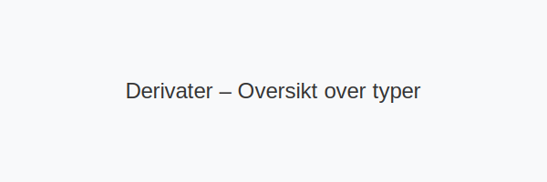
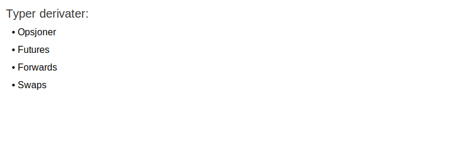

---
title: "Hva er Derivater?"
meta_title: "Hva er Derivater?"
meta_description: '**Derivater** er finansielle kontrakter hvis verdi er avledet fra underliggende eiendeler, indekser eller andre referanseverdier. Derivater brukes til risikosty...'
slug: derivater
type: blog
layout: pages/single
---

**Derivater** er finansielle kontrakter hvis verdi er avledet fra underliggende eiendeler, indekser eller andre referanseverdier. Derivater brukes til risikostyring, spekulasjon og effektiv kapitalallokering i norsk regnskaps- og finanspraksis.

## Definisjon og grunnleggende konsepter

Et **derivat** er et finansielt instrument som gir rettigheter og forpliktelser basert på verdien av en underliggende eiendel. Avhengig av kontraktens vilkår kan derivater benyttes til å sikre seg mot prisendringer eller til å spekulere i markedsbevegelser.

_Underliggende eiendel_, utløpsdato, avtalt pris (strike) og kontraktsstørrelse (notional) er sentrale elementer i samtlige derivater.

## Typer derivater

| Type derivat   | Beskrivelse                                                                 | Vanlige anvendelser                       |
|-----------------|-----------------------------------------------------------------------------|--------------------------------------------|
| **Opsjoner**    | Rett, men ikke plikt, til å kjøpe eller selge en eiendel til avtalt pris     | Risikostyring, ansattopsjoner              |
| **Futures**     | Standardisert kontrakt om kjøp eller salg av eiendel på en fremtidig dato    | Råvaresikring, spekulasjon                 |
| **Forwards**    | Skreddersydd OTC-kontrakt om kjøp eller salg på et fremtidig tidspunkt       | Tilpasset pris- og volumgaranti            |
| **Swaps**       | Avtale om å bytte kontantstrømmer mellom parter (for eksempel rentebytte)   | Valuta-, rente- og kredittsikring          |

## Regnskapsmessig behandling

> Derivater innregnes og måles i henhold til [IFRS 9](/blogs/regnskap/hva-er-ifrs "Hva er IFRS? Komplett Guide til International Financial Reporting Standards") og relevante NRS.

1. **Første gangs innregning:** Virkelig verdi på kontraktsdato.
2. **Etterfølgende måling:** Virkelig verdi gjennom resultat eller totalt resultat (OCI) avhengig av forretningsmodell.
3. **Sikringsbokføring:** Dokumentasjon og effektivitetstesting ved sikringsformål.

## Vurderingsmodeller

Vanlige modeller og metoder for verdsettelse av derivater inkluderer:

* **Mark-to-market** “ daglig oppdatering til markedsverdi.
* **Black“Scholes** “ prisingsmodell for europeiske opsjoner.
* **Binomialmodell** “ diskret valuering med mulighet for amerikansk utøvelse.
* **Monte Carlo-simulering** “ numerisk metode for komplekse og eksotiske derivater.

## Praktiske eksempler

1. **Valutasikring:** En importør av amerikanske varer bruker valutaforwards for å låse valutakurs.
2. **Renteswap:** Et selskap bytter flytende rente til fast rente på lån.
3. **Olje-futures:** En produsent selger olje for levering om tre måneder for å sikre salgspris.

## Risiko og styring

* **Markedsrisiko** “ eksponering mot prisendringer i underliggende eiendel.
* **Kredittrisiko** “ risiko for at motpart ikke oppfyller forpliktelser.
* **Likviditetsrisiko** “ mulighet for vanskeligheter ved avvikling av posisjoner.
* **Operasjonell risiko** “ prosess- og systemfeil knyttet til derivathandel.

## Oppsummering og videre lesning

**Derivater** gir kraftfulle verktøy for risikostyring og kapitalforvaltning, men krever grundig forståelse av verdsettelse, bokføring og risikostyring.

Se også:

* [Hva er en Opsjonsavtale?](/blogs/regnskap/hva-er-opsjonsavtale "Hva er en Opsjonsavtale?")
* [Hva er en Call-opsjon?](/blogs/regnskap/call-opsjon "Hva er en Call-opsjon?")
* [Hva er Shorting?](/blogs/regnskap/shorting "Hva er Shorting? En Guide til Short-salg i Norske Børser")

*For mer om finansielle instrumenter i regnskap, se [Hva er Finansregnskap?](/blogs/regnskap/hva-er-finansregnskap "Hva er Finansregnskap? En Komplett Guide").*

