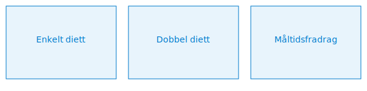

---
title: "Diett"
seoTitle: "Diett"
meta_description: '**Diett** refererer til den **skattefrie godtgjørelsen** for måltider og småforpleining ved tjenestereiser og arbeidsoppdrag. Dette er en viktig del av reise...'
slug: diett
type: blog
layout: pages/single
---

**Diett** refererer til den **skattefrie godtgjørelsen** for måltider og småforpleining ved tjenestereiser og arbeidsoppdrag. Dette er en viktig del av reiseregningen og påvirker både skattereglene og regnskapsføringen.

## Hva er diett?

Diett omfatter **måltider** og **småforpleining** (for eksempel kaffe og frukt) som dekkes av arbeidsgiver når ansatte er på tjenestereise eller oppdrag utenfor hjemstedet. Formålet er å dekke ekstra kostnader til livsopphold under reisen uten å føre til beskatning når det er innenfor Skatteetatens normaltariffer.

## Skatteregler og normaltariffer

> Skatteetaten fastsetter årlige **normaltariffer** for diett som gir rett til skattefri dekning innenfor satser for enkel eller dobbel diett.

| Type diett                       | Dokumentasjon          | Skatteetatens normaltariff  |
|----------------------------------|------------------------|-----------------------------|
| **Enkelt diett (innenlands)**    | Egenattest eller bilag | 313 NOK per hele døgn       |
| **Dobbel diett (innenlands)**    | Egenattest eller bilag | 627 NOK per hele døgn       |
| **Måltidsfradrag**               | Egenattest eller bilag | 20 % av enkel diett         |

## Regnskapsføring av diettkostnader

> Diettkostnader bokføres på egne konti i Norsk Standard Kontoplan, avhengig av om beløpene er oppgavepliktige eller ikke.

| Konto | Beskrivelse                          | Oppgavepliktig |
|-------|--------------------------------------|----------------|
| **7150** | Diettkostnader, oppgavepliktig    | Ja             |
| **7160** | Diettkostnader, ikke oppgavepliktig | Nei            |

### Bokføringseksempel

| Transaksjon                      | Debet                         | Kredit                       |
|----------------------------------|-------------------------------|------------------------------|
| Påløpte diettkostnader           | Konto 7150 - Diettkostnader   | Konto 2400 - Leverandørgjeld |
| Utbetaling av diettkostnader     | Konto 2400 - Leverandørgjeld  | Konto 1920 - Bankinnskudd    |

## Dokumentasjonskrav

* **Egenattest eller bilag:** Dokumentasjon av måltider med dato og beløp.
* **[Reiseregning](/blogs/regnskap/reiseregning "Reiseregning - Guide til reiseregninger i Norsk Regnskap")**: Spesifiser reiseformål, tidsrom og tilhørende diettkostnader.
* **Godkjenning:** Leder eller controller må attestere reiseregningen.

## Intern lenking og relaterte emner

* [A-meldingen](/blogs/regnskap/hva-er-a-melding "Hva er A-melding? Komplett Guide til A-meldingen")
* [Ansattutlegg](/blogs/regnskap/ansattutlegg "Ansattutlegg - Guide til håndtering av ansattes utlegg og refusjoner")
* [Bokføringsregler](/blogs/regnskap/hva-er-bokforingsregler "Hva er Bokføringsregler? Guide til Norske Bokføringsregler og Dokumentasjonskrav")
* [Hva er en Kontoplan?](/blogs/regnskap/hva-er-kontoplan "Hva er en Kontoplan? Komplett Guide til Kontoplaner i Norsk Regnskap")
* [Skatteloven](/blogs/regnskap/hva-er-skatt "Skatt - Komplett Guide til Skatteregler for Bedrifter")
* [Kjørebok](/blogs/regnskap/hva-er-kjorebok "Hva er Kjørebok? Komplett Guide til Kjørebok for Bedrifter i Norge")
 * [Pendlerfradrag](/blogs/regnskap/pendlerfradrag "Pendlerfradrag i regnskap: Guide til regler, dokumentasjon og beregning")
 * [Tariff](/blogs/regnskap/tariff "Tariff i Norsk Regnskap")

**Oppsummering:** Diett er en sentral del av reiseregningen og krever korrekt dokumentasjon, attesterte reiseregninger og bokføring på riktige konti for å sikre både skattefrihet og riktige regnskapsføringer.

