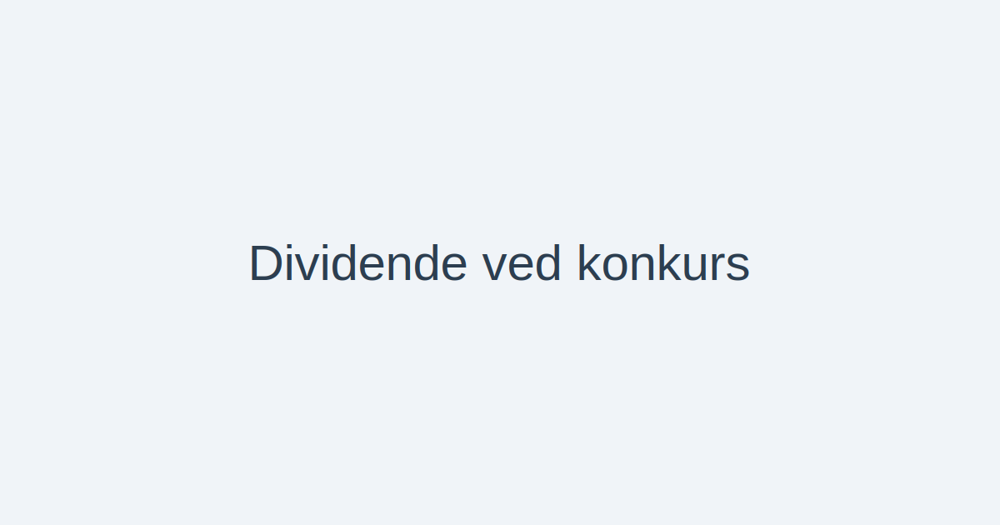

---
title: "Dividende ved konkurs"
meta_title: "Dividende ved konkurs"
meta_description: 'Dividende ved konkurs handler om fordelingen av tilgjengelige midler i et konkursbo etter at alle krav er oppfylt i henhold til konkursloven.'
slug: dividende-ved-konkurs
type: blog
layout: pages/single
---

Dividende ved konkurs handler om fordelingen av tilgjengelige midler i et konkursbo etter at alle krav er oppfylt i henhold til konkursloven.

En god forståelse av **prioriteringsrekkefølge**, **beregningsmetode** og praktiske eksempler er avgjørende for regnskapsførere, advokater og kreditorer.



## Hva er dividentemasse?

Dividentemassen er de midlene som er tilgjengelige for utdeling etter at alle *lovbestemte krav* og *konkursboets omkostninger* er dekket. Dette inkluderer ofte salg av eiendeler, innbetalinger fra debitorer og andre realisasjoner.

## Prioriteringsrekkefølge ved utdeling

For å sikre rettferdighet fastsetter konkursloven en **prioriteringsrekkefølge** for hvem som får dekket sine krav først:

| Prioritet | Krav/gruppe                | Kommentar                                         |
|:---------:|:---------------------------|:---------------------------------------------------|
| **1**     | Konkursboets omkostninger  | Kostnader for behandling og administrasjon av boet |
| **2**     | Prioriterte fordringer     | Lønnskrav, skatte- og avgiftskrav                 |
| **3**     | Sikrede fordringer         | Panterett i eiendeler                             |
| **4**     | Usikrede fordringer        | Uprioriterte kreditorer                           |
| **5**     | Aksjonærene                | Egenkapital / eventuelt utbytte                   |

## Beregning av divident

Selve **dividenten** beregnes ved å dele gjenværende midler på kravene i aktuell prioritet:

```text
Divident = (Tilgjengelige midler “ Sum krav i høyere prioritet) / Antall krav i denne prioritet
```

Eksempel:
* Tilgjengelige midler: 1 000 000 kr
* Sum krav i prioritet 1“2: 600 000 kr
* Antall usikrede krav (prioritet 4): 20

> Divident for prioritet 4 = (1 000 000 “ 600 000) / 20 = 20 000 kr per krav

## Praktiske hensyn og interne lenker

Ved håndtering av konkurs og dividentutbetaling bør du også kjenne til:

* [Hva er Konkurs?](/blogs/regnskap/konkurs "Hva er Konkurs? Juridiske og regnskapsmessige konsekvenser")
* [Tap på fordring](/blogs/regnskap/tap-pa-fordring "Tap på fordring i regnskap og konkurs")
* [Hva er kreditor?](/blogs/regnskap/hva-er-kreditor "Hva er Kreditor? Roller og rettigheter")

## Ofte stilte spørsmål

**Kan aksjonærer forvente divident ved konkurs?**  
I praksis får aksjonærer utbytte (divident) bare hvis det er midler igjen etter at alle kreditorer er fullt dekket.

**Hva skjer ved manglende dekning?**  
Hvis det ikke er nok midler til å dekke hele prioritet 5, får ingen aksjonærer utbetaling.

**Hvordan påvirker sikkerhet fordringshaverne?**  
Sikrede fordringer (prioritet 3) får ofte vesentlig høyere dekningsgrad enn usikrede fordringshavere.

Ved spørsmål om mer detaljerte krav og regnskapsmessig behandling, se [Konkursloven](/blogs/regnskap/hva-er-konkursloven "Hva er Konkursloven? Oversikt og viktige bestemmelser").


