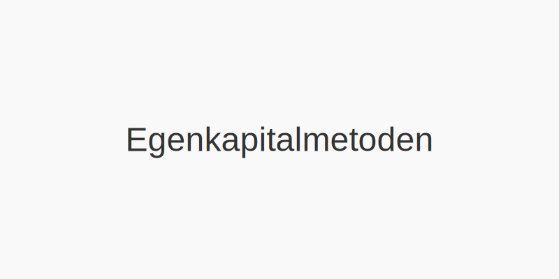

**Egenkapitalmetoden** er en regnskapsmetode som benyttes for investeringer i tilknyttede selskaper og felleskontrollert virksomhet (joint ventures). Metoden gir et mer rettvisende bilde av investeringens verdi ved å reflektere investorens andel av resultat og egenkapital i målforetaket.

## Hva er egenkapitalmetoden?

Egenkapitalmetoden blir brukt når en investor har **betydelig innflytelse**, men ikke kontroll, over et annet foretak. Dette innebærer vanligvis en eierandel på mellom 20 % og 50 % av stemmerettighetene.

- **Betydelig innflytelse**: Investor deltar i beslutninger om finansiell og driftsmessig politikk.
- **Ingen kontroll**: Investor styrer ikke foretakets overordnede retning.

Metoden skiller seg fra [kostmetoden](/blogs/regnskap/hva-er-kostmetoden "Hva er Kostmetoden? Regnskapsføring av Investeringer med Kostpris") ved at investeringen måles i takt med målforetakets egenkapitalendringer.

## NÃ¥r brukes egenkapitalmetoden?

| Eierandel     | Betegnelse                      | Regnskapsmetode                |
| ------------- | ------------------------------- | ------------------------------ |
| < 20 %        | Minimal innflytelse             | Kostmetoden                    |
| 20 %“50 %     | Betydelig innflytelse           | Egenkapitalmetoden             |
| > 50 %        | Kontroll (konsern)              | Konsolidering                  |

## Regnskapsføring med egenkapitalmetoden

Regnskapsføringen deles i to hovedtrinn:

1. **Innledende innregning** “ Investeringen innregnes til anskaffelseskost.
2. **Etterfølgende mÃ¥ling** “ Verdien justeres ved andel av mÃ¥lforetakets resultat og utbytte.

### Etterfølgende måling

| Hendelse                                         | Bokføring i investorens regnskap           |
| ------------------------------------------------- | ------------------------------------------ |
| Andel av resultat i målforetaket                  | Øker investering (± Resultatandel)         |
| Utbytte mottatt fra mÃ¥lforetaket                  | Reduserer investering (“ Mottatt utbytte)  |

## Eksempel på bokføring

La oss anta at investor A eier 30 % av aksjene i selskap B. B oppnår et årsresultat på 1 000 000 NOK og utbetaler 200 000 NOK i utbytte.

| Dato       | Konto                             | Debet (NOK)  | Kredit (NOK) |
| ---------- | --------------------------------- | ------------ | ------------ |
| 31.12 År 1 | Investering i tilknyttet selskap  | 300 000      |              |
|            | Resultatandel tilknyttet selskap  |              | 300 000      |
|            |                                   |              |              |
| 20.01 År 2 | Bankkonto                         | 60 000       |              |
|            | Investering i tilknyttet selskap  |              | 60 000       |

**Forklaring:**

- Årsresultat × 30 % = 1 000 000 × 0,30 = 300 000 NOK.
- Utbytte × 30 % = 200 000 × 0,30 = 60 000 NOK.

## Sammenligning med andre metoder

| Metode             | Måling ved anskaffelse | Etterfølgende måling                      |
| ------------------- | ---------------------- | ----------------------------------------- |
| Kostmetode         | Kostpris               | Uendret (kun nedskrivning ved verdifall)  |
| Egenkapitalmetoden  | Kostpris               | Justeres for andel av resultat og utbytte |
| Konsolidering      | Justert balanse         | Full konsolidering av balanse og resultat  |

## Regnskapsstandarder

Egenkapitalmetoden er beskrevet i:

- **NRS 8** “ Arbeidsgruppekontrollert virksomhet og tilknyttede foretak
- **IFRS IAS 28** “ Investments in Associates and Joint Ventures

## Fordeler og ulemper

**Fordeler:**

- Gir et mer korrekt bilde av investert kapital over tid
- Reflekterer investorens andel av resultat

**Ulemper:**

- Krever detaljert informasjon fra målforetaket
- Kan gi kompleks rapportering ved flere tilknytninger

## Relaterte artikler

- [Hva er datterselskap?](/blogs/regnskap/hva-er-datterselskap "Hva er datterselskap? Forklaring av Kontroll og Konsernregnskap")
- [Hva er investering?](/blogs/regnskap/hva-er-investere "Hva er å Investere? Komplett Guide til Investeringer i Regnskap")
- [Hva er konsolidering?](/blogs/regnskap/hva-er-konsolidering "Hva er Konsolidering? Komplett Guide til Konsernregnskap")

***
_Artikkelen er sist oppdatert: {{ lastReviewed | date("YYYY-MM-DD") }}_

