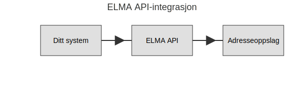

**ELMA** (Elektronisk mottaker- og avsenderregister) er Norges sentrale **digital adresse**-register for mottakere og avsendere av elektroniske meldinger, inkludert [EHF](/blogs/regnskap/hva-er-ehf "Hva er EHF? En Guide til Norsk Elektronisk Handelsformat"), [eFaktura](/blogs/regnskap/hva-er-efaktura "Hva er eFaktura? Komplett Guide til Elektronisk Fakturering i Norge") og annen digital post. Registeret driftes av [Brønnøysundregistrene](/blogs/regnskap/bronnoysundregistrene "Hva er Brønnøysundregistrene? En Guide til Norges Registerforvalter") og er en kritisk komponent i Norges infrastruktur for digital meldingsutveksling.

*Se ogsÃ¥: [Integrasjon](/blogs/regnskap/integrasjon "Integrasjon “ En Innføring i Integrasjonskonsepter i Regnskap").*

## Seksjon 1: Hva er ELMA?

ELMA er et offisielt **register** hvor virksomheter registrerer sine digitale adresser for å kunne motta og sende strukturerte meldinger elektronisk. Målet er å sikre at meldinger alltid når riktig mottaker, redusere feil ved manuelle adresseoppslag og legge til rette for automatiserte arbeidsflyter.

| Felt                        | Beskrivelse                                                                                         |
|-----------------------------|-----------------------------------------------------------------------------------------------------|
| **Organisasjonsnavn**       | Navnet på virksomheten registrert i [Enhetsregisteret](/blogs/regnskap/hva-er-enhetsregisteret "Hva er Enhetsregisteret?"). |
| **ServiceAdressetype**      | Type adresse, for eksempel **EHF**, **Peppol** eller **eFaktura**.                                   |
| **Adresse**                 | Den unike digitale adressen (ID) som brukes ved sending av meldinger.                                |
| **Kontaktpunkt**            | Teknisk endepunkt for kommunikasjon, ofte en URL eller URI for API-tilgang.                          |

## Seksjon 2: Hvorfor bruke ELMA?

Ã… integrere med ELMA gir flere fordeler:

* **Standardisert data**: Sørger for at alle parter benytter samme adresseinformasjon.
* **Automatisering**: Gjør det mulig å slå opp mottakeres adresser programmatisk via API.
* **Redusert risiko**: Minimerer feil ved manuelle adresseoppslag.
* **Offentlig krav**: Mange offentlige tjenester krever at adressene er registrert i ELMA.

## Seksjon 3: Registreringsprosess

For å ta i bruk ELMA må virksomheter registrere seg og legge inn adresseinformasjon:

## Seksjon 4: API-integrasjon

ELMA tilbyr et REST-basert API slik at systemer kan slå opp og oppdatere adresser automatisk:

En typisk integrasjon involverer følgende steg:

1. Autentisering mot ELMA API med sertifikat eller OAuth.
2. Hent mottakerens digitale adresse ved å sende organisasjonsnummer.
3. Bruk adressen for å sende fakturaer, meldinger eller annen kommunikasjon.

## Seksjon 5: Sammenheng med øvrige digitale tjenester

ELMA er tett integrert med flere sentrale digitale løsninger i norsk regnskap:

| Tjeneste              | Bruk av ELMA                                                                                                         |
|-----------------------|----------------------------------------------------------------------------------------------------------------------|
| **eFaktura**          | Slår opp mottakerens fakturaadresse i ELMA før sending av eFaktura.                                                   |
| **EHF**               | Henter EHF-adresse fra ELMA for å sikre korrekt levering av elektronisk handelsformat.                                |
| **Altinn**            | Kombineres med ELMA for digital adressering av rapporteringsmeldinger og skjemaer.                                     |

Ved å forstå og benytte ELMA sikrer virksomheter en **pålitelig**, **effektiv** og **feilfri** digital meldingsflyt.

## Videre lesning

* [Hva er Altinn?](/blogs/regnskap/hva-er-altinn "Hva er Altinn? Norges Digitale Portal for Næringsliv og Privatpersoner")
* [Hva er elektronisk fakturering?](/blogs/regnskap/hva-er-elektronisk-fakturering "Hva er Elektronisk Fakturering? Komplett Guide til Digitale Fakturaløsninger")
* [Hva er eFaktura?](/blogs/regnskap/hva-er-efaktura "Hva er eFaktura? Komplett Guide til Elektronisk Fakturering i Norge")
* [Hva er EHF?](/blogs/regnskap/hva-er-ehf "Hva er EHF? En Guide til Norsk Elektronisk Handelsformat")
* [Hva er Brønnøysundregistrene?](/blogs/regnskap/bronnoysundregistrene "Hva er Brønnøysundregistrene? En Guide til Norges Registerforvalter")

