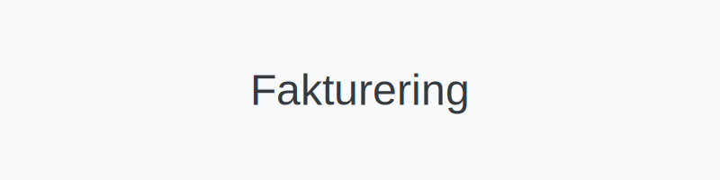
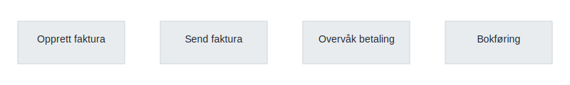

---
title: "Fakturering"
seoTitle: "Fakturering | Prosess, beste praksis og regnskapskobling"
description: "Fakturering er å opprette, sende og følge opp fakturaer. Lær steg i prosessen, typer fakturering og hvordan du automatiserer og kobler mot regnskap."
summary: "Kort oversikt over faktureringsprosessen og tips for raskere betaling og bedre likviditet."
---

**Fakturering** er prosessen med å **opprette**, **sende** og **følge opp fakturaer** for varer eller tjenester levert av en bedrift. Fakturering er et sentralt element i **likviditetsstyring**, **regnskapsføring** og **økonomisk rapportering**.
*Se også: [Ordrebekreftelse](/blogs/regnskap/ordrebekreftelse "Ordrebekreftelse i Regnskap: Komplett Guide til Ordrebekreftelser")*  

## Hva er Fakturering?

Fakturering omfatter alle aktiviteter knyttet til utstedelse av fakturaer, fra utarbeidelse av fakturagrunnlag til mottak og oppfølging av betalinger. En god faktureringsprosess sikrer:

* **Korrekt innhold** i henhold til lovpålagte krav
* **Rask utsendelse** og oppfølging for god likviditet
* **Automatisering** for å redusere manuelt arbeid
* **Integrasjon** med regnskapssystemer og betalingsløsninger

## Steg i Faktureringsprosessen

| Steg | Beskrivelse |
|------|-------------|
| **1. Opprett faktura** | Samle kundeinformasjon, leveranse- og prisdetaljer |
| **2. Send faktura** | Lever faktura elektronisk eller manuelt til kunden |
| **3. Overvåk betaling** | Følg opp forfall, avklar tvister og send purringer ved behov |
| **4. Bokføring** | Registrer betalinger og avslutt bilag i regnskapet |

## Typer Fakturering

Det finnes flere metoder for å sende fakturaer i Norge:

* **Papirfakturaer:** Tradisjonell utskrift og postlevering
* **PDF via e-post:** Enkel distribusjon med digital kopi
* **Elektronisk fakturering:** Strukturert via [EHF](/blogs/regnskap/hva-er-ehf "Hva er EHF? Komplett Guide til Elektronisk Handelsformat i Norge") eller [eFaktura](/blogs/regnskap/hva-er-efaktura "Hva er eFaktura? Komplett Guide til Elektronisk Fakturering i Norge")

## Beste praksis og tips

* Bruk et [fakturaprogram](/blogs/regnskap/fakturaprogram "Fakturaprogram: Komplett Guide til Digital Fakturering og Økonomistyring") for å **automatisere** arbeidsflyten.
* Sørg for å etterleve [bokføringsforskriften](/blogs/regnskap/hva-er-bokforingsforskriften "Hva er Bokføringsforskriften? Guide til Bokføringskrav i Norge") for å unngå revisjonsavvik.
* Implementer automatiske purringer for å forbedre **kontantstrømmen**.
* Dokumenter interne rutiner for fakturering og gi ansatte nødvendig opplæring.

Se også [Hva er en faktura?](/blogs/regnskap/hva-er-en-faktura "Hva er en Faktura? En Guide til Norske Fakturakrav") for en dypere gjennomgang av fakturaens innhold og krav.

