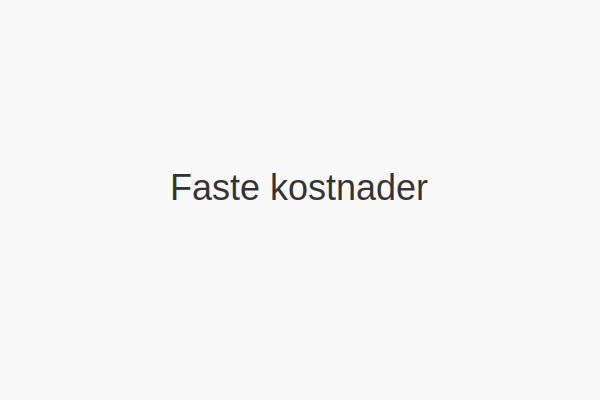
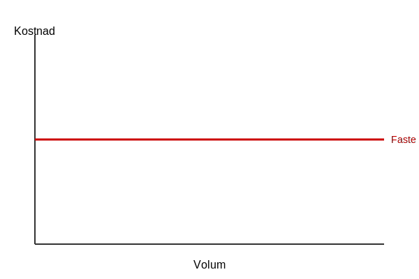

---
title: "Hva er Faste kostnader?"
seoTitle: "Hva er Faste kostnader?"
meta_description: '**Faste kostnader** er kostnader som forblir _konstante_ uavhengig av aktivitets- eller produksjonsvolum innenfor et relevant tidsintervall. Disse kostnadene mÃ...'
slug: faste-kostnader
type: blog
layout: pages/single
---

**Faste kostnader** er kostnader som forblir _konstante_ uavhengig av aktivitets- eller produksjonsvolum innenfor et relevant tidsintervall. Disse kostnadene må dekkes uansett om virksomheten produserer varer eller leverer tjenester.

For en komplett oversikt over kostnadstyper og kostnadskonsepter i regnskap, se [Hva er kostnader?](/blogs/regnskap/hva-er-kostnader "Hva er Kostnader i Regnskap? Komplett Guide til Kostnadstyper og Regnskapsføring").

Disse kostnadene er avgjørende i [budsjettering](/blogs/regnskap/hva-er-budsjettering "Hva er Budsjetering? Komplett Guide til Budsjettplanlegging"), [kostnadsanalyse](/blogs/regnskap/hva-er-dekningsbidrag "Hva er Dekningsbidrag? Beregning og Analyse for Bedre Lønnsomhet") og [break-even analyse](/blogs/regnskap/hva-er-nullpunktsomsetning "Hva er Nullpunktsomsetning (Break-Even Omsetning)?"). For mer om **variable kostnader**, se [Variable kostnader](/blogs/regnskap/variable-kostnader "Hva er Variable kostnader? Definisjon, Eksempler og Regnskapsføring"), [Direkte kostnader](/blogs/regnskap/hva-er-direkte-kostnader "Hva er Direkte kostnader? Definisjon, Eksempler og Regnskapsføring") og [Indirekte kostnader](/blogs/regnskap/hva-er-indirekte-kostnader "Hva er Indirekte kostnader? Definisjon, Eksempler og Regnskapsføring").

Det er viktig å skille mellom kostnad og [utgift](/blogs/regnskap/utgift "Utgift “ Komplett Guide til Utgifter i Norsk Regnskap"); les mer i vår artikkel om utgift.

## Kjennetegn ved faste kostnader

Faste kostnader har flere viktige egenskaper som skiller dem fra variable kostnader:

* **Konstans:** Beløpet endres ikke med produksjons- eller aktivitetsvolum.
* **Tidsaspekt:** Påløper periodisk, for eksempel månedlig eller årlig.
* **Dekningskrav:** Må dekkes av driftsinntekter før overskudd kan realiseres.

## Eksempler på faste kostnader

| Kostnadstype          | Eksempel                          |
|-----------------------|-----------------------------------|
| **Husleie og lokaler**| Kontorleie, fabrikkbygg           |
| **Fast lønn**         | Lønn til administrasjon           |
| **Forsikringer**      | Bygnings- og ansvarsforsikring    |
| **Avskrivninger**     | Maskiner, kjøretøy og inventar    |
| **Lisenser og abonnementer** | Programvareabonnementer    |

## Betydning i regnskap og analyse

I regnskapet inngår faste kostnader som en del av [driftskostnader](/blogs/regnskap/hva-er-driftskostnader "Hva er Driftskostnader? Typer, Beregning og Regnskapsføring - Komplett Guide"). Ved å skille dem fra variable kostnader kan virksomheter:

* Lage nøyaktige budsjetter og prognoser.
* Utføre break-even analyser for å finne nullpunktet.
* Optimalisere kostnadsstruktur og prisstrategi.

## Regnskapsføring av faste kostnader

Faste kostnader bokføres vanligvis på separate kontoer for å sikre oversikt og kontroll. Eksempler:

* Konto for husleie og lokalkostnader
* Konto for lønn og personalrelaterte kostnader
* Konto for avskrivninger av anleggsmidler
* Konto for forsikringspremier og abonnementer

## Oppsummering

**Faste kostnader** representerer de uunngåelige, konstante utgiftene som en virksomhet må dekke uavhengig av aktivitetsnivå. Ved å forstå og håndtere faste kostnader kan bedrifter ta bedre beslutninger om budsjettering, prissetting og lønnsomhet.

