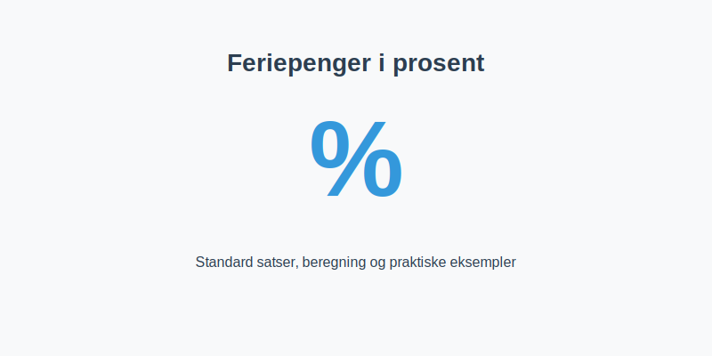

---
title: "Feriepenger i prosent"
meta_title: "Feriepenger i prosent"
meta_description: '**Feriepenger i prosent** er satsen som benyttes for Ã¥ beregne **feriepenger** i henhold til **[Ferieloven](/blogs/regnskap/ferieloven "Ferieloven “ Lov om f...'
slug: feriepenger-i-prosent
type: blog
layout: pages/single
---

**Feriepenger i prosent** er satsen som benyttes for Ã¥ beregne **feriepenger** i henhold til **[Ferieloven](/blogs/regnskap/ferieloven "Ferieloven “ Lov om ferie av 29. april 1988 nr. 21")**. Ã… forstÃ¥ de ulike prosentsatsene, unntakene og praktiske beregningseksempler sikrer korrekt hÃ¥ndtering av feriepengeplikten.



## Hvorfor bruke prosent for feriepenger?

Bruk av prosent som beregningsmetode for feriepenger gjør det:

* **Enkelt å standardisere** på tvers av ansatte og lønnsarter
* **Rettferdig** ved at satsen alltid er proporsjonal med opptjent inntekt
* **Lovpålagt** gjennom Ferielovens bestemmelser om feriepengesats

Ved å ha faste prosentsatser unngår bedriften manuelt kompliserte omregninger ved lønnsvariasjoner.

## Standard feriepengesatser

| Gruppe                           | Feriepengesats |
|----------------------------------|---------------:|
| Ansatte under 60 år              | **10,2%**      |
| Ansatte over 60 år               | **12,5%**      |
| Særskilte tariffavtaler          | *Varierer*     |

Se også artikkelen [Hva er Feriepenger?](/blogs/regnskap/hva-er-feriepenger "Hva er Feriepenger? En Guide til feriepengeberegning og regnskapsføring") for helhetlig gjennomgang av feriepengeberegning og regnskapsføring.

## Beregning av feriepenger i prosent

For å beregne feriepenger multipliseres feriepengegivende inntekt med gjeldende prosentsats.

1. Identifiser feriepengegivende inntekt (lønn, overtid, tillegg, mv.)
2. Velg korrekt feriepengesats basert på ansattkategori
3. Utfør beregning: **Feriepenger = Inntekt × Prosentsats**

```text
Feriepenger = 505 000 kr × 10,2% = 51 510 kr
```

## Praktiske eksempler

| Eksempel                         | Inntekt (kr) | Sats   | Feriepenger (kr) |
|----------------------------------|-------------:|-------:|-----------------:|
| Fastlønn + tillegg               |     550 000  | 10,2%  |          56 100  |
| Ansatt over 60 år (samme inntekt)|     550 000  | 12,5%  |          68 750  |

## Unntak og spesielle tilfeller

Noen situasjoner krever avvikende prosentsatser eller tilpasninger:

* [Tariffavtaler](/blogs/regnskap/tariff "Tariff i Norsk Regnskap") kan gi høyere satser enn standard
* **Langvarige ansatte** får ekstra ferieuke etter ansiennitet
* **Deltidsansatte** bruker samme prosentsats, men lavere grunnlag

For detaljert diskusjon om grunnlaget for feriepenger, se [Feriepengegrunnlag](/blogs/regnskap/feriepengegrunnlag "Feriepengegrunnlag: Grunnlag for beregning av feriepenger i Norge").

## Relevans for regnskap og bokføring

Å kjenne prosentsatsene er avgjørende ved:

* **Løpende avsetning** av feriepenger hver måned
* **Periodisering** i regnskapet (konto 2940 / 5180)
* **Ã…rlig avstemming** av feriepengegjeld og utbetalinger

Se vår guide [Hva er Feriepenger?](/blogs/regnskap/hva-er-feriepenger "Hva er Feriepenger? En Guide til feriepengeberegning og regnskapsføring") for utfyllende regnskapsinstruks.

## Oppsummering

**Feriepenger i prosent** gir en enkel og lovpålagt metode for å sikre korrekt kompensasjon til ansatte. Ved å følge standard satser, kjenne unntak og bruke klare beregningseksempler, oppnås både **nøyaktighet** og **etterlevelse** av ferielovens regler.

For flere verktøy og illustrasjoner knyttet til feriepenger og lønnsregnskap, se relaterte artikler om [arbeidsgiveravgift](/blogs/regnskap/hva-er-arbeidsgiveravgift "Hva er Arbeidsgiveravgift? Satser, Beregning og Regnskapsføring") og [A-ordningen](/blogs/regnskap/hva-er-a-ordningen "Hva er A-ordningen? Rapportering, Frister og Praktisk Håndtering").


