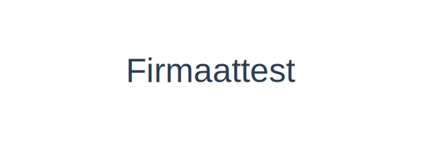
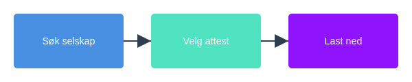

---
title: "Firmaattest"
meta_title: "Firmaattest"
meta_description: 'En **firmaattest** er et offisielt dokument utstedt av [Brønnøysundregistrene](/blogs/regnskap/bronnoysundregistrene "Brønnøysundregistrene - Oversikt over ...'
slug: firmaattest
type: blog
layout: pages/single
---

En **firmaattest** er et offisielt dokument utstedt av [Brønnøysundregistrene](/blogs/regnskap/bronnoysundregistrene "Brønnøysundregistrene - Oversikt over Norske Registere") som bekrefter de registrerte opplysningene om et selskap i [Foretaksregisteret](/blogs/regnskap/ansvarlig-selskap "Hva er Ansvarlig Selskap?"). Firmaattesten er et av de viktigste dokumentene for å vise at et selskap er lovlig registrert og kan brukes i en rekke sammenhenger, for eksempel ved søknad om kreditt, inngåelse av kontrakter og offentlig rapportering.

## Hva inneholder en Firmaattest?

| **Felt**                  | **Beskrivelse**                                                 |
|---------------------------|-----------------------------------------------------------------|
| Utstedelsesdato           | Dato for når attestasjonen ble generert                         |
| Foretaksnavn              | Det offisielle navnet på selskapet                              |
| Organisasjonsnummer       | Selskapets [organisasjonsnummer](/blogs/regnskap/hva-er-virksomhetsnummer "Hva er et Virksomhetsnummer?") |
| Organisasjonsform         | Selskapsform, for eksempel aksjeselskap (AS) eller enkeltpersonforetak (ENK) |
| Registrert virksomhetsadresse | Adresse registrert i Foretaksregisteret                     |
| Styrerepresentanter       | Navn på registrerte styremedlemmer                              |
| Selskapets status         | Status i Foretaksregisteret (aktiv, under avvikling, slettet)   |

## Hvorfor er en Firmaattest viktig?

* **Bevis for registrering:** Dokumenterer at selskapet er lovlig registrert i [Foretaksregisteret](/blogs/regnskap/ansvarlig-selskap "Hva er Ansvarlig Selskap?").
* **Kredittvurdering:** Ofte brukt av banker og leverandører ved vurdering av kreditt.
* **Kontraktsinngåelse:** Viser motparter at selskapet eksisterer og har nødvendig **myndighet** til å inngå avtaler.
* **Offentlig rapportering:** Kreves i enkelte offentlige etater som en del av registrerings- og rapporteringsprosesser, for eksempel [Enhetsregisteret](/blogs/regnskap/enhetsregisteret "Hva er Enhetsregisteret?").

## Hvordan bestille en Firmaattest?

1. Gå til [Brønnøysundregistrenes nettjeneste](/blogs/regnskap/bronnoysundregistrene "Brønnøysundregistrene - Oversikt over Norske Registere") eller bruk [Altinn](/blogs/regnskap/hva-er-altinn "Hva er Altinn? En Guide til Offentlige Tjenester").
2. Søk opp selskapet med **organisasjonsnummer** eller navn.
3. Velg **Firmaattest** som dokumenttype.
4. Betal påkrevd gebyr og last ned attestasjonen som PDF eller *XML*-fil.
5. Motta dokumentet umiddelbart eller innen kort tid for bruk.

## Typer Firmaattester

| **Type attest**          | **Bruksområde**                                                 |
|--------------------------|-----------------------------------------------------------------|
| Standard firmaattest     | Fullstendig oversikt over registrerte opplysninger               |
| Forenklet firmaattest    | Kun oversikt over utvalgte grunnleggende felt (navn og org.nr.) |
| Historisk attest         | Oversikt over tidligere registrerte data og endringstidspunkt   |

## Relaterte artikler

* Se også [Hva er en Faktura?](/blogs/regnskap/hva-er-en-faktura "Hva er en Faktura? En Guide til Norske Fakturakrav").
* Les mer om [Organisasjonsnummer](/blogs/regnskap/hva-er-virksomhetsnummer "Hva er et Virksomhetsnummer?").
* Lær om [Foretaksregisteret](/blogs/regnskap/ansvarlig-selskap "Hva er Ansvarlig Selskap?").
* Les mer om [Skatteattest](/blogs/regnskap/skatteattest "Skatteattest “ Hva er en skatteattest? En Komplett Guide").

