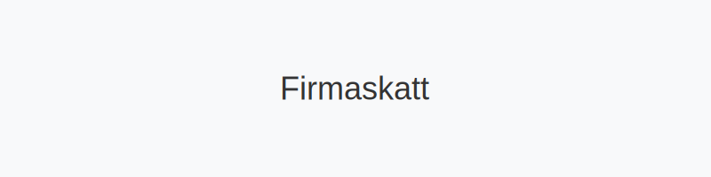

**Firmaskatt** (også kalt **selskapsskatt**) er den skatten et selskap må betale av sitt skattemessige overskudd. Firmaskatt er en sentral del av bedriftens **økonomiske planlegging** og påvirker både likviditet og lønnsomhet.

## Hva er firmaskatt?

Firmaskatt, eller selskapsskatt, beregnes på grunnlag av [alminnelig inntekt](/blogs/regnskap/alminnelig-inntekt "Alminnelig inntekt – Komplett guide") etter fradrag og justeringer. Formålet med firmaskatten er å finansiere offentlige tjenester og sikre korrekt fordeling av skattebyrden mellom virksomheter.

## Hvordan beregnes firmaskatt?

Beregningsgrunnlaget for firmaskatt består av følgende komponenter:

* **Alminnelig inntekt**: Netto skattegrunnlag etter fradrag ([alminnelig inntekt](/blogs/regnskap/alminnelig-inntekt "Alminnelig inntekt – Komplett guide"))  
* **Skattesats**: Gjeldende sats for selskaps­skatt (**22 %** per 2024)  
* **Forskuddsskatt**: Tidligere betalte terminer som motregnes ([betalbar skatt](/blogs/regnskap/betalbar-skatt "Betalbar skatt – Komplett guide til beregning og håndtering"))  

| **Element**           | **Beskrivelse**                                                                                  |
|-----------------------|--------------------------------------------------------------------------------------------------|
| Alminnelig inntekt    | [Alminnelig inntekt](/blogs/regnskap/alminnelig-inntekt "Alminnelig inntekt – Komplett guide")    |
| × Skattesats (22 %)   | Gjeldende sats for selskapsskatt                                                                   |
| − Forskuddsskatt      | Betalte terminer gjennom året ([betalbar skatt](/blogs/regnskap/betalbar-skatt "Betalbar skatt")) |
| **= Firmaskatt**      | Beløpet som skal innbetales til Skatteetaten                                                        |

## Satser for firmaskatt

Firmaskatt i Norge har en flat sats for de fleste selskapsformer:

| **Selskapsform**                   | **Skattesats** |
|------------------------------------|----------------|
| Aksjeselskap (AS/ASA) / ANS / DA   | **22 %**       |
| Enkeltpersonforetak (ENK)          | Progressiv personskatt                                                                              |

## Betalingsfrister for firmaskatt

Forskuddsskatt betales i fire terminer:

| **Termin**     | **Frist**      |
|---------------|----------------|
| 1. termin     | 15. februar    |
| 2. termin     | 15. april      |
| 3. termin     | 15. juni       |
| 4. termin     | 15. oktober    |

For full oversikt over betaling og bokføring, se [Betalbar skatt](/blogs/regnskap/betalbar-skatt "Betalbar skatt – Komplett guide til beregning og håndtering").

## Firmaskatt i regnskapet

Firmaskatt bokføres som kortsiktig gjeld og resultatpåvirkning:

* [Konto 2500 - Betalbar skatt, ikke utlignet](/blogs/kontoplan/2500-betalbar-skatt-ikke-utlignet "Konto 2500 - Betalbar skatt, ikke utlignet")  
* [Konto 8300 - Betalbar skatt](/blogs/kontoplan/8300-betalbar-skatt "Konto 8300 - Betalbar skatt")  

| **Konto** | **Debet**   | **Kredit**  |
|-----------|-------------|-------------|
| 8300      | 100 000 kr  |             |
| 2500      |             | 100 000 kr  |

## Oppsummering

* **Firmaskatt** (selskapsskatt) beregnes av skattemessig overskudd etter alminnelig inntekt.  
* Satsene er **22 %** for de fleste selskaper.  
* Betalingsfrister følger fire terminer gjennom året.  
* Bokføring skjer på konto 2500/8300 i regnskapet.

## Historisk utvikling av skattesatser

| **År**     | **Skattesats** |
|-----------|----------------|
| 2018      | 22 %           |
| 2019      | 22 %           |
| 2020      | 22 %           |
| 2021      | 22 %           |
| 2022      | 22 %           |
| 2023      | 22 %           |

## Fritaksmetoden og selskapsskatt

Utbytte og gevinst ved salg av aksjer i datterselskaper kan være helt eller delvis fritatt for selskapsskatt gjennom [fritaksmetoden](/blogs/regnskap/hva-er-fritaksmetoden "Hva er Fritaksmetoden? Komplett guide til skattefritak for utbytte").

## Skjermingsfradrag og selskapsskatt

Skjermingsfradraget reduserer den skattepliktige gevinsten ved utbytte i aksjeselskap. Les mer om [skjermingsfradrag](/blogs/regnskap/hva-er-skjermingsfradrag "Hva er Skjermingsfradrag? Beregning og anvendelse") for detaljer.

## Relatert lesning

* [Alminnelig inntekt](/blogs/regnskap/alminnelig-inntekt "Alminnelig inntekt – Komplett guide")  
* [Betalbar skatt](/blogs/regnskap/betalbar-skatt "Betalbar skatt – Komplett guide til beregning og håndtering")  
* [Utsatt skatt](/blogs/regnskap/hva-er-utsatt-skatt "Hva er Utsatt Skatt? Beregning og Regnskapsføring")  
* [Hva er et aksjeselskap?](/blogs/regnskap/hva-er-et-aksjeselskap "Hva er et Aksjeselskap?")  
