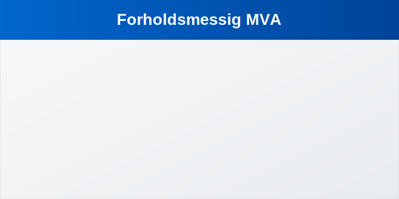
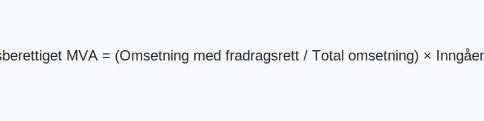

---
title: "Forholdsmessig MVA"
meta_title: "Forholdsmessig MVA"
meta_description: '**Forholdsmessig MVA** (også kalt *forholdsmessig fradragsrett*) er metoden for å fordele **inngående merverdiavgift** når en virksomhet har både avgiftspl...'
slug: forholdsmessig-mva
type: blog
layout: pages/single
---

**Forholdsmessig MVA** (også kalt *forholdsmessig fradragsrett*) er metoden for å fordele **inngående merverdiavgift** når en virksomhet har både avgiftspliktige og avgiftsfrie omsetninger. Denne metoden er viktig for å sikre korrekt fradrag av MVA i samsvar med [merverdiavgiftsloven](/blogs/regnskap/mva-loven "Mva-loven") og [MVA-plikt](/blogs/regnskap/mva-plikt "MVA-plikt").

## Hva er forholdsmessig MVA?

For virksomheter som både selger varer og tjenester med *fradragsrett* og uten, må inngående MVA fordeles på en *proportjonal* måte. **Forholdsmessig MVA** beregnes ved å se på andelen av omsetning som gir fradragsrett, i forhold til total omsetning:

### Formel for forholdsmessig MVA

$$
\\text{Fradragsberettiget MVA} = \\frac{\\text{Omsetning med fradragsrett}}
{\\text{Total omsetning}} \\times \\text{Inngående MVA}
$$

## Eksempelberegning

| Parameter                                    | Beløp      |
|----------------------------------------------|-----------:|
| Omsetning som gir fradragsrett               | 750 000 kr |
| Total omsetning                              |1 000 000 kr|
| **Fradragsprosent**                          | 75 %       |
| Inngående MVA                                 |125 000 kr |
| **Fradragsberettiget MVA**                   | 93 750 kr  |

## Steg for steg

1. Beregn forholdet mellom omsetning med fradragsrett og total omsetning.
2. Anvend forholdet på inngående MVA for å finne fradragsberettiget beløp.

## Retningslinjer og regelverk

Metoden for forholdsmessig fradragsrett er beskrevet i [merverdiavgiftsloven](/blogs/regnskap/mva-loven "Mva-loven") § 8-2 og utdypes i Skatteetatens veiledning. For mer om rapportering, se [momsregnskap](/blogs/regnskap/momsregnskap "Momsregnskap").

## Se også

- [MVA-plikt](/blogs/regnskap/mva-plikt "MVA-plikt")
- [Omvendt avgiftsplikt](/blogs/regnskap/omvendt-avgiftsplikt "Omvendt avgiftsplikt")
- [Mva-loven](/blogs/regnskap/mva-loven "Mva-loven")
- [Medsalgsplikt](/blogs/regnskap/medsalgsplikt "Hva er Medsalgsplikt? Komplett Guide til Medsalgsplikt og Merverdiavgift")

