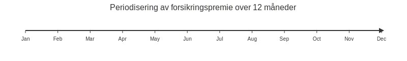

**Forsikringspremie** er en **forskuddsbetalt kostnad** som gir virksomheten forsikringsdekning over en bestemt periode. Denne artikkelen gir en grundig gjennomgang av hva **forsikringspremie** er, hvordan den **regnskapsføres**, periodiseres og klassifiseres i norsk regnskap.

## Seksjon 1: Definisjon og Konsept

En **forsikringspremie** er beløpet som betales på forhånd for forsikringsdekning. Forsikringstakeren kjøper beskyttelse mot økonomiske tap ved å betale premie til forsikringsselskapet. Premien avtales ofte for en periode, for eksempel 12 måneder, og må **periodiseres** i regnskapet for å reflektere kostnaden i den perioden dekningen gjelder.

For mer om periodisering, se [Hva er Periodisering?](/blogs/regnskap/hva-er-periodisering "Hva er Periodisering? Prinsipper og Praktiske Eksempler").

## Seksjon 2: Regnskapsføring og Periodisering

Når premie betales, bokføres den som en **forskuddsbetalt kostnad**, ofte som en omløpspost i balansen. Deretter kostnadsføres premien periodisk over forsikringsperioden.

### Steg for bokføring av forsikringspremie

* Først bokføres betaling som forskuddsbetalt kostnad:
  * Debet **Forskuddsbetalte kostnader** (f.eks. konto 1830)
  * Kredit **Bankinnskudd** (konto 1920)
* Deretter periodiseres premien månedlig (eller i andre perioder) til kostnad:
  * Debet **Forsikringskostnad** (konto 6300)
  * Kredit **Forskuddsbetalte kostnader** (konto 1830)

### Eksempel på periodisering

Tabellen nedenfor viser periodisering av en årsbetalingspremie på 12 000 kr over 12 måneder:

| MÃ¥ned    | Debet Forsikringskostnad (6300) | Kredit Forskuddsbetalte kostnader (1830) |
|----------|----------------------------------|------------------------------------------|
| Januar   | 1 000 kr                         | 1 000 kr                                 |
| Februar  | 1 000 kr                         | 1 000 kr                                 |
| Mars     | 1 000 kr                         | 1 000 kr                                 |
| …        | …                                | …                                        |
| Desember | 1 000 kr                         | 1 000 kr                                 |
| **Total**| **12 000 kr**                    | **12 000 kr**                            |

## Seksjon 3: Relevante Konsepter og Intern Linking

Forsikringspremier er et spesialtilfelle av [forskuddsbetaling](/blogs/regnskap/hva-er-forskuddsbetaling "Hva er Forskuddsbetaling? En komplett guide"), hvor kostnaden knyttes til en flerperiodisk avtale. Det er også nært knyttet til prinsippene for [avsetning](/blogs/regnskap/avsetning "Hva er Avsetning i Regnskap?") når usikre forpliktelser avdekkes, for eksempel når betaling til forsikringsselskapet avhenger av fremtidige erstatningsutbetalinger.

* **[Styreansvarsforsikring](/blogs/regnskap/styreansvarsforsikring "Hva er Styreansvarsforsikring? En Guide til Styremedlemsforsikring i Norge")**: Forsikring som dekker styremedlemmers erstatningsansvar

## Seksjon 4: Oppsummering

Forsikringspremie må regnskapsføres som forskuddsbetalt kostnad og periodiseres over forsikringsperioden. Korrekt bokføring sikrer at kostnaden matches mot riktig periode og gir et presist bilde av virksomhetens finansielle situasjon.

