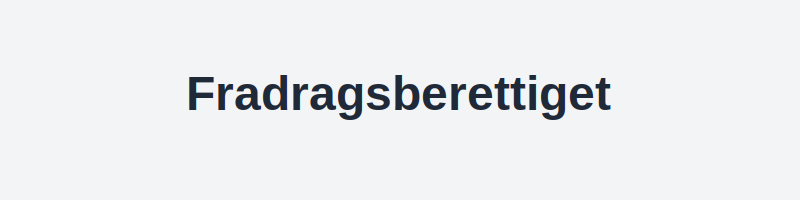

---
title: "Fradragsberettiget"
seoTitle: "Fradragsberettiget"
description: '**Fradragsberettiget** beskriver når en kostnad eller [utgift](/blogs/regnskap/utgift "Utgift “ Komplett Guide til Utgifter i Norsk Regnskap") kan trekkes fr...'
summary: "Hva betyr fradragsberettiget? Regler, eksempler og beste praksis."
---

**Fradragsberettiget** beskriver når en kostnad eller [utgift](/blogs/regnskap/utgift "Utgift “ Komplett Guide til Utgifter i Norsk Regnskap") kan trekkes fra i regnskapet eller skattemeldingen for å redusere det skattepliktige grunnlaget. Dette er et sentralt begrep i både bokføring og skatterett, og styrer hvilke kostnader som virksomheter og privatpersoner kan kreve fradrag for.

En kostnad er **fradragsberettiget** dersom den oppfyller samfunnsøkonomiske, juridiske og dokumentasjonsmessige krav. Begrepet dekker alt fra ordinære driftskostnader til særlige fradrag som minstefradrag, jordbruksfradrag eller særskilte bransjefradrag.

For en grundig gjennomgang av fradrag generelt, se også [Hva er fradrag?](/blogs/regnskap/hva-er-fradrag "Hva er fradrag? En guide til Norske Skatteregler").

For en praktisk innføring i hvordan man **fradragsfører** kostnader, se også [Hva er Fradragsføre?](/blogs/regnskap/hva-er-fradragsfoere "Hva betyr å fradragsføre i regnskap?").

For eksempler på delvis fradragsberettigede kostnader som faller under representasjon, se [Representasjon](/blogs/regnskap/representasjon "Representasjon “ Guide til representasjon og regnskapsmessig behandling i Norge").

## Grunnleggende prinsipper for fradragsberettigede kostnader

I norsk skatterett er hovedregelen at **fradrag** kun gis for kostnader pådratt for å erverve, sikre eller vedlikeholde skattepliktig inntekt (skatteloven § 6‘1). For at en kostnad skal være **[fradragsberettiget](/blogs/regnskap/fradragsberettiget "Hva betyr Fradragsberettiget?")**, må følgene vilkår være oppfylt:

* **Ervervstilknytning:** Kostnaden må ha klar kobling til inntektsgivende aktivitet
* **Faktisk pådratt:** Det må foreligge reell utbetaling eller forpliktelse
* **Dokumentert:** Gyldig [bilag](/blogs/regnskap/hva-er-bilag "Hva er bilag? Guide til regnskapsbilag og dokumentasjon") må finnes
* **Ikke privatforbruk:** Kostnaden må ikke være av privat karakter

## Eksempler på fradragsberettigede kostnadskategorier

| Kostnadskategori       | Forklaring                                                  |
|------------------------|-------------------------------------------------------------|
| Driftskostnader        | Lønn, husleie, strøm, vedlikehold, markedsføring           |
| Avskrivninger          | Fordeling av anskaffelseskostnader over levetiden           |
| Rentekostnader         | Renter på driftskreditt, investeringer og byggelån          |
| Tap og nedskrivninger  | Tap på fordringer og justering av verdier på eiendeler      |
| Minstefradrag          | Standardisert fradrag for lønnstakere og pensjonister       |

Se detaljerte regler i [Hva er avskrivning?](/blogs/regnskap/hva-er-avskrivning "Hva er avskrivning? Guide til avskrivningsmetoder"), [Hva er renter?](/blogs/regnskap/hva-er-rentekostnader "Hva er rentekostnader? Guide til rentefradrag") og [Hva er minstefradrag?](/blogs/regnskap/hva-er-minstefradrag "Hva er minstefradrag? Komplett guide").

## Dokumentasjonskrav og rutiner

God internkontroll og systematikk er avgjørende for korrekt fradragshåndtering:

1. **Bilagsmottak:** Registrer alle fakturaer og [kvitteringer](/blogs/regnskap/kvittering "Hva er Kvittering? En Guide til Kvitteringskrav i Norsk Regnskap") fortløpende
2. **Arkivering:** Oppbevar originaldokumentasjon i henhold til bokføringsloven
3. **Periodisering:** Match kostnader mot regnskapsperiode etter [periodiseringsprinsippet](/blogs/regnskap/hva-er-avstemming "Hva er avstemming? Guide til periodisering og avstemming")
4. **Gjennomgang:** Kontroller regelmessig at alle kostnader er relevante og dokumenterte

## Vanlige feil ved fradragsberegning

| Feiltype                        | Konsekvens                     | Løsning                                  |
|---------------------------------|--------------------------------|------------------------------------------|
| Manglende dokumentasjon         | Avvist fradrag ved kontroll    | Sikre fullstendige bilag og arkivrutiner |
| Privatandel ikke splittet ut    | Feil grunnlag for fradrag       | Fordel blandede kostnader etter bruk     |
| Ufullstendig periodisering      | Feil perioderesultat           | Implementer faste rutiner for periodisering |
| Overskridelse av fradragsgrenser| Skattetillegg og renter       | Følg særregler for representasjon og gaver |

## Tips for optimal fradragshåndtering

- **Automatiser** bilagsregistrering med [Fakturaprogram](/blogs/regnskap/fakturaprogram "Hva er fakturaprogram? Guide til automatisering av faktura")
- **Bruk kjørebok** for nøyaktig spor av fradragsberettigede bilkostnader ([Hva er kjørebok?](/blogs/regnskap/hva-er-kjorebok "Hva er kjørebok? Guide til kjørebok for bedrifter"))
- **Planlegg** investeringer med tanke på avskrivningssats og skattetiming
- **Hold deg oppdatert** på endringer i skattelovgivningen via [Skattefradrag-gaver](/blogs/regnskap/skattefradrag-gaver-veldedige-organisasjoner "Skattefradrag gaver til veldedige organisasjoner") og offentlige kilder

Ved å forstå og anvende prinsippene for hva som er **fradragsberettiget**, kan virksomheter og privatpersoner optimalisere skatteposisjonen og redusere risiko for feilrapportering.

