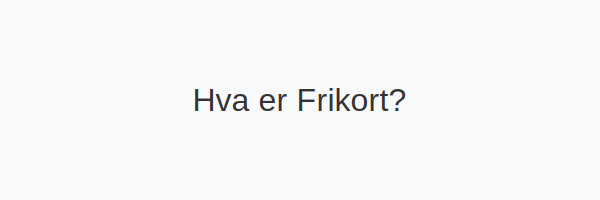

---
title: "Hva er Frikort?"
seoTitle: "Frikort | Slik fungerer frikort og frikortgrense"
description: 'Frikort er et skattekort som gjør at du ikke betaler skatt på inntekt opp til en bestemt grense. Slik fungerer frikort, hvem som kan få det, og hvilke grenser som gjelder.'
summary: "Frikort i Norge: hvordan det fungerer, hvem som kan få det og grenser."
---

**Frikort** er et [skattekort](/blogs/regnskap/skattekort "Hva er Skattekort? En komplett guide til skattekortregler i Norge") som gjør at du ikke betaler skatt på inntekt opp til en bestemt grense. Dette er et viktig verktøy i det norske skattesystemet for **lavinntektsgrupper** som studenter, pensjonister og deltidsansatte.

## Hva er Frikort?

**Frikort** er et skattekort som fritar deg for skattetrekk på inntekt opp til en fastsatt grense i løpet av et kalenderår. Systemet er utviklet for å:

* **Sikre skattefrihet** for grunnleggende inntekt
* **Redusere administrasjon** både for skattytere og [Skatteetaten](/blogs/regnskap/hva-er-altinn "Altinn - Digital Kommunikasjon med Offentlige Myndigheter")
* **Gi forutsigbarhet** i inntektsplanlegging
* **Styrke deltakelse** i arbeidslivet uten bekymring for skattetrekk

## Hvem kan få Frikort?

Du kan søke om frikort hvis du forventer å tjene under frikortgrensen som årlig:

* Studenter i deltids- eller feriejobb
* Pensjonister med lav pensjon
* Deltidsansatte og sesongarbeidere
* Personer med uføretrygd eller andre trygdeytelser
* Arbeidsledige som tar midlertidige oppdrag

## Slik søker du om Frikort

Prosessen for å få frikort er enkel og digital:

1. **Logg inn på Skatteetaten.no** med BankID eller annen godkjent ID
2. **Velg –œSkattekort–** og deretter –œSøk om frikort–
3. **Angi forventet inntekt** for kalenderåret
4. **Last opp dokumentasjon** som kontrakt eller pensjonsbeskrivelse
5. **Send inn søknaden** og vent på godkjenning

> **Tips:** Du kan endre forventet inntekt underveis dersom din situasjon endrer seg.

## Frikortgrense

Se [Hva er Frikortgrense?](/blogs/regnskap/hva-er-frikortgrense "Hva er Frikortgrense? Frikortgrenser og Skattefri Inntekt") for detaljer om grenser og beregning. Nedenfor er en forenklet oversikt for 2024:

| Kategori                      | Frikortgrense 2024 |
|-------------------------------|-------------------:|
| **Ordinær frikortgrense**     | 69–¯300 kr          |
| **Pensjonister (67“69 år)**   | 138–¯050 kr         |
| **Pensjonister (70 år og +)** | 138–¯050 kr         |

## Fordeler med Frikort

Å ha frikort gir flere fordeler:
* **Skattefri inntekt** opp til grensen
* **Enkel håndtering** uten trekk i lønnsutbetaling
* **Bedre økonomistyring** for lavinntektsgrupper
* **Komplementær bruk** sammen med ordinært skattekort

## Vanlige misforståelser

* **–œFrikort betyr ingen skatt i det hele tatt–**
  - Feil: Gjelder kun inntekt opp til grensen.
* **–œFrikort fornyes automatisk–**
  - Feil: Du må søke på nytt hvert år.
* **–œFrikort kan deles mellom arbeidsgivere–**
  - Feil: Frikort kan brukes hos én arbeidsgiver om gangen.

## Relaterte artikler

* [Hva er Frikortgrense?](/blogs/regnskap/hva-er-frikortgrense "Hva er Frikortgrense? Frikortgrenser og Skattefri Inntekt")
* [Hva er Forskuddstrekk?](/blogs/regnskap/hva-er-forskuddstrekk "Forskuddstrekk - Slik Beregnes Skattetrekk")
* [Hva er Altinn?](/blogs/regnskap/hva-er-altinn "Altinn - Digital Kommunikasjon med Offentlige Myndigheter")
* [Arbeidskontrakten](/blogs/regnskap/arbeidskontrakten "Arbeidskontrakten - Din Kontrakt med Arbeidsgiver")

