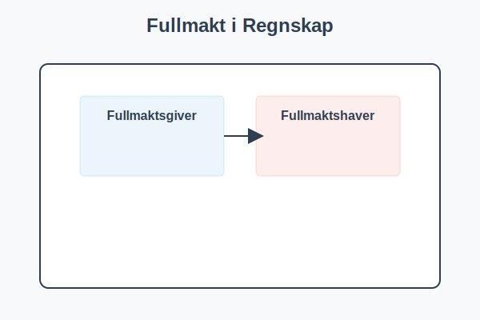

---
title: "Fullmakt"
meta_title: "Fullmakt"
meta_description: 'En **fullmakt** er et juridisk dokument som gir en person (*fullmaktsgiver*) rett til å la en annen (*fullmaktshaver*) handle på sine vegne i spesifikke saker...'
slug: fullmakt
type: blog
layout: pages/single
---

En **fullmakt** er et juridisk dokument som gir en person (*fullmaktsgiver*) rett til å la en annen (*fullmaktshaver*) handle på sine vegne i spesifikke saker eller generelt. I norsk regnskap er **fullmakt** avgjørende for å sikre korrekt autorisering av bilag, signaturer og økonomiske disposisjoner. Fullmakter kan være skriftlige eller muntlige, men for regnskapsformål anbefales det alltid skriftlig dokumentasjon i tråd med kravene i _bokføringsloven_ og _avtaleloven_.

## Typer Fullmakt

Det finnes flere typer fullmakter som brukes i næringslivet. Tabellen nedenfor gir en oversikt:

| Type Fullmakt        | Omfang                                      | Eksempel på Bruk                       |
|----------------------|---------------------------------------------|----------------------------------------|
| **Generell fullmakt**| Gir fullmaktshaver rett til å handle på vegne av fullmaktsgiver i alle angitte saker. | Daglig drift, betaling av regninger    |
| **Spesialfullmakt**  | Gir fullmaktshaver rett til å utføre en spesifikk handling eller avtale.            | Salg av eiendel, kontraktsinngåelse    |
| **Prokura**          | En særlig bedriftsfullmakt regulert av aksjeloven, som gir vidtgående representasjonsrett. | Representasjon for aksjeselskap        |

Se mer om [Aksjeloven](/blogs/regnskap/hva-er-aksjeloven "Hva er Aksjeloven? Regler for Aksjeselskaper i Norge") for detaljer om prokura.

## Fullmakt i Regnskapspraksis

I regnskapsavdelingen må fullmakter dokumenteres og oppbevares for revisjon og internkontroll. Nedenfor er noen viktige brukstilfeller:

* **Attestering:** Godkjenning av fakturaer og bilag krever ofte at fullmaktshaver har nødvendig fullmakt til å bekrefte forpliktelser. Se [attestering](/blogs/regnskap/hva-er-attestering "Hva er Attestering? En Komplett Guide til Bilagsbehandling og Godkjenning").
* **Firmaattest og Foretaksregisteret:** En skriftlig fullmakt kan vedlegges ved bestilling av [firmaattest](/blogs/regnskap/firmaattest "Firmaattest “ Hva er en firmaattest? En Komplett Guide") fra Brønnøysundregistrene.
* **Bankfullmakt:** Brukes for å autorisere banktransaksjoner og signering på bedriftskonto.
* **Kontraktsfullmakt:** Sikrer at avtaler signeres av personer med riktig delegasjon, for eksempel _arbeidskontrakten_ signert av daglig leder.

## Rutiner for Dokumentasjon og Oppbevaring

Ved regnskapsrevisjoner og bokettersyn er det avgjørende å kunne vise til fullmaktsdokumentasjon. Følgende punkter bør alltid være oppfylt:

1. Fullmakten bør være **skriftlig**, datert og signert av fullmaktsgiver.
2. Fullmaktsgiver må spesifiseres med navn, stilling og organisasjonsnummer.
3. Fullmaktshaverens identitet dokumenteres, for eksempel via personalregister.
4. Oppbevaring i henhold til kravene i _bokføringsloven_, som krever at bilag og tilhørende dokumentasjon oppbevares i minst 5 år.
5. Interne rutiner for periodisk gjennomgang og oppdatering av fullmakter.

## Oppsummering

Fullmakt er en grunnleggende del av intern kontroll og autorisasjonsprosesser i regnskap. Ved å dokumentere og følge klare rutiner for fullmaktshåndtering sikrer virksomheter at økonomiske disposisjoner utføres av riktige personer, og at kravene i _bokføringsloven_ og _avtaleloven_ etterfølges.

