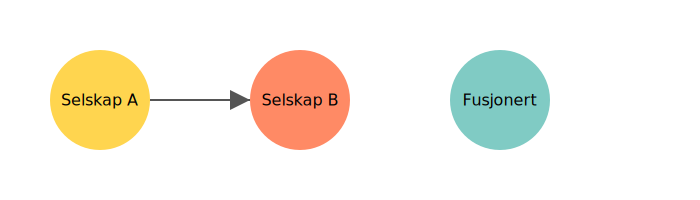

---
title: "Hva er Fusjon? En komplett guide til fusjon i norsk regnskap"
meta_title: "Hva er Fusjon? En komplett guide til fusjon i norsk regnskap"
meta_description: '**Fusjon** er en selskapsrettslig prosess hvor to eller flere selskaper slås sammen til én juridisk enhet. Fusjon er et sentralt verktøy for reorganisering, ...'
slug: fusjon
type: blog
layout: pages/single
---

**Fusjon** er en selskapsrettslig prosess hvor to eller flere selskaper slås sammen til én juridisk enhet. Fusjon er et sentralt verktøy for reorganisering, vekst og skattemessig planlegging i norsk næringsliv.

## Typer fusjon

| Type fusjon                                    | Beskrivelse                                                                                                   |
|------------------------------------------------|---------------------------------------------------------------------------------------------------------------|
| **Fusjon med opphør av overtakende selskap**   | Ett selskap overtar alle eiendeler og forpliktelser fra ett eller flere oppløsende selskaper (absorpsjonsfusjon). |
| **Fusjon ved ny stiftelse**                    | To eller flere selskaper oppløses samtidig og danner et nytt selskap som overtar eiendeler og forpliktelser (konsolideringsfusjon). |

## Juridisk rammeverk og prosess

Fusjonsprosessen er regulert av flere lover og forskrifter i Norge:

* **[Aksjeloven](/blogs/regnskap/hva-er-aksjeloven "Hva er Aksjeloven? Regler for Aksjeselskaper i Norge")** og **Allmennaksjeloven**
* **Regnskapsloven** kapittel om fusjoner og konsernregnskap
* **Brønnøysundregistrene** sin behandling av fusjonsmelding

## Steg i fusjonsprosessen

1. **Styreforslag** om fusjon med forslag til fusjonsplan og vilkår.
2. **Utarbeidelse av fusjonsplan** som spesifiserer bytteforhold, verdsettelse og tidsplan.
3. **Generalforsamling** i hvert selskap godkjenner fusjonsplanen.
4. **Fusjonsmelding** sendes til Brønnøysundregistrene for registrering.
5. **Oppgjør** etter fusjon, hvor aksjer utstedes eller overtas i henhold til bytteforhold.

## Regnskapsføring av fusjon

Ved fusjon overføres eiendeler og forpliktelser til overtakende eller nyetablert selskap. Eksempel på føring ved absorpsjonsfusjon:

| Konto                | Debet                      | Kredit            |
|----------------------|----------------------------|-------------------|
| Eiendeler            | Bokført verdi av eiendeler |                   |
| Egenkapital (bytte)  |                            | [Aksjekapital](/blogs/regnskap/hva-er-aksjekapital "Hva er Aksjekapital? Krav og Forklaring") og [overkurs](/blogs/regnskap/hva-er-overkurs "Hva er Overkurs? En Guide til Overkurs i Regnskap") ved fusjon |
| Forpliktelser        |                            | Bokført verdi av forpliktelser |

Se også vår guide til [Hva er konsern?](/blogs/regnskap/hva-er-konsern "Hva er Konsern? Komplett Guide til Konsernstrukturer") for regler om konsernregnskap etter fusjon.

## Skattemessige konsekvenser

Fusjon kan være skattemessig nøytral hvis vilkårene i **[Skatteloven](/blogs/regnskap/hva-er-skatteloven "Hva er Skatteloven? Komplett Guide til Norsk Skattelovgivning")** er oppfylt, særlig ved kontinuitetsprinsippet.

## Ofte stilte spørsmål

### Hva er forskjellen mellom absorpsjonsfusjon og konsolideringsfusjon?

Absorpsjonsfusjon innebærer at et overtakende selskap fortsetter, mens konsolideringsfusjon danner et nytt selskap, og de oppløsende selskaper opphører.

### NÃ¥r trer fusjonen i kraft?

Fusjonen trer i kraft når fusjonsmelding er registrert i Brønnøysundregistrene og vilkårene i fusjonsplanen er oppfylt.

## Videre lesning

* [Hva er fisjon?](/blogs/regnskap/hva-er-fisjon "Hva er Fisjon? Guide til Fisjon i Norsk Regnskap")
* [Hva er aksjeloven?](/blogs/regnskap/hva-er-aksjeloven "Hva er Aksjeloven? Regler for Aksjeselskaper i Norge")
* [Hva er konsern?](/blogs/regnskap/hva-er-konsern "Hva er Konsern? Komplett Guide til Konsernstrukturer")
* [Hva er emisjon?](/blogs/regnskap/emisjon "Hva er Emisjon? En komplett guide til kapitalforhøyelse og aksjeutstedelse")

