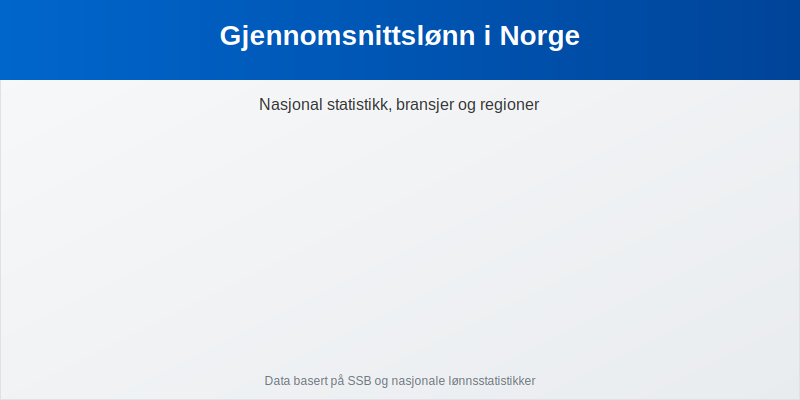

---
title: "Gjennomsnittslønn i Norge"
seoTitle: "Gjennomsnittslønn i Norge"
description: '**Gjennomsnittslønn i Norge** gir innsikt i hvordan lønnsnivået utvikler seg over tid, mellom bransjer og på tvers av regioner. Denne artikkelen hjelper deg...'
summary: "Gjennomsnittslønn i Norge: tall, bransjer, regioner og bruksområder."
---

**Gjennomsnittslønn i Norge** gir innsikt i hvordan lønnsnivået utvikler seg over tid, mellom bransjer og på tvers av regioner. Denne artikkelen hjelper deg med å forstå nasjonale trender, bransjesammenligninger og faktorene som påvirker lønnsnivået i norsk arbeidsliv.

## Nasjonale tall og utvikling

Tabellen under viser gjennomsnittlig årslønn i Norge de siste årene (bruttobeløp):

| År   | Gjennomsnittlig årslønn (kr) |
|------|-----------------------------:|
| 2020 | 598–¯746                      |
| 2021 | 613–¯598                      |
| 2022 | 628–¯622                      |
| 2023 | 640–¯000                      |

Tallene viser en jevn økning i årslønn, men for å forstå kostnadene knyttet til lønn i regnskapet kan du se nærmere på [lønns­kostnad](/blogs/regnskap/lonnskostnad "Hva er Lønnskostnad? Komplett Guide til Lønnskostnader").

## Gjennomsnittslønn etter bransje

Ulike sektorer har betydelig variasjon i lønnsnivå:

| Bransje           | Gj.snitt årslønn |
|-------------------|-----------------:|
| IT/Teknologi      | 800–¯000 kr       |
| Offentlig sektor  | 620–¯000 kr       |
| Bygg og anlegg    | 550–¯000 kr       |
| Helse             | 580–¯000 kr       |
| Undervisning      | 530–¯000 kr       |
| Finans            | 900–¯000 kr       |

For en full oversikt over ulike **lønns­komponenter**, se [Hva er Grunnlønn?](/blogs/regnskap/hva-er-grunnlonn "Hva er Grunnlønn i Regnskap?").

## Regional variasjon

Lønnsnivået varierer også mellom fylker og byområder:

* **Oslo:** 700–¯000 kr
* **Bergen:** 630–¯000 kr
* **Trondheim:** 620–¯000 kr
* **Distriktene (landsgjennomsnitt):** 580–¯000 kr

## Faktorer som påvirker lønnsnivået

Lønnsnivået i Norge avhenger av flere forhold:

* **Utdanning og kompetanse**
* **Arbeidserfaring/ansiennitet** (se [Ansiennitet](/blogs/regnskap/ansiennitet "Hva er Ansiennitet?"))
* **Bransjeregulering og tariffavtaler**
* **Geografisk lokasjon** og lokale levekostnader
* **Markedsforhold** og økonomisk konjunktur

## Bruk i regnskap og HR

For regnskapsførere og HR-ansvarlige er gjennomsnittslønn et viktig verktøy:

* **Budsjettplanlegging** og lønnsprognoser
* **Sammenligning** av lønnskostnader mellom avdelinger og bransjer
* **Benchmarking** med markedsdata
* **Rapportering** i årsregnskapet og til [Altinn](/blogs/regnskap/hva-er-altinn "Hva er Altinn?")

## Oppsummering

Gjennomsnittslønn i Norge gir et overblikk over hvordan norsk arbeidsliv belønner ulike yrker, bransjer og regioner. Ved å forstå disse tallene kan virksomheter sikre konkurransedyktige lønnstilbud, korrekt budsjett­håndtering og solid lønnsstyring.

