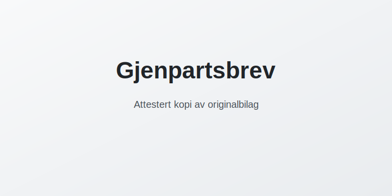

---
title: "Gjenpartsbrev"
meta_title: "Gjenpartsbrev"
meta_description: '**Gjenpartsbrev** er et attestert eksemplar av et originalbilag som benyttes for å sikre **dokumentasjon** og sporbarhet i regnskapet. Gjennom å utstede et gj...'
slug: gjenpartsbrev
type: blog
layout: pages/single
---

**Gjenpartsbrev** er et attestert eksemplar av et originalbilag som benyttes for å sikre **dokumentasjon** og sporbarhet i regnskapet. Gjennom å utstede et gjenpartsbrev kan bedriften håndtere kopier av viktige bilag uten å måtte distribuere originalen, samtidig som kravene i [bokføringsloven](/blogs/regnskap/hva-er-bokforingsloven "Hva er Bokføringsloven? Krav, regler og veiledning") og god regnskapsskikk oppfylles.

## Hva er et gjenpartsbrev?

Et **gjenpartsbrev** er en bekreftet kopi av et originalbilag, utstedt med attestasjon (signatur eller stempel) som bekrefter at kopien er identisk med originaldokumentet. Dette gir juridisk gyldighet til kopien og gjør det mulig å behandle dokumentasjonen uten å flytte eller kopiere originalen flere steder.

## Hvorfor bruke gjenpartsbrev?

Bruk av gjenpartsbrev har flere fordeler:

* Redusert risiko for tap eller skade på originalbilag
* Bedre intern kontroll og sporbarhet
* Enklere overlevering av dokumentasjon til eksterne parter
* Oppfyllelse av krav til bokføring og dokumentasjon

## Lovkrav og god regnskapsskikk

Bokføringsloven og bokføringsforskriften stiller klare krav til dokumentasjon av regnskapsbilag. Ved bruk av gjenpartsbrev må bedriften sikre at attestasjon og oppbevaring følger bestemmelsene for primærbilag og oppbevaringsplikt, slik det er beskrevet i [Oppbevaring av regnskapsmateriale](/blogs/regnskap/oppbevaring-av-regnskapsmateriale "Oppbevaring av Regnskapsmateriale - Krav, Frister og Beste Praksis i Norge").

## Krav til utforming av gjenpartsbrev

For at et gjenpartsbrev skal være gyldig, bør det inneholde:

| Element                | Beskrivelse                                                               |
|------------------------|---------------------------------------------------------------------------|
| Attestasjon            | Signatur eller stempel som bekrefter at kopien samsvarer med originalen    |
| Dato og sted           | Tidspunkt for attestasjon                                                  |
| Navn på attestant      | Fullt navn på den som attesterer                                          |
| Referanse til original | Referanse eller journalnummer til det originale bilaget                    |

## Hvordan utstede et gjenpartsbrev

Følg disse trinnene når du utsteder et gjenpartsbrev:

1. Finn originalbilaget og noter journal- eller referansenummer.
2. Lag en tydelig kopi av originaldokumentet.
3. Påfør attestasjon: signatur, stempel, dato og sted.
4. Legg til referanse til originalbilaget.
5. Distribuer gjenpartsbrevet til aktuelle mottakere og arkiver kopien.

## Oppbevaring og arkivering

Gjenpartsbrev regnes som primærdokumentasjon og må oppbevares sammen med øvrige bilag i henhold til [bokføringsloven](/blogs/regnskap/hva-er-bokforingsloven "Hva er Bokføringsloven? Krav, regler og veiledning"). Se også vår artikkel om [Oppbevaring av regnskapsmateriale](/blogs/regnskap/oppbevaring-av-regnskapsmateriale "Oppbevaring av Regnskapsmateriale - Krav, Frister og Beste Praksis i Norge") for detaljer om oppbevaringsfrister.

## Tabell: Sammenligning av dokumenttyper

| Dokumenttype    | Beskrivelse                                          |
|-----------------|------------------------------------------------------|
| Originalbilag   | Faktura, kvittering, kontrakt eller annet primærdokument |
| Gjenpartsbrev   | Attestert kopi av originalbilag med signatur eller stempel |

## Oppsummering

Gjenpartsbrev er et enkelt, men viktig verktøy i norsk regnskap for å sikre at dokumentasjon kan distribueres og oppbevares uten at originalbilag må håndteres konstant. Ved å følge kravene til attestasjon, referanse og oppbevaring, oppfyller gjenpartsbrev både lovkrav og prinsipper for god regnskapsskikk.

## Relaterte Artikler

* [Tinglyse i Regnskap](/blogs/regnskap/tinglyse "Tinglyse i Regnskap: En Guide til Tinglysing")

