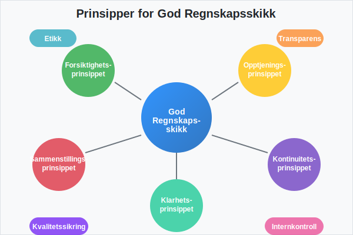
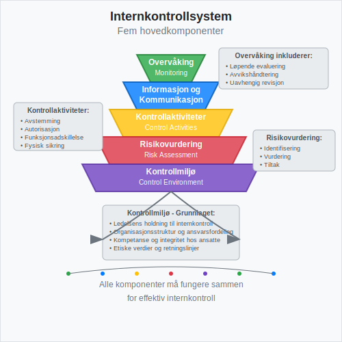
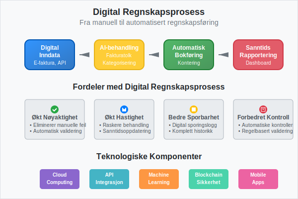
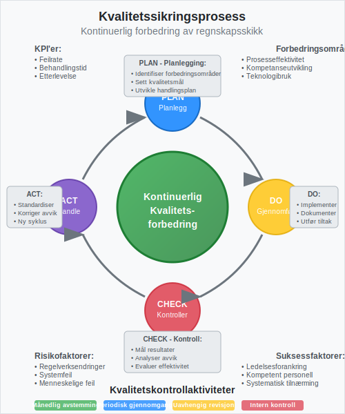

---
title: "God regnskapsskikk"
seoTitle: "God regnskapsskikk"
description: '**God regnskapsskikk** er fundamentet for pålitelig finansiell rapportering og en forutsetning for tillit i næringslivet. Det omfatter ikke bare teknisk korre...'
---

**God regnskapsskikk** er fundamentet for pålitelig finansiell rapportering og en forutsetning for tillit i næringslivet. Det omfatter ikke bare teknisk korrekthet i [bokføring](/blogs/regnskap/hva-er-bokforing "Hva er Bokføring? En Komplett Guide til Norsk Bokføringspraksis"), men også etiske standarder, transparens og systematisk kvalitetssikring. I Norge reguleres god regnskapsskikk gjennom [bokføringsloven](/blogs/regnskap/hva-er-bokforingsloven "Hva er Bokføringsloven? Komplett Guide til Norsk Bokføringslovgivning") og [bokføringsforskriften](/blogs/regnskap/hva-er-bokforingsforskriften "Hva er Bokføringsforskriften? Detaljert Guide til Norske Bokføringsregler"), som setter rammene for hvordan virksomheter skal føre sitt [regnskap](/blogs/regnskap/hva-er-regnskap "Hva er Regnskap? En Dybdeanalyse for Norge"). Moderne implementering av god regnskapsskikk støttes av [QA (Quality Assurance)](/blogs/regnskap/hva-er-qa-kvalitetssikring "Hva er QA (Quality Assurance) i Regnskap? Komplett Guide til Kvalitetssikring") systemer som sikrer kontinuerlig kvalitetskontroll.

For en oversikt over prioriteringen av rettskilder i norsk regnskap og god regnskapsskikk, se [Rettskildehierarkiet](/blogs/regnskap/rettskildehierarkiet "Rettskildehierarkiet i Norsk Regnskapsskikk").

## Grunnleggende Prinsipper for God Regnskapsskikk

God regnskapsskikk bygger på flere fundamentale prinsipper som sikrer kvalitet og pålitelighet i finansiell rapportering. Disse prinsippene er nedfelt i norsk lovgivning og internasjonale standarder.

### Regnskapsprinsipper i Norge

De grunnleggende regnskapsprinsippene som definerer god regnskapsskikk i Norge inkluderer:

| Prinsipp | Beskrivelse | Praktisk Anvendelse |
|----------|-------------|-------------------|
| **Forsiktighetsprinsippet** | Usikre tap skal regnskapsføres, usikre gevinster skal ikke regnskapsføres | Nedskrivning av [aktiva](/blogs/regnskap/hva-er-aktiva "Hva er Aktiva? En Komplett Guide til Eiendeler i Regnskap") ved verdifall |
| **Opptjeningsprinsippet** | Inntekter regnskapsføres når de er opptjent, ikke når de mottas | Periodisering av salg og tjenester |
| [**Sammenstillingsprinsippet**](/blogs/regnskap/sammenstillingsprinsippet "Hva er Sammenstillingsprinsippet?") | Kostnader knyttes til tilhørende inntekter i samme periode | Matching av kostnader og inntekter |
| **Kontinuitetsprinsippet** | Konsistent anvendelse av regnskapsprinsipper over tid | Samme [avskrivning](/blogs/regnskap/hva-er-avskrivning "Hva er Avskrivning? Komplett Guide til Avskrivninger i Regnskap")smetoder år for år |
| **Klarhetsprinsippet** | Regnskapet skal være klart og oversiktlig | Tydelig presentasjon i [balanse](/blogs/regnskap/hva-er-balanse "Hva er Balanse i Regnskap? Komplett Guide til Balansens Oppbygging og Funksjon") og resultatregnskap |

### Etiske Standarder og Integritet

God regnskapsskikk krever høye etiske standarder fra alle involverte parter. Dette inkluderer:

* **Objektivitet** - Regnskapsføring basert på faktiske forhold, ikke ønsketenkning
* **Integritet** - Ærlig og transparent rapportering av finansiell informasjon  
* **Profesjonell kompetanse** - Kontinuerlig utvikling av faglige ferdigheter
* **Konfidensialitet** - Beskyttelse av sensitiv finansiell informasjon
* **Profesjonell oppførsel** - Overholdelse av lover, forskrifter og faglige standarder

## Internkontroll og Kvalitetssikring

Effektiv internkontroll er en hjørnestein i god regnskapsskikk. Den sikrer at regnskapet er korrekt, komplett og i samsvar med gjeldende regelverk.

### Komponenter i Internkontroll

Et robust internkontrollsystem består av fem hovedkomponenter:

1. **Kontrollmiljø**
   * Ledelsens holdning til internkontroll
   * Organisasjonsstruktur og ansvarsfordeling
   * Kompetanse og integritet hos ansatte

2. **Risikovurdering**
   * Identifisering av risikoer for feil i regnskapet
   * Vurdering av sannsynlighet og konsekvens
   * Utvikling av risikoreduserende tiltak

3. **Kontrollaktiviteter**
   * [Avstemming](/blogs/regnskap/hva-er-avstemming "Hva er Avstemming i Regnskap? Komplett Guide til Regnskapsavstemming") av kontoer
   * Autorisasjonsprosedyrer for transaksjoner
   * Fysisk sikring av eiendeler
   * Funksjonsadskillelse mellom registrering og godkjenning

4. **Informasjon og Kommunikasjon**
   * Tilgang til relevant og pålitelig informasjon
   * Effektiv kommunikasjon av retningslinjer og prosedyrer
   * Rapportering av avvik og problemer

5. **Overvåking**
   * Løpende evaluering av internkontrollens effektivitet
   * [Avvikshåndtering](/blogs/regnskap/hva-er-avvikshandtering "Hva er Avvikshåndtering i Regnskap? Prosess, Metoder og Beste Praksis") og korrigerende tiltak
   * **[Uavhengig revisjon](/blogs/regnskap/revisjon "Revisjon “ Alt du trenger å vite om Revisjon i Norge")** og kontroll

### Dokumentasjon og Sporbarhet

God regnskapsskikk krever systematisk [dokumentasjon](/blogs/regnskap/hva-er-dokumentasjon-regnskap-bokforing "Hva er Dokumentasjon i Regnskap og Bokføring? Komplett Guide til Regnskapsdokumentasjon") av alle transaksjoner og prosesser:

* **Bilagsbehandling** - Alle transaksjoner må støttes av relevante [bilag](/blogs/regnskap/hva-er-bilag "Hva er Bilag i Regnskap? Komplett Guide til Regnskapsbilag og Dokumentasjon")
* **Sporbarhet** - Mulighet til å følge transaksjoner fra kilde til regnskap
* **Oppbevaring** - Sikker lagring av regnskapsmateriell i henhold til lovkrav
* **Tilgangskontroll** - Begrenset tilgang til regnskapsdata basert på roller og ansvar

## Regnskapsstandarder og Lovkrav

God regnskapsskikk i Norge følger et hierarki av regnskapsstandarder og lovkrav som sikrer konsistens og sammenlignbarhet. Det **[norske regnskapsstandardsystemet](/blogs/regnskap/norsk-regnskapsstandard-nrs "Norsk regnskapsstandard (NRS) - Komplett Guide til Norske Regnskapsstandarder")** kombinerer internasjonale standarder med nasjonale tilpasninger, administrert av Norsk RegnskapsStiftelse (NRS).

### Hierarki av Regnskapsstandarder

| Nivå | Standard | Anvendelsesområde | Eksempel |
|------|----------|------------------|----------|
| 1 | **Regnskapslov** | Alle regnskapspliktige | Grunnleggende regnskapsprinsipper |
| 2 | **God regnskapsskikk** | Generell praksis | Bransjespesifikke tolkninger |
| 3 | **[IFRS](/blogs/regnskap/hva-er-ifrs "Hva er IFRS? Komplett Guide til International Financial Reporting Standards")** | Børsnoterte selskaper | Internasjonale standarder |
| 4 | **Forenklet [IFRS](/blogs/regnskap/hva-er-ifrs "Hva er IFRS? Komplett Guide til International Financial Reporting Standards")** | Større ikke-børsnoterte | Tilpassede standarder |
| 5 | **[NRS](/blogs/regnskap/norsk-regnskapsstandard-nrs "Norsk regnskapsstandard (NRS) - Komplett Guide til Norske Regnskapsstandarder")** | Små og mellomstore | Norske regnskapsstandarder |

### Sektorspesifikke Krav

Ulike sektorer har spesifikke krav til god regnskapsskikk:

* **Finansinstitusjoner** - Særlige krav til risikorapportering og kapitaldekning
* **Forsikringsselskaper** - Spesielle regler for tekniske avsetninger
* **Offentlig sektor** - Fokus på måloppnåelse og ressursbruk
* **Ideelle organisasjoner** - Krav til åpenhet om midlenes anvendelse

## Digitalisering og Moderne Regnskapsskikk

Digitalisering har transformert god regnskapsskikk og skapt nye muligheter for kvalitetssikring og effektivitet.

### Teknologiske Løsninger

Moderne regnskapssystemer støtter god regnskapsskikk gjennom:

* **Automatisering** - Reduserer manuell feilrisiko i rutineoppgaver
* **Integrasjon** - Kobler sammen ulike systemer for konsistent dataflyt
* **Sanntidsrapportering** - Gir løpende innsikt i finansiell status
* **Digitale kontroller** - Automatiske valideringer og avstemminger

### Elektronisk Fakturering og Bilagsbehandling

[Elektronisk fakturering](/blogs/regnskap/hva-er-elektronisk-fakturering "Hva er Elektronisk Fakturering? Komplett Guide til E-faktura og Digitale Fakturaløsninger") og digital bilagsbehandling forbedrer regnskapsskikken ved:

* **Økt nøyaktighet** - Eliminerer manuelle overføringsfeil
* **Bedre sporbarhet** - Digital sporingslogg for alle transaksjoner
* **Raskere behandling** - Automatisk [fakturatolk](/blogs/regnskap/hva-er-fakturatolk "Hva er Fakturatolk? AI-basert Fakturagjenkjenning og Automatisering") og kontering
* **Forbedret kontroll** - Automatiske valideringer mot forretningsregler

## Rapportering og Transparens

God regnskapsskikk krever transparent og forståelig rapportering til alle interessenter.

### Finansiell Rapportering

Kvalitetsregnskap sikrer at [finansregnskapet](/blogs/regnskap/hva-er-finansregnskap "Hva er Finansregnskap? En Komplett Guide til Ekstern Finansiell Rapportering") gir et **rettvisende bilde** av virksomhetens økonomiske stilling:

* **Resultatregnskap** - Viser lønnsomhet og [driftsresultat](/blogs/regnskap/hva-er-driftsresultat "Hva er Driftsresultat? Beregning, Analyse og Betydning for Bedriften")
* **Balanse** - Presenterer eiendeler, gjeld og [egenkapital](/blogs/regnskap/hva-er-egenkapital "Hva er Egenkapital? Komplett Guide til Egenkapital i Regnskap")
* **Kontantstrømoppstilling** - Dokumenterer kontantbevegelser
* **Noter** - Gir detaljerte forklaringer og tilleggsinformasjon

### Offentlig Rapportering

Virksomheter må overholde ulike rapporteringskrav:

| Rapporteringstype | Frist | Mottaker | Innhold |
|------------------|-------|----------|---------|
| **Årsregnskap** | 5 måneder etter årsslutt | Regnskapsregisteret | Komplett finansregnskap |
| **MVA-melding** | Månedlig/2-månedlig | Skatteetaten | [MVA](/blogs/regnskap/hva-er-avgiftsplikt-mva "Hva er Avgiftsplikt MVA? Komplett Guide til Merverdiavgift i Norge")-beregning |
| **A-melding** | Månedlig | NAV/Skatteetaten | Lønn og personalopplysninger |
| **Skattemelding** | Innen 31. mai | Skatteetaten | Skattepliktig inntekt |

## Kvalitetssikring og Kontinuerlig Forbedring

God regnskapsskikk krever systematisk kvalitetssikring og kontinuerlig forbedring av prosesser og rutiner.

### Kvalitetskontroller

Effektive kvalitetskontroller inkluderer:

* **Månedlige avstemminger** - Systematisk [bankavstemming](/blogs/regnskap/hva-er-bankavstemming "Hva er Bankavstemming? Komplett Guide til Bankavstemming i Regnskap") og kontokontroll
* **Periodiske gjennomganger** - Regelmessig vurdering av regnskapspraksis
* **Uavhengig revisjon** - Ekstern kvalitetssikring av regnskapet
* **Intern revisjon** - Løpende kontroll av prosesser og rutiner

### Kompetanseutvikling

God regnskapsskikk krever kontinuerlig kompetanseutvikling:

* **Faglig oppdatering** - Følge med på endringer i regelverk og praksis
* **Teknisk opplæring** - Mestre nye regnskapssystemer og verktøy
* **Etisk bevissthet** - Styrke forståelsen av profesjonelle standarder
* **Bransjekunnskap** - Forstå spesifikke utfordringer i egen sektor

## Utfordringer og Risikofaktorer

God regnskapsskikk møter ulike utfordringer som må håndteres proaktivt.

### Vanlige Risikofaktorer

* **Kompleks regelverk** - Stadig endringer i lover og forskrifter
* **Teknologisk utvikling** - Behov for kontinuerlig systemoppdatering
* **Ressursbegrensninger** - Balansere kvalitet mot kostnader
* **Kompetansemangel** - Sikre tilgang på kvalifisert personell

### Risikoreduserende Tiltak

| Risiko | Tiltak | Ansvarlig |
|--------|--------|-----------|
| **Regelverksendringer** | Abonnement på faglige oppdateringer | Regnskapsansvarlig |
| **Systemfeil** | Backup-rutiner og testing | IT-ansvarlig |
| **Menneskelige feil** | Dobbel kontroll og opplæring | Alle medarbeidere |
| **Svindel** | Funksjonsadskillelse og overvåking | Ledelsen |

## Beste Praksis for God Regnskapsskikk

Implementering av god regnskapsskikk krever systematisk tilnærming og forankring i organisasjonen.

### Organisatoriske Tiltak

* **Tydelig ansvarsfordeling** - Klare roller og ansvar for regnskapsoppgaver
* **Skriftlige rutiner** - Dokumenterte prosedyrer for alle regnskapsprosesser
* **Regelmessig opplæring** - Kontinuerlig kompetanseutvikling for ansatte
* **Ledelsesforankring** - Toppledelsens støtte til god regnskapsskikk

### Praktiske Verktøy

* **Kontoplaner** - Systematisk og logisk oppbygging av kontostruktur
* **Bilagsnummerering** - Konsekvent nummerering for sporbarhet
* **Månedlige rutiner** - Faste prosedyrer for månedsavslutning
* **Årsavslutning** - Strukturert tilnærming til [avslutningsbalanse](/blogs/regnskap/hva-er-avslutningsbalanse "Hva er Avslutningsbalanse? Komplett Guide til Årsavslutning")

## Fremtidige Utviklingstrekk

God regnskapsskikk utvikler seg kontinuerlig med nye teknologier og krav.

### Teknologiske Innovasjoner

* **Kunstig intelligens** - Automatisk kategorisering og analyse
* **Blockchain** - Økt sikkerhet og sporbarhet
* **Sanntidsrapportering** - Kontinuerlig oppdatering av finansiell status
* **Prediktiv analyse** - Fremtidsrettet innsikt basert på historiske data

### Regulatoriske Endringer

* **Økt digitalisering** - Krav til elektronisk rapportering
* **Bærekraftsrapportering** - Integrering av ESG-faktorer
* **Internasjonalisering** - Harmonisering med globale standarder
* **Transparenskrav** - Økt åpenhet om forretningsmodeller

God regnskapsskikk er ikke bare et lovkrav, men en investering i virksomhetens troverdighet og langsiktige suksess. Ved å følge etablerte prinsipper, implementere robuste kontroller og kontinuerlig forbedre prosesser, kan organisasjoner sikre høy kvalitet i sin finansielle rapportering og bygge tillit hos alle interessenter.

