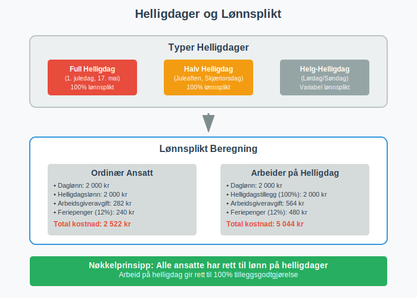
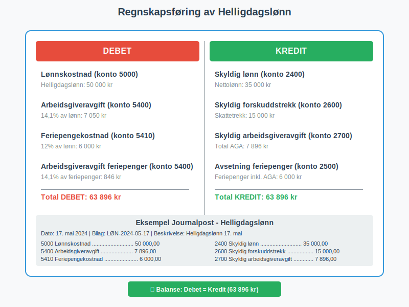
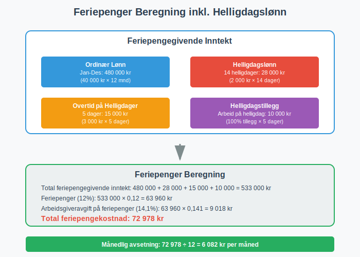
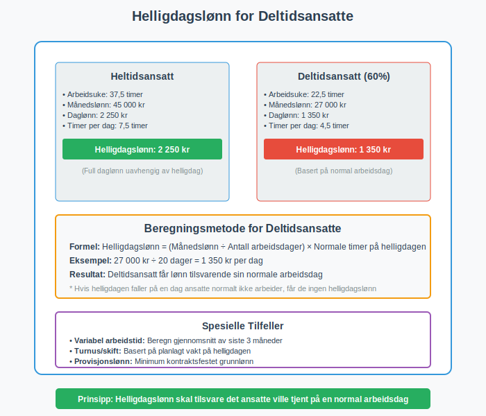
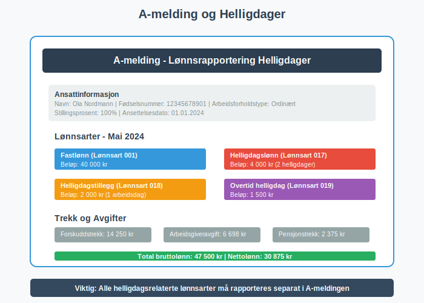
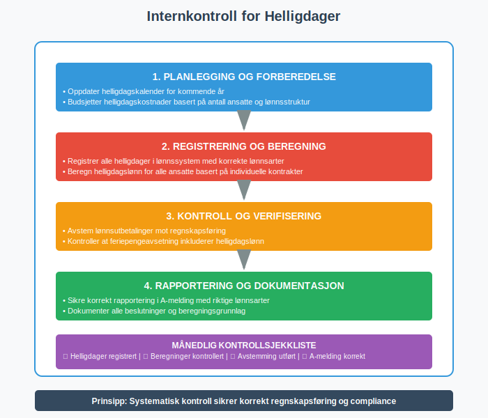
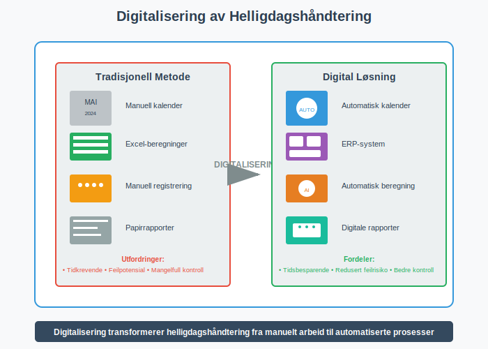
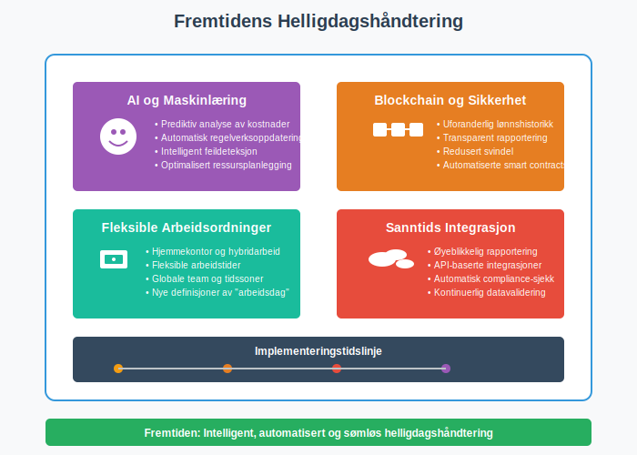

---
title: "Helligdager (regnskap, bedriftseiere)"
seoTitle: "Helligdager i regnskap | Regler, lønn og bokføring"
description: "Helligdager i regnskap forklart for bedriftseiere: hvilke dager gir lønnsplikt, hvordan beregne tillegg, hvordan bokføre kostnader og avsetninger, og hva som må rapporteres i lønn og regnskap. Praktiske råd for budsjettering og internkontroll."
summary: "Helligdager i regnskap: lønnsplikt, beregning, bokføring og rapportering for bedrifter."
---

**Helligdager** representerer en kompleks regnskapsmessig utfordring for norske bedriftseiere, hvor juridiske krav, lønnsforpliktelser og regnskapsføring må håndteres korrekt. Denne artikkelen gir en omfattende analyse av hvordan bedrifter skal behandle helligdager i regnskapssammenheng, fra [feriepenger](/blogs/regnskap/hva-er-feriepenger "Hva er Feriepenger? Komplett Guide til Beregning og Regnskapsføring") til komplekse avsetninger og rapportering.

For å sikre korrekt håndtering av alle lønnsrelaterte forpliktelser, er det essensielt å følge [god regnskapsskikk](/blogs/regnskap/god-regnskapsskikk "God Regnskapsskikk - Prinsipper, Standarder og Beste Praksis i Norge") og etablerte regnskapsprinsipper for personalrelaterte kostnader.

## Seksjon 1: Juridisk Rammeverk for Helligdager

Det norske lovverket etablerer klare rammer for hvordan helligdager skal håndteres i arbeidsforhold, med direkte konsekvenser for regnskapsføring og [bokføring](/blogs/regnskap/hva-er-bokforing "Hva er Bokføring? En Komplett Guide til Norsk Bokføringspraksis").

### 1.1 Arbeidsmiljølovens Bestemmelser

Arbeidsmiljøloven § 10-12 regulerer helligdager og gir arbeidstakere rett til fri på **offentlige helligdager**. Dette skaper regnskapsmessige forpliktelser for arbeidsgivere som må planlegges og bokføres korrekt.



**Hovedprinsipper:**
* Arbeidstakere har rett til lønn på helligdager selv om de ikke arbeider
* Arbeid på helligdager gir rett til **tilleggsgodtgjørelse** (minimum 100% tillegg)
* Bedrifter må planlegge for disse kostnadene i [budsjettering](/blogs/regnskap/hva-er-budsjettering "Hva er Budsjettering? Komplett Guide til Budsjettplanlegging for Bedrifter")

### 1.2 Oversikt over Norske Helligdager

For korrekt regnskapsplanlegging må bedriftseiere ha oversikt over alle offentlige helligdager:

| **Helligdag** | **Dato** | **Type** | **Regnskapsmessig Betydning** |
|---------------|----------|----------|--------------------------------|
| Nyttårsdag | 1. januar | Fast | Full lønnsplikt, ingen arbeid |
| Skjærtorsdag | Variabel | Bevegelig | Halv arbeidsdag, full lønnsplikt |
| Langfredag | Variabel | Bevegelig | Full lønnsplikt, ingen arbeid |
| 1. påskedag | Variabel | Bevegelig | Full lønnsplikt, ingen arbeid |
| 2. påskedag | Variabel | Bevegelig | Full lønnsplikt, ingen arbeid |
| Arbeidernes dag | 1. mai | Fast | Full lønnsplikt, ingen arbeid |
| Grunnlovsdag | 17. mai | Fast | Full lønnsplikt, ingen arbeid |
| Kristi himmelfartsdag | Variabel | Bevegelig | Full lønnsplikt, ingen arbeid |
| 1. pinsedag | Variabel | Bevegelig | Full lønnsplikt, ingen arbeid |
| 2. pinsedag | Variabel | Bevegelig | Full lønnsplikt, ingen arbeid |
| Juleaften | 24. desember | Fast | Halv arbeidsdag, full lønnsplikt |
| 1. juledag | 25. desember | Fast | Full lønnsplikt, ingen arbeid |
| 2. juledag | 26. desember | Fast | Full lønnsplikt, ingen arbeid |
| Nyttårsaften | 31. desember | Fast | Halv arbeidsdag, full lønnsplikt |

## Seksjon 2: Regnskapsføring av Helligdagslønn

Korrekt regnskapsføring av helligdagsrelaterte kostnader krever forståelse av både løpende kostnader og avsetninger.

### 2.1 Løpende Regnskapsføring

**Helligdagslønn** behandles som ordinære lønnskostnader, men krever spesiell oppmerksomhet i [lønnskjøringen](/blogs/regnskap/hva-er-ansattreskontro "Hva er Ansattreskontro? En Guide til Ansattkontoer i Regnskap"):



**Typisk bokføring:**
```
Debet: Lønnskostnad (konto 5000-5099)
Kredit: Skyldig lønn (konto 2400)
Kredit: Skyldig arbeidsgiveravgift (konto 2700)
Kredit: Skyldig forskuddstrekk (konto 2600)
```

For mer om konto for forskuddstrekk, se [Konto 2600 - Skyldig forskuddstrekk](/blogs/kontoplan/2600-forskuddstrekk "Konto 2600 - Skyldig forskuddstrekk").

### 2.2 Avsetninger for Fremtidige Helligdager

Bedrifter må vurdere om det er nødvendig å sette av midler for **kjente fremtidige helligdager**, spesielt når regnskapsåret ikke sammenfaller med helligdagsfordelingen.

**Avsetningskriterier:**
* Forpliktelsen er **sannsynlig** (helligdagen vil inntreffe)
* Beløpet kan **måles pålitelig**
* Forpliktelsen stammer fra **tidligere hendelser** (ansettelsesforhold)

## Seksjon 3: Feriepenger og Helligdager

Sammenhengen mellom **feriepenger** og helligdager er kompleks og krever nøye regnskapsmessig behandling.

### 3.1 Beregningsgrunnlag for Feriepenger

[Feriepenger](/blogs/regnskap/hva-er-feriepenger "Hva er Feriepenger? Komplett Guide til Beregning og Regnskapsføring") beregnes som 12% av **feriepengegivende inntekt**, som inkluderer lønn utbetalt på helligdager:



**Feriepengegivende inntekt inkluderer:**
* Ordinær lønn utbetalt på helligdager
* Tilleggsgodtgjørelse for arbeid på helligdager
* Overtidsbetaling på helligdager
* Bonuser og provisjoner knyttet til helligdagsarbeid

### 3.2 Regnskapsføring av Feriepengeavsetning

**Månedlig avsetning** av feriepenger må inkludere helligdagslønn:

```
Debet: Feriepengekostnad (konto 5400)
Kredit: Avsetning feriepenger (konto 2500)
```

**Beregningseksempel:**
* Månedslønn inkl. helligdagslønn: 50 000 kr
* Feriepengeavsetning: 50 000 × 12% = 6 000 kr
* [Arbeidsgiveravgift](/blogs/regnskap/hva-er-arbeidsgiveravgift "Hva er Arbeidsgiveravgift? En Komplett Guide til Norges Lønnsavgift") på feriepenger: 6 000 × 14,1% = 846 kr

## Seksjon 4: Spesielle Regnskapsmessige Utfordringer

Helligdager skaper flere komplekse regnskapsmessige situasjoner som krever spesiell oppmerksomhet.

### 4.1 Helligdager på Lørdager og Søndager

Når helligdager faller på **helger**, oppstår spesielle regnskapsmessige vurderinger:

* **Lørdag/søndag-helligdager:** Ingen ekstra lønnsplikt for 5-dagers arbeidere
* **Skiftarbeidere:** Kan ha lønnsplikt også på helger
* **Regnskapsføring:** Må reflektere faktisk lønnsplikt, ikke kalenderdato

### 4.2 Deltidsansatte og Helligdager

**Deltidsansatte** har rett til helligdagslønn basert på sin **normale arbeidsdag**:



**Beregningsprinsipp:**
* Helligdagslønn = (Månedslønn ÷ Antall arbeidsdager) × Normale timer på helligdagen
* Må bokføres individuelt for hver ansatt i [ansattreskontro](/blogs/regnskap/hva-er-ansattreskontro "Hva er Ansattreskontro? En Guide til Ansattkontoer i Regnskap")

### 4.3 Variabel Lønn og Helligdager

For ansatte med **variabel lønn** (provisjon, bonus) krever helligdagslønn spesiell beregning:

**Beregningsmetoder:**
1. **Gjennomsnitt av siste 3 måneder**
2. **Gjennomsnitt av siste 13 uker**
3. **Kontraktsfestet minimumslønn**

## Seksjon 5: Rapportering og Compliance

Korrekt rapportering av helligdagsrelaterte kostnader er kritisk for compliance med norske myndigheter.

### 5.1 A-melding og Helligdager

[A-meldingen](/blogs/regnskap/hva-er-a-melding "Hva er A-melding? Komplett Guide til Norsk Lønnsrapportering") må inneholde korrekte opplysninger om helligdagslønn:



**Viktige rapporteringselementer:**
* **Lønnsart:** Spesifiser helligdagslønn som egen kategori
* **Arbeidsforholdstype:** Korrekt klassifisering av ansettelsesforhold
* **Arbeidsgiveravgift:** Beregnet på helligdagslønn
* **Forskuddstrekk:** Basert på total utbetaling inkl. helligdagslønn

### 5.2 Skattemessig Behandling

**Skattemessig** behandles helligdagslønn som ordinær lønnsinntekt:

* **For arbeidstaker:** Skattepliktig som lønnsinntekt
* **For arbeidsgiver:** Fradragsberettiget som lønnskostnad
* **Timing:** Kostnadsføres når lønnsforpliktelsen oppstår

## Seksjon 6: Internkontroll og Kvalitetssikring

Etablering av robuste kontrollsystemer for helligdagsrelaterte kostnader er essensielt for korrekt regnskapsføring.

### 6.1 Kontrollrutiner

**Månedlige kontroller:**
* Verifiser at alle helligdager er korrekt registrert i lønnssystemet
* Kontroller beregning av helligdagslønn for alle ansatte
* Sikre korrekt [avstemming](/blogs/regnskap/hva-er-avstemming "Hva er Avstemming i Regnskap? Komplett Guide til Regnskapsavstemming") mot lønnsutbetalinger
* Verifiser feriepengeavsetning inkluderer helligdagslønn



### 6.2 Dokumentasjon og Sporbarhet

Korrekt [dokumentasjon](/blogs/regnskap/hva-er-dokumentasjon-regnskap-bokforing "Hva er Dokumentasjon i Regnskap og Bokføring? Krav, Typer og Oppbevaring") av helligdagsrelaterte beslutninger:

* **Arbeidsplaner:** Dokumenter normal arbeidstid på helligdager
* **Lønnsvedtak:** Beslutninger om tilleggsgodtgjørelse
* **Beregningsgrunnlag:** Dokumentasjon av variable lønnsberegninger
* **Avsetningsvurderinger:** Begrunnelse for regnskapsmessige avsetninger

## Seksjon 7: Digitalisering og Automatisering

Moderne teknologi kan betydelig forenkle håndtering av helligdagsrelaterte regnskapsoppgaver.

### 7.1 Integrerte Lønnssystemer

**[ERP-systemer](/blogs/regnskap/hva-er-erp-system "Hva er ERP-system? Komplett Guide til Enterprise Resource Planning")** med integrert lønnsmodul kan automatisere:

* Automatisk registrering av helligdager i arbeidskalender
* Beregning av helligdagslønn basert på individuelle kontrakter
* Generering av regnskapsposter for helligdagsrelaterte kostnader
* Automatisk rapportering til A-melding

### 7.2 Kvalitetskontroll gjennom Teknologi



**Teknologiske kontrollmekanismer:**
* **Automatiske varsler:** Påminnelser om kommende helligdager
* **Validering:** Kontroll av beregninger mot forhåndsdefinerte regler
* **Rapportgenerering:** Automatiske rapporter for ledelseskontroll
* **Integrasjon:** Kobling mellom lønn, regnskap og rapportering

## Seksjon 8: Bransjespesifikke Utfordringer

Ulike bransjer har spesielle utfordringer knyttet til helligdager som påvirker regnskapsføringen.

### 8.1 Detaljhandel og Servicenæringer

**[Detaljhandel](/blogs/regnskap/hva-er-detaljhandel "Hva er Detaljhandel? Komplett Guide til Detaljhandelens Regnskap og Drift")** har ofte behov for bemanning på helligdager:

* **Tilleggsgodtgjørelse:** Minimum 100% tillegg for helligdagsarbeid
* **Planlegging:** Ekstra kostnader må budsjetteres
* **Regnskapsføring:** Separate kontoer for ordinær og tilleggslønn

### 8.2 Produksjonsbedrifter

**Kontinuerlig produksjon** krever spesiell håndtering:

* **Skiftarbeid:** Komplekse beregninger for ulike skiftordninger
* **Beredskapsvakter:** Godtgjørelse for tilgjengelighet på helligdager
* **Overtid:** Kombinasjon av helligdags- og overtidstillegg

### 8.3 Offentlig Sektor vs. Privat Sektor

**Forskjeller i regnskapsbehandling:**

| **Aspekt** | **Privat Sektor** | **Offentlig Sektor** |
|------------|-------------------|----------------------|
| Regnskapsstandard | NGRS/IFRS | KOSTRA/GKRS |
| Helligdagslønn | Lønnskostnad | Driftskostnad |
| Avsetninger | Etter regnskapsloven | Etter kommuneloven |
| Rapportering | A-melding | KOSTRA-rapportering |

## Seksjon 9: Fremtidige Utviklingstrekk

Regnskapsbehandling av helligdager påvirkes av samfunnsmessige og teknologiske endringer.

### 9.1 Fleksible Arbeidsordninger

**Hjemmekontor og fleksitid** skaper nye utfordringer:

* **Definisjon av arbeidsdag:** Når gjelder helligdagslønn?
* **Dokumentasjon:** Bevis for faktisk arbeidstid
* **Regnskapsføring:** Nye kategorier for fleksible ordninger

### 9.2 Automatisering og AI

**Kunstig intelligens** kan revolusjonere helligdagshåndtering:



* **Prediktiv analyse:** Forutsigelse av helligdagskostnader
* **Automatisk beregning:** AI-drevet lønnsberegning
* **Compliance-overvåking:** Automatisk kontroll av regelverksetterlevelse

## Seksjon 10: Praktiske Anbefalinger

For å sikre korrekt håndtering av helligdager i regnskapet, anbefaler vi følgende tilnærming:

### 10.1 Implementering av Best Practice

**Trinnvis implementering:**

1. **Kartlegging:** Identifiser alle helligdagsrelaterte forpliktelser
2. **Systematisering:** Etabler rutiner for beregning og bokføring
3. **Automatisering:** Implementer teknologiske løsninger
4. **Kontroll:** Etabler månedlige kontrollrutiner
5. **Oppdatering:** Følg med på regelverksendringer

### 10.2 Nøkkelkontroller for Bedriftseiere

**Månedlig sjekkliste:**
* Alle helligdager korrekt registrert i lønnssystem
* Helligdagslønn beregnet for alle ansatte
* Feriepengeavsetning inkluderer helligdagslønn
* [Arbeidsgiveravgift](/blogs/regnskap/hva-er-arbeidsgiveravgift "Hva er Arbeidsgiveravgift? En Komplett Guide til Norges Lønnsavgift") beregnet korrekt
* A-melding inneholder korrekte opplysninger
* Regnskapsposter stemmer med lønnsutbetalinger

### 10.3 Når Søke Profesjonell Hjelp

**Indikatorer for ekstern bistand:**
* Komplekse arbeidsordninger med mange ansatte
* Hyppige endringer i arbeidsstyrken
* Usikkerhet om regelverksfortolkning
* Behov for systemoppgradering eller implementering

For bedrifter som ønsker maksimal sikkerhet og compliance, kan det være aktuelt å engasjere et **[ARS (Autorisert Regnskapsførerselskap)](/blogs/regnskap/hva-er-ars "Hva er ARS? Autorisert Regnskapsførerselskap - Krav, Fordeler og Prosess")** som har spesialkompetanse på lønnsregnskap og personaladministrasjon.

## Konklusjon

Helligdager representerer en betydelig regnskapsmessig kompleksitet for norske bedriftseiere, men med riktig kunnskap, systemer og rutiner kan disse utfordringene håndteres effektivt. Nøkkelen ligger i å forstå det juridiske rammeverket, etablere robuste regnskapsrutiner, og implementere teknologiske løsninger som sikrer korrekt beregning og rapportering.

Ved å følge prinsippene i denne artikkelen, kombinert med løpende oppdatering på regelverksendringer og investering i moderne lønnssystemer, kan bedriftseiere sikre både compliance og kostnadseffektivitet i håndteringen av helligdagsrelaterte forpliktelser.

For kontinuerlig oppdatering og dypere innsikt i spesifikke regnskapstemaer, anbefaler vi å følge med på endringer i [bokføringsloven](/blogs/regnskap/hva-er-bokforingsloven "Hva er Bokføringsloven? Krav, Regler og Praktisk Veiledning") og etablere gode rutiner for [internkontroll](/blogs/regnskap/hva-er-avvikshåndtering "Hva er Avvikshåndtering i Regnskap? Prosess, Metoder og Beste Praksis") som sikrer kvalitet i regnskapsføringen.


