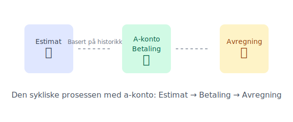

---
title: "Hva er A-konto Betaling? En Enkel Forklaring"
seoTitle: "Hva er A-konto Betaling? En Enkel Forklaring"
meta_description: 'A-konto, en forkortelse for **à conto**, er et italiensk begrep som betyr "på regning". I praksis er en a-konto betaling en **delinnbetaling** for en vare ell...'
slug: hva-er-a-konto-betaling
type: blog
layout: pages/single
---

A-konto, en forkortelse for **à conto**, er et italiensk begrep som betyr "på regning". I praksis er en a-konto betaling en **delinnbetaling** for en vare eller tjeneste hvor den endelige prisen ennå ikke er kjent. Man betaler et avdrag basert på et estimat, og en endelig avregning skjer senere.

Tenk på det som et forskudd som jevner ut kostnader over tid, slik at du unngår store, uforutsigbare regninger.

## Hvordan fungerer a-konto i praksis?

A-konto baserer seg på et **estimat** av fremtidig forbruk eller kostnad. Leverandøren ser vanligvis på tidligere perioders forbruk eller en standardisert modell for å beregne et fornuftig beløp. Dette beløpet faktureres jevnlig, for eksempel månedlig eller kvartalsvis.

Når den faktiske kostnaden er klar, gjøres en [**avregning**](/blogs/regnskap/hva-er-avregning "Hva er Avregning i Regnskap? Komplett Guide til Avregning").

*   **Har du betalt for mye?** Du mottar en kreditnota eller får penger tilbake.
*   **Har du betalt for lite?** Du mottar en restfaktura for det gjenstående beløpet.

## Når brukes a-konto?

A-konto er mest utbredt i situasjoner der det er vanskelig å fastsette en nøyaktig pris på forhånd. Her er noen typiske eksempler:

### 1. Strømregninger

Dette er det vanligste eksempelet. Strømforbruket ditt varierer gjennom året, med høyere forbruk om vinteren. For å unngå sjokkfakturaer, estimerer strømselskapet ditt årlige forbruk og deler det på 12 måneder. Du betaler en fast sum hver måned (a-konto), og ved jevne mellomrom leses måleren av for å avregne det faktiske forbruket.

### 2. Entreprenør- og byggeprosjekter

Ved større byggeprosjekter kan det være usikkerhet knyttet til endelig timebruk og materialkostnader. Kunden betaler ofte avdrag (a-konto) basert på prosjektets fremdrift. Dette sikrer likviditet for entreprenøren og fordeler kostnaden for kunden.

### 3. Husleie med felleskostnader

I noen leieforhold, spesielt i borettslag og sameier, kan felleskostnader som oppvarming, vann og internett være inkludert i en a-konto-post i husleien. Kostnadene blir så avregnet en gang i året basert på det reelle forbruket.

## Fordeler og ulemper med a-konto

| Fordeler                                    | Ulemper                                        |
| ------------------------------------------- | ---------------------------------------------- |
| **Forutsigbarhet:** Jevne og stabile utgifter | **Utsatt nøyaktighet:** Endelig pris er ukjent  |
| **Bedre likviditet:** Unngår store engangsbeløp | **Kan føre til restbeløp:** Krever god budsjettering |
| **Enklere budsjettering:** Lettere å planlegge økonomien | **Mindre transparens:** Krever tillit til leverandøren |

## A-konto og regnskap

For bedrifter er det viktig å håndtere a-konto korrekt i regnskapet. En a-kontofaktura representerer en **[forskuddsbetaling](/blogs/regnskap/hva-er-forskuddsbetaling "Hva er forskuddsbetaling? Komplett Guide til Forskuddsbetalinger i Regnskap")** og skal i utgangspunktet ikke føres som en kostnad før den endelige fakturaen med avregning foreligger.

For de fleste bedrifter som mottar elektroniske fakturaer, vil en [EHF-faktura](/blogs/regnskap/hva-er-ehf-faktura "Les mer om Elektronisk Handelsformat (EHF)") ofte være involvert i denne prosessen, noe som forenkler håndteringen.

## Automatisering av A-konto Betalinger

For å gjøre a-konto betalinger enda mer praktiske, kan de automatiseres gjennom **[AvtaleGiro](/blogs/regnskap/hva-er-avtalegiro "Hva er AvtaleGiro? Komplett Guide til Automatisk Betaling")**. Dette er spesielt nyttig for:

### Regelmessige A-konto Betalinger
- **Strømregninger:** Månedlige a-konto beløp trekkes automatisk
- **Felleskostnader:** Husleie med inkluderte a-konto poster
- **Forsikringer:** Månedlige premier basert på estimert risiko

### Fordeler med AvtaleGiro for A-konto
- **Ingen glemte betalinger:** Automatisk trekk på forfallsdato
- **Tidsbesparelse:** Slipper manuell behandling hver måned
- **Bedre oversikt:** Enkelt å følge med på betalinger i nettbank

Ved å kombinere a-konto systemet med [AvtaleGiro](/blogs/regnskap/hva-er-avtalegiro "Hva er AvtaleGiro? Komplett Guide til Automatisk Betaling") får du maksimal forutsigbarhet og bekvemmelighet i betalingsrutinene.

## A-konto vs. Forskuddsbetaling

Selv om både a-konto og [forskuddsbetaling](/blogs/regnskap/hva-er-forskuddsbetaling "Hva er forskuddsbetaling? Komplett Guide til Forskuddsbetalinger i Regnskap") innebærer betaling før endelig levering, er det viktige forskjeller:

| Aspekt | A-konto | Forskuddsbetaling |
|--------|---------|-------------------|
| **Formål** | Jevne ut kostnader over tid | Sikre betaling før levering |
| **Pris** | Ukjent endelig pris | Ofte kjent pris på forhånd |
| [**Avregning**](/blogs/regnskap/hva-er-avregning "Hva er Avregning i Regnskap? Komplett Guide til Avregning") | Regelmessig avregning | Ingen avregning nødvendig |
| **Risiko** | Lav risiko for begge parter | Høyere risiko for kjøper |
| **Bruksområde** | Løpende tjenester | Engangskjøp eller prosjekter |

**A-konto** brukes når den endelige prisen er ukjent og det er behov for jevnlig avregning, mens **forskuddsbetaling** brukes når man ønsker full betaling før levering av en vare eller tjeneste med kjent pris.

## Oppsummering

A-konto er en praktisk betalingsmodell som skaper **økonomisk forutsigbarhet** for både leverandør og kunde. Ved å betale et estimert beløp jevnlig, unngår man store og uventede regninger. Nøkkelen ligger i den endelige [**avregningen**](/blogs/regnskap/hva-er-avregning "Hva er Avregning i Regnskap? Komplett Guide til Avregning"), som sikrer at du kun betaler for det du faktisk har brukt.

